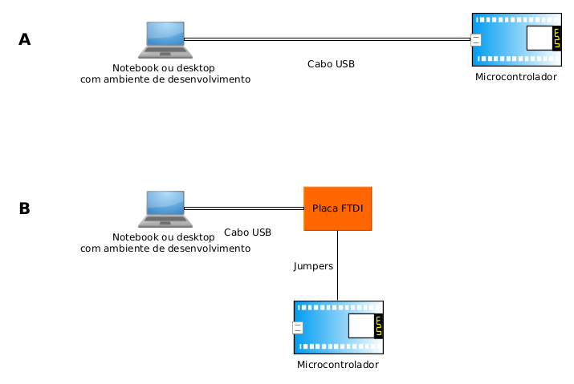

# Como programar as placas microcontroladoras que há no lab

Nos kits de desenvolvimento usados no laboratório, os microcontroladores são conectados a componentes adicionais. O conjunto é chamado placa microcontroladora. Em contextos onde não há diferença entre microcontrolador e placa microcontroladora, o primeiro pode ser usado para designar o segundo.

Há placas microcontroladoras com conexão USB, como Arduino UNO e Node MCU, mas há outras que necessitam de uma interface que converte o protocolo USB para o protocolo serial RS-232. Estas, em geral, são denominadas placas FTDI-RS232. Placas microcontroladoras que necessitam de FTDI são, por exemplo, Arduino Lily Pad e ESP-CAM.

Usualmente, instalam-se, em um computador (desktop ou notebook), programas que ajudam o programador a escrever programas, compilá-los, enviá-los para a placa microcontroladora e depurá-los. Alguns exemplos são:

1. Arduino IDE (https://www.arduino.cc/en/software);
2. PlatformIO (plugin para VS-Code: https://platformio.org/);
3. ESP-IDF (https://docs.espressif.com/projects/esp-idf/en/stable/esp32/index.html);

Embora o nome específico varie, genericamente (e com imprecisões) esse conjunto de programas é chamado *Integrated Development Environment* ou IDE.




Após instalar a(o) IDE e, se necessário, configurá-lo(a), conecta-se a placa microcontroladora ao computador. Geralmente um cabo USB apropriado é suficiente, mas há conexões mais complicadas. Na figura acima, a conexão mais simples está no diagrama A. Uma alternativa um pouco mais complicada é mostrada no diagrama B. 

## Que placas microcontroladoras há no lab e qual é o tipo de conexão

1. Arduino UNO (A);
2. Arduino Nano (A);
3. Arduino Mega (A);
4. Arduino Lily Pad (B);
5. Arduino Lily Pad USB (A);
4. Node MCU com ESP8266 (A);
5. Node MCU com ESP32 (A);
6. ESP-CAM (B);

## O primeiro programa

Na maioria das linguagens e ambientes de programação existe um programa muito simples que serve para atestar que a linguagem/ambiente tem um mínimo de funcionalidade. O apelido para esse programa costuma ser *Hello World*. Em ambientes para computadores ele mostra uma mensagem na tela. Em placas microcontroladoras ele pisca um LED (por isso também é chamado *blink*). Recomenda-se fazer esse teste em novas instalações.

Tanto Arduino IDE quanto Platformio quanto ESP-IDF usam a linguagem C. Por isso, o programa *blink* em cada IDE deve ser parecido com o programa abaixo:
  
```C
void setup() {
  // initialize digital pin LED_BUILTIN as an output.
  pinMode(LED_BUILTIN, OUTPUT);
}

// the loop function runs over and over again forever
void loop() {
  digitalWrite(LED_BUILTIN, HIGH);   // turn the LED on (HIGH is the voltage level)
  delay(1000);                       // wait for a second
  digitalWrite(LED_BUILTIN, LOW);    // turn the LED off by making the voltage LOW
  delay(1000);                       // wait for a second
}
```

### Passos

1. Editar o programa: No editor da IDE de escolha, escreva o programa acima;
2. Compilar;
  - As constantes são configuradas pela própria IDE;
  - Em geral para Arduino UNO e Nano, LED_BUITIN vale 13;
  - Para ESP8266 e ESP32, LED_BUILTIN vale 2; 
3. Enviar para a placa microcontroladora;
  - O resultado esperado é que algum LED na placa microcontroladora pisque.
