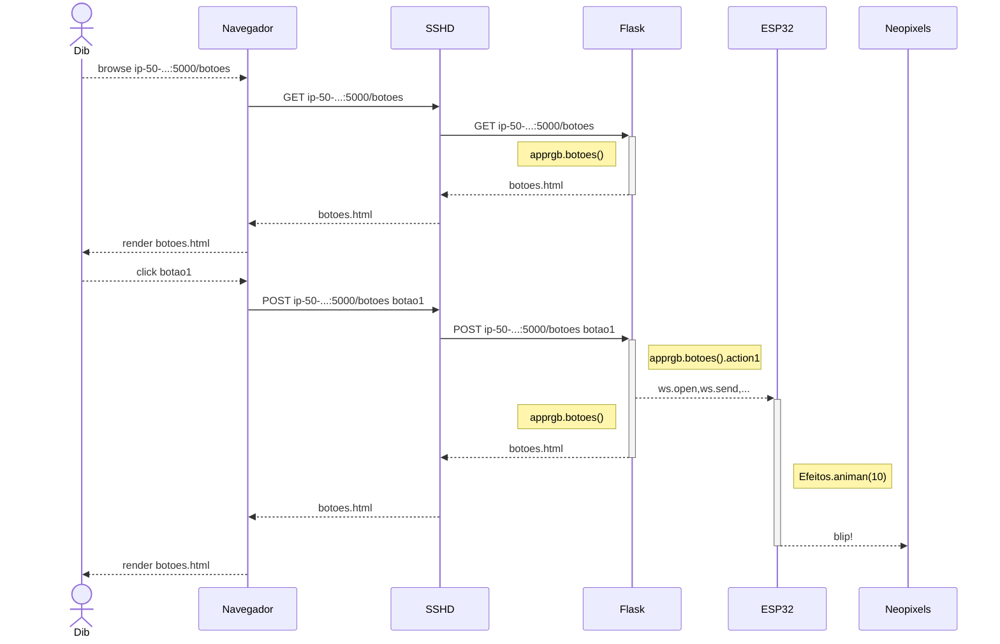

## ESP32

Atualmente há uma variedade de ESP32, inclusive com diferentes arquiteturas de processador. Os ESP32 mais comuns ainda são os ESP32 que têm dois núcleos com arquitetura XTENSA LX6, 520kBytes de RAM estática (as placas de desenvolvimento podem ser marcadas WROOM ou WROOVER). Segundo o fabricante, esses componentes serão fabricados até 2031 (https://www.espressif.com/en/products/longevity-commitment) mas já não são recomendados para novos projetos (https://www.espressif.com/sites/default/files/documentation/esp32-wroom-32_datasheet_en.pdf (tem cópia neste repositório)).

Vou dar mais ênfase a este modelo pois é o mais comum.

Quanto às placas de desenvolvimento, há placas com 30 pinos e com 38 pinos. Parece que as com 30 pinos são mais comuns. Um diagrama da placa de 30 pinos pode ser visto neste site: https://randomnerdtutorials.com/esp32-pinout-reference-gpios/ . Um diagrama da placa de 38 pinos pode ser visto neste outro site: https://www.studiopieters.nl/esp32-pinout/

Para mim, não há vantagem em usar a placa de 38 pinos pois passam a ser acessíveis pinos que não são fáceis de usar como GPIO0, GPIO6, GPIO7, GPIO8, GPIO9, GPIO10, GPIO11. Por outro lado, talvez seja possível conectar um cartão SD usando esses pinos. 

Sobre os pinos, nem todos podem ser usados para qualquer aplicação. Citando a referência https://randomnerdtutorials.com/esp32-pinout-reference-gpios/:
  
> The ADC (analog to digital converter) and DAC (digital to analog converter) features are assigned to specific static pins. However, you can decide which pins are UART, I2C, SPI, PWM, etc – you just need to assign them in the code. This is possible due to the ESP32 chip’s multiplexing feature.

### Que pinos usar?

Há pinos usados para controlar o modo de inicialização do processador, pinos usados para comunicação com a memória FLASH interna (que pode ser pensada como armazenamento secundário - um SSD de, geralmente, 4MBytes), pinos usados para comunicação com o PC. Acabam restando proporcionalmente poucos que podem de fato serem usados. A partir da tabela de pinos usáveis em https://randomnerdtutorials.com/esp32-pinout-reference-gpios/ , separei alguns com as funcionalidades potenciais anotadas.

| GPIO | obs | usos possíveis | usos que reservei |
| --- | --- | --- | --- |
| (0) | strapping pin | ~~ADC2_CH1~~, TOUCH1, HSPI_HD |  |
| 4 | --- | ~~ADC2_CH0~~, TOUCH0, RTC_GPIO10 | SCL |
| 5 | outputs PWM signals at boot, strapping pin | VSPI_CS0 its in this list for a reason... | SDA |
| ~~12~~ | --- | ADC2_5, TOUCH5, HSPIQ, HS2_DATA2 | boot fails if pulled HIGH |
| 13 | --- | ~~ADC2_CH4~~, TOUCH4, RTC_GPIO14, HSPI_MOSI | TOUCH |
| 14 | --- | ~~ADC2_CH6~~, TOUCH6, RTC_GPIO16, HSPI_CLK | TOUCH |
| 15 | --- | ~~ADC2_CH3~~, TOUCH3, RTC_GPIO13, HSPI_CS0 | TOUCH |
| 16 | --- | UART2_RX | UART_RX |
| 17 | --- | UART2_TX | UART_TX |
| 18 | --- | VSPI_CLK | PWM |
| 19 | --- | VSPI_MISO | PWM |
| SD2 (9) | internal SPI Flash | | |
| SD3 (10) | internal SPI Flash | | |
| CMD (11) | internal SPI Flash | | |
| 21 | --- | I2C_SDA | PWM |
| 22 | --- | I2C_SCL | PWM |
| 23 | --- | VSPI_MOSI | PWM |
| 25 | --- | ~~ADC2_CH8~~, RTC_GPIO6, DAC1 | DAC/I2S |
| 26 | --- | ~~ADC2_CH9~~, RTC_GPIO7, DAC2 | DAC/I2S |
| 27 | --- | ~~ADC2_CH7~~, TOUCH7, RTC_GPIO17 | TOUCH |
| CLK(6) | internal SPI Flash  | | |
| SD0(7) | internal SPI Flash  | | |
| SD1(8) | internal SPI Flash  | | |
| 32 | --- | ADC1_CH4, TOUCH9, RTC_GPIO9 | ADC |
| 33 | --- | ADC1_CH5, TOUCH8, RTC_GPIO8 | ADC |
| 34 | somente entrada | ADC1_CH6, RTC_GPIO4 | TOUCH |
| 35 | somente entrada | ADC1_CH7, RTC_GPIO5 | TOUCH |
| 36 | somente entrada | ADC1_CH0, RTC_GPIO0, Sensor_VP | ADC |
| 39 | somente entrada | ADC1_CH3, RTC_GPIO3, Sensor_VN | ADC |

Na coluna GPIO, entre parêntesis estão as GPIOs que são acessíveis somente na placa de 38 pinos. Como a marcação na placa é diferente, ela também é apresentada na coluna.

Pinos e usos que escolhi excluir estão riscados (strikethrough).

A última coluna, dos usos que pretendo dar para os pinos, baseia-se num critério de abundância.

O ADC2 é usado pelo WiFi, como a maioria das aplicações deste repositório usa WiFi, então o ADC2 não é usável (https://docs.espressif.com/projects/esp-idf/en/v4.2/esp32/api-reference/peripherals/adc.html#analog-to-digital-converter , https://randomnerdtutorials.com/esp32-pinout-reference-gpios/). Os pinos podem ser usados com outra função.

O ESP32 tem hardware para I2S (protocolo para periféricos de som). Não entendi se os mesmos pinos do DAC precisam ser usados para I2S ou se os sinais I2S podem ser roteados para qualquer pino e só por questão de preferência a documentação se refere a eles (https://docs.espressif.com/projects/esp-idf/en/v4.2/esp32/api-reference/peripherals/i2s.html)

> The ESP32 LED PWM controller has 16 independent channels that can be configured to generate PWM signals with different properties. All pins that can act as outputs can be used as PWM pins 
(...)
> The GPIOs routed to the RTC low-power subsystem can be used when the ESP32 is in deep sleep.
> The ESP32 has 10 internal capacitive touch sensors. These can sense variations in anything that holds an electrical charge, like the human skin. (...) The capacitive touch pins can also be used to wake up the ESP32 from deep sleep.


1. A segunda interface serial pode ser usada para comunicar com Arduino;
2. DACs (e I2S?) são interessantes para síntese de som;
3. Em placas alternativas, como wemos lolin32, usa-se para I2C os pinos SCL=GPIO4, SDA=GPIO5. Tenho algumas dessas e a interface com o display funciona bem. Isto quer dizer que o pino 5, que também serve para configurar o boot, serve para I2C.
4. Parece que Sensor_VP e Sensor_VN são entradas diferenciais para um amplificador de baixo ruído mas não funciona bem (https://esp32.com/viewtopic.php?t=3206) "The low noise amplifier in the ESP32 is removed from the specs and documentation as it never really worked well. As such, you can't use those pins for low voltage measurements. You can still use them as ADC pins, but they have the same range as other ADC pins."

## Usar bateria ou battery pack (carregador portátil)

O carregador portátil desliga automaticamente em menos de um minuto quando a corrente de carga é muito baixa (não medi, mas, do uso, "corrente muito baixa" é da ordem de 100mA).

Bateria de 3,6V ou mais não podem ser conectadas diretamente ao ESP32 pois a tensão fornecida supera a tensão máxima aceita pelo ESP32 (o ESP vai queimar).

Os reguladores de tensão das placas de desenvolvimento para ESP32 costumam ser AMS1117. Ele precisa que a tensão fornecida seja pelo menos 4,3V então conectar baterias no pino de 5V provavelmente não faz o ESP32 funcionar.

Tem uma placa cujo regulador permite usar bateria. O teste está neste projeto: https://github.com/FNakano/CFA/tree/master/projetos/Teste3V6

Há alguns modelos novos de ESP e de placas de desenvolvimento que podem ser bem interessantes. Além das listadas abaixo, tem algumas que estão para chegar para mim.

- [Site contendo modelos e esquemáticos](http://esp32.net/)
- [URL do esquemático que baixei da ESPRESSIF](https://dl.espressif.com/dl/schematics/ESP32-Core-Board-V2_sch.pdf)
- [Cópia local do esquemático da ESPRESSIF](ESP32-Core-Board-V2_sch.pdf)
- [URL do esquemático que baixei do nodeMCU](http://esp32.net/images/Ai-Thinker/NodeMCU-32S/Ai-Thinker_NodeMCU-32S_DiagramSchematic.png)
- [Cópia local do esquemático do nodeMCU](Ai-Thinker_NodeMCU-32S_DiagramSchematic.png)
- [URL da foto com atribuição de pinos](https://pt.aliexpress.com/item/4000267191708.html?spm=a2g0o.productlist.0.0.81651027YPzmyr&algo_pvid=1a60ffda-ed96-4a60-be51-2452dc4a964b&algo_expid=1a60ffda-ed96-4a60-be51-2452dc4a964b-11&btsid=0ab50f4415991615959921606ea624&ws_ab_test=searchweb0_0,searchweb201602_,searchweb201603_)
- [Cópia local da foto com atribuição de pinos](Ha6b92f8013f544dca6078e05fc74a998r.jpg)
- [URL do esquemático do SparkFun Thing](https://cdn.sparkfun.com/assets/learn_tutorials/5/0/7/esp32-thing-schematic.pdf)
- [Cópia local do esquemático do SparkFun Thing](esp32-thing-schematic.pdf)

Mais modelos no projeto [ESP32-CAM](/projetos/ESP32-CAM/README.md)

## ESP32-C3 super mini

Esta placa comprei em 2024-09-24 pelo mercado livre a um pouco menos de R$40. Atraiu meu interesse porque é pequena e porque o regulador de tensão não é AMS1117. Fui atrás de documentação. Achei uma pinagem: https://forum.arduino.cc/t/esp32-c3-supermini-pinout/1189850 , um esquemático: https://imgse.com/i/pCUheR1 - neste mostra que o regulador de tensão é um ME6211. Segundo o datasheet (https://stm32-base.org/assets/pdf/regulators/ME6211.pdf), a corrente máxima de saída é 500mA, com dropout de 1V nesta condiçao não é melhor que o AMS1117, mas a 100mA o dropout é de 100mV e, com este dropout, é possível usar uma bateria de 3,6V ligada no pino de 5V.

Tem um tutorial: https://github.com/sidharthmohannair/Tutorial-ESP32-C3-Super-Mini

## ESP32-C3 (Aprox. 4h de trabalho e documentação)

## 12F (AiThinker)

(2024-09-23) Testei uma dessas placas durante a semana que passou. É cômodo ter um LED RGB à disposição.

Parece que o ADC não funciona bem (ou tem algum sinal adicional que o Micropython não expõe. A documentação do ESP32C3 informa que há condições para usar o ADC e a conversão pode falhar e que há sinais que indicam sucesso (https://docs.espressif.com/projects/esp-idf/en/v4.3/esp32c3/api-reference/peripherals/adc.html#overview).  Não dá para ter certeza que o Micropython considera essas condições (https://docs.micropython.org/en/latest/esp32/quickref.html#adc-analog-to-digital-conversion). Achei uma discussão no fórum do Micropython que não me deixa muito esperançoso (https://github.com/orgs/micropython/discussions/11013#discussioncomment-5279756) pois as características do ADC do ESP32C3 são diferentes das do ESP32 e ninguém no fórum deu uma boa resposta e fechou a questão, até agora, 2024-09-23.

Há postagens em outros fóruns apontando problemas:
  - https://forum.arduino.cc/t/problem-with-analogread-on-esp32-c3/892651
  - https://github.com/espressif/arduino-esp32/issues/5502


## 01Space

Começo a achar estes controladores interessantes (2022-08-21). Explico:

Até agora, é o único controlador que aceita, de maneira descomplicada, ser ligado a baterias de 3,6V, usuais em telefones celulares.

Descomplicado = liga a bateria direto na linha de 5V (https://github.com/01Space/ESP32-C3FH4-RGB/issues/9).

Ligar bateria de 3,6V direto não é muito comum porque a tensão nominal de alimentação do ESP é 3,3V, então resta 0,3V para a tensão (mínima) de dropout do regulador de tensão. Não é todo regulador de tensão que faz isso e os que o fazem, controlam correntes muito baixas. O ESP32 com processador e wifi ligados chega a 500mA de consumo (https://www.cnx-software.com/2022/01/12/esp32-s3-esp32-c3-esp8266-modules-comparison/). 01Space coloca no github um pdf com o esquemático. O regulador de tensão é SPX3819 que, segundo o fabricante, fornece 500mA e, nessa condição, tem dropout de 0,34V, o que ainda permite ao ESP32 operar.

Outra caracteristica interessante é o tipo de LED RGB endereçável. É uma versão de WS2812B que aceita tensão de alimentação a partir de 3,6V (https://pt.aliexpress.com/item/4000262327171.html). Em geral, a tensão de operação desse tipo de LED é 5V+-10%.

A placa com display tem um LED RGB endereçável ligado ao pino 2.

### ESP32-C3FH4-RGB

https://github.com/01Space/ESP32-C3FH4-RGB

Esta placa controladora contém uma matriz de LEDs RGB compatíveis com NeoPixel. Para testá-la portei o `Efeitos.py` do projeto [py-efeitos](/projetos/py-efeitos) 

1. Instalei Micropython [Referência neste repositório](https://github.com/FNakano/CFA/tree/master/programas/Micropython);
   - a placa é muito parecida com a placa com display, então tentei o mesmo firmware da placa com display;
   - captura de tela de 01space mostrando que é esse firmware mesmo: https://github.com/01Space/ESP32-C3-0.42LCD/blob/main/micropython/image/4.png
   - firmware sem conversor serial para usb: https://micropython.org/download/esp32c3-usb/
2. Configurei webREPL [Referência neste repositório](https://github.com/FNakano/CFA/tree/master/programas/Micropython/webREPL);
3. Ajustei o `boot.py` para reconectar ao meu WiFi e escrever no display qual é o IP;
   - enviei o `boot.py` para a placa através do webREPL;
      - o primeiro LED Neopixel está conectado à GPIO 8;
      - a matriz tem 25 LEDs;
   - para fins de arquivamento, renomeei `boot.py` para `bootRGB.py`;
3. Fiz esses ajustes em `Efeitos.py`;

O regulador de voltagem da entrada é potencial fonte de problemas. Não consegui identificar qual é o regulador, mas os candidatos são Texas Instruments lp2980 e Microchip TC1186. Os dois tem dropout da ordem de 0.3V, logo, permitem ligar 3,6V na linha de 5V e fornecer os ao menos 3,3V nominais para o ESP32. Acontece que a corrente máxima é da ordem de 150mA, o que é pouco quando o wifi está ligado, logo, pode acontecer brownout.


### ESP32-C3-0.42LCD

https://github.com/01Space/ESP32-C3-0.42LCD

Esta placa controladora contém um display OLED com controlador SSD1306. Para testá-la:

1. Instalei Micropython [Referência neste repositório](https://github.com/FNakano/CFA/tree/master/programas/Micropython);
   - captura de tela de 01space mostrando que é esse firmware mesmo: https://github.com/01Space/ESP32-C3-0.42LCD/blob/main/micropython/image/4.png
   - firmware sem conversor serial para usb: https://micropython.org/download/esp32c3-usb/
   - usei um comando para apagar a memória flash e outro para gravar o firmware. IMPORTANTE: não mudar o endereço de gravação. Se fizer isso não dá para gravar outro firmware - o `esptool.py` falha com mensagens na operação de leitura, tentando ler o efuse de habilitação de criptografia. Corrigi isso instalando a placa na IDE do Arduino e enviando `blink`. Por sorte, isto reescreveu o programa, o que  "consertou" o problema.
   - `esptool.py -p /dev/ttyACM0 erase_flash`, `esptool.py --chip esp32c3 --port /dev/ttyACM0 --baud 460800 write_flash -z 0x0 esp32c3-usb-20220618-v1.19.1.bin`
2. Configurei webREPL [Referência neste repositório](https://github.com/FNakano/CFA/tree/master/programas/Micropython/webREPL);
3. Ajustei o `boot.py` para reconectar ao meu WiFi e escrever no display qual é o IP;
   - enviei o `boot.py` para a placa através do webREPL;
      - este boot cria a variável `oled`, que é a representação do display no programa;
   - para fins de arquivamento, renomeei `boot.py` para `bootOLED.py`;
      - é possível que a execução desse script sem ter instalado o módulo ssd1306 cause alguma escrita ilegal na memória, contribuindo para o dispositivo não permitir que o firmware seja regravado;
3. Testei a biblioteca padrão para SSD1306 (https://docs.micropython.org/en/latest/esp8266/tutorial/ssd1306.html);
   - tem somente fonte 8 pixels monospace;
   - por maior que seja o cuidado, a gente sempre esquece algo... o `driver` do ssd1306 não vem pré-compilado no firmware, então precisa copiar na raiz do sistema de arquivos do ESP32-C3. Para isso, usar webrepl, localizar o driver na árvore de arquivos do micropython (deve ser algum lugar como `/home/fabio/Documentos/git/micropython/drivers/display/ssd1306.py`) e enviar o arquivo;
3. Usei um gerador de fontes (https://github.com/peterhinch/micropython-font-to-py), usei o `writer.py` desse mesmo projeto (https://github.com/peterhinch/micropython-font-to-py/blob/master/writer/WRITER.md) e adaptei o exemplo `writer_demo.py` (https://github.com/peterhinch/micropython-font-to-py/blob/master/writer/writer_demo.py) para usar com a biblioteca padrão.

O conversor de fonte é um programa em Python3 executado em desktop. Para instalá-lo, clonei o repositório https://github.com/peterhinch/micropython-font-to-py, instalei a dependência `freetype-py` e executei `./font_to_py.py -x ~/R/x86_64-pc-linux-gnu-library/3.6/rmarkdown/rmd/h/bootstrap/css/fonts/RobotoBold.ttf 28 roboto28.py`. Isto usa o fonte, codificado em `ttf` e cria um fonte bitmap codificado em Python. A opção `-x` é obrigatória. Sua falta causa o erro `ValueError: Font must be horizontally mapped`. Achar o tamanho certo foi por tentativa e erro.

Transferi para a placa, usando webREPL, os arquivos `writer.py` e `roboto28.py`. No console do webREPL, digitei o teste:

```python
from writer import Writer
import roboto28                                                                          
oled.fill(0) # limpa o display
wri=Writer(oled,roboto28) # instancia um Writer que envia letras para o oled
Writer.set_textpos(oled,0,0) # posiciona o cursor do framebuffer em 0,0
wri.printstring('22:22') # escreve a string no framebuffer
oled.show() # envia o conteúdo do framebuffer para o oled
```

A placa com display tem um LED RGB endereçável ligado ao pino 2.

## <a id="2022-08-06-205959" href="#2022-08-06-205959">2022-08-06-205959</a>

### Estou acumulando informação para fechar mais um ponto. Trabalhei umas 4 horas para chegar nesse resultado e documentar (não contei o trabalho em background).

O objetivo é enviar, de qualquer computador na internet, através do navegador, comandos para um dispositivo, conectado à minha rede doméstica, que executa webrepl. 

O que sei até agora:

Segundo os detalhes técnicos de webREPL (https://github.com/micropython/webrepl#technical-details), ele é baseado no protocolo websockets (https://websockets.readthedocs.io/en/stable/). A documentação é muito volumosa pois o protocolo pode ser usado de várias formas.

Eu quero usar comandos Python para enviar, como cliente, comandos para o webREPL (que está atrás de um servidor websocket). O mais comum é usar comandos Python para criar um servidor websocket. Logo, leva mais tempo até encontrar o que quero (pois os buscadores retornam o que é mais frequente). 

O exemplo que me ajudou está em https://pypi.org/project/websocket-client/. Ajustando, cheguei aos comandos que uso no Python do notebook:

```python
from websocket import create_connection
ws=create_connection("ws://192.168.1.101:8266")
print(ws.recv())
Password: 
ws.send('star\r')
print(ws.recv())
WebREPL connected
ws.send('oled.fill(0)\r')
ws.send('import roboto28\r')
ws.send('from writer import Writer\r')
ws.send('wri=Writer(oled, roboto28)\r')
ws.send('wri.printstring("22:22")\r')
ws.send('oled.show()\r')
>>> print(ws.recv())
o
>>> print(ws.recv())
l
>>> print(ws.recv())
e
>>> print(ws.recv())
d
>>> print(ws.recv())
.
>>> print(ws.recv())
f
>>> print(ws.recv())
i
>>> print(ws.recv())
l
>>> print(ws.recv())
l
>>> print(ws.recv())
(
>>> print(ws.recv())
0
>>> print(ws.recv())
)
>>> 
```

Apanhei um bocado até perceber que a mensagem para o webREPL precisava conter o `\r` para o comando ser executado.

Algumas mensagens aparecem no REPL do minicom conectado à USB. Também ajudou um pouco.

A API do websocket está documentada aqui: https://websockets.readthedocs.io/en/8.1/api.html.

Websocket foi proposto/definido/normatizado (no IETF) através de RFC: https://www.rfc-editor.org/rfc/rfc6455.html#section-4

## <a id="2022-08-06-212738" href="#2022-08-06-212738">2022-08-06-212738</a>

O passo (anterior? posterior?) é enviar esses comandos através de um servidor web. Como os comandos que testei são Python, então deve ser mais fácil usar Django ou Flask. Conheço nada de Django e pouco de Flask, então vai Flask. AINDA NÃO IMPLEMENTEI ESTE PASSO!!

Quero executar o servidor web num computador na minha rede doméstica. Não tenho IP público nela. Tenho um servidor em um provedor privado, então vou ver como configurá-lo para encaminhar as conexões (HTTP) que ele receber na Web para o meu computador doméstico. Parece que há várias maneiras de fazer isso. A que achei mais simples (e por isso resolvi investir em aprender) é fazer um tunel reverso com SSH.

A documentação sobre como criar o tunel é vasta e confusa. Para fazer a coisa parecer fácil, vai o comando:

```
ssh -R 5000:192.168.1.106:5000 fabio@ip-50-62-81-50.ip.secureserver.net
```

executado no terminal da máquina doméstica, cria o túnel através do qual o servidor `ip-50-...` encaminha os pacotes TCP que chegam na porta 5000 para o computador doméstico no IP (doméstico) `192.168...`, também na porta 5000.

O daemon ssh do servidor precisa ser configurado. Colocar no arquivo `\etc\ssh\sshd_config` uma linha contendo `GatewayPorts yes` (https://www.ssh.com/academy/ssh/tunneling/example, https://www.ssh.com/academy/ssh/sshd_config)

Para testar o encaminhamento criei um servidor `flask` no computador doméstico e executei. Detalhes ainda não estão no repositório, estão no arquivo local `ExplorarFlask/diario.md`. Apontei o navegador para `http://ip-50-62-81-50.ip.secureserver.net:5000` e voilá: o navegador abriu a página "olá mundo" do servidor `flask`.

O que falta agora é criar uma página com botões que quando clicados executam os comandos Python para enviar comandos webREPL.

## <a id="2022-08-07-092719" href="#2022-08-07-092719">2022-08-07-092719</a>

Com mais 4 horas de trabalho fechei uma história. Usei umas três horas para colocar uma página com dois botões funcionando. São muitos posts em foruns e muita documentação que *bate na trave* pois ou não explica algo (falta informação, contexto incompleto, falta a mim algum conhecimento óbvio,...) ou baseia-se em bibliotecas auxiliares que não quero usar. Usei um pouco mais de meia hora para ajustar o código para enviar comandos para o dispositivo. Usei o restante (uns 10 minutos) para testar o proxy e ajustar o template (`/templates/botoes.html`).

São muitos detalhes, acho que vou levar o resto do dia para explicar o que fiz...


https://www.google.com/search?channel=fs&client=ubuntu&q=python+flask+create+button
https://stackoverflow.com/questions/19794695/flask-python-buttons
https://www.tutorialspoint.com/flask/flask_quick_guide.htm
https://predictivehacks.com/?all-tips=how-to-add-action-buttons-in-flask
https://www.google.com/search?channel=fs&client=ubuntu&q=python+pass+command
https://www.google.com/search?channel=fs&client=ubuntu&q=flask+render_template
https://flask.palletsprojects.com/en/2.1.x/quickstart/
https://www.google.com/search?q=flask+template+NameError%3A+name+%27form%27+is+not+defined&client=ubuntu&hs=M8M&channel=fs&ei=I5jvYqmnKeCQ4dUP1aaQqAU&ved=0ahUKEwjpxNnZxrT5AhVgSLgEHVUTBFUQ4dUDCA0&uact=5&oq=flask+template+NameError%3A+name+%27form%27+is+not+defined&gs_lcp=Cgdnd3Mtd2l6EAM6BwgAEEcQsANKBAhBGABKBAhGGABQ3QlYzRJg7hRoAXABeACAAYoBiAGSCJIBAzAuOJgBAKABAcgBCMABAQ&sclient=gws-wiz
https://python-adv-web-apps.readthedocs.io/en/latest/flask_forms.html
https://python-adv-web-apps.readthedocs.io/en/latest/flask_forms.html#id1
https://www.google.com/search?channel=fs&client=ubuntu&q=flask+template+method+not+allowed
https://thewebdev.info/2022/04/03/how-to-fix-post-error-405-method-not-allowed-with-flask-python/
http://192.168.1.1/NHMLZKBBNVUCLBNA/userRpm/Index.htm

Aplicando mais meia hora, consegui escrever e testar o `apprgb.py` e melhorar o `/templates/botoes.html` para enviar comandos, tanto locais quanto remotos, para o ESP32 com matriz RGB. Isto fecha a meta mínima para terça, agora vou trabalhar na meta para segunda-feira.

### Teste

1. Ligar o(s) dispositivo(s);
2. Checar a conexão no AP;
   - verificar se os IPs não mudaram. Se mudaram, precisa mudar em app???.py
3. Checar o funcionamento do dispositivo e da conexão local através do webREPL
4. *Levantar o servidor* `python app???.py` em `ExplorarFlask/webapp`
5. Testar servidor local com navegador local conectado a `localhost:5000/botoes` usar os botões da linha de baixo;
6. Criar tunel reverso SSH (comando logo acima);
7. Testar tunel e conexão remota com navegador (remoto ou local) conectado a `ip-50-...:5000/botoes` usar os botões da linha de cima;



## Mais informação sobre comunicação com ESP32S

Não sei bem em que arquivo colocar essa informação então vai neste arquivo.

### Quantas conexões TCP o ESP32S consegue gerenciar?

Segundo o fabricante, oito conexões (https://docs.espressif.com/projects/esp-faq/en/latest/software-framework/wifi.html#connect-how-many-devices-is-esp8266-able-to-connect-in-softap-mode)

https://esp32.com/viewtopic.php?t=9130

### Quantos sockets podem estar abertos simultaneamente?

A pergunta vem em uma postagem (https://www.reddit.com/r/esp32/comments/12v4i3e/how_many_clients_can_an_esp32_as_a_mqtt_broker/) sobre MQTT, que é um protocolo de interesse. A resposta é "...limitado pela quantidade de memória disponível" e controlado pela constante CONFIG_LWIP_MAX_SOCKETS que tem valor default 10 (acredito que, quando usando ESP-IDF). (https://docs.espressif.com/projects/esp-idf/en/latest/esp32/api-reference/kconfig.html#config-lwip-max-sockets)

Referências acessadas 

- https://www.esp32.com/viewtopic.php?t=5163#:~:text=In%20the%20make%20menuconfig%20we,and%20leave%20the%20connections%20live.
- https://esp32.com/viewtopic.php?t=319
- https://docs.micropython.org/en/latest/esp8266/tutorial/network_tcp.html#network-tcp-sockets
- https://medium.com/@rabeeqiblawi/harnessing-the-power-of-esp32-for-socket-communication-27fbd0ee5184
- https://github.com/orgs/micropython/discussions/11019

### Domain Name Service

Trata-se do protocolo de resolução de nomes de domínios na Internet.
A mensagem no protocolo tem vários registros. Nem todos são suportados no ESP32 o que limita sua aplicação.

Referências consultadas

- https://www.ibm.com/topics/dns-records
- https://www.reddit.com/r/esp32/comments/18zt9tz/howto_query_dns_txt_records/
- https://stackoverflow.com/questions/1128409/how-might-i-perform-dns-lookups-using-c-c-on-linux
- https://gist.github.com/fffaraz/9d9170b57791c28ccda9255b48315168

### Comparação entre web socket e http

HTTP é um protocolo request-response enquanto Web Socket cria uma conexão permanente.

- https://www.geeksforgeeks.org/what-is-web-socket-and-how-it-is-different-from-the-http/


