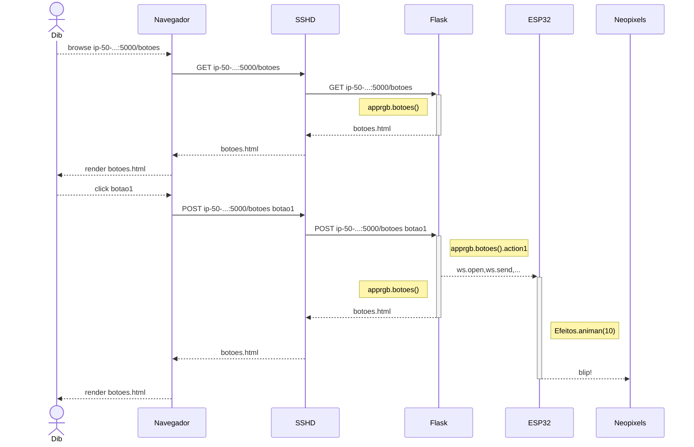

## ESP32

- [Site contendo modelos e esquemáticos](http://esp32.net/)
- [URL do esquemático que baixei da ESPRESSIF](https://dl.espressif.com/dl/schematics/ESP32-Core-Board-V2_sch.pdf)
- [Cópia local do esquemático da ESPRESSIF](ESP32-Core-Board-V2_sch.pdf)
- [URL do esquemático que baixei do nodeMCU](http://esp32.net/images/Ai-Thinker/NodeMCU-32S/Ai-Thinker_NodeMCU-32S_DiagramSchematic.png)
- [Cópia local do esquemático do nodeMCU](Ai-Thinker_NodeMCU-32S_DiagramSchematic.png)
- [URL da foto com atribuição de pinos](https://pt.aliexpress.com/item/4000267191708.html?spm=a2g0o.productlist.0.0.81651027YPzmyr&algo_pvid=1a60ffda-ed96-4a60-be51-2452dc4a964b&algo_expid=1a60ffda-ed96-4a60-be51-2452dc4a964b-11&btsid=0ab50f4415991615959921606ea624&ws_ab_test=searchweb0_0,searchweb201602_,searchweb201603_)
- [Cópia local da foto com atribuição de pinos](Ha6b92f8013f544dca6078e05fc74a998r.jpg)
- [URL do esquemático do SparkFun Thing](https://cdn.sparkfun.com/assets/learn_tutorials/5/0/7/esp32-thing-schematic.pdf)
- [Cópia local do esquemático do SparkFun Thing](esp32-thing-schematic.pdf)

Mais modelos no projeto [ESP32-CAM](/projetos/ESP32-CAM/README.md)

## ESP32-C3 (Aprox. 4h de trabalho e documentação)

## 12F (AiThinker)

## 01Space

### ESP32-C3FH4-RGB

https://github.com/01Space/ESP32-C3FH4-RGB

Esta placa controladora contém uma matriz de LEDs RGB compatíveis com NeoPixel. Para testá-la portei o `Efeitos.py` do projeto [py-efeitos](/projetos/py-efeitos) 

1. Instalei Micropython [Referência neste repositório](https://github.com/FNakano/CFA/tree/master/programas/Micropython);
   - a placa é muito parecida com a placa com display, então tentei o mesmo firmware da placa com display;
   - captura de tela de 01space mostrando que é esse firmware mesmo: https://github.com/01Space/ESP32-C3-0.42LCD/blob/main/micropython/image/4.png
   - firmware sem conversor serial para usb: https://micropython.org/download/esp32c3-usb/
2. Configurei webREPL [Referência neste repositório](https://github.com/FNakano/CFA/tree/master/programas/Micropython/webREPL);
3. Ajustei o `boot.py` para reconectar ao meu WiFi e escrever no display qual é o IP;
   - enviei o `boot.py` para a placa através do webREPL;
      - o primeiro LED Neopixel está conectado à GPIO 8;
      - a matriz tem 25 LEDs;
   - para fins de arquivamento, renomeei `boot.py` para `bootRGB.py`;
3. Fiz esses ajustes em `Efeitos.py`;

O regulador de voltagem da entrada é potencial fonte de problemas. Não consegui identificar qual é o regulador, mas os candidatos são Texas Instruments lp2980 e Microchip TC1186. Os dois tem dropout da ordem de 0.3V, logo, permitem ligar 3,6V na linha de 5V e fornecer os ao menos 3,3V nominais para o ESP32. Acontece que a corrente máxima é da ordem de 150mA, o que é pouco quando o wifi está ligado, logo, pode acontecer brownout.


### ESP32-C3-0.42LCD

https://github.com/01Space/ESP32-C3-0.42LCD

Esta placa controladora contém um display OLED com controlador SSD1306. Para testá-la:

1. Instalei Micropython [Referência neste repositório](https://github.com/FNakano/CFA/tree/master/programas/Micropython);
   - captura de tela de 01space mostrando que é esse firmware mesmo: https://github.com/01Space/ESP32-C3-0.42LCD/blob/main/micropython/image/4.png
   - firmware sem conversor serial para usb: https://micropython.org/download/esp32c3-usb/
   - usei um comando para apagar a memória flash e outro para gravar o firmware. IMPORTANTE: não mudar o endereço de gravação. Se fizer isso não dá para gravar outro firmware - o `esptool.py` falha com mensagens na operação de leitura, tentando ler o efuse de habilitação de criptografia. Corrigi isso instalando a placa na IDE do Arduino e enviando `blink`. Por sorte, isto reescreveu o programa, o que  "consertou" o problema.
   - `esptool.py -p /dev/ttyACM0 erase_flash`, `esptool.py --chip esp32c3 --port /dev/ttyACM0 --baud 460800 write_flash -z 0x0 esp32c3-usb-20220618-v1.19.1.bin`
2. Configurei webREPL [Referência neste repositório](https://github.com/FNakano/CFA/tree/master/programas/Micropython/webREPL);
3. Ajustei o `boot.py` para reconectar ao meu WiFi e escrever no display qual é o IP;
   - enviei o `boot.py` para a placa através do webREPL;
      - este boot cria a variável `oled`, que é a representação do display no programa;
   - para fins de arquivamento, renomeei `boot.py` para `bootOLED.py`;
      - é possível que a execução desse script sem ter instalado o módulo ssd1306 cause alguma escrita ilegal na memória, contribuindo para o dispositivo não permitir que o firmware seja regravado;
3. Testei a biblioteca padrão para SSD1306 (https://docs.micropython.org/en/latest/esp8266/tutorial/ssd1306.html);
   - tem somente fonte 8 pixels monospace;
   - por maior que seja o cuidado, a gente sempre esquece algo... o `driver` do ssd1306 não vem pré-compilado no firmware, então precisa copiar na raiz do sistema de arquivos do ESP32-C3. Para isso, usar webrepl, localizar o driver na árvore de arquivos do micropython (deve ser algum lugar como `/home/fabio/Documentos/git/micropython/drivers/display/ssd1306.py`) e enviar o arquivo;
3. Usei um gerador de fontes (https://github.com/peterhinch/micropython-font-to-py), usei o `writer.py` desse mesmo projeto (https://github.com/peterhinch/micropython-font-to-py/blob/master/writer/WRITER.md) e adaptei o exemplo `writer_demo.py` (https://github.com/peterhinch/micropython-font-to-py/blob/master/writer/writer_demo.py) para usar com a biblioteca padrão.

O conversor de fonte é um programa em Python3 executado em desktop. Para instalá-lo, clonei o repositório https://github.com/peterhinch/micropython-font-to-py, instalei a dependência `freetype-py` e executei `./font_to_py.py -x ~/R/x86_64-pc-linux-gnu-library/3.6/rmarkdown/rmd/h/bootstrap/css/fonts/RobotoBold.ttf 28 roboto28.py`. Isto usa o fonte, codificado em `ttf` e cria um fonte bitmap codificado em Python. A opção `-x` é obrigatória. Sua falta causa o erro `ValueError: Font must be horizontally mapped`. Achar o tamanho certo foi por tentativa e erro.

Transferi para a placa, usando webREPL, os arquivos `writer.py` e `roboto28.py`. No console do webREPL, digitei o teste:

```python
from writer import Writer
import roboto28                                                                          
oled.fill(0) # limpa o display
wri=Writer(oled,roboto28) # instancia um Writer que envia letras para o oled
Writer.set_textpos(oled,0,0) # posiciona o cursor do framebuffer em 0,0
wri.printstring('22:22') # escreve a string no framebuffer
oled.show() # envia o conteúdo do framebuffer para o oled
```

## <a id="2022-08-06-205959" href="#2022-08-06-205959">2022-08-06-205959</a>

### Estou acumulando informação para fechar mais um ponto. Trabalhei umas 4 horas para chegar nesse resultado e documentar (não contei o trabalho em background).

O objetivo é enviar, de qualquer computador na internet, através do navegador, comandos para um dispositivo, conectado à minha rede doméstica, que executa webrepl. 

O que sei até agora:

Segundo os detalhes técnicos de webREPL (https://github.com/micropython/webrepl#technical-details), ele é baseado no protocolo websockets (https://websockets.readthedocs.io/en/stable/). A documentação é muito volumosa pois o protocolo pode ser usado de várias formas.

Eu quero usar comandos Python para enviar, como cliente, comandos para o webREPL (que está atrás de um servidor websocket). O mais comum é usar comandos Python para criar um servidor websocket. Logo, leva mais tempo até encontrar o que quero (pois os buscadores retornam o que é mais frequente). 

O exemplo que me ajudou está em https://pypi.org/project/websocket-client/. Ajustando, cheguei aos comandos que uso no Python do notebook:

```python
from websocket import create_connection
ws=create_connection("ws://192.168.1.101:8266")
print(ws.recv())
Password: 
ws.send('star\r')
print(ws.recv())
WebREPL connected
ws.send('oled.fill(0)\r')
ws.send('import roboto28\r')
ws.send('from writer import Writer\r')
ws.send('wri=Writer(oled, roboto28)\r')
ws.send('wri.printstring("22:22")\r')
ws.send('oled.show()\r')
>>> print(ws.recv())
o
>>> print(ws.recv())
l
>>> print(ws.recv())
e
>>> print(ws.recv())
d
>>> print(ws.recv())
.
>>> print(ws.recv())
f
>>> print(ws.recv())
i
>>> print(ws.recv())
l
>>> print(ws.recv())
l
>>> print(ws.recv())
(
>>> print(ws.recv())
0
>>> print(ws.recv())
)
>>> 
```

Apanhei um bocado até perceber que a mensagem para o webREPL precisava conter o `\r` para o comando ser executado.

Algumas mensagens aparecem no REPL do minicom conectado à USB. Também ajudou um pouco.

A API do websocket está documentada aqui: https://websockets.readthedocs.io/en/8.1/api.html.

Websocket foi proposto/definido/normatizado (no IETF) através de RFC: https://www.rfc-editor.org/rfc/rfc6455.html#section-4

## <a id="2022-08-06-212738" href="#2022-08-06-212738">2022-08-06-212738</a>

O passo (anterior? posterior?) é enviar esses comandos através de um servidor web. Como os comandos que testei são Python, então deve ser mais fácil usar Django ou Flask. Conheço nada de Django e pouco de Flask, então vai Flask. AINDA NÃO IMPLEMENTEI ESTE PASSO!!

Quero executar o servidor web num computador na minha rede doméstica. Não tenho IP público nela. Tenho um servidor em um provedor privado, então vou ver como configurá-lo para encaminhar as conexões (HTTP) que ele receber na Web para o meu computador doméstico. Parece que há várias maneiras de fazer isso. A que achei mais simples (e por isso resolvi investir em aprender) é fazer um tunel reverso com SSH.

A documentação sobre como criar o tunel é vasta e confusa. Para fazer a coisa parecer fácil, vai o comando:

```
ssh -R 5000:192.168.1.106:5000 fabio@ip-50-62-81-50.ip.secureserver.net
```

executado no terminal da máquina doméstica, cria o túnel através do qual o servidor `ip-50-...` encaminha os pacotes TCP que chegam na porta 5000 para o computador doméstico no IP (doméstico) `192.168...`, também na porta 5000.

O daemon ssh do servidor precisa ser configurado. Colocar no arquivo `\etc\ssh\sshd_config` uma linha contendo `GatewayPorts yes` (https://www.ssh.com/academy/ssh/tunneling/example, https://www.ssh.com/academy/ssh/sshd_config)

Para testar o encaminhamento criei um servidor `flask` no computador doméstico e executei. Detalhes ainda não estão no repositório, estão no arquivo local `ExplorarFlask/diario.md`. Apontei o navegador para `http://ip-50-62-81-50.ip.secureserver.net:5000` e voilá: o navegador abriu a página "olá mundo" do servidor `flask`.

O que falta agora é criar uma página com botões que quando clicados executam os comandos Python para enviar comandos webREPL.

## <a id="2022-08-07-092719" href="#2022-08-07-092719">2022-08-07-092719</a>

Com mais 4 horas de trabalho fechei uma história. Usei umas três horas para colocar uma página com dois botões funcionando. São muitos posts em foruns e muita documentação que *bate na trave* pois ou não explica algo (falta informação, contexto incompleto, falta a mim algum conhecimento óbvio,...) ou baseia-se em bibliotecas auxiliares que não quero usar. Usei um pouco mais de meia hora para ajustar o código para enviar comandos para o dispositivo. Usei o restante (uns 10 minutos) para testar o proxy e ajustar o template (`/templates/botoes.html`).

São muitos detalhes, acho que vou levar o resto do dia para explicar o que fiz...


https://www.google.com/search?channel=fs&client=ubuntu&q=python+flask+create+button
https://stackoverflow.com/questions/19794695/flask-python-buttons
https://www.tutorialspoint.com/flask/flask_quick_guide.htm
https://predictivehacks.com/?all-tips=how-to-add-action-buttons-in-flask
https://www.google.com/search?channel=fs&client=ubuntu&q=python+pass+command
https://www.google.com/search?channel=fs&client=ubuntu&q=flask+render_template
https://flask.palletsprojects.com/en/2.1.x/quickstart/
https://www.google.com/search?q=flask+template+NameError%3A+name+%27form%27+is+not+defined&client=ubuntu&hs=M8M&channel=fs&ei=I5jvYqmnKeCQ4dUP1aaQqAU&ved=0ahUKEwjpxNnZxrT5AhVgSLgEHVUTBFUQ4dUDCA0&uact=5&oq=flask+template+NameError%3A+name+%27form%27+is+not+defined&gs_lcp=Cgdnd3Mtd2l6EAM6BwgAEEcQsANKBAhBGABKBAhGGABQ3QlYzRJg7hRoAXABeACAAYoBiAGSCJIBAzAuOJgBAKABAcgBCMABAQ&sclient=gws-wiz
https://python-adv-web-apps.readthedocs.io/en/latest/flask_forms.html
https://python-adv-web-apps.readthedocs.io/en/latest/flask_forms.html#id1
https://www.google.com/search?channel=fs&client=ubuntu&q=flask+template+method+not+allowed
https://thewebdev.info/2022/04/03/how-to-fix-post-error-405-method-not-allowed-with-flask-python/
http://192.168.1.1/NHMLZKBBNVUCLBNA/userRpm/Index.htm

Aplicando mais meia hora, consegui escrever e testar o `apprgb.py` e melhorar o `/templates/botoes.html` para enviar comandos, tanto locais quanto remotos, para o ESP32 com matriz RGB. Isto fecha a meta mínima para terça, agora vou trabalhar na meta para segunda-feira.

### Teste

1. Ligar o(s) dispositivo(s);
2. Checar a conexão no AP;
   - verificar se os IPs não mudaram. Se mudaram, precisa mudar em app???.py
3. Checar o funcionamento do dispositivo e da conexão local através do webREPL
4. *Levantar o servidor* `python app???.py` em `ExplorarFlask/webapp`
5. Testar servidor local com navegador local conectado a `localhost:5000/botoes` usar os botões da linha de baixo;
6. Criar tunel reverso SSH (comando logo acima);
7. Testar tunel e conexão remota com navegador (remoto ou local) conectado a `ip-50-...:5000/botoes` usar os botões da linha de cima;


