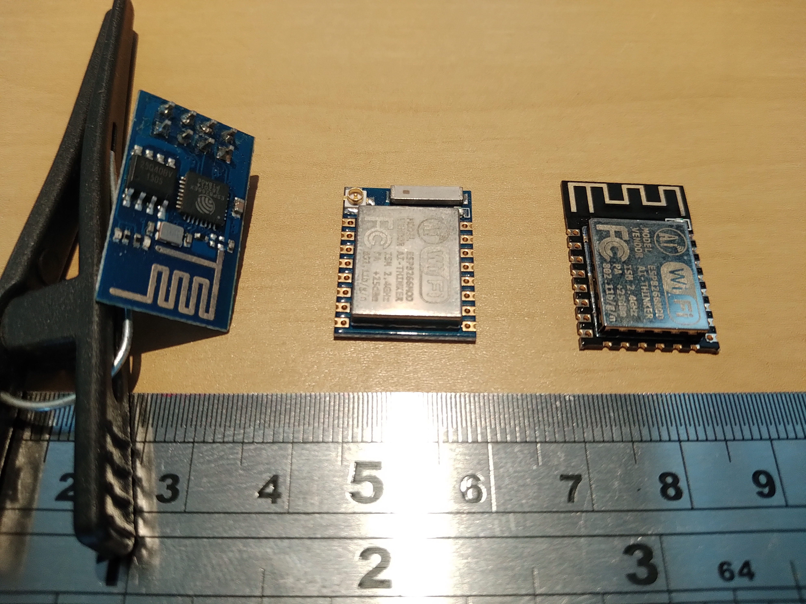
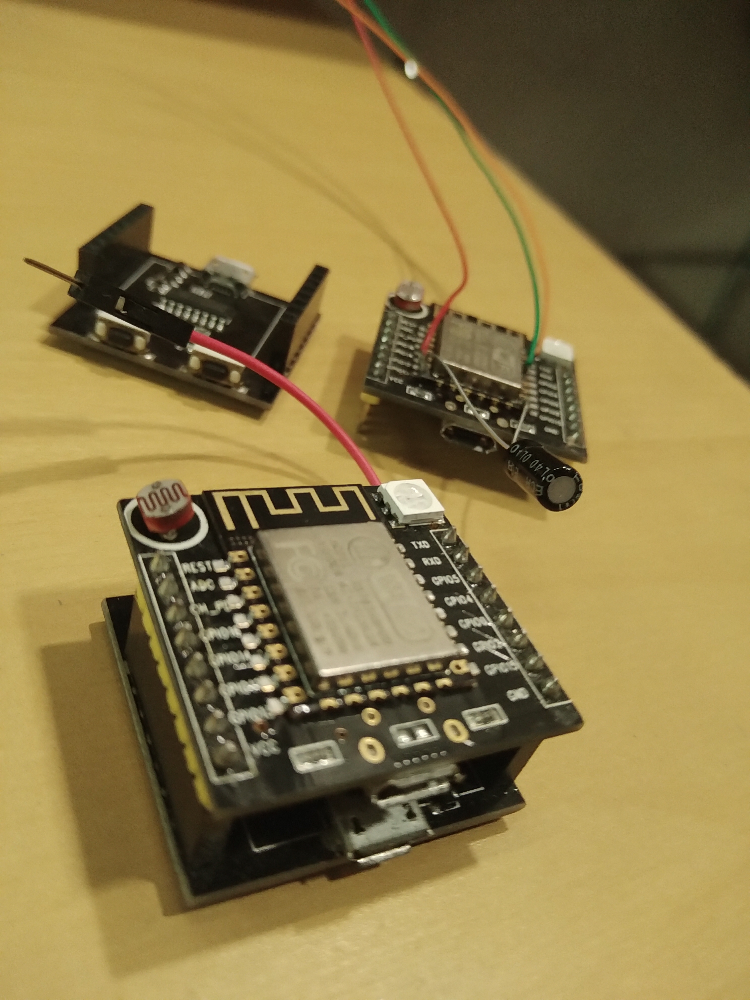
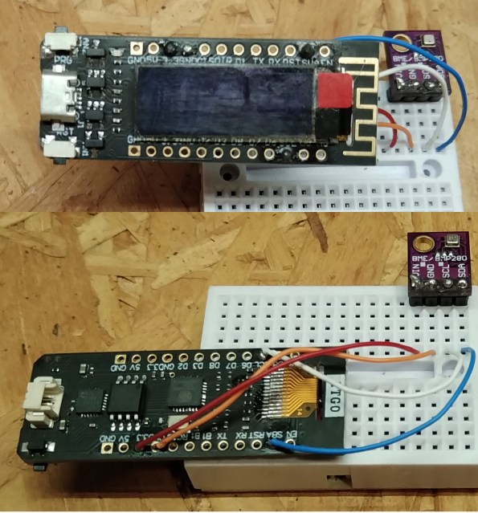

# ESP8266

ESP8266 refere-se a uma família de System on Chip (SoC) produzidos(?) pela Espressif. Há vários modelos com diferentes pinagens, quantidades de pinos usáveis, capacidades de processamento, quantidade de memória.

A cadeia de ferramentas de programação (toolchain) tem grande participação de comunidades de desenvolvedores autônomos.

Na figura abaixo, da esquerda para a direita: ESP8266-01, ESP8266-07, ESP8266-12. Em certos contextos, o 8266 pode ser omitido sem perda de especificidade do termo. Então tem-se ESP-01, ESP-07 e ESP-12. Caso seja necessário ser mais preciso para apontar o componente, o chip quadrado com terminais pelos quatro lados (encapsulamento [QFP](https://en.wikipedia.org/wiki/Quad_flat_package)), visível no ESP-01 é o SoC. Nos outros modelos, removendo a capa metálica é possível ver o SoC.



Existe uma variedade de placas controladoras baseadas em ESP8266. As que conheço, ou uso, são documentadas nas próximas seções.

## NodeMCU-ESP12

É a placa de ESP8266-12 que costumo encontrar nas lojas com maior frequência. 

Diagrama esquemático


Na minha opinião, esta placa foi concebida para prototipagem, nos moldes do Arduino Nano.

Uma pergunta que me fazem frequentemente é como usar protoboard com NodeMCU, já que ele ocupa toda a largura de um protoboard. A resposta é usar um protoboard para cada fileira de pinos. Se seu projeto puder usar os pinos de um lado só, um protoboard é suficiente.

## Wittyboard

Wittyboard é um controlador baseado em ESP8266 composto por duas placas que são conectadas uma sobre a outra, similar a *shields* de Arduino UNO.

Na foto, no plano da frente as duas placas montadas, no plano de trás as duas placas separadas.



Para programar, as duas placas devem estar conectadas (ou montadas uma sobre a outra) e a conexão deve ser feita pela porta USB da placa de baixo no plano da frente, ou à esquerda no plano de trás.

Na placa de baixo, o componente (que considero) principal é o conversor USB para Serial - CH340. Há na placa um cristal oscilador de 12MHz os capacitores conectados a ele. Os dois transistores e alguns resistores fazem parte do circuito de reset.

Na placa de cima, o ESP8266-12E, um LED RGB, um LDR e alguns resistores na parte de cima. No verso da placa há um regulador de tensão de 3.3V - AMS1117, alguns resistores e capacitores.

Comparando com o diagrama esquemático do NodeMCU-ESP12, acima, os circuitos nos quadros CORE e POWER estão na placa de cima e os circuitos USBtoUART e KEY estão na placa de baixo. O ADC foi um pouco modificado para receber o LDR. Os LEDs e o botão na placa de cima foram acrescentados.

A pinagem está na tabela abaixo.

| Label | Pin (Arduino) | Purpose
| --- | --- | --- |
| REST | — | Reset |
| ADC | A0 | Analog input, connected to LDR |
| CH_PD | — | Chip Power-Down |
| GPIO16 | D0 | GPIO, freely usable |
| GPIO14 | D5 | GPIO, freely usable |
| GPIO12 | D6 | GPIO, green channel of RGB-LED |
| GPIO13 | D7 | GPIO, blue channel of RGB-LED |
| VCC | — | +5V power |
| TXD | TX | Serial interface |
| RXD | RX | Serial interface |
| GPIO5 | D1 | GPIO, freely usable |
| GPIO4 | D2 | GPIO, connected to pushbutton |
| GPIO0 | D3 | GPIO, connected to flash-button, not really freely usable |
| GPIO2 | D4 | GPIO, connected to blue LED on the ESP-Module |
| GPIO15 | D8 | GPIO, red channel of RGB-LED |
| GND | — | Ground |

Os 3.3V não são acessíveis através dos pinos do wittyboard. Por outro lado, a saída do regulador de tensão é conectada ao seu dissipador de calor, logo, soldando um jumper ao dissipador do regulador permite usar 3,3V.

A mistura de circuitos que operam a 5V com circuitos que operam a 3,3V é possível, até comum, mas os circuitos precisam ser projetados para isso. Logo, é mais simples usar 3.3V em tudo. Seguem dois exemplos de mistura de tensão de operação. O primeiro, com LEDs neopixel, costuma falhar, o segundo com shield de relé, costuma funcionar.

LEDs WS2812 (os neopixel) necessitam de 5V em Vcc para operar, mas isso não é suficiente para funcionar conforme a operação normal, quando conectado ao ESP: Fornecendo 5V no Vcc do LED, o nível lógico alto em Din corresponde a aprox. 0,7*Vcc (dado de manual), o que resulta em 3,5V. A saída do ESP em nível lógico alto fornece 3,3V, o que não é suficiente para Din do LED. Ou seja, alguns '1' serão trocados por '0', em função de características de construção do LED e do circuito que não são controladas. Consequentemente, ocorrem resultados inesperados.

Um caso em que, misturando, funciona conforme normalmente se espera, é o de conectar ESP com *shield* de relé. O circuito mais comum para esse *shield* tem um transistor para aumentar a corrente controlada e energizar a bobina do relé. Quando usado com ESP, além de aumentar a corrente, ele também ajusta os 3.3V para 5V. Tecnicamente, funciona como *level shifter* ou *level converter* unidirecional, o que é suficiente para que o relé ligue e desligue conforme o esperado.

Projetos neste repositório que usam esta placa:

1. [Tomada conectada](../../../../projetos/ControlarTomadaPelaInternet/README.md)
3. [Prototipagem com Witty board](../../../../projetos/PrototipagemWitty/README.md)
3. [ESP32 Crossover](../../../../projetos/ESP32Crossover/README.md)

## TTGO ESP8266

Esta placa tem um display OLED.



Projetos neste repositório que usam esta placa:

1. [Sensor meteorológico](../../../../projetos/SensorMeteorologico/README.md).

## Problemas frequentes e suas soluções

Há uma variedade de ferramentas de programação para ESP8266 e elas nem sempre são baseadas no mesmo núcleo (no ESP32, a Espressif padroniza o núcleo das ferramentas de programação).

Até onde eu sei, diferentes núcleos, entre outras coisas, implicam em diferentes **bootloaders**, diferentes segmentações da memória flash, ... o que pode levar a uma variedade de contratempos, por exemplo, instabilidade no funcionamento, dificuldade em transferir o programa,...

Isto aconteceu comigo.

Emprestei Witty boards para um desenvolvedor usar num projeto dele. Não dei instruções sobre como programá-los. O desenvolvedor encontrou na internet uma ferramenta de programação e programou os Witty boards, usou e depois os devolveu a mim.

Um tempo depois peguei um para testar um programa. Uso Arduino IDE com placa Generic ESP8266. Eu não conseguia enviar o programa (já não tenho o traceback, acho que o erro era *invalid packet header*). Então vi a opção 'Erase Flash: "erase all flash content"'. Ativei essa opção e programei. As mensagens são as mesmas abaixo:

```
Archiving built core (caching) in: /tmp/arduino_cache_660514/core/core_esp8266_esp8266_generic_xtal_80,vt_flash,exception_legacy,ssl_all,ResetMethod_nodemcu,CrystalFreq_26,FlashFreq_40,FlashMode_dout,eesz_1M64,led_2,sdk_nonosdk_190703,ip_lm2f,dbg_Disabled,lvl_None____,wipe_all,baud_115200_5e3949df3ec8afd6d2f23643e15ed1c3.a
Executable segment sizes:
IROM   : 234152          - code in flash         (default or ICACHE_FLASH_ATTR) 
IRAM   : 27864   / 32768 - code in IRAM          (ICACHE_RAM_ATTR, ISRs...) 
DATA   : 1280  )         - initialized variables (global, static) in RAM/HEAP 
RODATA : 740   ) / 81920 - constants             (global, static) in RAM/HEAP 
BSS    : 25248 )         - zeroed variables      (global, static) in RAM/HEAP 
O sketch usa 264036 bytes (27%) de espaço de armazenamento para programas. O máximo são 958448 bytes.
Variáveis globais usam 27268 bytes (33%) de memória dinâmica, deixando 54652 bytes para variáveis locais. O máximo são 81920 bytes.
esptool.py v2.8
Serial port /dev/ttyUSB0
Connecting....
Chip is ESP8266EX
Features: WiFi
Crystal is 26MHz
MAC: a0:20:a6:0f:58:99
Uploading stub...
Running stub...
Stub running...
Configuring flash size...
Auto-detected Flash size: 4MB
Erasing flash (this may take a while)...
Chip erase completed successfully in 11.9s
Flash params set to 0x0340
Compressed 268192 bytes to 197544...

Writing at 0x00000000... (7 %)
Writing at 0x00004000... (15 %)
Writing at 0x00008000... (23 %)
Writing at 0x0000c000... (30 %)
Writing at 0x00010000... (38 %)
Writing at 0x00014000... (46 %)
Writing at 0x00018000... (53 %)
Writing at 0x0001c000... (61 %)
Writing at 0x00020000... (69 %)
Writing at 0x00024000... (76 %)
Writing at 0x00028000... (84 %)
Writing at 0x0002c000... (92 %)
Writing at 0x00030000... (100 %)
Wrote 268192 bytes (197544 compressed) at 0x00000000 in 17.5 seconds (effective 122.8 kbit/s)...
Hash of data verified.

Leaving...
Hard resetting via RTS pin...
```

Fazendo isto o programa foi transmitido e executado com sucesso. **Como há limite ,aprox. 10000 vezes, na quantidade de vezes que a memória flash pode ser apagada**, recomendo voltar para  'Erase Flash: "Only sketch"' para as próximas vezes em que programas forem enviados.


