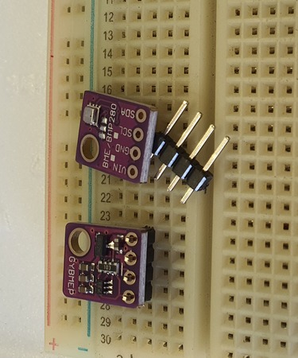
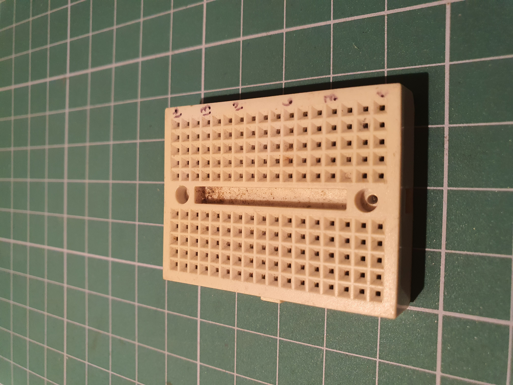
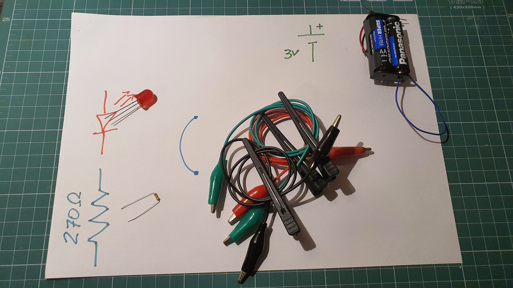
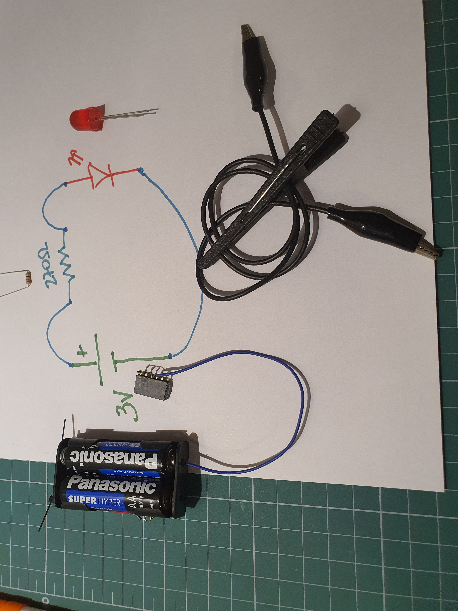
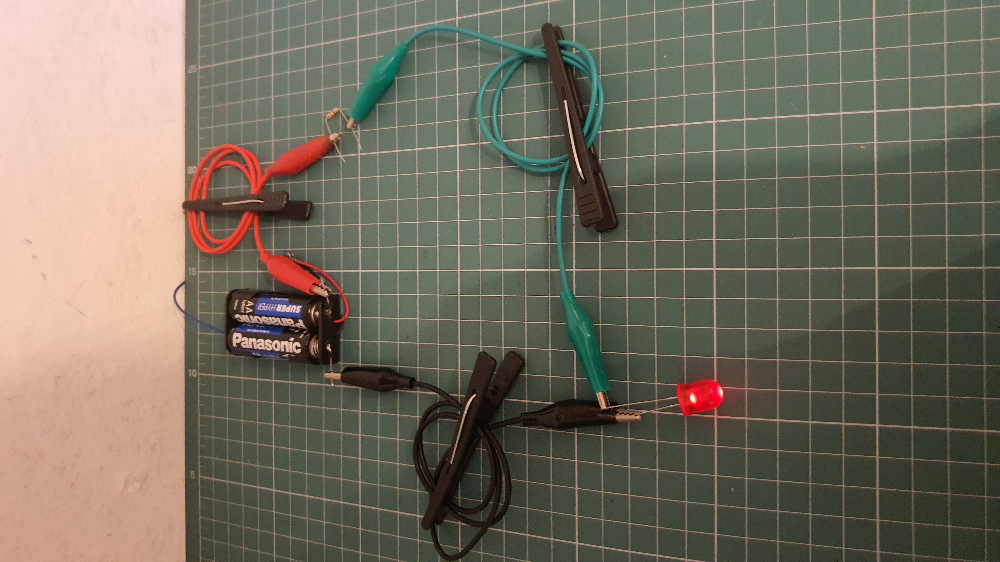
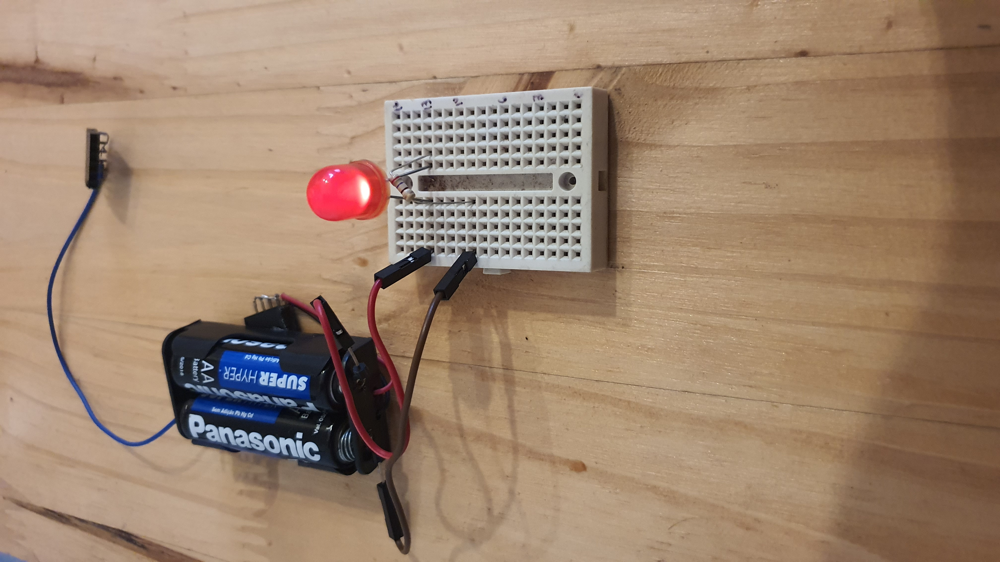
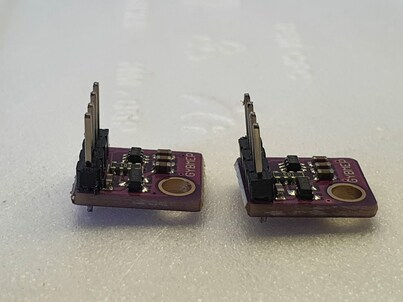
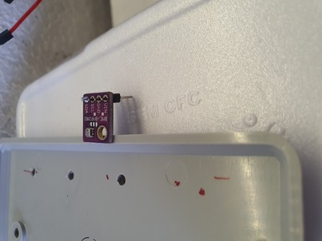

# Interconexões

Frequentemente recebo placas de sensores sem as barras de pinos soldadas (foto, placa acima). Infelizmente os contatos não se estabelecem se apenas colocarmos os pinos nas ilhas (foto, placa abaixo). Se o caso é esse, o que dá menos trabalho é soldar a barra de pinos, ou pedir para alguém fazer.

Existe uma variedade de componentes para conectar eletricamente outros componentes.

Na foto abaixo: 

- à esquerda conector Sindal, frequentemente usado para conectar chuveiro à rede elétrica. As três linhas horizontais de dois parafusos são, cada uma, um contato, os fios a conectar são inseridos pelas laterais, os pararfusos devem ser afrouxados para inserir os fios e apertados para firmar os fios e a conexão. Os outros dois furos são usados para fixar fisicamente o conector em uma caixa ou placa;
- no alto, azuis, conectores parafusados usados em módulos de relé. Os parafusos são afrouxados para permitir a conexão pela lateral e apertados para fixar a conexão;
- em baixo dos conectores parafusados, placa de circuito impresso tipo trilha. As trilhas são de cobre e interconectam as ilhas (furos). Nas ilhas são inseridos e soldados terminais de componentes;
- em verde com ilhas metalizadas, uma placa de circuito impresso tipo ilha. As conexões entre as ilhas são soldadas.
- abaixo, barras de pinos (headers) e barra de conectores. Cada pino corresponde a um contato. Essas barras são soldadas às placas de circuito impresso para conectar circuitos de diferentes placas. Os arduinos UNO e MEGA trazem soldadas barras de conectores, o arduino nano e o Node* trazem soldadas barras de pinos. O suporte plastico dos pinos derrete com a temperatura do ferro de solda, o que dificulta (inviabiliza) usar a barra de pinos sem que ela esteja apoiada numa placa de circuito impresso.
- no centro da foto, branco com traços vermelhos e azuis um protoboard. É uma placa de contatos (como os da barra de conectores), usada para agilizar a construção de protótipos para teste. Referências:
    - [O que é, como é construído (desmontagem), como usar,...](https://portal.vidadesilicio.com.br/protoboard/)
    - [como usar (site robocore)](https://www.robocore.net/tutoriais/como-utilizar-uma-protoboard)
    - [o que é - slides no site da UEL](http://www.uel.br/pessoal/ernesto/arduino/00_Protoboard.pdf)
    - [wikipedia](https://pt.wikipedia.org/wiki/Placa_de_Ensaio)

Foto 1: Vários componentes usados para conexão de outros componentes.

# Protoboards, Jumpers, bitolas, lapiseiras e um pouco de pensamento lógico.

## Descrição de *protoboard*

Protoboard, ou breadboard é um componente elétrico usado para construir protótipos de circuitos eletro-eletrônicos. 

A função do protoboard é facilitar a (inter)conexão dos demais componentes que constituem os circuitos. 

Um protoboard é constituído por blocos plásticos encaixados. No interior de cada bloco plástico há contatos metálicos de encaixe. Os contatos são interconectados em uma determinada ordem. Os blocos plásticos servem como suporte mecânico para os contatos (os mantém em posições fixas um em relação aos outros) e como isolante elétrico (evita conexões indesejadas entre contatos). Os contatos estão dentro do bloco e são acessados por furos. O conjunto furo + contato às vezes é chamado ponto (do protoboard). Nesses pontos podem ser inseridos ou os terminais de uma variedade de componentes eletro-eletrônicos, ou uma variedade de conectores elétricos ou uma variedade de fios condutores elétricos.

Se um terminal de um componente é inserido em um ponto, o terminal é conectado (eletricamente) ao contato. Em um ponto espera-se que somente um terminal seja inserido.

Os pontos, ou contatos, usualmente, são interconectados em grupos de cinco e dispostos em linha. A distância entre um ponto (de referência) e um ponto adjacente do mesmo grupo (dada uma linha há no máximo dois pontos adjacentes ao ponto de referência) é de 0,1 polegadas (2,54mm). **nota**: a distância entre dois pontos ser de 0,1 polegadas não é (condição) suficiente para concluir que os pontos estão interconectados. 

Há duas ordens de contatos mais comuns: barramento e matriz. Um barramento é um bloco de plástico com contatos, uma matriz é um bloco de plástico com contatos. Na Foto 1, o protoboard tem três blocos. O bloco mais acima é um barramento, o bloco do meio é uma matriz e o bloco de baixo é outro barramento.

No barramento, geralmente, há duas linhas paralelas constituidas por pontos. Graficamente são representadas por uma linha azul e outra vermelha. Fixada uma linha, todos os pontos na linha devem estar interconectados. A interrupção da conexão é informada pela interrupção das linhas azul e vermelha. 

Na matriz há linhas e colunas. Em uma linha, o mais comum é haver um grupo de cinco pontos alinhados e interconectados, um espaço de 0,3 polegadas sem contatos, seguido de um segundo grupo de cinco pontos alinhados e interconectados. Os grupos não são conectados entre si. Em uma matriz há de 17 a mais de 50 linhas. A distância entre as linhas (também) é de 0,1 polegadas. Para completar a informação: a matriz tem cinco colunas de contatos, uma coluna de espaçamento de 0,3 polegadas e mais cinco colunas de contatos. Fixada uma coluna, na matriz sem componentes adicionais, os pontos da coluna não são interconectados. 

Foto 2: Um protoboard de um só bloco. O tipo do bloco é matriz.

Desta forma, visualmente, tome como base o protoboard da Foto 1:

- se a distância entre um ponto e o ponto adjacente é de mais de 0,1 polegadas, é pouco provável que estes pontos estejam interconectados;
   - exceção: barramento;
- se há exatamente cinco pontos em linha a 0,1 polegadas um do outro, é muito provavel que estejam interconectados,
   - desconheço protoboard do tipo matriz com exatamente cinco colunas, se existir, seria exceção a esta regra;
- se há mais (ou menos) de cinco pontos em linha a 0,1 polegadas um do outro, então é pouco provável que estejam conectados.

### Notas

- Agora percebo porque eu estava adiando escrever sobre protoboard: gastei bastante tempo;
- A Wikipedia vem sendo completada! (https://en.wikipedia.org/wiki/Breadboard)

### Conectar componentes usando protoboard

A fim de facilitar a leitura, convenciona-se que *grupo* refere-se a um grupo de cinco contatos em linha que são, por construção do protoboard, interconectados.

Se um terminal de um componente é ligado a um contato do grupo e um terminal de outro componente é ligado a outro contato do mesmo grupo, os dois terminais estão (inter)conectados.

Por exemplo, num circuito para acender um LED, usa-se um LED, um resistor e duas pilhas montadas em um suporte para pilhas (Foto 3). 

Foto 3: Componentes e seus símbolos em diagramas esquemáticos (exceto os fios com garras jacaré desenhados "artisticamente" como arcos. Em diagramas esquemáticos os fios confundem-se com os terminais dos componentes. Pode-se dizer que estão implícitos nas linhas que conectam os terminais dos componentes.)

O circuito pode ser desenhado em um diagrama esquemático (Foto 4), ou montado com cabos e garras jacaré (Foto 5), ou montado com um protoboard (Foto 6).

Foto 4: Diagrama esquemático que representa o circuito usado como exemplo. Seguindo o circuito: a partir do polo positivo das pilhas, conecta a um terminal do resistor, passa pelo resistor, conecta o outro terminal do resistor ao catodo do LED, passa pelo LED, conecta o anodo do LED ao polo negativo das pilhas.

Foto 5: Circuito montado com interconexão com fios e garras jacaré: Seguindo o circuito: a partir do polo positivo das pilhas, conecta com o fio vermelho a um terminal do resistor, passa pelo resistor, conecta com o fio verde o outro terminal do resistor ao catodo do LED, passa pelo LED, conecta com o fio preto o anodo do LED ao polo negativo das pilhas.

Foto 6: Circuito montado com interconexão com jumpers e protoboard. Nota: Jumper, neste contexto, é o fio com as pontas apropriadas para conexão no protoboard.  Seguindo o circuito: a partir do polo positivo das pilhas, conecta com o jumper vermelho a um ponto do grupo da linha 13, esquerda; em um outro ponto do grupo conecta o catodo do LED; conecta o anodo do LED a um ponto do grupo da linha 13, direita; conecta outro ponto deste grupo a um terminal do resistor, passa pelo resistor, conecta o outro terminal do resistor a um ponto do grupo da linha 9, esquerda; conecta outro ponto da linha 9, esquerda ao polo negativo das pilhas. **nota**: o circuito é ligeiramente diferente do diagrama esquemático e da montagem com fios e garras jacaré.

### Sobre que terminais e fios são apropriados para usar com protoboard.

Os contatos do protoboard têm tamanho limitado, são feitos de metal e aproveitam o efeito mola do metal para pinçar os fios, terminais ou conectores que são inseridos nos pontos. Portanto, esses fios, terminais e conectores devem "respeitar" o tamanho do contato.

O conector padrão é o conector macho para jumpers DuPont (é a empresa que patenteou o conector há algumas décadas). Até onde procurei, a DuPont não fabrica mais esse tipo de conector mas o nome ficou. Por exemplo *jumper wires with Dupont connectors* (https://www.farnell.com/datasheets/3178883.pdf), *male pin connector for dupont jumper wire*. Nessas referências a ponta do conector é de metal sólido de secção transversal quadrada e 0,64mm de lado.

Esses *DuPont jumper wires* são comparativamente mais caros que suas alternativas. Fios sólidos (ou rígidos) são alternativas viáveis. Fios costumam ter secção (transversal) circular. Na faixa de diâmetros de secção apropriados para protoboard, é mais comum usar o padrão de medida *American Wire Gauge* (AWG). Esta pode ser convertida em milímetros ou em milímetros quadrados, caso a medida desejada seja da superfície da secção transversal. Tabela de conversão em https://en.wikipedia.org/wiki/American_wire_gauge#Tables_of_AWG_wire_sizes . Caso seja necessário usar fios muito finos, ex. 28 AWG, colocar na ponta o conector DuPont diminuirá significativamente a probabilidade de mau contato.

Segundo a tabela de conversão, o diâmetro que mais se aproxima do lado da secção transversal do conector DuPont é o 22 AWG.

Já experimentei com fio tirado de:
	
- cabo de rede, geralmente é AWG 24 que é um pouco mais fino que o 22 AWG. A impressão que tenho é de firmeza na conexão com o contato do protoboard [Foto](./20230929_191937.jpg);
- cabo telefônico CI 50, este tem diâmetro de 0,50 mm. É um pouco mais fino que o 24 AWG. A impressão que tenho é que ele fica um pouco frouxo com o contato do protoboard [Foto](./20230929_192200.jpg).

Atualmente os cabos chatos (*flat cables*) mais comuns no mercado brasileiro têm vias com fio trançado (enamelado) de 26 ou 28 AWG ([Foto](./20230929_193751.jpg)). Para usá-los, é necessário (mandatório?) usar conector DuPont. Caso contrário, a chance de mau contato é alta (o fio é fino) e o fio pode enroscar no ponto do protoboard - puxar com muita força pode danificar o ponto do protoboard.

Alguém pode notar que terminais de resistores, de LEDs, de transistores, ... são mais finos que 24 AWG. De fato são, de fato são bastante sujeitos a mau contato MAS isso é aliviado porque o componente é rígido e tem dois ou mais terminais então o terminal sempre entra enviesado em relação ao conector o que acaba dando mais firmeza no contato.

Barras de pinos (headers, https://en.wikipedia.org/wiki/Pin_header) existem em vários tamanhos. O mais conhecido acredito que seja a barra de pinos que faz par com os contatos do protoboard. Novamente referenciado como DuPont connector. Logo, se quiser ter uma referência de tamanho, é razoável usar o conector da barra de pinos.

## Soldar barras de pinos

Quando for soldar, nao aqueça o pino por muito tempo pois o plástico (preto) derrete muito fácil e o pino fica torto em relação aos outros, ou se destaca da barra (com o característico cheiro de plástico derretido).

Também, numa barra, quando soldar uma sequência de pinos, dê um tempo entre uma solda e outra, para o plástico esfriar e não derreter.

Barras de pinos soldadas muito inclinadas em relação ao plano da placa podem gerar falta de espaço: O conjunto de placas não encaixa (porque uma placa atrapalha o encaixe da outra), ou o conjunto não cabe na caixa (porque tem uma placa torta que faz o conjunto não caber na caixa). Fora isso, não deve haver maiores problemas. Por via das dúvidas e das mudanças, procure soldar as barras de pinos na posição certa (tem manha para isso). Na foto abaixo, a barra de pinos da placa da esquerda está (razoavelmente) perpendicular à placa, como costuma se esperar. Na placa da direita ela está suficientemente 'torta' para ser fonte potencial de problemas de espaço.

A manha: quando for soldar uma barra de pinos, comece soldando o pino de alguma das extremidades (um só!). Espere o plástico esfriar, veja se precisa acertar (raramente fica bom de primeira). Se precisar acertar, aqueça o pino novamente (e rapidamente) e acerte a inclinação. Outras plaquinhas, suportes, etc. podem ser úteis para apoiar a placa que vai ter a barra de pinos soldada. Na foto abaixo usei um espelho de caixa de luz como apoio. Depois que a barra estiver acertada e bem apoiada na placa, solde o restante dos pinos (sempre com o cuidado de não derreter o plástico da barra).

## Derivações

Em circuitos elétricos existe a noção de hierarquia em função da capacidade de corrente, tensão ou outras características. Esta noção induz a existência de condutores principais e condutores secundários. 

A conexão de um condutor secundário a um condutor principal é chamada derivação. O 'gato' é uma derivação, geralmente inesperada, indesejada ou fora das regras.

Derivações podem ser feitas desencapando um segmento do condutor principal e soldando ou enrolando o condutor secundário. Isto é simples quando o condutor principal é suficientemente resistente, como um fio de 2.5mm^2.

Já em jumpers, geralmente fio 26 AWG (American Wire Gauge), aprox. 0,13mm^2, cortar o isolamento sem cortar o fio pode ser difícil...

Uma solução é construir distribuidores com headers soldados em placas de circuito impresso.

Conversor de bitola de fio: <https://www.areaseg.com/awg.html>

