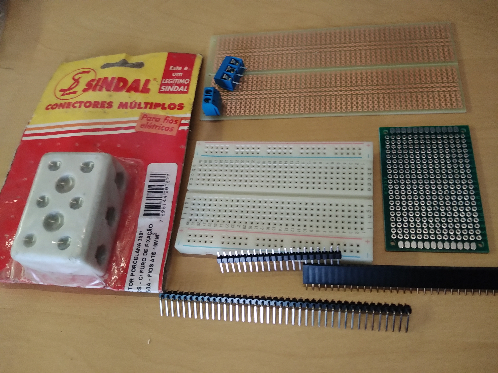

# Interconexões

Existe uma variedade de componentes para conectar eletricamente outros componentes.

Na foto: 

- à esquerda conector Sindal, frequentemente usado para conectar chuveiro à rede elétrica. As três linhas horizontais de dois parafusos são, cada uma, um contato, os fios a conectar são inseridos pelas laterais, os pararfusos devem ser afrouxados para inserir os fios e apertados para firmar os fios e a conexão. Os outros dois furos são usados para fixar fisicamente o conector em uma caixa ou placa;
- no alto, azuis, conectores parafusados usados em módulos de relé. Os parafusos são afrouxados para permitir a conexão pela lateral e apertados para fixar a conexão;
- em baixo dos conectores parafusados, placa de circuito impresso tipo trilha. As trilhas são de cobre e interconectam as ilhas (furos). Nas ilhas são inseridos e soldados terminais de componentes;
- em verde com ilhas metalizadas, uma placa de circuito impresso tipo ilha. As conexões entre as ilhas são soldadas.
- abaixo, barras de pinos (headers) e barra de conectores. Cada pino corresponde a um contato. Essas barras são soldadas às placas de circuito impresso para conectar circuitos de diferentes placas. Os arduinos UNO e MEGA trazem soldadas barras de conectores, o arduino nano e o Node* trazem soldadas barras de pinos. O suporte plastico dos pinos derrete com a temperatura do ferro de solda, o que dificulta (inviabiliza) usar a barra de pinos sem que ela esteja apoiada numa placa de circuito impresso.
- no centro da foto, branco com traços vermelhos e azuis um protoboard. É uma placa de contatos (como os da barra de conectores), usada para agilizar a construção de protótipos para teste. Referências:
    - [O que é, como é construído (desmontagem), como usar,...](https://portal.vidadesilicio.com.br/protoboard/)
    - [como usar (site robocore)](https://www.robocore.net/tutoriais/como-utilizar-uma-protoboard)
    - [o que é - slides no site da UEL](http://www.uel.br/pessoal/ernesto/arduino/00_Protoboard.pdf)
    - [wikipedia](https://pt.wikipedia.org/wiki/Placa_de_Ensaio)

## Derivações

Em circuitos elétricos existe a noção de hierarquia em função da capacidade de corrente, tensão ou outras características. Esta noção induz a existência de condutores principais e condutores secundários. 

A conexão de um condutor secundário a um condutor principal é chamada derivação. O 'gato' é uma derivação, geralmente inesperada, indesejada ou fora das regras.

Derivações podem ser feitas desencapando um segmento do condutor principal e soldando ou enrolando o condutor secundário. Isto é simples quando o condutor principal é suficientemente resistente, como um fio de 2.5mm^2.

Já em jumpers, geralmente fio 26 AWG (American Wire Gauge), aprox. 0,13mm^2, cortar o isolamento sem cortar o fio pode ser difícil...

Uma solução é construir distribuidores com headers soldados em placas de circuito impresso.

Conversor de bitola de fio: <https://www.areaseg.com/awg.html>
