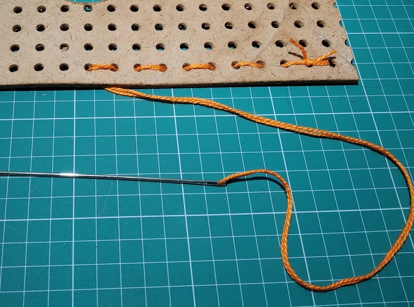
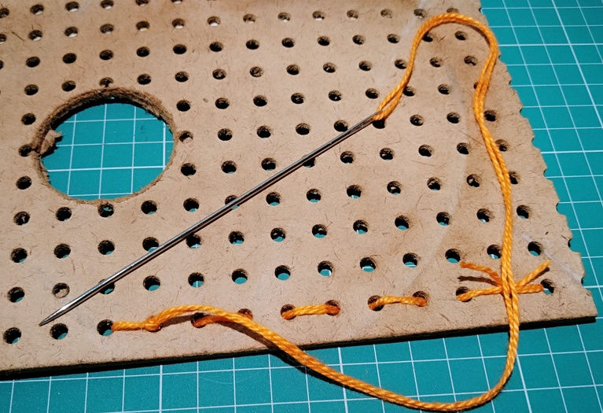
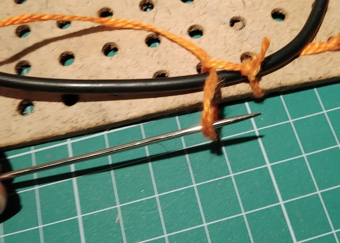

# Vestíveis em geral
(baseado nas aulas da Prof. Isabel Italiano)

Conforto

- Calor, frio;
- Transpiração;
- Atrito com a pele;
- Firmeza, frouxidão;
- cantos 'vivos'
- rebarbas,

Placas de circuito impresso são compostas por camadas alternadas de isolante (fenolite ou fibra de vidro) e condutor (cobre). O condutor forma trilhas que conectam os terminais dos componentes. Em geral não há trilhas passando por fora dos furos de fixação dos cantos das placas. Por exemplo, abaixo, a placa do TTGO (imagem de um link do ebay: <https://www.ebay.com/itm/TTGO-T-Display-ESP32-CP2104-WiFi-Bluetooth-Module-1-14-LCD-Board-For-Arduino-/312989098067) 

Na imagem há trilhas em vermelho, rosa e azul. Os componentes em amarelo. Não há trilhas passando por fora dos furos de fixação, em amarelo, no topo da figura, embora um dos furos fique obstruído pela antena do ESP32.

Com base nesses diagramas, é possível desbastar os cantos das placas sem danificar os circuitos.

Conservação do dispositivo

- Impacto
- Flexão/torção
- Lavagem
- Água
    - respingos;
    - mergulho e encharcamento;
    
    - água doce;
    - água com produtos, ex. produtos de limpeza;
    - água salgada;
    - outras misturas;
- Suor
- vapor/condensação
- poeira;
- 
Conservação das outras peças de roupa

- cantos 'vivos'
- rebarbas,

- mangas, punhos, bolsos

Acessos físicos

- Concectores, pinos: elementos que precisam ser acessados;
- Chave liga/desliga;

Vou apresentar o que fiz (ou o que fui capaz de fazer) nas partes vestíveis, sem ocupar-me com variações...

## Linha na agulha

Passar a linha na agulha e fazer um nó unindo as duas pontas da linha.

## Costura reta

A placa perfurada representa o tecido. Para começar a costura, fazer um ponto para trás e passar a agulha dentro do laço. Isto fixa a ponta do nó eda costura. 

Um nó aumenta a firmeza:

Antes de fechar o nó, certificar que o ponto não está frouxo e que a linha não vai dar voltas, enrolar, quando fechar.

Seguir com a costura reta até terminar o comprimento a costurar

Dar um nó, como o mostrado anteriormente: um ponto para trás, 

laçar a linha e dar o nó, com o cuidado de não deixar a linha embaraçar e não afrouxar o ponto.

Nesta costura fiz um segundo nó - talvez dê para entender melhor a idéia do nó nesta foto.

## União de faixa com uma haste ou cabo

Começa da mesma forma: [Linha na agulha](#Linha-na-agulha) e passa pelo laço formado pelas duas pontas.

 
 Antes de apertar completamente, laçar cabo ou haste junto.

Depois de laçar o cabo ainda fica frouxo...

 então para firmar, ajustar e fazer um nó: passar a agulha sob a linha do ponto para criar um laço...

passar a agulha por dentro do laço criado...

puxar na direção para tirar as folgas

...e apertar o nó.

**início da repetição**: Nos pontos seguintes, a descida forma um laço e a subida passa por dentro do laço.

subida passa dentro do laço.

a volta sobre o cabo é frouxa

firmar com um nó: passar a agulha por baixo da volta, 

no novo laço que se forma, passar a agulha de volta, 

apertando o ponto antes de apertar o nó.

nó feito, passando para o próximo ponto, repete o processo a partir de **inicio de repetição** 

## União com uma placa

A placa perfurada grande representa o tecido, a placa pequena represente uma placa de circuito com furos para fixação.

Inicia passando a agulha pelo furo de fixação da placa e pelo tecido, voltando e passando pelo laço entre as linhas, como no início das costuras anteriores.

O ponto fica frouxo, então passar a agulha pelo ponto para formar o laço e dar um nó

Tirando as folgas para depois apertar o nó.

Nó feito

Para reforçar, dar algumas voltas, laçar as voltas e dar um nó.

 
laçar as voltas

 
 dar nó
 

