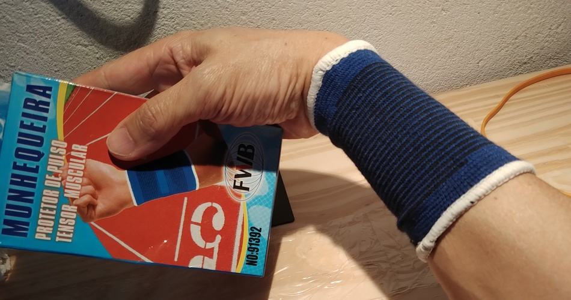
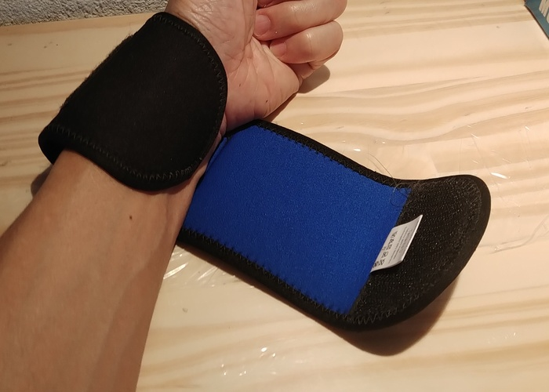
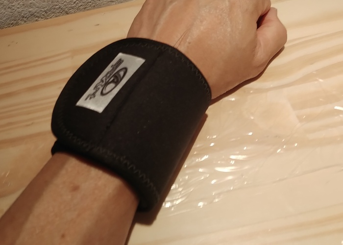
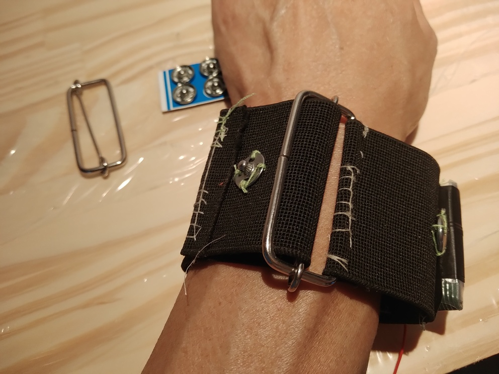
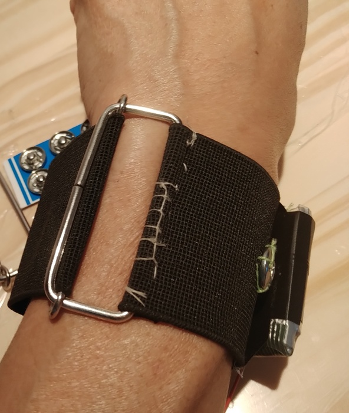

# Faixa de Pulso

## Introdução

Este artigo apresenta proposta, construção e teste de um ambiente de pulso para prototipação de dispositivos computacionais, IoT, TIC 

No corpo, a região do pulso (ou do punho em camisas) é facilmente acessível, geralmente exposta, móvel e estável em relação às mãos e olhos da própria pessoa. É localização interessante para dispositivos que tenham algum tipo de interação consciente (ver e intepretar, escolher e tocar, ...).

As aplicações podem ser muito variadas, além da imaginação dos autores que, em resposta, prentendem propor o ambiente mais genérco possível, conservando utilidade e variedade de aplicaões.

A superfície disponível, aproximadamente um cilindro, pode ser segmentada em planos, o que permite posicionar placas de circuito impresso, baterias e componentes avulsos, o que permite posicionar alguns modelos específicos de ESP e Arduino, sensores, chaves, displays,...

Uma peça vestível requer ajuste apropriado ao corpo no formato, dissipação de calor e umidade, atrito com a pele. Há variabilidade nesses parâmetros por conta da diversidade biológica e psicológica dos indivíduos, o que torna conveniente que o usuário tenha liberdade para ajustar a peça.

Componentes e dispositivos eletrônicos, em geral, são mecanicamente rígidos, encapsulados em plástico ou resina, têm contatos de metal. Esta construção é especialmente sensível a esforço mecânico (compressão, torção), líquidos, que pode oxidar os contatos com facilidade. No processo construção de protótipos, nas etapas computacionais, pouca atenção é dada ao desenho mecânico do produto como um todo (ex. bastidores, pontos e sistemas de fixação,...). Placas para prototipação frequentemente têm todos os componentes expostos, da forma como são soldados à placa.

Neste contexto, propõe-se que o suporte vestível seja uma faixa elástica com um regulador que permita ao usuário ajustar a (com)pressão da faixa.

Os dispositivos e componentes são aplicados (costurados) em passadores, proporcionando suporte mecânico firme e removível. Foram testados passadores de fita isolante com reforço de elástico, EVA e fita de gorgorão.

A faixa pode ser lavada sem cuidados especiais e, caso os passadores precisem ser lavados (o que espera-se que seja raro ou desnecessário para os passadores de fita isolante e EVA), os dispositivos podem ser descosturados e recosturados com a maior facilidade possível.

## Resultados

Para chegar ao resultado foram avaliadas alternativas: faixa fechada e faixa com fecho em velcro.

### Faixa fechada

Este modelo de faixa, cilíndrica, sem abertura e toda elástica requer expandir para ser vestida. Os dispositivos, ou são costurados diretamente na faixa, ou são montados sobre passadores com fecho. 

No caso da costura direta, isto dificulta a lavagem da faixa e a costura pode romper-se ou ficar folgada para compensar a elasticidade da faixa contraposta à rigidez do dispositivo.

No caso do passador com fecho, transfere trabalho de construção da faixa para o passador. Como pode haver mais de um passador na faixa, acaba aumentando a quantidade de trabalho para chegar ao resultado final.

### Faixa com fecho em velcro

Consegui um bom ajuste ao fechar este modelo de faixa apoiando o braço na mesa ou segurando com a mão em que a faixa é fechada e então tracionando a outra ponta com a outra mão.

### Faixa com regulador

O regulador de metal tem haste central móvel e fina. A inversão de direção da faixa permite que seja fechada e, se necessário, apertada com bastante força. A haste central móvel contribui para a firmeza do ajuste pois pressiona a faixa elástica contra o quadro do regulador.

Esta foi a construção escolhida.

### Escolha de passador 

<!--- convert -crop 3368x800+300+1300 IMG_20200817_172651874.jpg faixa.jpg --->

<!--- convert -crop 3368x1800+300+800 IMG_20200817_191645877.jpg relogioNoPulso.jpg --->

<!--- convert -crop 3368x2400+600+500 IMG_20200817_192119384.jpg relogio.jpg --->

O passador de fita isolante, pela baixa espessura, é confortável do lado do contato com o pulso, mas pouco resistente à costura. Por isso recebeu reforço, feito da própria faixa elástica, do lado do dispositivo, a costura atravessa o reforço e a fita. O adesivo da fita é útil para manter a posição dos componentes no momento da costura.

O passador de EVA é mais fácil de fazer pois as extremidades podem ser coladas; possibilita controlar melhor a folga entre o passador e a faixa, mas sua espessura o torna mais perceptível e seu material não permite circulação de ar (dissipação de calor e vapor) - o suor se acumula no passador. A costura do dispositivo deve ser feita com pontos largos para evitar que a linha rasgue o EVA.

O passador de fita de gorgorão ainda não foi testado.

## Materiais

- 25 cm de elástico chato, 50mm de largura;
- 1 Regulador de alça 50mm;
- Para os passadores: fita gorgorão, ou, viés, 30mm de largura;
- Para segurar a ponta do elástico 1 Colchete;
- Agulha, linha e outras ferramentas;

## Construção

Dobrar a extremidade da fita sobre uma ponta do regulador e costurar. Pode-se usar [a costura com haste ou cabo](../README.md#União-de-faixa-com-uma-haste-ou-cabo)

Nesta etapa a faixa pode ser experimentada.

Costurar o colchete na outra extremidade da fita. Pode-se usar [a costura com placa](../README.md#União-com-uma-placa)

Fazer os passadores com tiras de 11cm de comprimento de viés. As extremidades podem ser costuradas com 

Feitos os passadores, testar o ajuste destes à faixa;

Passando no teste, retirar da faixa e costurar o dispositivo no passador. Pode-se usar [a costura com placa](../README.md#União-com-uma-placa)

## Aplicações

[Relógio Bluetooth](../../../projetos/RelogioConectado/README.md)

