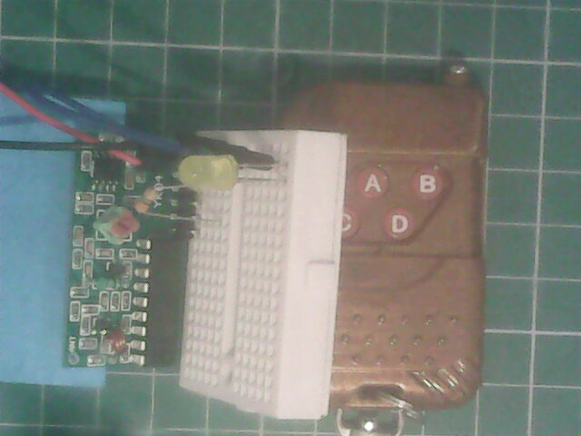

Este é um controle remoto para portão eletrônico, similar aos usados em garagens. Consiste em um transmissor, na foto, o chaveiro marrom e um receptor, na foto a placa de circuito impresso conectada ao protoboard.

O transmissor usa uma bateria de 12V código A23.

O receptor tem pinos:
	
| Pino | função | botão do controle remoto |
| --- | --- | --- |
| GND | GND | X |
| VCC | alimentação, 5V | X |
| D0 | saída | ?{A,B,D} |
| D1 | saída | ?{A,B,D} |
| D2 | saída | ?{A,B,D} |
| D3 | saída | C |
| V1 | ? | X |

O botão C corresponde à saída D3.

Este modelo de controle remoto foi usado em: https://github.com/tio-bryan/wearables-2022

### Objetivo

Pretende-se demonstrar um uso simples do controle remoto.

### Materiais

| item | quantidade | ccc |
| --- | --- | --- |
| bateria A27 | 1 | --- |
| transmissor YK04 | 1 | --- |
| fonte 5V | 1 | --- |
| receptor YK04 | 1 | --- |
| LED amarelo | 1 | --- |
| resistor 330$\Omega$ | 1 | --- |
| protoboard | 1 | --- |
| jumpers macho-macho | vários | --- |

### Conexões

| item | pino | pino | pino | pino | pino | pino |
| --- | --- | --- | --- | --- | --- |
| fonte 5V | VCC | GND | --- | --- | --- |
| receptor YK04 | VCC | GND | --- | D3 | --- |
| LED amarelo | --- | ânodo | catodo | --- | --- | --- |
| resistor 330$\Omega$ | --- | --- | 1 | 2 | --- | --- |

### teste

- Colocar a bateria no transmissor
- Ligar a fonte de 5V
- Apertar o botão C
   - caso o LED não acenda nem pisque, aproxime o transmissor do receptor, sem soltar o botão.
   
[Vídeo do teste](https://youtu.be/KOvdvc1P9Gw)

### Comentários

- Os sinais nos pinos Di do receptor parecem ser digitais.
- Quando o sinal é recebido sem falhas, Di tem nível lógico 1, estável, enquanto o botão no transmissor estiver pressionado.
- Uma recepção falha, por exemplo por sinal fraco, faz o sinal em Di oscilar.
- A distância entre a antena do transmissor e o receptor (sem antena) para recepção sem falhas é de, no máximo, 5cm;
- A distâncias entre 5cm e 15cm a recepção é falha (o sinal no pino Di correspondente oscila);
- A distância maior que 15cm não há recepção (Di fica em nível zero);

