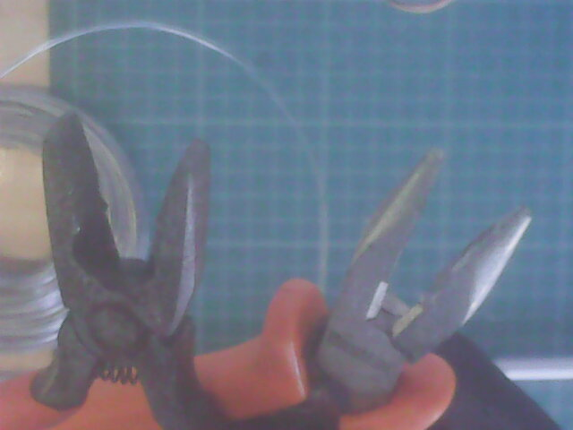
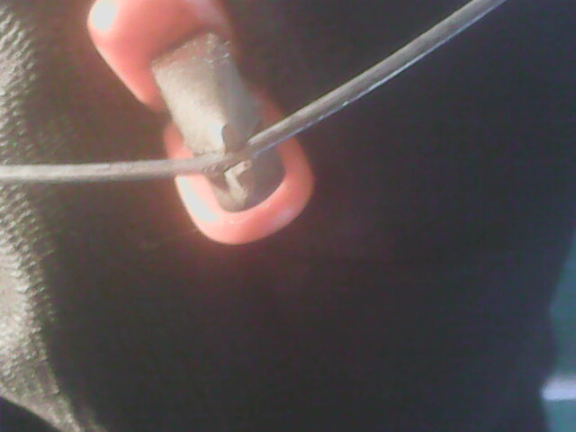
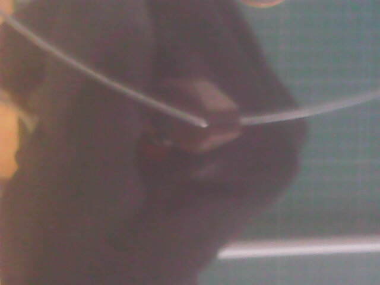
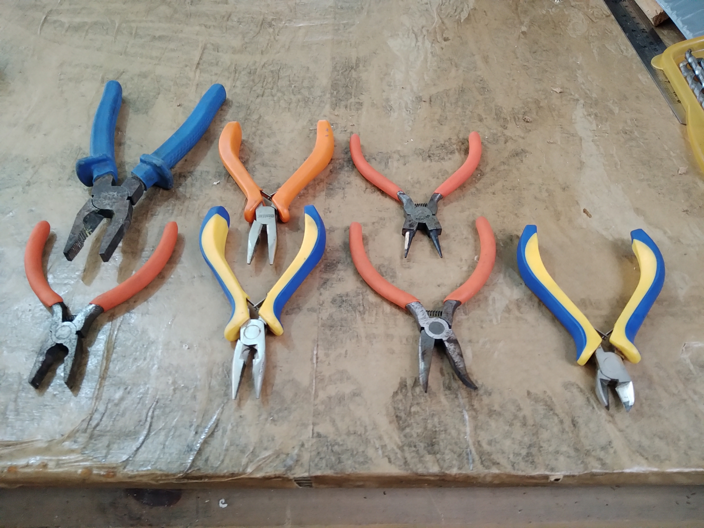
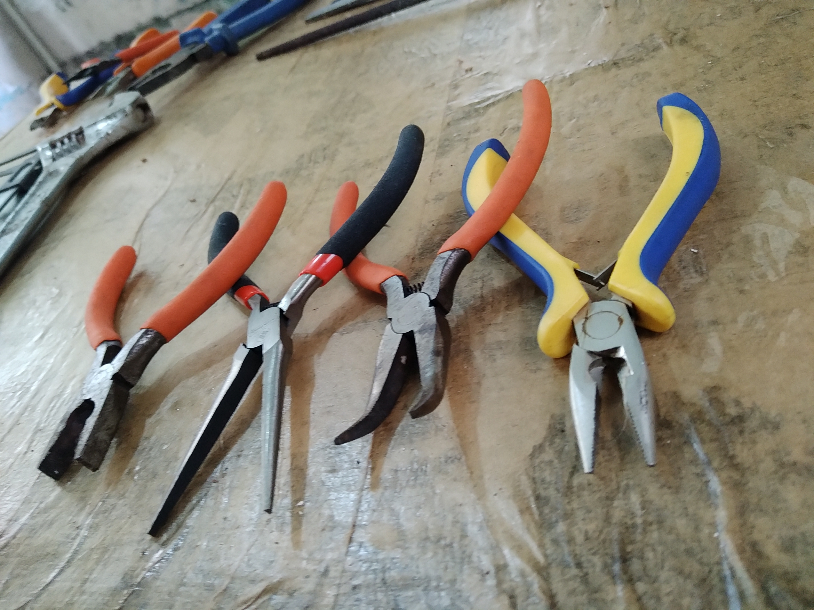

# Alicates

Caso precise segurar algo com firmeza, dobrar uma peça pequena, ... alicates podem ajudar.

Alicates são ferramentas robustas, mas têm 'pontos fracos'. Faz bem prestar um pouco de atenção...

Alicates de bico reto são frágeis a torções em torno do eixo do bico. Infelizmente é a torção que geralmente se faz com esse alicate então:

- use o bico mais grosso possível;
- use o bico mais curto possivel;

Fotos para ilustrar:

universal e bico curto

torção não recomendada - é possível ver as pontas do alicate desalinhando.

se der para fazer com alicate mais resistente...

## Alguns tipos de alicates

Na foto abaixo, da esquerda para a direita: 

- Universal, 
- bico, 
- bico curvo (à frente), bico redondo (atrás), 
- corte

Na foto abaixo, da esquerda para a direita:

- Universal,
- bico longo (o fabricante chama de alicate para bijuteria);
- bico curvo,
- bico curto.

