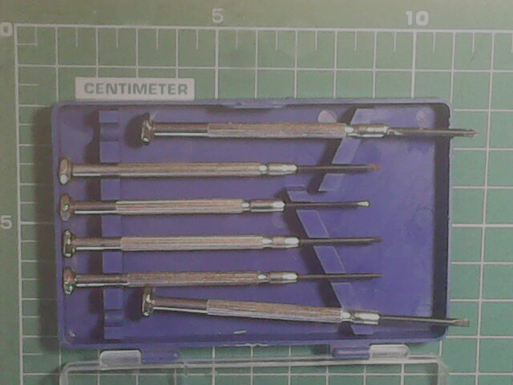

# Chaves de fenda

Talvez 'chave de parafuso' seja um nome mais preciso, já que 'fenda' é um tipo de encaixe da chave no parafuso... enfim.

## Alguns modelos de parafusos

<https://www.reddit.com/r/coolguides/comments/2tgll3/screw_sizes_shank_sizes_and_pilot_holes_sizes/> parafusos para madeira
<https://www.bsstainless.com/american-screw-sizes> parafusos para máquinas
<https://www.globalspec.com/learnmore/manufacturing_process_equipment/industrial_assembly/driver_bits> Tabelas e figuras!

<https://www.apexfasteners.com/fasteners/images/SelectingPhillipsPointSize.png> - bits para parafusadeira
<https://apexfasteners.com/fasteners/apex-fastener-tools/bits> - bits para parafusadeira

<https://www.homestratosphere.com/types-of-screws/> - o que me ocorre está escrito nesse site, em inglês:
- parafuso de material e desenho compatível com o uso ( para madeira, alvenaria, metal, ...);
- ferramenta com desenho compatível (fenda, phillips, allen, torx, ...);
- ferramenta com tamanho compatível;
- *cam out* quando a ferramenta escorrega na fenda - isto protege o parafuso e a ferramenta contra sobreaperto, mas não é desejável;
- *stripped screws* quando a ferramenta escorrega na fenda E danifica a fenda;

## Alguns modelos de chave de fenda

Quanto maior o diâmetro do cabo, maior a força que se consegue aplicar (cuidado para não estragar o parafuso ou a ponta).

Quanto mais curta, maior a força que se pode aplicar, precisão e sensibilidade.

### Chaves de precisão;
(também chaves de relojoeiro)

Para parafusos pequenos. É suficiente aplicar a força da ponta dos dedos. Caso precise mais força, talvez haja algo inesperado (parafuso de tamanho/rosca diferente, sujeira no furo onde vai o parafuso,...)

### Chaves pequenas, portáteis;

Leves e cabem nos bolsos, mas não suportam uso muito frequente e às vezes são feitas de material pouco durável. Passam a impressão de terem comprimento desproporcional ao diâmetro.

### Chaves de uso geral;

Aquelas de tamanho/tipo mais fácil de encontrar no mercado. Para uso doméstico.

### Chaves com pontas intercambiáveis;

As pontas (bits) podem ser trocadas e, também, podem ser usadas em parafusadeiras elétricas.

### Chaves com lâmpada neon;

A lâmpada neon está ligada entre a ponta da chave e uma peça de metal atrás do cabo. A lâmpada acende caso haja tensão elétrica entre esses dois pontos. Em uso doméstico, numa casa normal, coloca-se o dedo na peça de metal, se a lâmpada acender, há chance de choque elétrico.

## Parafusadeira elétrica

Esta parafusadeira, na regulagem de torque 7 é capaz de torcer e quebrar o parafuso mais longo

### *cam out* e *stripped screws*

Às vezes o desenho da cabeça do parafuso é feito para permitir que escorregue caso se aplique torque demais (*cam out*). Por outro lado, quando a ponta escorrega no parafuso, tanto o desenho da cabeça do parafuso quanto a broca vão gastando. Na foto, no parafuso mais ao centro,o desenho 'gastou' (*stripped screw*). É possível comparar com o parafuso quase novo.

Nas duas pontas Phillips que aparecem na foto, a que está à esquerda teve o desenho todo quebrado. É possível comparar com outra ponta de mesmo tamanho ao seu lado.

