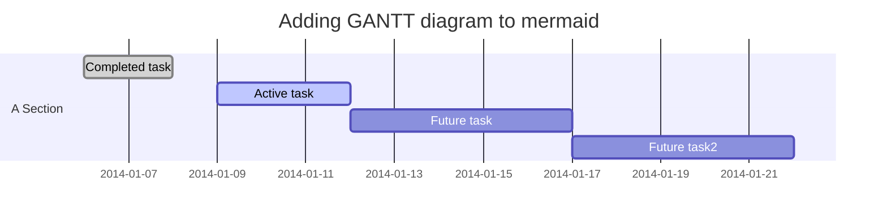
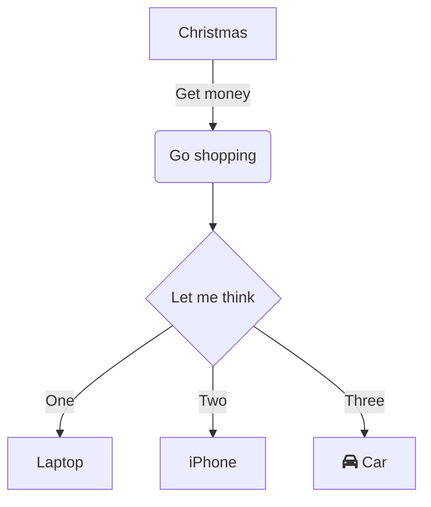

# Modelos

## Motivação

Considerando *modelo de documento*, os textos que contém a lista dos elementos que determinados documentos precisam conter, é possível usar os modelos como instrumentos para direcionar a atenção a características importantes para o sucesso do projeto e a avaliação apropriada do desempenho na disciplina. Neste caso, a documentação do projeto demonstra que a equipe dedicou algum tempo e esforço refletindo sobre os elementos da documentação.

As características observadas em todas as etapas de desenvolvimento são `Specific Measurable Attainable Relevant Time-bound` (SMART):

- Specific: Pouco específico (muito vago ou muito amplo, [quem, o que, quando, como, por quê](https://www.smartsheet.com/blog/essential-guide-writing-smart-goals) - dificulta execução) ... específico;
- Measurable: Pouco mensurável (sem resultados ou resultados que dependem de análise qualitativa em que pode haver divergências),..., Muito mensurável
- Attainable: difícil de atingir - a equipe, no projeto, não mostrou elementos suficientes (conhecimento prévio ou etapas de aquisição de conhecimento no próprio projeto) para o avaliador dizer se a equipe consegue atingir
- Relevant: Pouco relevante (traz pouco aprendizado, não cumpre a finalidade do aprendizado na disciplina, limitado, pouco ambicioso);
- Time-bound: Sem prazos definidos, ou prazos muito curtos versus prazos bem definidos e cumpridos;

As características SMART podem ter dependências entre si. Dois exemplos:

1. atividades muito bem especificadas podem ser muito atingíveis, mas pouco relevantes, por outro lado, atividades pouco específicas podem ser muito relevantes, mas com prazos difíceis de definir, ou fracamente definidos. 
2. uma atividade pode ser muito relevante, mas difícil de atingir dado o tempo disponível. Neste caso, é possível dividir a atividade em sub-atividades e dedicar-se a uma sub-atividade ainda relevante e atingível. Simultaneamente, manter a informação que a possibilidade de explorar a atividade foi aventada e que, pelos motivos apresentados, escolheu-se a sub-atividade é informação relevante para os relatórios e para as avaliações.

A avaliação dos ítens permite definir atividades com características equilibradas.

A idéia é aplicável tanto para objetivos 'complexos' quanto para objetivos 'simples'. Quando forem muito simples, aplicar SMART pode usar mais tempo e esforço do que chegar ao objetivo. Neste caso, é melhor fazer. Caso tente fazer e não consiga, talvez alguma característica tenha sido super/sub-estimada.

As etapas de desenvolvimento são:

1. Proposta;
2. Plano de atividades;
3. Site;
    - código-fonte;
    - diagramas, esquemas;
    - tutoriais;
    - materiais de apresentação/divulgação do projeto;
    - diário de projeto, caso seja opção utilizar esta ferramenta;
4. Relatório;

<!---  
A proposta é maximizar a chance da entrega de um resultado, e que esse resultado mostre que o aluno melhorou suas habilidades interpessoais e/ou técnicas.

- Desenvolvimento de produto? : plano/projeto + relatórios
- Desenvolvimento de serviço? : plano/projeto (business canvas?) + relatórios

*a produção de um produto é um serviço*

*a informação dos relatórios pode ser ajustada para fazer parte de um artigo*

*artigos podem ser de vários tipos, dentre eles, científicos, de divulgação científica, de divulgação para público amplo, ...*

- Quanto tempo, em horas por semana, você estima que pode dedicar a desenvolver o proposto?
- O que você já sabe, já tem ou está seguro que é capaz de aprender, fazer?
--->

## Seções da proposta

No processo de construção da proposta, espera-se que o proponente reflita sobre sua motivação, capacidade de realização, ganhos e chance de sucesso naquilo que propõe fazer; Que se permita pesquisar que recursos necessita e que recursos tem à disposição; Que o que tem em mente é suficientemente claro para ser comunicado por escrito. Espera-se que o tempo e esforço dispendido nesta etapa seja pequeno, e que poupe tempo e esforço cuidando de imprevistos nas etapas seguintes.

1. Título
2. Objetivo (O que fazer)
3. Motivação (Por que fazer: Relevância, experiência, conhecimento acumulado, motivação pessoal,...)
4. Caso seja parte de uma sequência/cadeia/rede, quais relações com as outras atividades/elos são conhecidas.
5. Referências

A avaliação da proposta por outras pessoas permite coletar opiniões que balizam a relevância e chance de sucesso da proposta.

## Seções do plano de atividades

Após a proposta ser aceita, o detalhamento minucioso das etapas de execução, materiais, métodos, prazos e medidas de sucesso, posto por escrito no plano de atividades.

1. Título
2. Resumo
3. Justificativa (cópia da motivação da proposta)
4. Resultados Anteriores (para continuação de projetos anteriores executados pela mesma equipe ou por outra equipe)
5. Objetivos
6. Métodos
7. Detalhamento das atividades a serem desenvolvidas por cada membro da equipe
8. Resultados previstos (entregáveis) e seus respectivos indicadores de avaliação (testes para validar o funcionamento do entregável)
9. Cronograma de execução
10. Outras informações que sejam relevantes para o processo de avaliação.

## Repositório do projeto

O resultado das atividades. Como os resultados vão evoluindo à medida que as atividades são executadas, é conveniente usar um versionador, como git, e um repositório na nuvem, como github, para que todos possam acessar e trabalhar simultaneamente.

### Informação sobre circuitos e programas (para o desenvolvedor/mantenedor)

Caso o entregável seja um dispositivo, a informação mínima sobre o dispositivo é:

- Para cada componente;
    - lista de pinos;
    - fotos;
    - datasheet;
    - diagrama esquemático;
    - PCB;
- Para a interligação dos componentes;
    - Lista de componentes que serão interligados;
    - Lista de conexões;
- Para os programas;
    - Código-fonte 
    - instruções para compilar/transferir para o dispositivo/celular/computador;
    - casos de uso, testes,...
    
### Informação sobre o vestível (para o desenvolvedor/mantenedor)


### Informação sobre o produto (para o usuário/cliente)


### Informação sobre o serviço (para o usuário/cliente)

há outros stakeholders, como os fornecedores

## Seções do relatório

1. Introdução (parte já foi feita no plano de atividades)
    1. ~~Contextualização (o que se sabe) e Motivação (por que se quer)~~ feito na proposta
    1. Revisão Bibliográfica (informação que foi encontrada durante a execução do plano)
        1. Conceitos e Terminologia (glossário)
    2. ~~Questão de pesquisa~~
    3. Organização do relatório
2. ~~Objetivos~~ (feito no plano de atividades)
3. Materiais e Métodos ( quais são os ingredientes e o que fazer com eles para chegar nos resultados)
4. Resultados e indicadores de avaliação (resultados dos testes dos entregáveis)
    1. Entregáveis previstos
    2. Entregáveis não previstos (soluções para problemas colaterais)
5. Discussão e Conclusão
    1. Consequências lógicas dos resultados (resultados deduzidos);
    3. Dificuldades que levaram às soluções colaterais
    2. Especulações/questionamentos a partir dos resultados (resultados induzidos);
    2. Desdobramentos possíveis (próximos passos, possibilidades, *spin-offs*);
    
6. Referências

## Gerar relatórios em pdf a partir das páginas do repositório

Esta é a recomendação para gerar documentos na disciplina.

Trata-se de uma sistematização para criação dos repositórios github onde os projetos podem ser publicados. Não tem código. Se escrever o repositório sabendo previamente quais são as seções do relatório, construi-lo fica mais rápido. O caso que considero 'sucesso' é este: https://github.com/camilabezerril/ImageCV

O relatório: https://github.com/camilabezerril/ImageCV/blob/master/relatorio.md foi criado com uma seleção de parágrafos e seções da documentação (plano de trabalho, ...) que estão no repositório também. A impressão em pdf, removendo a interface do site do github, é feita do arquivo .md em um repositório local, através do browser, usando o addon para renderizar markdown. Por fim, se necessário, acrescenta folha de rosto, sumário e numeração de páginas num editor pdf como https://www.ilovepdf.com/.

- Instalar o Gitlab Markdown Viewer addon/plugin no navegador;
- exibir no navegador o arquivo .md do repositório **local**;
- imprimir para pdf;
- acrescentar folha de rosto, sumário e numeração de páginas num editor pdf como <https://www.ilovepdf.com/>;

Fórmulas matemáticas (em latex) são renderizadas automaticamente pelo addon/plugin.
    
## Grafos, Gantt e mais...

No momento a melhor solução é usar a ferramenta de edição melhor conhecida por quem for fazer os diagramas, exportar em um formato suportado em navegador (svg, png, jpeg, ...), incluir no repositório e linkar nas páginas.

Usando [mermaid](https://mermaid-js.github.io/mermaid/), é possível gerar o cronograma abaixo...


... a partir desta especificação ('programa'):






<!--- 
O addon funciona em arquivos armazenados no github, não funciona em arquivos locais (2020-10-01-090920)


 --->
 
[link para mermaid online editor](https://mermaid-js.github.io/mermaid-live-editor/)

### Fórmulas matemáticas

No momento a melhor solução é usar a ferramenta de edição melhor conhecida por quem for fazer os diagramas, exportar em um formato suportado em navegador (svg, png, jpeg, ...), incluir no repositório e linkar nas páginas.

<!--- 
a fórmula é renderizada em arquivos locais, não é renderizada em arquivos no github (2020-10-01-090902)


$`\Sigma_{i=1}^{10} i^2`$

```math
\Sigma_{i=1}^{10} i^2
```
 --->

