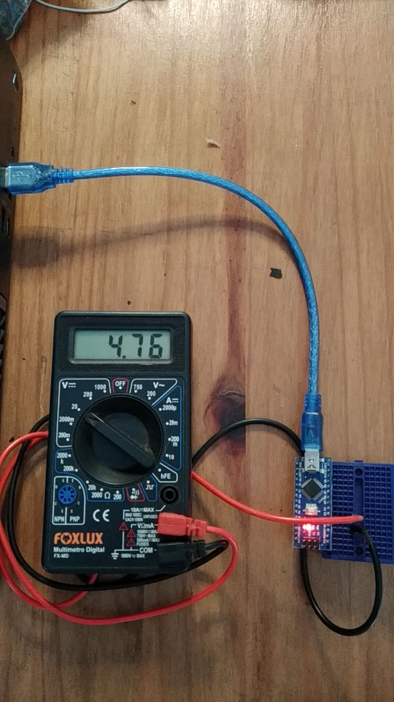

### Arduino nano logical HIGH level is aprox. 5V

- Measured with a multimeter

- Source code

(There's a lot of context no told here.)

Note on `setup()` the command `digitalWrite(3, HIGH)` I measured pin 3 voltage with a multimeter, it is 4.76V




```C
int flowPin = 2;    //This is the input pin on the Arduino
double flowRate;    //This is the value we intend to calculate.
volatile int count; //This integer needs to be set as volatile to ensure it updates correctly during the interrupt process.

void setup() {
  pinMode(3, OUTPUT);
  digitalWrite(3, HIGH); // POWER THE SENSOR
  // put your setup code here, to run once:
  pinMode(flowPin, INPUT);           //Sets the pin as an input
  attachInterrupt(0, Flow, RISING);  //Configures interrupt 0 (pin 2 on the Arduino Uno) to run the function "Flow"
  Serial.begin(9600);
}
void loop() {
  // put your main code here, to run repeatedly:
  count = 0;      // Reset the counter so we start counting from 0 again
  //interrupts();   //Enables interrupts on the Arduino
  delay (1000);   //Wait 1 second
  //noInterrupts(); //Disable the interrupts on the Arduino

  //Start the math
  //flowRate = (count * 2.25);        //Take counted pulses in the last second and multiply by 2.25mL
  //flowRate = flowRate * 60;         //Convert seconds to minutes, giving you mL / Minute
  //flowRate = flowRate / 1000;       //Convert mL to Liters, giving you Liters / Minute
  Serial.println(count);
}

void Flow()
{
   count++; //Every time this function is called, increment "count" by 1
}

// https://bc-robotics.com/tutorials/using-a-flow-sensor-with-arduino/

```
