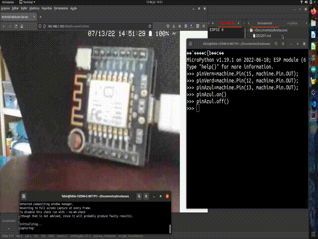

Existe uma versão de Python que pode ser executada em uma variedade de microcontroladores, incluindo ESP32 e ESP8266-12. É o Micropython (http://micropython.org/).

É necessário instalar Micropython nos microcontroladores. Após instalar, os comandos em Python são enviados e executados no microcontrolador, como se vê na animação abaixo:



Esta forma de programar o microcontrolador é diferente da forma de programar que usa Arduino IDE. Algumas dessas diferenças, na minha opinião, facilitam o aprendizado da linguagem de programação e a criação de protótipos:

1. A interação do programador com o dispositivo pode ser explicada com menos etapas "difíceis de entender", como compilar e enviar o programa para o dispositivo;
2. O resultado da execução do comando *aparece* mais rápido;
3. Alguns usos tecnicamente sofisticados, como o envio dos comandos por WiFi, podem ser configurados por um programador mais experiente e usados, de maneira transparente, por outros programadores (ex. webREPL).

Por outro lado, há diferenças que podem dificultar certos usos e a criação de produtos.

### A fazer

- Guia sobre como instalar Micropython no ESP8266;

### Feito

- [Guia mostrando como usar webREPL](./webREPL).

A maneira mais comum para executar comandos em Python é digitando no interpretador: um programa em linha de comando que lê o comando digitado, avalia (executa) o comando e imprime o resultado. Interpretadores desse tipo, comumente são designados REPL (Read-Evaluate-Print Loop) (pronúncia: http://www.howtopronounce.cc/repl). Nos microcontroladores com micropyton instalado o interpretador é executado continuamente, "só" precisa ser acessado.

O acesso ao interpretador é feito através de uma ferramenta de comunicação. Se o microcontrolador está conectado  ao computador por uma porta USB, ferramentas comuns são PuTTY (Windows), minicom (Linux), picocom (Linux).

Após instalar, o resultado é este:


- Captura da tela feita com `recordmydesktop --fps=15 --no-sound --v_quality=32`
- Conversão para gif animado feito com `ffmpeg -i out.ogv -s 640x480 -r 7 -ss 00:00:01 -t 00:00:16.5 output.gif`
- Referências sobre vídeo:
   - https://linuxhint.com/make-animated-gif-ubuntu/
   - https://superuser.com/questions/556029/how-do-i-convert-a-video-to-gif-using-ffmpeg-with-reasonable-quality
   - https://trac.ffmpeg.org/wiki/ChangingFrameRate


- Site do micropyton: http://micropython.org/
- Tutorial de micropyton para ESP8266: https://docs.micropython.org/en/latest/esp8266/tutorial/intro.html
- Download do micropyton para ESP8266 de 2MB: https://micropython.org/download/esp8266/
- Download do micropyton para ESP8266 de 1MB (é o que funcionou no wittyboard): https://micropython.org/download/esp8266-1m/
- `help('modules')`: 
   - https://forum.micropython.org/viewtopic.php?t=3298
   - https://docs.micropython.org/en/latest/library/index.html
- como usar os pinos do ESP8266: https://docs.micropython.org/en/latest/esp8266/tutorial/pins.html
- Sistema de arquivos no ESP8266:
   - https://docs.micropython.org/en/latest/reference/filesystem.html#fat
   - https://forum.pycom.io/topic/1358/get-free-flash-space/3
   - https://forum.micropython.org/viewtopic.php?f=16&t=2361&hilit=statvfs&start=10
   - https://docs.micropython.org/en/latest/esp8266/tutorial/filesystem.html
   - https://www.google.com/search?channel=fs&client=ubuntu&q=micropython+os+module+documentation
   - documentação do módulo os: https://docs.micropython.org/en/latest/library/os.html
```python
import os
curdir=os.getcwd()
os.listdir(curdir)
os.statvfs(curdir)
```
<pre>&gt;&gt;&gt; import os
&gt;&gt;&gt; curdir=os.getcwd()
&gt;&gt;&gt; os.listdir(curdir)
[&apos;boot.py&apos;]
&gt;&gt;&gt; os.statvfs(curdir)
(4096, 4096, 866, 863, 863, 0, 0, 0, 0, 255)
&gt;&gt;&gt; 
</pre>
- pronúncia de REPL
   - http://www.howtopronounce.cc/repl
   - https://coderanch.com/t/680914/pronounce-REPL
   - https://replit.com/talk/ask/How-do-you-pronounce-replit/4490
- Memória RAM
   - https://docs.micropython.org/en/latest/develop/memorymgt.html
   - https://forum.micropython.org/viewtopic.php?t=1747
```python
import gc
gc.collect()
gc.mem_free()
```
<pre>&gt;&gt;&gt; import gc
&gt;&gt;&gt; gc.collect()
&gt;&gt;&gt; gc.mem_free()
35920
&gt;&gt;&gt; </pre>
