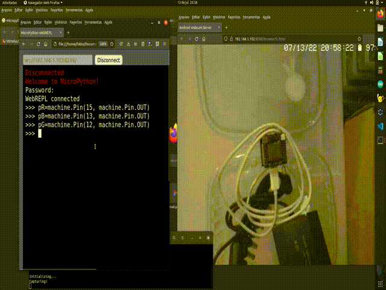

# webREPL

Acho que concluí uma história, agora vou contar...

Na animação abaixo o Witty Board está conectado por wifi à minha rede doméstica, tal como o computador que estou usando. Eles estão a uns dois metros de distância um do outro e não estão interconectados por cabos de comunicação (ex. USB - o cabo USB conectado ao witty board está conectado a uma fonte de alimentação). Consigo acender e apagar o LED **através da conexão WiFi**.



### Instruções Rápidas (sem muitas explicações)

1. Instalar na placa controladora o firmware Micropython apropriado;
	- ajuda em ../README.md
2. Com a placa controladora conectada pela porta USB, executar no REPL `webrepl_setup`;
	- responder às perguntas, anotar/lembrar a senha;
	- ao final o setup reinicia a placa microcontroladora;
3. Com a placa controladora conectada pela porta USB, conectar ao wifi;
	- anotar o endereço IP da placa controladora;
4. Abrir o arquivo `webrepl.html` no navegador;
	- o arquivo (e scripts associados) podem ser clonados(baixados) de https://github.com/micropython/webrepl;
5. Digitar na caixa de texto do alto à esquerda `ws//<IP>:8266` e clicar no botão connect;
6. Enviar comandos Python para, por exemplo, acender e apagar o LED embutido.

### O que é webREPL

webREPL é uma ferramenta que permite usar um computador com navegador web para enviar comandos Python através da conexão de rede para um dispositivo (ex. Witty Board). Este envio pode (ou não) ser intermediado por um servidor Web.


A fim de entender o funcionamento e explicar a implantação da ferramenta, assume-se que esta tem duas partes. Uma parte, "C", que pode ser baixada de: https://github.com/micropython/webrepl, é executada no computador e outra, "D", faz parte do micropyton, é executada no dispositivo depois de configurada.

A configuração de "D" é feita com o dispositivo conectado por cabo USB, executando `import webrepl_setup` e respondendo às perguntas exibidas. Anote o password cadastrado. Ele será solicitado na conexão com o computador.

Após a configuração, de "D", configura-se e ativa-se a conexão WiFi no dispositivo com estes comandos:

```python
import network, time
staif=network.WLAN(network.STA_IF) 
staif.active(True) # conecta ao ap conectado anteriormente
staif.connect('SSID', 'PASSWORD') # preenche se quiser mudar
time.sleep(5)
staif.isconnected() # True se conectou
staif.ifconfig()    # Mostra o IP para conexão da parte "C" - anotar o IP
```
Referência: https://docs.micropython.org/en/latest/esp8266/tutorial/network_basics.html, 

Após sucesso nas etapas, o dispositivo está pronto para conectar.Se o dispositivo for reiniciado ou se a energia desligar e retornar, a conexão WiFi precisará ser (novamente) ativada. Isto pode ser contornado. É mais fácil fazer isso usando webREPL por isso adia-se o passo de tornar a conexão permanente.

A parte "C" é executada no computador e pode ser baixada de https://github.com/micropython/webrepl. Depois de baixada, abrir o arquivo `webrepl.html` com o navegador. A página no navegador mostra deve ser semelhante à apresentada na figura abaixo:


 
Para conectar, substituir o IP na caixa de texto ao lado do botão Connect pelo IP apresentado pelo dispositivo durante a configuração do wifi. Manter o `:8266`. Clicar em Connect, digitar a senha usada na execução de `webrepl_setup`, deve aparecer a mensagem WebREPL Connected e o prompt (>>>). Através desse prompt enviam-se comandos, em Python, para o dispositivo.

### ESP como Access Point (AP)

Isto configura o ESP como AP, permitindo que o cliente wifi conecte-se diretamente ao ESP, sem intermediário (roteador). Isto é conveniente quando não se tem roteador ou o ESP é levado para diferentes locais com diferentes roteadores. É inconveniente porque o cliente precisa conectar-se à rede wifi fornecida pelo ESP, que, geralmente, não serve internet simultaneamente.

```python
import network
ap = network.WLAN(network.AP_IF)
ap.active(True)
ap.config(essid="Micropython-C3", password='123456789')
# https://randomnerdtutorials.com/micropython-esp32-esp8266-access-point-ap/

```

 
### WebREPL com Thonny

Thonny é uma IDE para Python e MicroPyton. Ela permite conexão através de WebREPL. A referência está em: https://bhave.sh/micropython-webrepl-thonny/ , O screenshot da minha configuração está em: 
	


 
### Multitarefa

Note que WebREPL mantém a conexão com a interface do navegador (via websocket), ao mesmo tempo executa o interpretador para o qual enviamos comandos. ié: algum suporte para multitarefa existe e é usado para WebREPL funcionar dessa forma.

Buscando um pouco mais, chega-se à informação: usa `asyncio` (https://docs.micropython.org/en/latest/library/uasyncio.html, https://github.com/peterhinch/micropython-async/blob/master/v3/docs/TUTORIAL.md).

Pensei que, talvez, executar um loop como:

```python
import time
while (True):
  i=0
  time.sleep(1)

```

fizesse o repl "travar". MAS `CTRL-C` interrompe (talvez seja uma interrupção mesmo). Se o objetivo fosse "travar" o controlador, poderia desabilitar as interrupções de teclado, mas não é a idéia.

Testei também com `webrepl`. `CTRL-C` também interrompe nesse caso.


### Tornar a conexão permanente.

Para tornar a conexão permanente, acrescentar a ativação da rede no arquivo `boot.py`. 

Nesta pasta há uma cópia do `boot.py` resultante desse acréscimo. Caso este sirva, usando webREPL, renomeie o `boot.py` original usando o comando `os.rename()` (https://docs.micropython.org/en/v1.7/esp8266/library/os.html), depois, transfira o novo `boot.py` para o dispositivo usando o botão `Send a file`.

O arquivo `boot.py` não precisa conter o SSID e o password do ponto de acesso pois o dispositivo armazena a última conexão wifi feita e, na ativação, tenta conectar-se a esse mesmo ponto de acesso. Caso a conexão não seja possível, o dispositivo entra em modo ponto de acesso. Neste caso, a conexão é feita pelo SSID `esp8266`, sem senha.

### Comandos usados para gravar vídeo e converter em gif animado:

```
recordmydesktop --fps=15 --no-sound --v_quality=32
ffmpeg -i out.ogv -s 640x480 -r 7 -filter:v "setpts=PTS/3" -ss 00:00:01 -t 00:00:16.5 output.gif
```

Referência sobre como acelerar o vídeo: https://superuser.com/questions/1261678/how-do-i-speed-up-a-video-by-60x-in-ffmpeg

Referência com módulos para micropython: https://awesome-micropython.com/

mDNS facilitaria o uso de WebREPL, mas parece que não há implementação de mDNS para ESP8266...

- https://github.com/cbrand/micropython-mdns
- https://github.com/micropython/micropython/issues/2875
- https://github.com/micropython/micropython/issues/4912
- https://community.hiveeyes.org/t/esp32-network-discovery-through-mdns-with-micropython/2253

