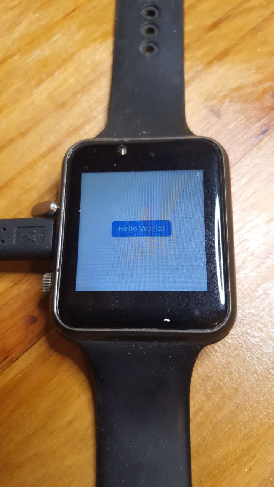

(instructions tested in feb 28, 2024)

Might have done something not trivial...

I wanted to install Micropython with LVGL support in a ttgo t-watch.

It takes some work to setup all tools using compatible versions.

Installed OS is UBUNTU 22.04. Its default python version is 3.10. ESP-IDF 4.4.6 requires at least python version 3.11 . Change python version may hurt various applications (in my case CTRL-ALT-T shortcut did not open terminal window, application menu did not open terminal windows, to get a terminal window I had to open file manager and choose "open this in terminal" with mouse right button)

To install python 3.11 alongside python 3.10

```
sudo apt install python3.11
#may test installation with command:
python3.11
```

To configure alternatives:

```
sudo update-alternatives --install /usr/bin/python3 python3 /usr/bin/python3.10 1
sudo update-alternatives --install /usr/bin/python3 python3 /usr/bin/python3.11 2

```

To switch between alternatives:

```
sudo update-alternatives --config python3
```

Reference: https://medium.com/python-mvp/upgrade-python-3-10-to-3-11-on-ubuntu-22-04-2f63e4d326f9

To install ESP-IDF version 4.4.6 (current stable version is 5.2). ESP-IDF 4.4.6 is compatible with LVGL binding to ESP32. First switch to python 3.11 and issue these commands:

pre-requisites:
	
```
sudo apt-get install git wget flex bison gperf python3 python3-pip python3-venv cmake ninja-build ccache libffi-dev libssl-dev dfu-util libusb-1.0-0
```

Reference: https://docs.espressif.com/projects/esp-idf/en/latest/esp32/get-started/linux-macos-setup.html#get-started-prerequisites

```
% get IDF ver. 4.4.6
git clone -b v4.4.6 --recursive https://github.com/espressif/esp-idf.git
% install ESP32 support
cd esp-idf/
./install.sh esp32
% export global names notice the blank between the dots. This command is different from its equivalent in ESP-IDF 5.2 
. ./export.sh
cd .. % switch to upper level and copy example
cp -r $IDF_PATH/examples/get-started/hello_world .
cd hello_world/
% configure ESP-IDF project
idf.py set-target esp32
idf.py menuconfig % just save and quit
idf.py build
idf.py -p /dev/ttyACM0 flash
idf.py -p /dev/ttyACM0 monitor % to see MCU messages

```

Sample mcu messages from `idf.py ... monitor`

<pre><font color="#33DA7A"><b>fabio@super</b></font>:<font color="#2A7BDE"><b>~/Github/hello_world</b></font>$ idf.py -p /dev/ttyACM0 monitor
Executing action: monitor
Running idf_monitor in directory /home/fabio/Github/hello_world
Executing &quot;/home/fabio/.espressif/python_env/idf4.4_py3.11_env/bin/python /home/fabio/Github/esp-idf/tools/idf_monitor.py -p /dev/ttyACM0 -b 115200 --toolchain-prefix xtensa-esp32-elf- --target esp32 --revision 0 /home/fabio/Github/hello_world/build/hello_world.elf -m &apos;/home/fabio/.espressif/python_env/idf4.4_py3.11_env/bin/python&apos; &apos;/home/fabio/Github/esp-idf/tools/idf.py&apos; &apos;-p&apos; &apos;/dev/ttyACM0&apos;&quot;...
<font color="#A2734C">--- idf_monitor on /dev/ttyACM0 115200 ---</font>
<font color="#A2734C">--- Quit: Ctrl+] | Menu: Ctrl+T | Help: Ctrl+T followed by Ctrl+H ---</font>
<font color="#26A269">I (13) boot: ESP-IDF v4.4.6 2nd stage bootloader</font>
<font color="#26A269">I (13) boot: compile time 15:07:29</font>
<font color="#26A269">I (13) boot: Multicore bootloader</font>
<font color="#26A269">I (15) boot: chip revision: v3.0</font>
<font color="#26A269">I (19) boot.esp32: SPI Speed      : 40MHz</font>
<font color="#26A269">I (24) boot.esp32: SPI Mode       : DIO</font>
<font color="#26A269">I (28) boot.esp32: SPI Flash Size : 2MB</font>
<font color="#26A269">I (33) boot: Enabling RNG early entropy source...</font>
<font color="#26A269">I (38) boot: Partition Table:</font>
<font color="#26A269">I (42) boot: ## Label            Usage          Type ST Offset   Length</font>
<font color="#26A269">I (49) boot:  0 nvs              WiFi data        01 02 00009000 00006000</font>
<font color="#26A269">I (57) boot:  1 phy_init         RF data          01 01 0000f000 00001000</font>
<font color="#26A269">I (64) boot:  2 factory          factory app      00 00 00010000 00100000</font>
<font color="#26A269">I (72) boot: End of partition table</font>
<font color="#26A269">I (76) esp_image: segment 0: paddr=00010020 vaddr=3f400020 size=088ach ( 34988) map</font>
<font color="#26A269">I (97) esp_image: segment 1: paddr=000188d4 vaddr=3ffb0000 size=01b78h (  7032) load</font>
<font color="#26A269">I (100) esp_image: segment 2: paddr=0001a454 vaddr=40080000 size=05bc4h ( 23492) load</font>
<font color="#26A269">I (113) esp_image: segment 3: paddr=00020020 vaddr=400d0020 size=15144h ( 86340) map</font>
<font color="#26A269">I (144) esp_image: segment 4: paddr=0003516c vaddr=40085bc4 size=05a5ch ( 23132) load</font>
<font color="#26A269">I (160) boot: Loaded app from partition at offset 0x10000</font>
<font color="#26A269">I (160) boot: Disabling RNG early entropy source...</font>
<font color="#26A269">I (171) cpu_start: Multicore app</font>
<font color="#26A269">I (171) cpu_start: Pro cpu up.</font>
<font color="#26A269">I (172) cpu_start: Starting app cpu, entry point is 0x40080fec</font>
<font color="#A2734C">0x40080fec: call_start_cpu1 at /home/fabio/Github/esp-idf/components/esp_system/port/cpu_start.c:151</font>

<font color="#26A269">I (0) cpu_start: App cpu up.</font>
<font color="#26A269">I (189) cpu_start: Pro cpu start user code</font>
<font color="#26A269">I (190) cpu_start: cpu freq: 160000000</font>
<font color="#26A269">I (190) cpu_start: Application information:</font>
<font color="#26A269">I (194) cpu_start: Project name:     hello_world</font>
<font color="#26A269">I (199) cpu_start: App version:      1</font>
<font color="#26A269">I (204) cpu_start: Compile time:     Feb 27 2024 15:07:26</font>
<font color="#26A269">I (210) cpu_start: ELF file SHA256:  86bf427dff3f417c...</font>
<font color="#26A269">I (216) cpu_start: ESP-IDF:          v4.4.6</font>
<font color="#26A269">I (221) cpu_start: Min chip rev:     v0.0</font>
<font color="#26A269">I (225) cpu_start: Max chip rev:     v3.99 </font>
<font color="#26A269">I (230) cpu_start: Chip rev:         v3.0</font>
<font color="#26A269">I (235) heap_init: Initiali</font></pre>

Reference: https://docs.espressif.com/projects/esp-idf/en/stable/esp32/get-started/linux-macos-setup.html

In the same shell (to use the environment variables) install and build lv_micropython:
	
`cd` to the directory to contain lv_micropython clone.

```
git clone https://github.com/lvgl/lv_micropython.git
cd lv_micropython
git submodule update --init --recursive lib/lv_bindings
make -C mpy-cross
```
Reference: https://github.com/lvgl/lv_micropython

Next build ESP32 binding

```
cd ports/esp32
make submodules
make
```

Reference: https://github.com/micropython/micropython/blob/master/ports/esp32/README.md

´make´ messages have many warnings and no errors. Tells what to do at the end:

<pre>Project build complete. To flash, run this command:
/home/fabio/.espressif/python_env/idf4.4_py3.11_env/bin/python ../../../esp-idf/components/esptool_py/esptool/esptool.py -p (PORT) -b 460800 --before default_reset --after hard_reset --chip esp32  write_flash --flash_mode dio --flash_size detect --flash_freq 40m 0x1000 build-GENERIC/bootloader/bootloader.bin 0x8000 build-GENERIC/partition_table/partition-table.bin 0x10000 build-GENERIC/micropython.bin
or run &apos;idf.py -p (PORT) flash&apos;
bootloader  @0x001000    22000  (    6672 remaining)
partitions  @0x008000     3072  (    1024 remaining)
application @0x010000  2212848  (  146448 remaining)
total                  2278384
</pre>
 
Issue command:

```
idf.py -p /dev/ttyACM0 flash
```

After this, open Thonny, connect to the device, get REPL prompt and type `help(modules)` to get the figure at the top.

Now hardware interconnection starts to play a role. ttgo t-watch v.3 hardware pinout is here: https://github.com/Xinyuan-LilyGO/TTGO_TWatch_Library/blob/master/docs/watch_2020_v3.md

I believe more hints on using ST7789 are in https://github.com/lvgl/lv_binding_micropython/blob/master/README.md#st7789-driver-class , instead of other references.

Got backlight on with these  (still there is something strange):

Clone `https://gitlab.com/mooond/t-watch2020-esp32-with-micropython` and upload files to watch (need adafruit-ampy, and edit `writeall.sh` shell script to setup right USB port)

```
pip install adafruit-ampy
git clone https://gitlab.com/mooond/t-watch2020-esp32-with-micropython.git
cd t-watch2020-esp32-with-micropython/
% edit writeall.sh and run it
./writeall.sh % may take a minute remember to free access to dev/tty???? port (shut off Thonny)
```

References: https://learn.adafruit.com/micropython-basics-load-files-and-run-code/install-ampy , https://gitlab.com/mooond/t-watch2020-esp32-with-micropython

issue commands in Thonny:

```
import lily
li=lily.LILY() # there is some command(s) in lily.LILY() which is needed by LVGL example code.
import lvgl as lv
from ili9XXX import st7789
import axp202c
axp=axp202c.PMU()
axp.setLDO2Voltage(2800)
disp = st7789(
  mosi=19, clk=18, cs=5, dc=27, rst=-1, backlight=12, power=-1,
  width=240, height=240, factor=4)
```

commands with messages:
	
```
>>> import lily
>>> li=lily.LILY() # there is some command(s) in lily.LILY() which is needed by LVGL example code.
* initializing pins
* initializing i2c
Warning: I2C(-1, ...) is deprecated, use SoftI2C(...) instead
* initializing mpu
* Detect PMU Type is AXP202
>>> 
>>> import lvgl as lv
>>> from ili9XXX import st7789
>>> import axp202c
>>> axp=axp202c.PMU()
* initializing pins
* initializing i2c
Warning: I2C(-1, ...) is deprecated, use SoftI2C(...) instead
* initializing mpu
* Detect PMU Type is AXP202
>>> axp.setLDO2Voltage(2800)
>>> disp = st7789(
    mosi=19, clk=18, cs=5, dc=27, rst=-1, backlight=12, power=-1,
    width=240, height=240, factor=4)
>>> 
```

Reference: https://github.com/lvgl/lv_binding_micropython/blob/master/README.md#ttgo-twatch-2020-st7789-configuration-example

Library axp202c is in: https://gitlab.com/mooond/t-watch2020-esp32-with-micropython , ili9XXX is LVGL+Micropython built-in (try `help('modules')`)

Now from LVGL documentation, issue:
	
```
# Create a button with a label
scr = lv.obj()
btn = lv.button(scr)
btn.align(lv.ALIGN.CENTER, 0, 0)
label = lv.label(btn)
label.set_text('Hello World!')
lv.screen_load(scr)
```

Reference: https://docs.lvgl.io/master/integration/bindings/micropython.html

Resulted in the watch screen below:



Old code (might have some hints but probably don't work anymore):

- https://gist.github.com/AngainorDev/63ee2994e6e159daac0c23651eee1005
- https://github.com/schumixmd/TTGO-ST7789-MicroPython
- https://y0no.fr/posts/micropython-ttgo-twatch2020/

Discussion about lvgl support to displays: https://forum.lvgl.io/t/micropython-display-drivers/13229/92

This author is mentioned in the above discussion: https://github.com/russhughes/st7789_mpy

*feel like I'm lifting a piano...*

after running:

```
import lily
li=lily.LILY() # there is some command(s) in lily.LILY() which is needed by LVGL example code.
```

one can access hardware rtc using:

```
li.hwrtc.datetime()
```

Reference: https://gitlab.com/mooond/t-watch2020-esp32-with-micropython/-/blob/master/lily.py?ref_type=heads

and can access python time using:

```
import time
time.localtime()
# (2024, 2, 28, 11, 32, 23, 2, 59)
```

Reference: https://docs.micropython.org/en/latest/library/time.html#functions

Continue in [touchDisplayButton.md](./touchDisplayButton.md)

Examples of LVGL+Micropython: https://baxterbuilds.com/micropython-lvgl-roller-example/
