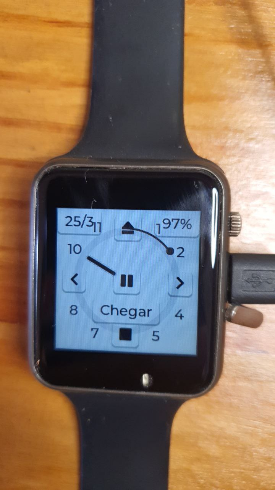

prev: [bigMess](../bigMess.md)

document created in 2024-03-25 (no relevant updates yet)

## Requisites

This project meets the following requisites:

1. Show date and time first (DTScreen); :heavy_check_mark:;
2. In DTScreen some shortcuts to my activity log; :heavy_check_mark:;
3. In DTScreen a button to activity log app;
4. In DTScreen a button to the "next screen"; :heavy_check_mark:;
5. A screen to set date/time
  - Try to automatically adjust date/time when connected to USB;
    - how to know a data connection is available?
6. A screen to activate ESP.AP and WebREPL
7. A screen to show battery status; :heavy_check_mark:
8. A screen to show temperature; :heavy_check_mark:
9. A screen to set wakeup/sleep interval
10. A screen to set alarms
11. A screen to chronometer/timer
12. Upload/download of logged data is provided by Micropython/Thonny; :heavy_check_mark:

https://docs.lvgl.io/8.3/overview/object.html#create-and-delete-objects

## Framework

- Micropython with LVGL (see https://github.com/FNakano/CFA/tree/master/programas/MicropythonWithLVGL)
- axp202c.py from https://gitlab.com/mooond/t-watch2020-esp32-with-micropython
- ft66x36.py (see https://github.com/FNakano/CFA/blob/master/programas/MicropythonWithLVGL/touchDisplayButton.md)

## Source code explained

The source files are  `deploy.py` and `watch_v5.py`. The first one contains commands (function calls) to build the watch faces and functionalities. The second one specifies the watch faces and functionalities. 

### deploy.py

```python
import watch_v5          # import watch faces and funcionalities
import lvgl as lv
w=watch_v5.WATCH()       # create watch instance
w.setHardware()          # setup hardware 
w.drawDateTempHourMin()  # draw Hours/minutes hand and arc scale
w.drawTimeFace()         # draw buttons and hour marks
# w.drawExternalFace()

w.drawLogButtons()       # draw buttons to log events
w.sleepOnTimer()         # start timer to make the watch sleep in 20s

```

This file can be imported into `boot.py` in order to start watch at every boot.

### watch_v5.py

```python
...
class WATCH:
  tim=None
  def setHardware (self):
    print("LVGL version:"+str(lv.version_major())+"."+str(lv.version_minor()))
    ...
  def drawProgrammingFace (self):
    actscr=lv.screen_active()
    lv.obj.clean(actscr)
    self.lblSleep=lv.label(lv.screen_active())
    ...
  def drawTimeFace (self):
    btn=lv.button(lv.screen_active())
    btn.set_style_bg_opa(lv.STATE.DEFAULT, lv.OPA.TRANSP)
    ...
  def drawLogButtons (self):
    self.btnBk=lv.button(lv.screen_active())
    ...
    self.axp.setLDO2Voltage(3300) # turn backlight on

  def drawRing (self, size, value, text):
    arc=lv.arc(lv.screen_active())
    arc.set_size(size,size)
    ...    
  def drawNeedleAndRing (self, size, value, text):
    arc=lv.arc(lv.screen_active())
    arc.set_size(size,size)
    ...
  def drawDateTempHourMin (self):
    datetime=self.hwrtc.datetime()
    self.temp= self.axp.getTemp()
    ...
  def sleepNow (self, event):
    # may be called with None as argument
    scr=lv.screen_active()
    lv.obj.clean(scr)
    ...
    machine.deepsleep() # sleep forever, wake on touchscreen 

  def sleepOnTimer (self):
    ...
  def cancelSleep (self):
    ...
  def log (self, strEv):
    datetime=self.hwrtc.datetime()
    with open('logfile.csv', 'a', encoding='utf-8') as f:
    ...

```

## User Journey

### See date/hour

1. touch watch face;

### Log an event

1. touch watch face;
2. touch some log button;
  - log buttons are at 12, 3, 6, 9 hours and at the center. I use them as 12(Eject) = walk by foot, 3(right arrow) = ride (car,bus,train,...), 6(Stop) = arrived in some noticeable place, 9(left arrow) = going back home, center(Pause) = waiting(for the train to ride, for the bus to come,...)
  
### Program/download/upload files

1. touch watch face;
2. touch battery percentage button;
  - this switches face to programming face
3. touch play button;
  - PLAY button stops the sleep timer;
  - STOP button starts the sleep timer;
4. Use Thonny or AMPY to navigate/upload/download files

## Considerations

- In current compilation of Micropython+LVGL (as of March, 2024), LVGL version is 9.0 and Micropython version is 1.20.0;
  - 
- naming conventions in LVGL+Micropython are different from native LVGL (C language);
  - ex.: C `lv_act_scr()` function is equivalent to Micropython+LVGL `lv.active_screen()` function.
  - ex.: C `lv_obj_clean()` function is equivalent to Micropython+LVGL `lv.obj.clean()` function (see: https://forum.lvgl.io/t/calling-lv-obj-clean-lv-scr-act-to-clear-the-current-screen-prevents-further-object-creation/3484.
  - ex.: C `LV_PART_KNOB()` constant is equivalent to Micropython+LVGL `lv.PART.KNOB` constant.
- peek at ESP32 LVGL bindings, such as https://github.com/lvgl/lv_binding_micropython/blob/master/driver/esp32/ili9XXX.py, may give some hints;
- some constants shoud be imported in Micropython
  -  `from ili9XXX import REVERSE_PORTRAIT` (see: https://forum.lvgl.io/t/rotating-display/1447/10).
- autocomplete tool may not properly function in ESP32+LVGL+Micropython due to low RAM;
- ST7789 driver supports 320x240 display but T-WATCH display is 240x240. Just REVERSE_PORTRAIT results in cropping part of the watch face. Should set y-coordinate to correct it.
- LVGL functions are asynchronous so issuing `machine.deepsleep(...)` may turn ESP32 off before lv.obj_clean() complete. 
- axp202 temperature sensor does not sense environment temperature accurately;
  - removed temperature from watch face;
  - tried on a hot day (33 Celsius or above from train temperature report and weather forecast), it measured arround 27 Celsius most of the time;
