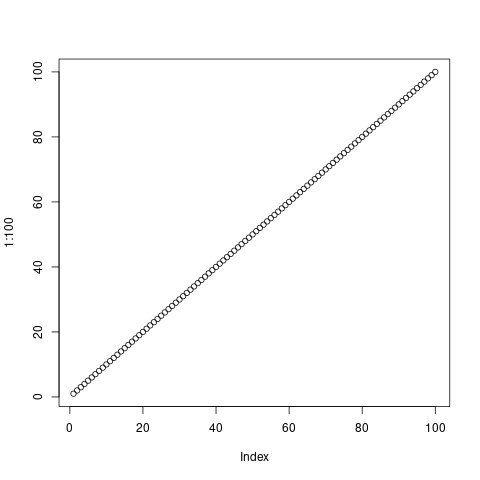
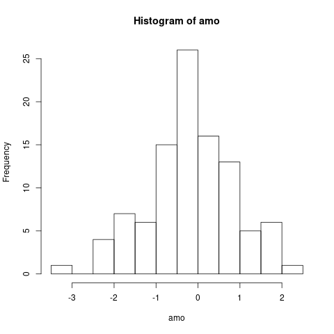

# R

## Motivação

Aproveitar a oportunidade de analisar dados usando R para documentar etapas de análise, soluções e scripts.

Documentar os pedidos e as soluções feitos por colaboradores.

### Comparando R e Excel

Uma pergunta que facilmente ocorre é: `Qual a diferença entre R e Excel?`

Acho a diferença mais fácil de notar e de explicar envolve quantidade de dados e facilidade de operação:

Concordo que muito do que é possível fazer com R também é possível com Excel. Concordo que este segundo é mais agradável aos olhos, que a interface com menus, botões, a visualização das tabelas, a operação por seleção com ponteiro do mouse é (ou tornou-se) mais intuitiva,... concordo muito que planilha é mais agradável de usar para lidar com umas três folhas de dados, cada uma com da ordem de uma dezena de colunas e da ordem de uma centena de linhas (embora selecionar uma centena de linhas para fazer um gráfico já não seja tão confortável).

A planilha eletrônica já não é tão conveniente quando trabalha-se com muitas tabelas (algo como dez ou mais), cada uma com muitas colunas (algo como mais de dez) e muitas linhas (algo como umas milhares). Neste caso, selecionar o que operar clicando e arrastando com o mouse não é a forma mais rápida, e talvez não seja a mais conveniente. Por exemplo, digitar `A$temperatura[1:10000]` para selecionar as primeiras dez mil linhas da coluna `temperatura` da tabela `A`, ou, criar um gráfico de uma parte de uma tabela digitando `plot(A$temperatura[1:10000])` certamente é mais rápido e talvez seja mais conveniente.

Quando, na planilha, aquilo que queremos realizar, requer que digitemos algo como `=soma(A10:A10000)`, ou requer clicar o botão para criar gráfico e preencher as faixas de dados (ao invés de selecionar com o mouse, porque as faixas são muito extensas), a operação da planilha se aproxima da operação de R: torna-se, em algum sentido, mais fácil digitar que arrastar o mouse.

Em resumo e, superficialmente, a diferença é que numa a principal forma de especificar o que fazer é através de texto que obedece as regras de uma linguagem que, em princípio não conhecemos, noutra a principal forma de especificar o que fazer é gráfica, através de botões e gestos usando o mouse. A primeira é mais conveniente para grandes quantidades de dados, a segunda é conveniente para operar visualmente sobre quantidades menores de dados.

## Introdução

R é um ambiente para análise estatística. Com ele é possível carregar dados armazenados em tabelas e manipulá-las, por exemplo, fazendo gráficos, aplicando testes e modelos estatísticos em poucos comandos. 

O [site oficial](https://www.r-project.org/) permite o download do programa para Linux, Windows e Mac, da [documentação](https://cran.r-project.org/manuals.html), e permite acompanhar as notícias dos desenvolvedores da ferramenta.

Há muito material gratuito  na internet. Uma busca por `R tutorials` mostra isso. Vou listando abaixo o que encontrei e minha impressão (superficial) sobre o material.

1. [Este link é o primeiro capítulo do material do referido site, que cobre instalação, geração de gráficos análise de regressão e segue aplicando em geoestatística](https://geokrigagem.com.br/geoestatistica-no-r-como-instalar-tutorial/).
2. [Este apresenta a experiência de dois estudantes do IB](http://ecovirtual.ib.usp.br/doku.php?id=ecovirt:roteiro:soft:rprincip).
3. [Este PDF está no e-disciplinas e explica bem as janelas no R-Studio, antes de mostrar e explicar os comandos básicos](https://edisciplinas.usp.br/pluginfile.php/4883125/mod_resource/content/1/Tutorial.pdf).
4. [Este é um tutorial gratuito bastante completo usado para promover livros sobre tópicos mais avançados](http://www.r-tutor.com/r-introduction).

### Comentários sobre construção e manutenção de programas de computador

Esta é minha opinião...

Construir e manter programas com código-fonte volumoso, baseado em outros programas (que podem mudar ou deixar de ser mantidos), é uma empreitada trabalhosa. Talvez sirva como balizador que empresas de software, como MS, G, F, ... mantém uma grande quantidade de programadores, normalmente bastante ocupados, seja para manter um programa funcionando, seja corrigindo a versão atual, seja preparando a próxima versão,... Importante: essas empresas ganham dinheiro e ordenam aos programadores o que deve ser feito (através de uma hierarquia de empresa privada).

R é um *software livre*, uma expressão que indica que a intenção dos desenvolvedores e mantenedores é que o código-fonte seja público, que todos sejam livres para usar e modificar. A orientação do desenvolvimento e manutenção do software é coordenado por uma fundação. Quando o software é financeiramente bem sucedido, a fundação consegue contratar pessoas para trabalhar, caso contrário, ela é movida por voluntários. É um modelo de negócio diferente do de uma empresa privada.

O desenvolvimento de R é feito, principalmente, por contribuições de usuários, que podem ser indivíduos ou grupos, estarem ligados a empresas ou não. Essas contribuições podem ser feitas escrevendo uma biblioteca, que pode então ser incorporada ao programa, dedicando algum tempo a alguma funcionalidade do programa,... Há outras formas de contribuir, claro.

Isto torna comum que vários colaboradores escrevam bibliotecas para tratar a mesma questão, por exemplo, **datas**.

Neste caso, as bibliotecas podem atender necessidades diferentes, ou necessidades parcialmente coincidentes, ... e fazê-lo de maneiras diferentes. Por exemplo, uma biblioteca pode tratar datas usando código próprio, outra pode aproveitar código de alguém e disponibilizado em uma biblioteca muito usada por desenvolvedores Python, outro aproveita uma biblioteca popular entre desenvolvedores C, outro aproveita as funções de data/hora do sistema operacional,...

Também não há garantia que o desenvolvedor de uma biblioteca a tenha construído de maneira a ser compatível com o restante do programa.

Isto significa trabalho adicional para quem desenvolve *scripts*, pois, mesmo que dois comandos diferentes tenham documentado que apresentam o mesmo resultado, estes podem não ser compatíveis, por exemplo porque um retorna o resultado como palavras, outro como números.

Por outro lado, o trabalho investido no R e o resultado obtido é muito significativo, não se justifica, na minha opinião, deixar de usá-lo pelas incompatibilidade internas que ele tenha neste momento.

### Estratégias para seguir acompanhando este material

O restante desta página segue no formato Pergunta-Resposta. Em algum momento a página pode ficar longa demais, o que tornará conveniente criar algum tipo de índice ou de categorização. Enquanto isso não acontece, vamos trabalhando.

Projetos com sensores são uma boa oportunidade para apresentar um pouco de análise de dados. As necessidades, consequentemente as soluções, vão surgindo dentro de um contexto, quase linearmente.

## Como começar com o R?

Depois de baixar e instalar, iniciar e aprender alguns comandos básicos. Na lista acima, [1,3] mostram o passo a passo para baixar, instalar e iniciar. Caso goste do material, siga com ele para os comandos básicos.

[2,4] Iniciam pelos comandos básicos, [4] tem muita informação, avançando sobre tópicos mais complexos.

## De dentro do R, como sei em que pasta estou e que arquivos estão na pasta?

- Em que pasta estou: `getwd()`
- Que arquivos tem na pasta: `dir()`
- Quero ir para *C:\outraPasta*: `setwd("C:\outraPasta")` (se for Windows, no Linux a barra é a direita, não a barra invertida.)

Frequentemente ocorrem problemas com a forma como o nome da pasta é escrito. É possível saber qual é o formato usando `setwd()`, ou `dir()`, e vendo como são os nomes que eles listam (por exemplo, se a barra é direita ou invertida, como os caracteres acentuados e espaços aparecem, ...), então, copiar o formato, ou marcar o texto com o mouse, copiar, e colar no `setwd(`, ajustando o que for necessário. 

Os comandos do R aceitam argumentos dentro dos parêntesis. Esses argumentos podem ter várias linhas, ou seja, se você estiver digitando um argumento para um comando e, por acidente, acertar o ENTER, continue digitando o restante do argumento, feche os parêntesis e aperte ENTER para executar o comando. O sinal que se estão em um argumento é o `prompt` que muda de `>` para `+`.

## Dá para carregar arquivos do Excel?

Parece que dá para carregar os dados, uma folha de dados por vez. (ainda não sei como funciona para fórmulas e macros).

[Referência](https://stackoverflow.com/questions/7049272/importing-excel-files-into-r-xlsx-or-xls)

[Outra referência](https://github.com/tidyverse/readxl)

de dentro do R, em três passos:

1. Baixar e instalar uma biblioteca com `install.packages("readxl")`
   - só precisa fazer uma vez, aí a biblioteca fica instalada.
2. Carregar a biblioteca com: `library(readxl)`
   - precisa carregar toda vez que iniciar o R, a menos que esteja salva do ambiente (por exemplo, quando sair, escolher salvar o ambiente, da próxima vez aue iniciar o R, a biblioteca estará carregada, e as variáveis, e o histórico de comandos).
3. Armazenar o conteúdo do arquivo do Excel em uma variável: `M <- read_excel("Planilha Dados Pluviômetro.xlsx")` isto carrega a primeira folha de dados da planilha.
   - para ver a documentação: `help(read_excel)` para sair do help, digitar q.
   - [exemplos e código-fonte](https://github.com/tidyverse/readxl)


<pre>&gt; ls()
character(0)
&gt; pwd()
Error in pwd() : não foi possível encontrar a função &quot;pwd&quot;
&gt; dir()
[1] &quot;Planilha Dados Pluviômetro.xlsx&quot;
&gt; M &lt;- read_excel(&quot;Planilha Dados Pluviômetro.xlsx&quot;)
Error in read_excel(&quot;Planilha Dados Pluviômetro.xlsx&quot;) : 
  não foi possível encontrar a função &quot;read_excel&quot;
&gt; library(readxl)
&gt; M &lt;- read_excel(&quot;Planilha Dados Pluviômetro.xlsx&quot;)
&gt; dim(M)                                                                      
[1] 454   8
&gt; colnames(M)
[1] &quot;Município&quot;       &quot;Cód Estação&quot;     &quot;UF&quot;              &quot;Nome da Estação&quot;
[5] &quot;Latutude&quot;        &quot;Longitude&quot;       &quot;Data/Hora&quot;       &quot;Valor Medida&quot;   
&gt; M$&quot;Município&quot;[1]
[1] &quot;MOGI DAS CRUZES&quot;
&gt; M$&quot;Data/Hora&quot;[1]
[1] &quot;2014-12-19 13:10:00 UTC&quot;
&gt; M[1,2]
<font color="#949494"># A tibble: 1 x 1</font>
  `Cód Estação`
  <font color="#949494"><i>&lt;chr&gt;</i></font>        
<font color="#BCBCBC">1</font> 353060704A   
&gt; M[1,1]
<font color="#949494"># A tibble: 1 x 1</font>
  Município      
  <font color="#949494"><i>&lt;chr&gt;</i></font>          
<font color="#BCBCBC">1</font> MOGI DAS CRUZES
&gt; 

</pre>

## Como carregar uma folha de dados que não seja a primeira

Em `read_excel`, acrescentar o argumento `sheet=x`. Se `x` for um número, carrega a folha de número `x`. Se `x` for uma palavra (algum texto entre double-quotes), carrega a folha de nome `x`.

<pre>&gt; M &lt;- read_excel(&quot;Planilha Dados Pluviômetro.xlsx&quot;, sheet=&quot;2015&quot;)            
&gt; dim(M)                                                                      
[1] 5212   10
&gt; colnames(M)
 [1] &quot;Município&quot;        &quot;Cód Estação&quot;      &quot;UF&quot;               &quot;Nome da Estação&quot; 
 [5] &quot;Latutude&quot;         &quot;Longitude&quot;        &quot;Data/Hora&quot;        &quot;Valor Medida&quot;    
 [9] &quot;Mês&quot;              &quot;Acumulado Mensal&quot;
&gt; 
</pre>

## Como saber quantas linhas e colunas tem a tabela?

`dim(M)`

Às vezes, a variável não é uma tabela, então o comando acima retorna `NULL`. Caso seja uma lista, o comando `length(L)` deve resolver. `nrow(M)` e `ncol(M)` acessam os mesmos atributos que `dim()` acessa, então se `dim(M)` retorna `NULL`, `nrow(M)` e `ncol(M)` também retornarão `NULL`. Referências:

- https://www.google.com/search?channel=fs&client=ubuntu&q=R+number+of+rows+in+a+list
- https://stackoverflow.com/questions/7340197/how-to-count-rows
- https://stats.stackexchange.com/questions/5253/how-do-i-get-the-number-of-rows-of-a-data-frame-in-r
- https://stat.ethz.ch/R-manual/R-devel/library/base/html/nrow.html


Às vezes a informação que queremos é uma tabela dentro de uma lista, aí é necessário acessar o elemento da lista e então testar o tamanho.

às vezes queremos saber qual é o tipo de dados de alguma variável. Referências sobre como R define os tipos durante a execução:

- https://www.rdocumentation.org/packages/lambda.r/versions/1.2.4/topics/duck-typing
- https://stat.ethz.ch/R-manual/R-devel/library/base/html/typeof.html
- https://cran.r-project.org/doc/manuals/R-lang.html#Basic-types
- https://stackoverflow.com/questions/49757080/check-the-type-of-a-vector-variable-in-r
- https://stackoverflow.com/questions/12693908/get-type-of-all-variables/12694054
- https://en.wikipedia.org/wiki/Duck_typing
- https://www.datacamp.com/community/tutorials/data-types-in-r

## Como saber os nomes das colunas?

`colnames(M)`

## Como referenciar uma coluna?

`M$'nome_da_coluna'`

## Como acessar/referenciar uma linha em uma coluna?

`M$'nome_da_coluna'[10]` retorna o valor armazenado na linha 10 da coluna. 

## Como colocar caracteres especiais, como 'grau', letras gregas,... nas legendas dos gráficos

`expression(paste(...))`

Referências:

- https://stackoverflow.com/questions/51799118/writing-the-symbol-degrees-celsius-in-axis-titles-with-r-plotly/51799161
- https://stats.idre.ucla.edu/r/codefragments/greek_letters/
- https://lukemiller.org/index.php/2010/05/modifying-basic-plots-in-r/


## Como trabalho com data e hora?

### Data/Hora em programas de computador

A forma como a humanidade trata o tempo contém muitas peculiaridades. Seja pelo desenvolvimento científico-tecnológico (ex. relógio atômico) seja pelo desenvolvimento social (ex. adoção do calendário Gregoriano no lugar do calendário Juliano, existência de outros sistemas, como o chinês, ...).

Essas peculiaridades dificultam a construção de bons programas de computador para lidar com datas, e multiplicam a quantidade soluções particulares.

No R, existem algumas funções para manipulação de data em R.base, outras em Tibble.time, outras em Lubridate, pior, elas se sobrepõe e são parcialmente compatíveis. Portanto, cabe ter cuidado e paciência quando lidar com datas.

A escolha por lubridate não tem uma boa justificativa. Apenas foi a primeira que apareceu quando procurei como lidar com datas no R.

### Arquivo gerado por pluviômetro do CEMADEN

No caso dos arquivos gerados pelo CEMADEN, Data/Hora estão em um formato padronizado (ISO8601), o que facilita sua carga no R.

Para separar Data/Hora em seus elementos, usar a biblioteca `lubridate`.

1. Instalar lubridate: `install.package(lubridate)`
2. Carregar lubridate: `library(lubridate)`

Com isto, selecionar a hora da coluna Data/Hora é feito assim: `hour(M$'Data/Hora') e o resultado:

<pre>&gt; hour(M$&apos;Data/Hora&apos;)
  [1] 13 13 13 13 13 14 14 14 14 14 15 16 16 16 17 18 19 20 21 22 23  0  1  2  3
 [26]  4  5  6  7  8  9 10 11 12 13 14 15 16 17 18 19 20 21 22 23  0  1  2  3  4
 [51]  5  6  7  8  9 10 11 12 13 14 15 16 17 18 19 20 21 22 23  0  1  2  3  4  5
 [76]  6  7  8  9 10 11 12 13 14 15 15 15 15 15 15 16 16 16 16 16 16 17 17 17 17
[101] 17 17 18 18 18 18 18 18 19 19 19 19 19 19 20 20 20 20 20 20 21 21 21 21 21
[126] 22 22 22 22 22 22 23 23 23 23 23  0  0  1  1  1  1  1  1  2  2  2  2  2  2
[151]  3  4  5  6  7  8  8  8  8  8  8  9 10 10 10 10 10 10 11 11 11 11 11 11 12
[176] 12 12 12 12 13 14 14 14 14 14 14 15 15 15 15 15 15 16 16 16 16 16 16 17 17
[201] 18 19 20 21 22 23 23 23 23 23 23  0  1  2  3  4  5  6  7  8  9 10 11 12 12
[226] 12 13 14 15 16 17 18 19 20 21 22 23  0  1  2  3  4  5  6  7  8  9 10 11 12
[251] 13 14 14 14 14 14 14 15 15 15 15 16 17 18 19 20 21 22 23  0  1  2  3  4  5
[276]  6  7  8  9 10 11 12 13 14 15 16 17 18 19 20 21 22 23  0  1  2  3  4  5  6
[301]  7  8  9 10 11 12 13 14 15 16 17 18 19 20 21 22 23  0  1  2  3  4  5  6  7
[326]  8  9 10 11 12 13 14 15 16 17 18 18 18 18 18 18 19 19 19 19 19 20 20 21 22
[351] 23  0  1  1  1  2  3  4  5  6  7  8  9 10 11 12 13 13 13 13 13 13 14 15 15
[376] 15 15 15 15 16 16 16 16 16 16 17 18 19 20 20 20 20 20 20 21 21 21 21 21 21
[401] 22 22 23  0  1  2  3  4  5  6  7  8  9 10 10 10 10 11 12 13 14 15 16 17 18
[426] 19 20 21 22 23  0  1  2  3  4  5  6  7  8  9 10 11 12 13 14 15 16 17 18 19
[451] 20 21 22 23
&gt; 
</pre>

## Como faço para agregar os valores nas linhas por hora?

### Primeira abordagem

Aproveitando que a folha de dados de 2014 contém somente alguns dias de dezembro, criar uma tabela contendo dia, hora e chuva acumulada na hora fica:

``` R
H <- tibble (
a = tapply(day(M$'Data/Hora'), hour(M$'Data/Hora')+24*day(M$'Data/Hora'), mean),
b = tapply(hour(M$'Data/Hora'), hour(M$'Data/Hora')+24*day(M$'Data/Hora'), mean),
c = tapply(M$'Valor Medida', hour(M$'Data/Hora')+24*day(M$'Data/Hora'), sum)
)
```

**nota**: nesta abordagem, a linha de `H` contém dia, hora e volume medido durante a hora, de hora:00 até hora:59:59.9999....

**nota2**: checar qual a referência da hora (ou fuso, ou timezone).

Os 'truque's que não estão nas referências: 

como são data/hora de um único mês, um número que é 24*dia+hora é suficiente para identificar uma determinada hora em um determinado dia. Os valores de chuva dentro desta hora, queremos acumular. tapply faz isso. Referências:

- https://rdrr.io/r/base/tapply.html
- https://stackoverflow.com/questions/3505701/grouping-functions-tapply-by-aggregate-and-the-apply-family
- https://stat.ethz.ch/R-manual/R-devel/library/base/html/tapply.html
- https://www.rdocumentation.org/packages/base/versions/3.6.2/topics/tapply

Cada 24*dia+hora tem até seis valores (por causa dos intervalos de 10 minutos ou de 1 hora usados pelo instrumento). Se esses valores forem o dia de cada medida, todos os valores são iguais e iguais à média.

Esta forma de trabalhar funciona, mas como ela mistura datas com escalares sem considerar meses de 30 ou 31 dias, anos bissextos, etc, resultados inesperados podem ocorrer.
 
- fim dos truques.

### Segunda abordagem


#### funções de agregação como mean, min e max funcionam com lubridate

- https://community.rstudio.com/t/to-find-maximum-date/57790
- https://rawgit.com/rstudio/cheatsheets/master/lubridate.pdf
- https://r4ds.had.co.nz/dates-and-times.html
- https://cran.r-project.org/web/packages/lubridate/lubridate.pdf
- https://stackoverflow.com/questions/53561299/rmin-and-max-of-a-date-column-in-a-dataframe/53561477


trabalhando...

https://www.google.com/search?channel=fs&client=ubuntu&q=R+accumulated+sum
https://stackoverflow.com/questions/40042711/how-to-calculate-cumulative-sum
https://www.google.com/search?channel=fs&client=ubuntu&q=r+integer+part
https://stat.ethz.ch/R-manual/R-devel/library/base/html/Round.html
https://www.google.com/search?client=ubuntu&hs=smr&channel=fs&sxsrf=ALeKk02m8SXEEcwxDn19mO-6hyMQiUPHWQ%3A1611846409350&ei=CdMSYMCCFbTX5OUPnK25oAo&q=lubridate+datediff&oq=lubridate+datediff&gs_lcp=CgZwc3ktYWIQAzIFCAAQywEyBggAEBYQHjoHCAAQRxCwAzoGCCMQJxATOgQIIxAnOggIABCxAxCDAToFCC4QsQM6CwgAELEDEMcBEKMCOggILhCxAxCDAToCCAA6BAgAEAM6BAgAEEM6BQgAELEDOgcIABCxAxBDOgQILhBDOgQIABAKOgQIABANOgYIABANEB46CAgAEA0QChAeUK6VAVjiuAFgqboBaAJwAngAgAH0AYgBxhOSAQYxLjE2LjGYAQCgAQGqAQdnd3Mtd2l6yAEEwAEB&sclient=psy-ab&ved=0ahUKEwiAq6Xl877uAhW0K7kGHZxWDqQQ4dUDCAw&uact=5
https://data.library.virginia.edu/working-with-dates-and-time-in-r-using-the-lubridate-package/
about:home
https://www.google.com/search?channel=fs&client=ubuntu&q=R+accumulated+sum
https://stackoverflow.com/questions/40042711/how-to-calculate-cumulative-sum
https://www.google.com/search?channel=fs&client=ubuntu&q=r+integer+part
https://stat.ethz.ch/R-manual/R-devel/library/base/html/Round.html
https://www.google.com/search?client=ubuntu&hs=smr&channel=fs&sxsrf=ALeKk02m8SXEEcwxDn19mO-6hyMQiUPHWQ%3A1611846409350&ei=CdMSYMCCFbTX5OUPnK25oAo&q=lubridate+datediff&oq=lubridate+datediff&gs_lcp=CgZwc3ktYWIQAzIFCAAQywEyBggAEBYQHjoHCAAQRxCwAzoGCCMQJxATOgQIIxAnOggIABCxAxCDAToFCC4QsQM6CwgAELEDEMcBEKMCOggILhCxAxCDAToCCAA6BAgAEAM6BAgAEEM6BQgAELEDOgcIABCxAxBDOgQILhBDOgQIABAKOgQIABANOgYIABANEB46CAgAEA0QChAeUK6VAVjiuAFgqboBaAJwAngAgAH0AYgBxhOSAQYxLjE2LjGYAQCgAQGqAQdnd3Mtd2l6yAEEwAEB&sclient=psy-ab&ved=0ahUKEwiAq6Xl877uAhW0K7kGHZxWDqQQ4dUDCAw&uact=5
https://data.library.virginia.edu/working-with-dates-and-time-in-r-using-the-lubridate-package/
https://www.google.com/search?channel=fs&client=ubuntu&q=concatenate+tibbles+R
https://dplyr.tidyverse.org/reference/bind.html
https://garthtarr.github.io/meatR/merging.html
https://stackoverflow.com/questions/51673607/combine-two-data-frames-or-tibbles
https://github.com/FNakano/CFA/tree/master/programas/R
https://www.google.com/search?channel=fs&client=ubuntu&q=barplot+r
https://www.r-graph-gallery.com/barplot.html
https://www.google.com/search?channel=fs&client=ubuntu&q=r+concatenate+string
https://stat.ethz.ch/R-manual/R-patched/library/base/html/paste.html

library(readxl)
library(tidyverse)
library(lubridate)
M <- read_excel("Planilha Dados Pluviômetro.xlsx")
H <- tibble (
a = tapply(day(M$'Data/Hora'), hour(M$'Data/Hora')+24*day(M$'Data/Hora'), mean),
b = tapply(hour(M$'Data/Hora'), hour(M$'Data/Hora')+24*day(M$'Data/Hora'), mean),
c = tapply(M$'Valor Medida', hour(M$'Data/Hora')+24*day(M$'Data/Hora'), sum)
)
H %>% print (n=Inf, width=Inf)
M$'Data/Hora'
M$'Data/Hora'[2:200]-M$'Data/Hora'[1:199]

M$'Data/Hora'[1:200]-M$'Data/Hora'[1]
(M$'Data/Hora'[1:200]-M$'Data/Hora'[1])/(24*3600)
int((M$'Data/Hora'[1:200]-M$'Data/Hora'[1])/(24*3600))
trunc((M$'Data/Hora'[1:200]-M$'Data/Hora'[1])/(24*3600))

(M$'Data/Hora'[1:200]-M$'Data/Hora'[1])

as.duration(M$'Data/Hora'[1:200]-M$'Data/Hora'[1])/ddays(1)
trunc(as.duration(M$'Data/Hora'[1:200]-M$'Data/Hora'[1])/ddays(1))
trunc(as.duration(M$'Data/Hora'[1:200]-M$'Data/Hora'[1])/dhours(1))
mean(M$'Data/Hora'[1:200])
max(M$'Data/Hora'[1:200])


## Como faço para imprimir a tabela toda na tela? (a tabela é um tibble)

Imprimir a tabela toda na tela: `H %>% print (n=Inf, width=Inf)`

[Referência](https://r4ds.had.co.nz/tibbles.html)

### Juntando tudo para ter volume acumulado de chuva por hora usando a primeira abordagem

O script inteiro fica:

``` R
library(readxl)
library(tidyverse)
library(lubridate)
M <- read_excel("Planilha Dados Pluviômetro.xlsx")
H <- tibble (
a = tapply(day(M$'Data/Hora'), hour(M$'Data/Hora')+24*day(M$'Data/Hora'), mean),
b = tapply(hour(M$'Data/Hora'), hour(M$'Data/Hora')+24*day(M$'Data/Hora'), mean),
c = tapply(M$'Valor Medida', hour(M$'Data/Hora')+24*day(M$'Data/Hora'), sum)
)
H %>% print (n=Inf, width=Inf)
```

## Como concatenar novas colunas em um tibble

Esta é para colocar uma tabela ao lado da outra, sem precisar checar que linhas estão sendo colocadas lado-a-lado. 

`R  <- bind_cols(J,tibble(CAD)) # https://dplyr.tidyverse.org/reference/bind.html`

## Como faço para fundir duas tabelas, sincronizando as linhas.

Esta é quando as linhas colocadas lado-a-lado precisam ter algumas cararcterísticas iguais - por exemplo alinhar linhas com dados da mesma hora.

Exemplo: Uma tabela, T1, tem duas colunas: horaMinuto e temperatura, outra tabela, T2, tem duas colunas: horaMinuto e umidade relativa do ar. Elas estão na mesma escala de tempo, mas às vezes faltam leituras (em qualquer uma das duas). Como juntar T1 e T2 em uma tabela só, mantendo a correspondência entre horaMinuto?

Com o `tidyverse`, é possível fazer isso usando `joins`, como na terceira linha do código abaixo:

```R
M <- read_csv("2020.csv")

N <- read_csv("feeds-BME280.csv")

J <- inner_join(M, N, by = c("Ano", "Mes", "Dia", "HoraInicio")) # https://rpubs.com/CristianaFreitas/311735

```

No código, M e N são as tabelas que deseja-se juntar. Das várias colunas das tabelas, elas têm colunas com nomes em comum: `$Ano`, `$Mes`, `$Dia`, `$HoraInicio`. No conjunto de dados, às vezes faltam linhas em M, às vezes em N e só interessam as datas em que as colunas de M **E** as colunas de N estão presentes. O comando que faz isso é `inner_join`.

Há situações em que deseja-se que todas as linhas da primeira tabela estejam presentes. O comando que faz isso é `right_join`. Neste caso, os elementos da tabela que não tem a linha são preenchidos com `NA`.

Há situações em que deseja-se que todas as linhas das DUAS tabelas estejam presentes. O comando que faz isso é `full_join`. Neste caso, os elementos da tabela que não tem a linha são preenchidos com `NA`.


### Referências

- https://rpubs.com/CristianaFreitas/311735
- https://www.fulljoin.com.br/posts/2016-05-12-tudo-sobre-joins/
- https://dplyr.tidyverse.org/reference/join.html
- https://www.r-bloggers.com/2020/05/create-and-convert-tibbles/
- https://dplyr.tidyverse.org/reference/join.html
- https://rpubs.com/williamsurles/293454
- https://r4ds.had.co.nz/relational-data.html
- https://stackoverflow.com/questions/1299871/how-to-join-merge-data-frames-inner-outer-left-right
- https://www.datasciencemadesimple.com/join-in-r-merge-in-r/


**sugestão**: Pense como fazer isso numa planilha: fazer a operação equivalente a `join` entre duas folhas de dados de uma planilha.

## Como gerar uma tabela (tibble) com todas as horas dentro de um intervalo (ex. de um mês)?

Isto pode ser usado, por exemplo, como referência de tempo de observações em uma sequência temporal. Caso a sequência tenha algum valor faltante, a tabela que contém as observações pode simplesmente não conter a respectiva linha. Alinhar a tabela de observações com esta referência elicita os valores faltantes e permite que o analista escolha a forma adequada para tratá-los.

```R
library(tidyverse)
library(lubridate)

inicio <- ymd_hm("2020-06-01 0:00");
fim <- ymd_hm("2020-07-01 0:00");

S <- seq(inicio, fim, by='hour');

# Ref.: http://uc-r.github.io/date_sequences/

```

## Gráficos em R

Buscando `R plot examples` uma quantidade de referências com código aparecem. Vou deixar duas aqui:

- https://sites.harding.edu/fmccown/r/  (mais simples)
- https://www.r-graph-gallery.com/      (mais exemplos)

Um ponto de partida pode ser: `plot(1:100)`, que faz o gráfico de uma sequência de 1 até 100. A partir daí, com `help(plot)` é possível ver outros tipos de gráficos. Outro ponto de partida é:

```R
amostras <- rnorm(100); # gera 100 observações (números) a partir de uma distribuição Normal Padrão ( média zero e variância 1). 
hist(amostras); # gera o histograma das amostras, contando quantas "caem" em cada uma de 10 divisões)
```




Para criar o gráfico em um arquivo:

```R
png ("seq.png");    # cria e abre o arquivo
plot (1:100)        # gera o gráfico no arquivo
dev.off()           # fecha o arquivo (informa que o arquivo não receberá mais dados desta vez.
```

```R
png ("norm.png");   # cria e abre o arquivo
amo<-rnorm(100);    # gera 100 observações a partir de uma Normal Padrão 
hist(amo)           # gera o gráfico no arquivo
dev.off()           # fecha o arquivo (informa que o arquivo não receberá mais dados desta vez.
```

## Como faço para ver todos os comandos que usei durante a seção?

`history()`

## Como faço para salvar em um arquivo todos os comandos que usei durante a seção?

`savehistory('arquivo.txt')`

[Referência](https://stackoverflow.com/questions/2749390/command-history-in-r)

## Tentei instalar tidyverse no Ubuntu/Linux com install.package("tidyverse") mas deu erro, o que faço?

Veja se o erro é o abaixo:

<pre>** testing if installed package can be loaded from final location
** testing if installed package keeps a record of temporary installation path
* DONE (ggplot2)
ERROR: dependencies ‘httr’, ‘rvest’, ‘xml2’ are not available for package ‘tidyverse’
* removing ‘/home/fabio/R/x86_64-pc-linux-gnu-library/3.6/tidyverse’

The downloaded source packages are in
	‘/tmp/RtmpEGuoep/downloaded_packages’
Warning messages:
1: In install.packages(&quot;tidyverse&quot;) :
  installation of package ‘curl’ had non-zero exit status
2: In install.packages(&quot;tidyverse&quot;) :
  installation of package ‘xml2’ had non-zero exit status
3: In install.packages(&quot;tidyverse&quot;) :
  installation of package ‘httr’ had non-zero exit status
4: In install.packages(&quot;tidyverse&quot;) :
  installation of package ‘rvest’ had non-zero exit status
5: In install.packages(&quot;tidyverse&quot;) :
  installation of package ‘tidyverse’ had non-zero exit status
&gt; library(tidyverse)
Error in library(tidyverse) : there is no package called ‘tidyverse’
</pre>

Instalei programas adicionais no linux, de acordo com a [referência](https://stackoverflow.com/questions/43592316/warning-in-install-packages-installation-of-package-tidyverse-had-non-zero-e)

linha de comando: `sudo apt install libxml2-dev libcurl4-openssl-dev libssl-dev`

... então tentei instalar tidyverse novamente:

<pre>* DONE (rvest)
* installing *source* package ‘tidyverse’ ...
** package ‘tidyverse’ successfully unpacked and MD5 sums checked
** using staged installation
** R
** inst
** byte-compile and prepare package for lazy loading
** help
*** installing help indices
*** copying figures
** building package indices
** installing vignettes
** testing if installed package can be loaded from temporary location
** testing if installed package can be loaded from final location
** testing if installed package keeps a record of temporary installation path
* DONE (tidyverse)

The downloaded source packages are in
	‘/tmp/RtmpEGuoep/downloaded_packages’
&gt; library(tidyverse)
── <b>Attaching packages</b> ──────────────────────────────────────────────────────── tidyverse 1.3.0 ──
<font color="#859900">✔</font> <font color="#268BD2">ggplot2</font> 3.3.3     <font color="#859900">✔</font> <font color="#268BD2">purrr  </font> 0.3.4
<font color="#859900">✔</font> <font color="#268BD2">tibble </font> 3.0.5     <font color="#859900">✔</font> <font color="#268BD2">dplyr  </font> 1.0.3
<font color="#859900">✔</font> <font color="#268BD2">tidyr  </font> 1.1.2     <font color="#859900">✔</font> <font color="#268BD2">stringr</font> 1.4.0
<font color="#859900">✔</font> <font color="#268BD2">readr  </font> 1.4.0     <font color="#859900">✔</font> <font color="#268BD2">forcats</font> 0.5.0
── <b>Conflicts</b> ─────────────────────────────────────────────────────────── tidyverse_conflicts() ──
<font color="#DC322F">✖</font> <font color="#268BD2">lubridate</font>::<font color="#859900">as.difftime()</font> masks <font color="#268BD2">base</font>::as.difftime()
<font color="#DC322F">✖</font> <font color="#268BD2">lubridate</font>::<font color="#859900">date()</font>        masks <font color="#268BD2">base</font>::date()
<font color="#DC322F">✖</font> <font color="#268BD2">dplyr</font>::<font color="#859900">filter()</font>          masks <font color="#268BD2">stats</font>::filter()
<font color="#DC322F">✖</font> <font color="#268BD2">lubridate</font>::<font color="#859900">intersect()</font>   masks <font color="#268BD2">base</font>::intersect()
<font color="#DC322F">✖</font> <font color="#268BD2">dplyr</font>::<font color="#859900">lag()</font>             masks <font color="#268BD2">stats</font>::lag()
<font color="#DC322F">✖</font> <font color="#268BD2">lubridate</font>::<font color="#859900">setdiff()</font>     masks <font color="#268BD2">base</font>::setdiff()
<font color="#DC322F">✖</font> <font color="#268BD2">lubridate</font>::<font color="#859900">union()</font>       masks <font color="#268BD2">base</font>::union()
&gt; 
</pre>

[Referência](https://stackoverflow.com/questions/43592316/warning-in-install-packages-installation-of-package-tidyverse-had-non-zero-e)


## Projetos

[Ajusta dados da estação meteorológica para resolução horária](/projetos/DadosMeteorologica/README.md)

[Ajusta dados da estação de iluminância para resolução horária](/projetos/DadosIluminancia/README.md)


## notas para desenvolvedores e usuários do R de antes de 2016

**ainda não sei o que é um `tibble`...**

[*tibble* é o jeito moderno dos dataframes](https://tibble.tidyverse.org/). 

A justificativa que, para mim, faz essa explicação ter algum sentido tem a ver com desenvolvimento de programas: As versões iniciais de R (lá pelos 2000), usavam dataframes como estrutura de armazenamento dos valores nas variáveis, por exemplo, tabelas eram dataframes. À medida que R foi evoluindo, a implementação dos dataframes no programa foi evoluindo, e ficando complicada, às vezes por funcionalidades que poucos aproveitavam. Em um momento, os usuários/mantenedores/programadores de R resolveram limpar o código-fonte, mantendo compatibilidade com versões anteriores. Para isso, criaram o conceito de *tibble*.

[Tidyverse](https://www.tidyverse.org/)
[Tibble no Tidyverse](https://tibble.tidyverse.org/)
[Tibble no R](https://cran.r-project.org/web/packages/tibble/vignettes/tibble.html)

Em primeiro.R usei dataframes quando fiz `read.csv`. Para que as datas fossem carregadas como palavras, ou, Strings, (para que eu pudesse separar ano, mês, dia), precisei procurar uma solução e ir testando, chegando a `as.is=TRUE`. A promessa é que com tibble não seria necessário usar o `as.is`.

Ainda sobre datas e tibbles, a data no arquivo foi lida como um dttm, que é um tibble para data e hora. Tentei aplicar uma função sobre strings, mas o tipo não permite:

<pre>&gt; M[1,7]
<font color="#949494"># A tibble: 1 x 1</font>
  `Data/Hora`        
  <font color="#949494"><i>&lt;dttm&gt;</i></font>             
<font color="#BCBCBC">1</font> 2014-12-19 <font color="#949494">13:10:00</font>
&gt; strsplit(M[1,7],&quot; &quot;)
Error in strsplit(M[1, 7], &quot; &quot;) : argumento modo não caractere
&gt; 
</pre>

Para lidar com datas dentro de *tibbles* precisaria da biblioteca [lubridate](https://r4ds.had.co.nz/dates-and-times.html), então fica seis por meia-dúzia. Ou trabalha com Strings, ou trabalha com *tibble*.

Quanto a lidar com números, o exemplo abaixo:

<pre>&gt; M[1,8]
<font color="#949494"># A tibble: 1 x 1</font>
  `Valor Medida`
           <font color="#949494"><i>&lt;dbl&gt;</i></font>
<font color="#BCBCBC">1</font>            0.2
&gt; M[1,8]+M[2,8]
  Valor Medida
1            2
&gt; M[2,8]
<font color="#949494"># A tibble: 1 x 1</font>
  `Valor Medida`
           <font color="#949494"><i>&lt;dbl&gt;</i></font>
<font color="#BCBCBC">1</font>            1.8
&gt; sum(M[1:200,8]
+ )
[1] 136.2
&gt; 
</pre>

A notação do *tibble* é mais verbosa, o que pode atrapalhar quem usa...

Como carreguei a planilha com algo que usa tibbles, então, para pré-tratar os dados para uma escala horária, melhor usar lubridate...

<pre>&gt; library(lubridate)
Error in library(lubridate) : there is no package called ‘lubridate’
&gt; install.packages(&quot;lubridate&quot;)
Installing package into ‘/home/fabio/R/x86_64-pc-linux-gnu-library/3.6’
(as ‘lib’ is unspecified)
also installing the dependency ‘generics’

tentando a URL &apos;https://cloud.r-project.org/src/contrib/generics_0.1.0.tar.gz&apos;
Content type &apos;application/x-gzip&apos; length 117834 bytes (115 KB)
==================================================
downloaded 115 KB

tentando a URL &apos;https://cloud.r-project.org/src/contrib/lubridate_1.7.9.2.tar.gz&apos;
Content type &apos;application/x-gzip&apos; length 472640 bytes (461 KB)
==================================================
downloaded 461 KB

* installing *source* package ‘generics’ ...
** package ‘generics’ successfully unpacked and MD5 sums checked
** using staged installation
** R
** byte-compile and prepare package for lazy loading
** help
*** installing help indices
** building package indices
** testing if installed package can be loaded from temporary location
** testing if installed package can be loaded from final location
** testing if installed package keeps a record of temporary installation path
* DONE (generics)
* installing *source* package ‘lubridate’ ...
** package ‘lubridate’ successfully unpacked and MD5 sums checked
** using staged installation
** libs
g++ -std=gnu++11 -I&quot;/usr/share/R/include&quot; -DNDEBUG -I. -I./cctz/src/ -I&quot;/home/fabio/R/x86_64-pc-linux-gnu-library/3.6/Rcpp/include&quot;   -fpic  -g -O2 -fdebug-prefix-map=/build/r-base-jbaK_j/r-base-3.6.3=. -fstack-protector-strong -Wformat -Werror=format-security -Wdate-time -D_FORTIFY_SOURCE=2 -g  -c cctz/src/time_zone_fixed.cc -o cctz/src/time_zone_fixed.o
g++ -std=gnu++11 -I&quot;/usr/share/R/include&quot; -DNDEBUG -I. -I./cctz/src/ -I&quot;/home/fabio/R/x86_64-pc-linux-gnu-library/3.6/Rcpp/include&quot;   -fpic  -g -O2 -fdebug-prefix-map=/build/r-base-jbaK_j/r-base-3.6.3=. -fstack-protector-strong -Wformat -Werror=format-security -Wdate-time -D_FORTIFY_SOURCE=2 -g  -c cctz/src/time_zone_if.cc -o cctz/src/time_zone_if.o
g++ -std=gnu++11 -I&quot;/usr/share/R/include&quot; -DNDEBUG -I. -I./cctz/src/ -I&quot;/home/fabio/R/x86_64-pc-linux-gnu-library/3.6/Rcpp/include&quot;   -fpic  -g -O2 -fdebug-prefix-map=/build/r-base-jbaK_j/r-base-3.6.3=. -fstack-protector-strong -Wformat -Werror=format-security -Wdate-time -D_FORTIFY_SOURCE=2 -g  -c cctz/src/time_zone_impl.cc -o cctz/src/time_zone_impl.o
g++ -std=gnu++11 -I&quot;/usr/share/R/include&quot; -DNDEBUG -I. -I./cctz/src/ -I&quot;/home/fabio/R/x86_64-pc-linux-gnu-library/3.6/Rcpp/include&quot;   -fpic  -g -O2 -fdebug-prefix-map=/build/r-base-jbaK_j/r-base-3.6.3=. -fstack-protector-strong -Wformat -Werror=format-security -Wdate-time -D_FORTIFY_SOURCE=2 -g  -c cctz/src/time_zone_info.cc -o cctz/src/time_zone_info.o
g++ -std=gnu++11 -I&quot;/usr/share/R/include&quot; -DNDEBUG -I. -I./cctz/src/ -I&quot;/home/fabio/R/x86_64-pc-linux-gnu-library/3.6/Rcpp/include&quot;   -fpic  -g -O2 -fdebug-prefix-map=/build/r-base-jbaK_j/r-base-3.6.3=. -fstack-protector-strong -Wformat -Werror=format-security -Wdate-time -D_FORTIFY_SOURCE=2 -g  -c cctz/src/time_zone_libc.cc -o cctz/src/time_zone_libc.o
g++ -std=gnu++11 -I&quot;/usr/share/R/include&quot; -DNDEBUG -I. -I./cctz/src/ -I&quot;/home/fabio/R/x86_64-pc-linux-gnu-library/3.6/Rcpp/include&quot;   -fpic  -g -O2 -fdebug-prefix-map=/build/r-base-jbaK_j/r-base-3.6.3=. -fstack-protector-strong -Wformat -Werror=format-security -Wdate-time -D_FORTIFY_SOURCE=2 -g  -c cctz/src/time_zone_lookup.cc -o cctz/src/time_zone_lookup.o
g++ -std=gnu++11 -I&quot;/usr/share/R/include&quot; -DNDEBUG -I. -I./cctz/src/ -I&quot;/home/fabio/R/x86_64-pc-linux-gnu-library/3.6/Rcpp/include&quot;   -fpic  -g -O2 -fdebug-prefix-map=/build/r-base-jbaK_j/r-base-3.6.3=. -fstack-protector-strong -Wformat -Werror=format-security -Wdate-time -D_FORTIFY_SOURCE=2 -g  -c cctz/src/time_zone_posix.cc -o cctz/src/time_zone_posix.o
g++ -std=gnu++11 -I&quot;/usr/share/R/include&quot; -DNDEBUG -I. -I./cctz/src/ -I&quot;/home/fabio/R/x86_64-pc-linux-gnu-library/3.6/Rcpp/include&quot;   -fpic  -g -O2 -fdebug-prefix-map=/build/r-base-jbaK_j/r-base-3.6.3=. -fstack-protector-strong -Wformat -Werror=format-security -Wdate-time -D_FORTIFY_SOURCE=2 -g  -c cctz/src/zone_info_source.cc -o cctz/src/zone_info_source.o
ar rcs libcctz.a ./cctz/src/time_zone_fixed.o ./cctz/src/time_zone_if.o ./cctz/src/time_zone_impl.o ./cctz/src/time_zone_info.o ./cctz/src/time_zone_libc.o ./cctz/src/time_zone_lookup.o ./cctz/src/time_zone_posix.o ./cctz/src/zone_info_source.o
g++ -std=gnu++11 -I&quot;/usr/share/R/include&quot; -DNDEBUG -I. -I./cctz/src/ -I&quot;/home/fabio/R/x86_64-pc-linux-gnu-library/3.6/Rcpp/include&quot;   -fpic  -g -O2 -fdebug-prefix-map=/build/r-base-jbaK_j/r-base-3.6.3=. -fstack-protector-strong -Wformat -Werror=format-security -Wdate-time -D_FORTIFY_SOURCE=2 -g  -c RcppExports.cpp -o RcppExports.o
g++ -std=gnu++11 -I&quot;/usr/share/R/include&quot; -DNDEBUG -I. -I./cctz/src/ -I&quot;/home/fabio/R/x86_64-pc-linux-gnu-library/3.6/Rcpp/include&quot;   -fpic  -g -O2 -fdebug-prefix-map=/build/r-base-jbaK_j/r-base-3.6.3=. -fstack-protector-strong -Wformat -Werror=format-security -Wdate-time -D_FORTIFY_SOURCE=2 -g  -c update.cpp -o update.o
gcc -std=gnu99 -I&quot;/usr/share/R/include&quot; -DNDEBUG -I. -I./cctz/src/ -I&quot;/home/fabio/R/x86_64-pc-linux-gnu-library/3.6/Rcpp/include&quot;   -fpic  -g -O2 -fdebug-prefix-map=/build/r-base-jbaK_j/r-base-3.6.3=. -fstack-protector-strong -Wformat -Werror=format-security -Wdate-time -D_FORTIFY_SOURCE=2 -g  -c utils.c -o utils.o
gcc -std=gnu99 -I&quot;/usr/share/R/include&quot; -DNDEBUG -I. -I./cctz/src/ -I&quot;/home/fabio/R/x86_64-pc-linux-gnu-library/3.6/Rcpp/include&quot;   -fpic  -g -O2 -fdebug-prefix-map=/build/r-base-jbaK_j/r-base-3.6.3=. -fstack-protector-strong -Wformat -Werror=format-security -Wdate-time -D_FORTIFY_SOURCE=2 -g  -c datetime.c -o datetime.o
gcc -std=gnu99 -I&quot;/usr/share/R/include&quot; -DNDEBUG -I. -I./cctz/src/ -I&quot;/home/fabio/R/x86_64-pc-linux-gnu-library/3.6/Rcpp/include&quot;   -fpic  -g -O2 -fdebug-prefix-map=/build/r-base-jbaK_j/r-base-3.6.3=. -fstack-protector-strong -Wformat -Werror=format-security -Wdate-time -D_FORTIFY_SOURCE=2 -g  -c period.c -o period.o
gcc -std=gnu99 -I&quot;/usr/share/R/include&quot; -DNDEBUG -I. -I./cctz/src/ -I&quot;/home/fabio/R/x86_64-pc-linux-gnu-library/3.6/Rcpp/include&quot;   -fpic  -g -O2 -fdebug-prefix-map=/build/r-base-jbaK_j/r-base-3.6.3=. -fstack-protector-strong -Wformat -Werror=format-security -Wdate-time -D_FORTIFY_SOURCE=2 -g  -c tparse.c -o tparse.o
g++ -std=gnu++11 -shared -L/usr/lib/R/lib -Wl,-Bsymbolic-functions -Wl,-z,relro -o lubridate.so RcppExports.o update.o utils.o datetime.o period.o tparse.o -L. -lcctz -L/usr/lib/R/lib -lR
installing to /home/fabio/R/x86_64-pc-linux-gnu-library/3.6/00LOCK-lubridate/00new/lubridate/libs
** R
** data
*** moving datasets to lazyload DB
** inst
** byte-compile and prepare package for lazy loading
** help
*** installing help indices
*** copying figures
** building package indices
** installing vignettes
** testing if installed package can be loaded from temporary location
** checking absolute paths in shared objects and dynamic libraries
** testing if installed package can be loaded from final location
** testing if installed package keeps a record of temporary installation path
* DONE (lubridate)

The downloaded source packages are in
	‘/tmp/RtmpEGuoep/downloaded_packages’
&gt; 
&gt; library(lubridate)

Attaching package: ‘lubridate’

The following objects are masked from ‘package:base’:

    date, intersect, setdiff, union

&gt; year(M[1,7])
Error in as.POSIXlt.default(x, tz = tz(x)) : 
  do not know how to convert &apos;x&apos; to class “POSIXlt”
&gt; 
&gt; M$&apos;Data/Hora&apos;[1]
[1] &quot;2014-12-19 13:10:00 UTC&quot;
&gt; hour(M$&apos;Data/Hora&apos;[1])
[1] 13
</pre>

**atenção**: Para conseguir selecionar uma parte da data/hora, tem que referenciar a variável como `M$'Data/Hora'[1]. Referenciar como `M[1,7]` faz `year(), month(), day(), hour(),...` todas dar erro.

### Tecnicalidades sobre o tibble dttm

<pre>&gt; M$&apos;Data/Hora&apos;[1]
[1] &quot;2014-12-19 13:10:00 UTC&quot;
&gt; M$[1,7]
Erro: &apos;[&apos; inesperado in &quot;M$[&quot;
&gt; M[1,7]
<font color="#949494"># A tibble: 1 x 1</font>
  `Data/Hora`        
  <font color="#949494"><i>&lt;dttm&gt;</i></font>             
<font color="#BCBCBC">1</font> 2014-12-19 <font color="#949494">13:10:00</font>
&gt; as.character(M[1,7])
[1] &quot;1418994600&quot;
&gt; 

</pre>

O valor 1418994600 corresponde à quantidade de milissegundos decorridos desde 1970-01-01 00:00:00, que é [UNIX Epoch](https://en.wikipedia.org/wiki/Unix_time)

Vi isto numa tentativa frustrada de converter o tibble para string, baseada na informação em https://stackoverflow.com/questions/59644534/r-converting-datetime-to-an-actual-string

`toString(M[1,7])` resuta igual. [Ref](https://stat.ethz.ch/R-manual/R-devel/library/base/html/toString.html)

Código-fonte de lubridate no github: https://github.com/tidyverse/lubridate

Documentação sobre timezones em R: https://www.rdocumentation.org/packages/base/versions/3.6.2/topics/timezones

`format(M[1,7])` é mais estranho ainda: São códigos ANSI, no estilo dos que é usado para apresentar a saída colorida no terminal do Linux.

<pre>&gt; M[1,7]
<font color="#949494"># A tibble: 1 x 1</font>
  `Data/Hora`        
  <font color="#949494"><i>&lt;dttm&gt;</i></font>             
<font color="#BCBCBC">1</font> 2014-12-19 <font color="#949494">13:10:00</font>
&gt; as.character(M[1,7])
[1] &quot;1418994600&quot;
&gt; format(M[1,7])
[1] &quot;\033[38;5;246m# A tibble: 1 x 1\033[39m&quot;                          
[2] &quot;  `Data/Hora`        &quot;                                            
[3] &quot;  \033[3m\033[38;5;246m&lt;dttm&gt;\033[39m\033[23m             &quot;       
[4] &quot;\033[38;5;250m1\033[39m 2014-12-19 \033[38;5;246m13:10:00\033[39m&quot;
&gt; 
</pre>

Essa tentativa foi inspirada por: https://stackoverflow.com/questions/41385646/error-in-posixlt

https://tibble.tidyverse.org/articles/types.html
https://bookdown.org/mikemahoney218/LectureBook/working-with-dates-and-times.html
https://lubridate.tidyverse.org/
https://r4ds.had.co.nz/tibbles.html
https://r4ds.had.co.nz/dates-and-times.html
https://cran.r-project.org/web/packages/tibble/vignettes/tibble.html
https://tibble.tidyverse.org/

Tem uma bagunça de representações de datas em R, e uma bagunça de dúvidas e respostas:

https://stackoverflow.com/questions/41385646/error-in-posixlt


