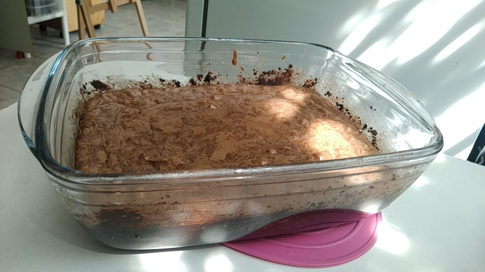
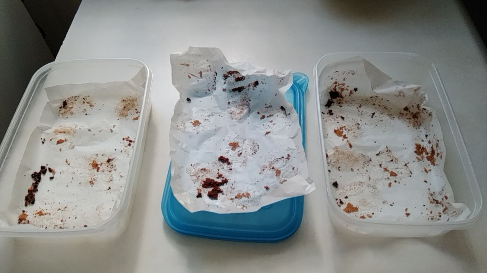

# Fazer Brownie
**nota**: Tive problema com o corte. O resultado ficou entre brownie e cookie. Antes de fazer, leia até o fim.
**nota2**: fiz outras três vezes comentários na seção [comentários](https://github.com/FNakano/CFA/tree/master/projetos/Brownie#coment%C3%A1rios).

## Motivação

- Porque é gostoso;
- Porque descontrair é bom;
- Porque nerd também cozinha (e come).

## Materiais

### Utensíos

Tigelas, espátulas, colheres, medidas (xícara), batedeira.

### Ingredientes 

- 340 gramas de chocolate meio amargo picado
- 9 colheres de manteiga (110 gramas)
- 1 colher de chá de essência de baunilha
- 3 ovos
- 1 xícara de açúcar
- 1 ½ xícara de farinha de trigo
- 1 colher de café de sal
- ~~1 xícara de nozes ou avelãs picadas (opcional)~~ substituí por meia xícara de amendoim torrado, descascado, sem sal picado em pedaços;

[Foto com ingredientes](photo1666281350.jpeg)

## Método

- Derreta o chocolate em banho maria e adicione a margarina e a baunilha.
- Na batedeira, bata os ovos com o açúcar até obter uma mistura fofa.
- Acrescente o chocolate e a farinha de trigo. Misture delicadamente, acrescentando as nozes (ou avelãs). 
- Asse em forno médio (180º graus) por 20 minutos.

Dica: untar a forma com chocolate em pó.

## Resultado

- Porcionar açúcar, farinha e quebrar o amendoim (em metades ainda é grande) [Foto](photo1666282509.jpeg)
- Derreter o chocolate em banho maria e acrescentar a manteiga [Foto](photo1666282835.jpeg)
- Enquanto o chocolate e a manteiga derretem, untar a forma com manteiga e chocolate em pó [Foto](photo1666282993.jpeg)
- Bater os ovos com o açúcar [Animação para ver a consistência](output.gif)
- Pré-aquecer o forno a 180 graus
- Acrescenta chocolate [Foto](photo1666283923.jpeg)
- Acrescenta farinha [Intermediário](photo1666284065.jpeg)  [Final](photo1666284135.jpeg)
- Acrescenta o amendoim quebrado (não mostrado)
- Despeja na forma [Foto](photo1666284393.jpeg)
- Põe no forno [Foto](photo1666284462.jpeg)
- Verifica se formou casquinha [Foto](photo1666285593.jpeg)

### Resultado imprevisto

Não desenformou e, tanto quente quanto depois de esfriar, ficou mole demais para cortar e levantar a fatia. [Foto](msg-691578869-724.jpg)

Acrescentei os seg. passos:

- colocar na geladeira (ficou uma noite, para dar um descanso na cabeça).  [Foto](msg-691578869-722.jpg)
- cortar [Foto](msg-691578869-721.jpg)
- dispor os pedaços em assadeira com distância suficiente para não grudar um pedaço no outro, caso derreta um pouco  [Foto](msg-691578869-720.jpg)
- assar a 200 graus por 17 minutos (15 ficou mole demais, 20, depois de esfriar, vira cookie  [Foto](msg-691578869-719.jpg)

### Outras tentativas

Em uma segunda tentativa fiz com 200 gramas de chocolate de outra marca, substituí a manteiga por margarina e usei uma forma de metal. Passou um pouco do ponto que eu queria (a maior parte ficou parecendo bolo) e o gosto do chocolate não era tão intenso.

Em uma terceira tentativa fiz 1/3 da receita, com 100 gramas de chocolate da mesma outra marca, com a mesma margarina e usei forma de silicone. O fundo queimou um pouco, o miolo ficou na consistência de um creme que derrete na boca (como chocolate em barra).

Na quarta tentativa fiz com 300 gramas de chocolate da mesma outra marca e margarina de outra marca. Forma de alumínio e forma de metal.

## Comentários

A execução foi acompanhada por quem deu a receita, fui recebendo informação adicional.

O meio ficou muito mole para cortar. Devolvi ao forno por uns minutos. Na próxima vez observar o ponto para corte.

Ainda assim, não firmou. Ao corte a massa não escorre, mas é difícil tirar uma fatia, por isso fiz mais uns passos.

No fim, quem comeu gostou e não sobrou.

- Diminuir a quantidade de gordura (de 340 para 200) muda muito a consistência do brownie;
- Trocar de margarina para manteiga faz diferença. Com manteiga, dá para assar duas vezes e fazer cookie, com margarina, a impressão que tenho, é que não dá;
- O tipo de forma é importante - para brownie, forma de metal é melhor. Se a intenção é fazer cookie, o primeiro cozimento pode ser feito em refratário de vidro;
