# Controlar tomada pela internet

## Introdução (parte já foi feita no plano de atividades ou na proposta)

### ~~Contextualização (o que se sabe) e Motivação (por que se quer)~~ feito na proposta

### Revisão Bibliográfica (informação que foi encontrada durante a execução do plano)

#### Conceitos e Terminologia (glossário)

### Organização do relatório

## Objetivos específicos (O geral foi feito no plano de atividades ou na proposta)

## Materiais e Métodos ( quais são os ingredientes e o que fazer com eles para chegar nos resultados)

Lista de materiais

| Nome | Quantidade | link para foto do componente, de fato, utilizado|
| --- | --- | --- |
| Wittyboard | 1 | [centro-esquerda da foto, conectado ao carregador](IMG_20201011_143947403.jpg) | 
| [Relé Shield](../../componentes/atuadores/rele/README.md) | 3 | [três módulos, esquerda das tomadas, com o relé azul](IMG_20201011_143947403.jpg) |
| Fonte 5V (carregador para celular, battery pack ou equivalente) | 1 | [sobre a tomada do alto](IMG_20201011_143947403.jpg) |
| tomada | 4 | [entre os fios verdes](IMG_20201011_143947403.jpg) |
| plugue | 1 | [já conectado ao cabo de par, parte inferior da foto](IMG_20201011_143947403.jpg) |
| chapadur para apoiar montagem | 1 | [chapa perfurada embaixo dos componentes](IMG_20201011_143947403.jpg) |
| cabo de par 1.0mm | 1 | [branco, enrolado, parte inferior da foto](IMG_20201011_143947403.jpg) |
| segmentos 2.5mm^2 | 1 | [verde, acima e abaixo das tomadas](IMG_20201011_143947403.jpg) |
| Conector Sindal | 1 | [embaixo à direita, entre os fios verdes, o cabo de par e as tomadas](IMG_20201011_143947403.jpg) |
| placa de distribuição de energia | 1 | [foto da placa](IMG_20201016_181147909.jpg) | 

 


Ferramentas utilizadas

Ferro de solda, solda, alicates, chaves de fenda e phillips.

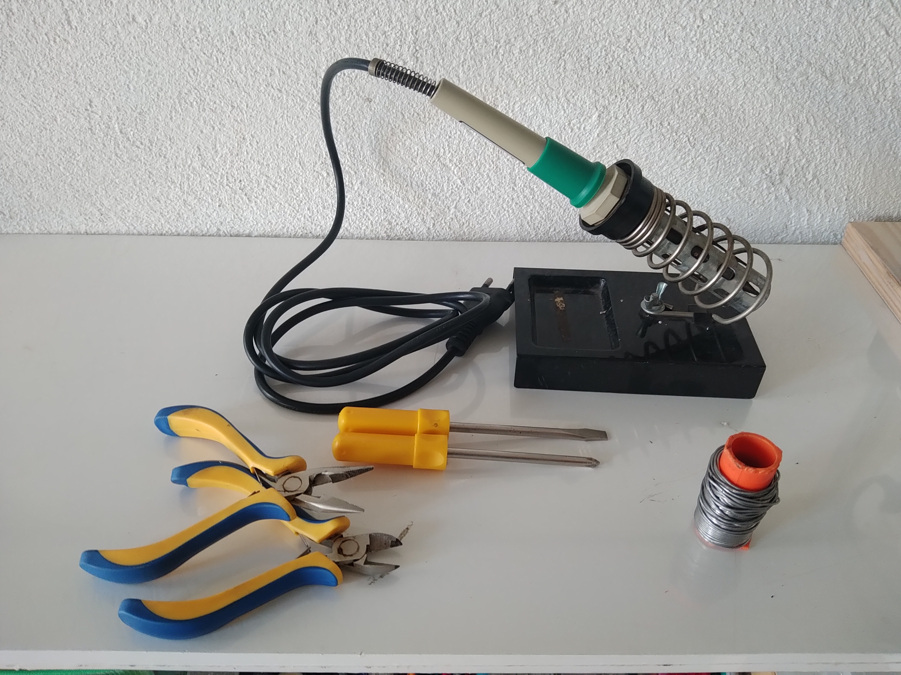

Preparação

- [Instalar Arduino IDE](/programas/arduinoIDE/README.md); <!--- o link absoluto funcionou! --->
    - [Instalar pacote para placa ESP8266](/componentes/controladores/ESP/README.md#configurar-arduinoide-para-programar-o-ESP8266-ou-o-ESP32);
    - [Instalar biblioteca para DHT22](Captura%20de%20tela%20de%202020-10-17%2011-02-52.png);
    - [Instalar biblioteca Blynk](Captura%20de%20tela%20de%202020-10-17%2011-03-19.png);
- [Instalar Blynk no celular](/programas/blynk/README.md);
    - Instalar usando o celular e acessando Play Store no Android ou App Store no iOS.
    - Criar o app no Blynk;
- [Baixar e instalar o programa no ESP8266](blynkTresLEDeDHT22-limpo.ino);
    - Inserir no programa nome e senha da rede local e token do app Blynk;
- Instalar `curl` 
    - no Ubuntu 20.04LTS: `sudo apt install curl`
- Instalar o ambiente de programação (SDK) `Java`
    - No Ubuntu 20.04LTS: `sudo apt install openjdk-11-jdk`

## Resultados e indicadores de avaliação 
(resultados dos testes dos entregáveis)

O sistema entregue compreende, além do dispositivo, programas para desktop e para celular. A comunicação utiliza protocolo HTTP e é intermediada pelo servidor blink-cloud.

No desktop o controle do dispositivo é feito usando [curl](README.md#curl), ou [Java](README.md#java-e-reason). Clicar nos links para detalhes.

No celular foi instalado Blynk e criado o [app](README.md#app-blynk)

O dispositivo é programado usando [Arduino IDE](README.md#programa-arduino). Circuito e construção são apresentados [abaixo](README.md#circuito-e-montagem).

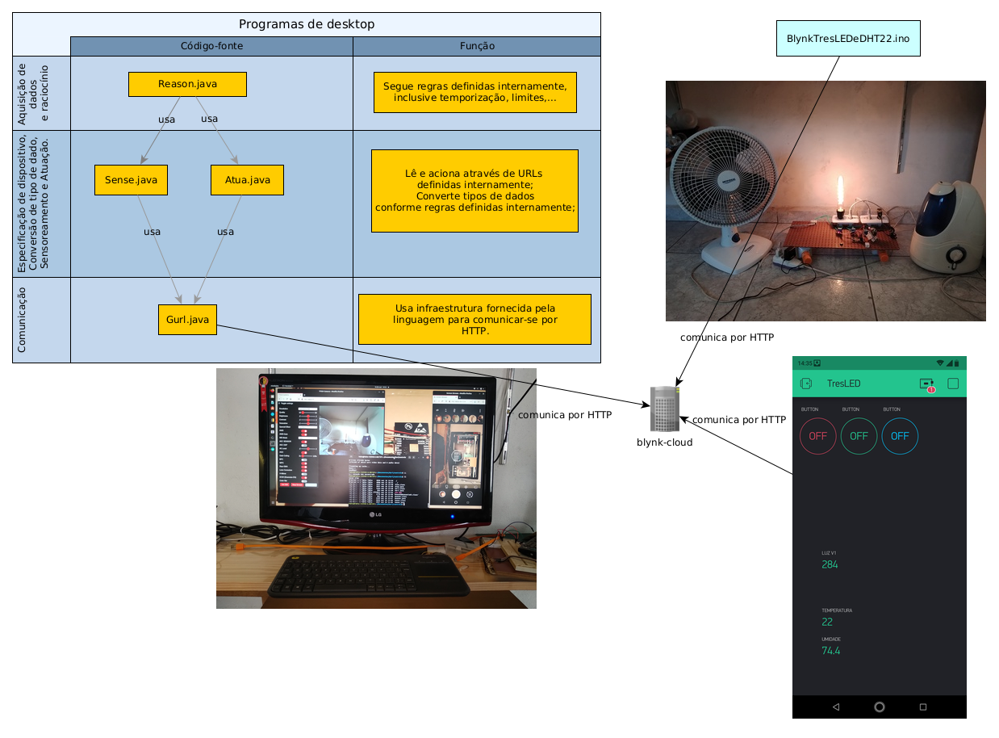

### Entregáveis previstos

- Circuito e montagem;
- Programa Arduino;
- app Blynk;
- curl;

#### Circuito e montagem

| ESP8266 | Outro Componente | obs. |
| --- | --- | --- |
| GPIO12 | Sinal do Relé 1 |  |
| GPIO13 | Sinal do Relé 2 |  |
| GPIO15 | Sinal do Relé 3 |  |
| USB | carregador |  |
| Vcc | placa de distribuição header Vcc |  |
| GND | placa de distribuição header GND |  |
| 3V3 | VCC do DHT22 | 3V3 hackeado do dissipador (TAB) do AMS1117 no verso do ESP8266. |
| GPIO5 | DATA do DHT22 |  |

[Datasheet do AMS1117](http://www.advanced-monolithic.com/pdf/ds1117.pdf)

[Referência de pinagem do DHT22](https://www.baudaeletronica.com.br/sensor-de-temperatura-e-umidade-dht22.html)

| Placa de distribuição | Relé 1 | Relé 2 | Relé 3 |
| --- | --- | ---  | --- |
| header Vcc | + | +  | + |
| header GND | - | -  | - |

A placa de distribuição distribui Vcc e GND para vários componentes. A placa apóia duas fileiras de pinos (dois headers), na foto, uma no fundo, uma na frente. Os pinos em cada fileira são soldados juntos. A energia é fornecida pelo carregador de celular, através do WittyBoard e distribuída. Foi a solução que encontrei quando tentei fazer derivações dos jumpers mas as soldas quebraram.


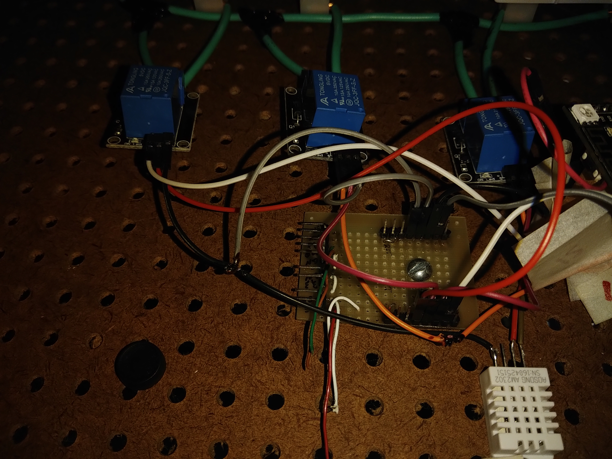

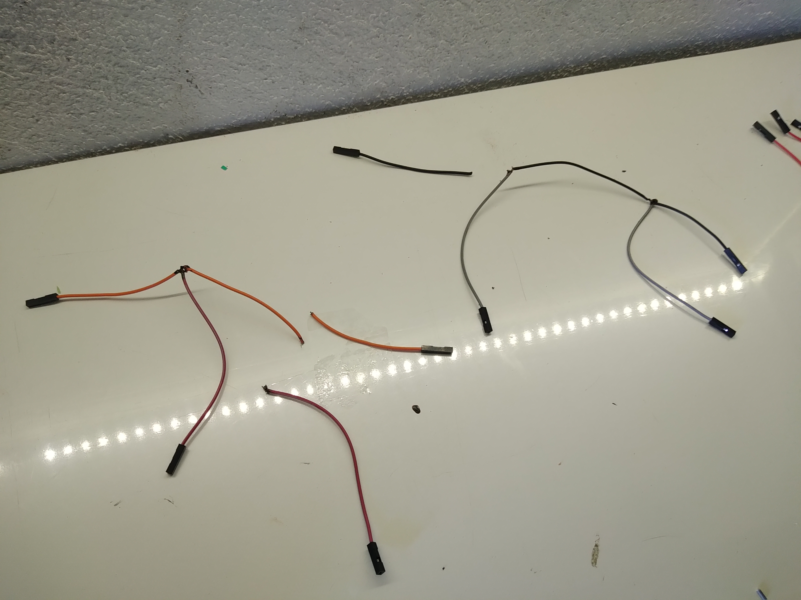

[sobre interconexões](/componentes/interconexoes/README.md)

Conexões com a rede elétrica (CUIDADO! Fazê-las com o plugue desligado e checar para evitar curto-circuitos e conexões estranhas)

| Plugue | Relé 1 | Relé 2 | Relé 3 | Tomada 4 |
| --- | --- | ---  | --- | --- |
| Pino1 | COM | COM  | COM | Contato 1 |
| Pino2 |  |   |  | Contato 2 |

| Tomada 1 | Outro componente |
| --- | --- |
| Contato 1 | Relé1 - NO |
| Contato 2 | Plugue Pino 2 |

| Tomada 2 | Outro componente |
| --- | --- |
| Contato 1 | Relé2 - NO |
| Contato 2 | Plugue Pino 2 |

| Tomada 3 | Outro componente |
| --- | --- |
| Contato 1 | Relé3 - NO |
| Contato 2 | Plugue Pino 2 |

Os circuitos das tomadas 1, 2 e 3 são 'iguais'. As conexões são as mesmas de um circuito com interruptor para acender lâmpada. Os terminais do interruptor são COM e NO de cada relé, as lâmpadas são as tomadas.

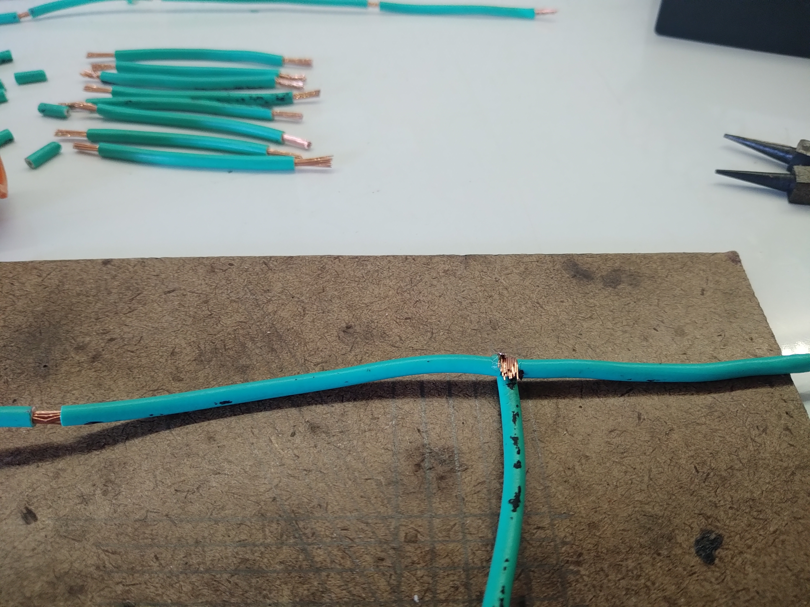
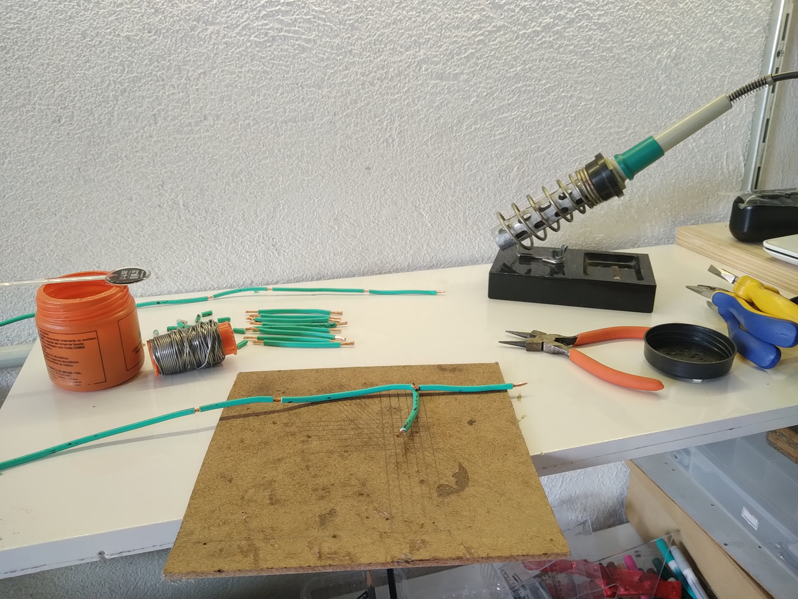
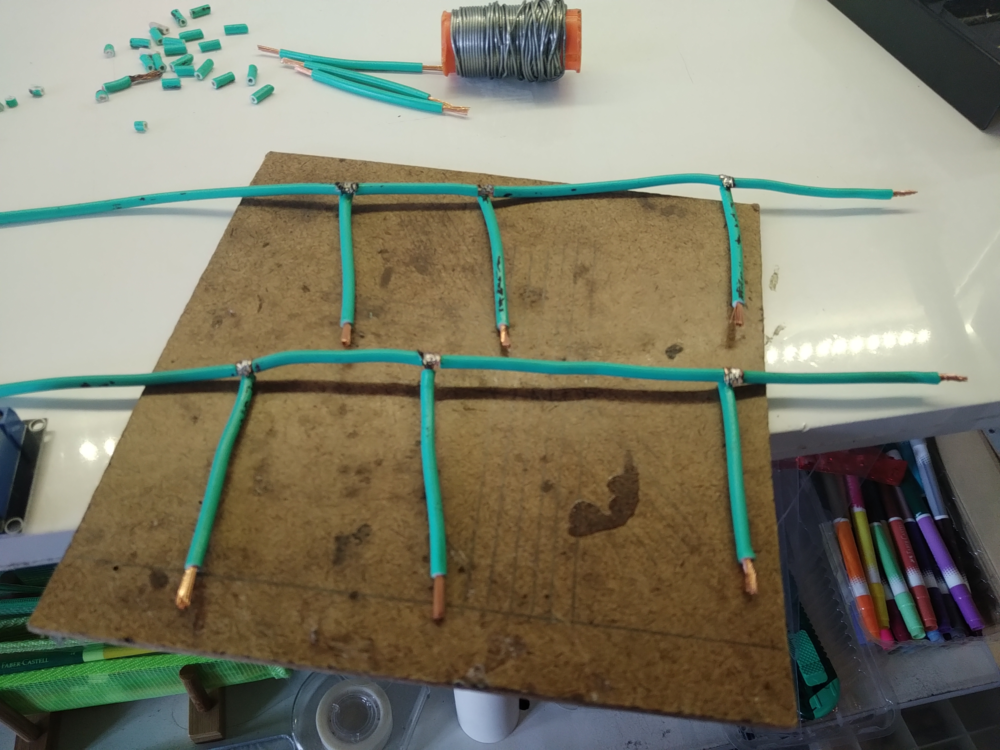
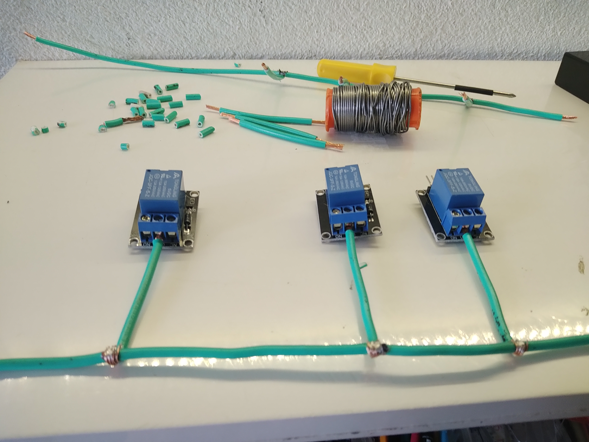
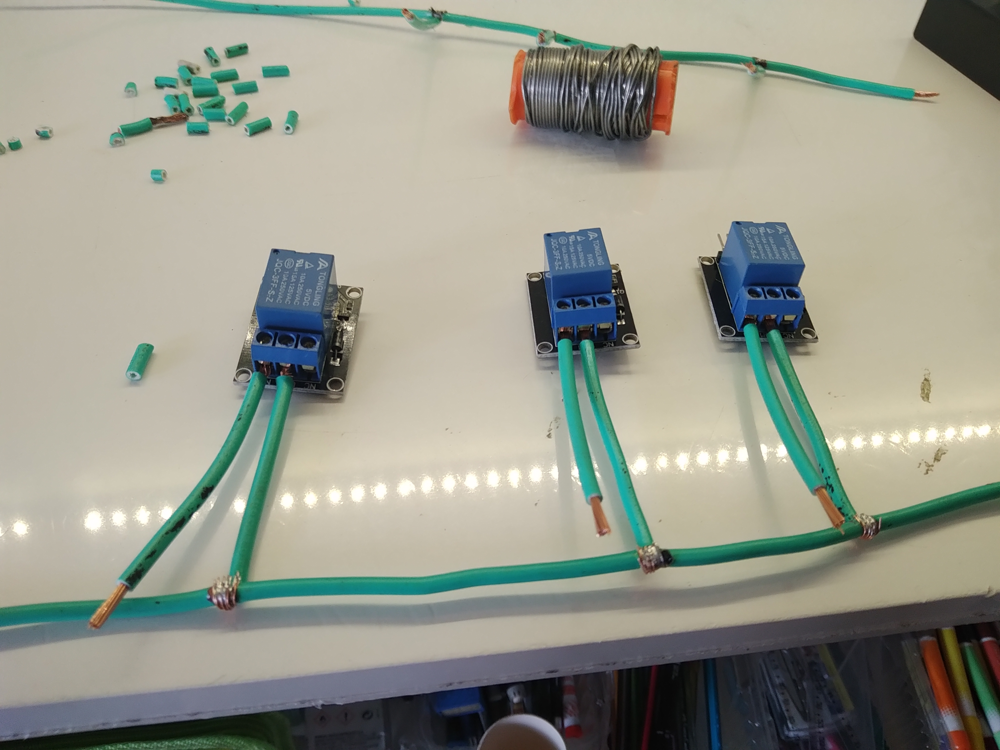
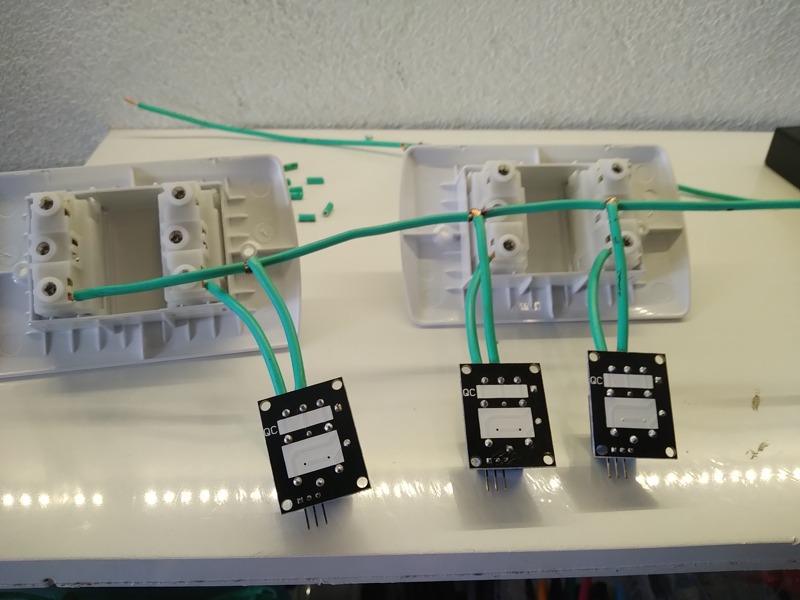
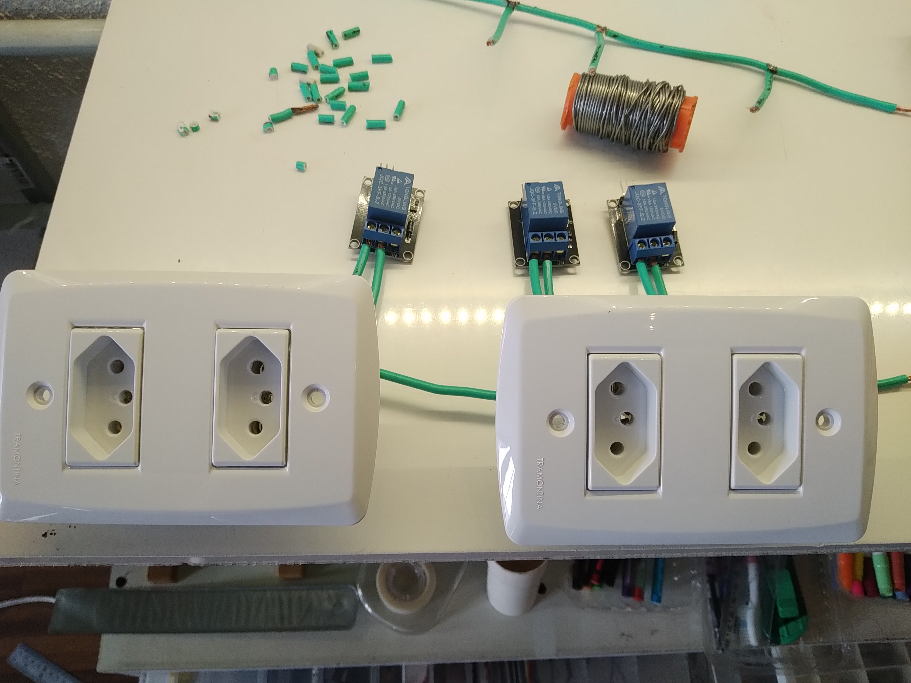
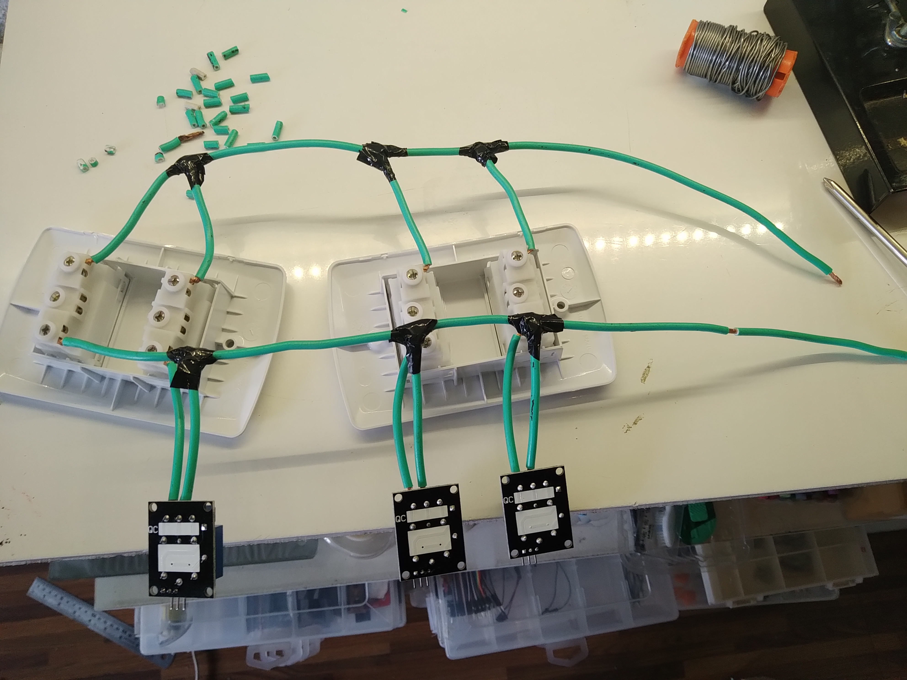
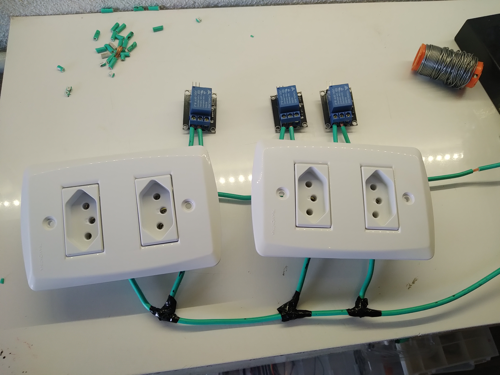

Dispositivo montado:
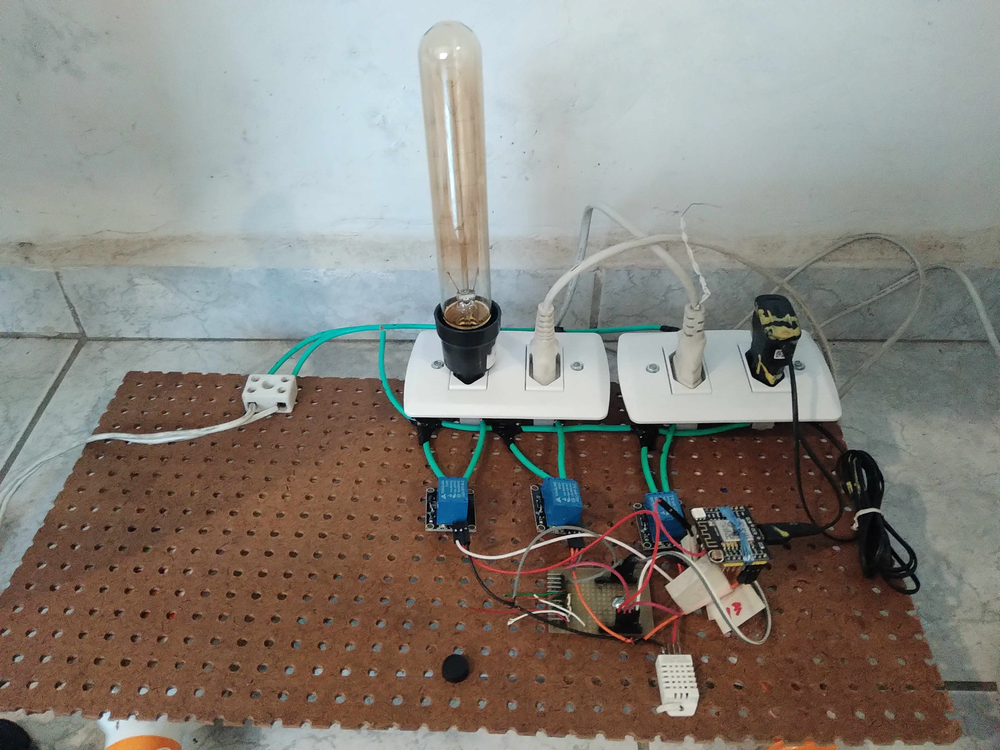


#### Programa Arduino

[Código-fonte](blynkTresLEDeDHT22-limpo.ino)

#### app Blynk

[vídeo com teste usando app Blynk no celular](https://youtu.be/cZgetUtyo48)

#### curl

- ler temperatura `curl -X GET -i http://blynk-cloud.com/blynktokenblynktokenblynktokenbl/get/v6`
- ler umidade `curl -X GET -i http://blynk-cloud.com/blynktokenblynktokenblynktokenbl/get/v5`
- ler luz `curl -X GET -i http://blynk-cloud.com/blynktokenblynktokenblynktokenbl/get/v1` ou `curl -X GET -i http://blynk-cloud.com/blynktokenblynktokenblynktokenbl/get/d17`

O pino `d17` corresponde à entrada analógica do ESP8266. O programa do arduino foi feito para repetir esse valor em `v1` pois `d17` pode não ser atualizado no servidor quando não há `timer.run()`.

- ler estado da saída em que o ventilador está conectado: `curl -X GET -i http://blynk-cloud.com/blynktokenblynktokenblynktokenbl/get/d12`
- ler estado da saída em que o umidificador está conectado: `curl -X GET -i http://blynk-cloud.com/blynktokenblynktokenblynktokenbl/get/d13`
- ler estado da saída em que a lâmpada está conectada: `curl -X GET -i http://blynk-cloud.com/blynktokenblynktokenblynktokenbl/get/d15`

- ligar a saída em que o ventilador está conectado: `curl -X GET -i http://blynk-cloud.com/blynktokenblynktokenblynktokenbl/update/d12?value=1`
- ligar a saída em que o umidificador está conectado: `curl -X GET -i http://blynk-cloud.com/blynktokenblynktokenblynktokenbl/update/d13?value=1`
- ligar a saída em que a lâmpada está conectada: `curl -X GET -i http://blynk-cloud.com/blynktokenblynktokenblynktokenbl/get/update?value=1`

- desligar a saída em que o ventilador está conectado: `curl -X GET -i http://blynk-cloud.com/blynktokenblynktokenblynktokenbl/update/d12?value=0`
- desligar a saída em que o umidificador está conectado: `curl -X GET -i http://blynk-cloud.com/blynktokenblynktokenblynktokenbl/update/d13?value=0`
- desligar a saída em que a lâmpada está conectada: `curl -X GET -i http://blynk-cloud.com/blynktokenblynktokenblynktokenbl/get/update?value=0`

[vídeo com teste usando curl no console do linux](https://youtu.be/jV4n5LRMwzM)

### Entregáveis não previstos (soluções para problemas colaterais)

- Witty Board - descrição e tutorial
- Blynk - descrição e tutorial
    - A entrada analógica do ESP8266, no Blynk, está mapeada no pino d17;
    - Blynk tem alguma questão com o uso da porta analógica padrão e a operação do celular;
- Java e Reason
- Melhorias no protocolo de prototipagem
    - montagem física;
    - tipos de interconexão;
- Melhorias no processo e ferramentas de documentação
    - Reprodução da tela do celular no navegador: <https://play.google.com/store/apps/details?id=info.dvkr.screenstream&hl=pt>

#### Java e Reason

Na organização do sistema entregue, `Reason.java` contém e executa o controle de tempo e regras. No exemplo em particular, apenas o tempo é controlado, com o objetivo de gerar o vídeo de teste.

O teste dura 5 minutos, as ações são tomadas a cada 30 segundos. No primeiro minuto todos os aparelhos estão desligados, no início do segundo minuto, liga-se o umidificador (nota-se aumento no valor da umidade), no início do terceiro minuto desliga-se o umidificador e liga-se a lâmpada (nota-se aumento no valor da luminosidade), no início do quarto minuto liga-se o ventilador e no quinto minuto desligam-se todos os aparelhos.

Os comandos são armazenados em um array:

```java
boolean tasks[][]= {
    // lamp, vent, um
    {false, false, false},
    {false, false, false}, // quinto minuto tudo desligado.
    {true, true, false},
    {true, true, false}, // quarto minuto lâmpada e ventilador
    {true, false, false},
    {true, false, false},  // terceiro minuto só lâmpada
    {false, false, true},
    {false, false, true},  // segundo minuto só umidificador
    {false, false, false},   
    {false, false, false}  // primeiro minuto tudo desligado
};

```

Em `Sense.java` e `Atua.java`, especificam-se os comandos, convertem-se os tipos de dados, para sensores e atuadores, respectivamente.

`Gurl.java` encapsula os detalhes da implementação do envio em HTTP em Java.

[Código-fonte](./JavaEReason)

[Vídeo do teste da tomada conectada no youtube](https://youtu.be/AKbXOdZNY_E).

## Discussão e Conclusão

O uso do Witty Board foi muito conveniente. Como ele tem LEDs e LDR, é possível testar acionamento, medição, e comunicação, de ponta a ponta, com o componente desconectado do restante do circuito.

A grande quantidade de entregáveis colaterais aumenta grandemente o valor do resultado.


## Referências

[proposta do projeto](./proposta.md)

[diário do projeto](./diario.md)

