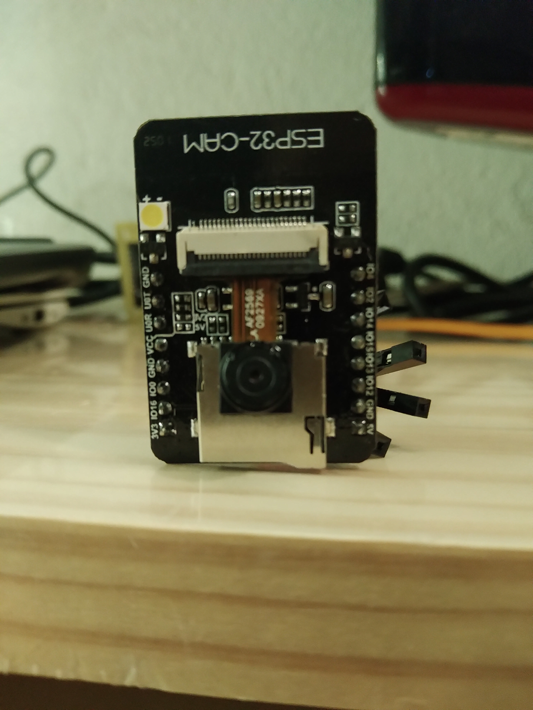
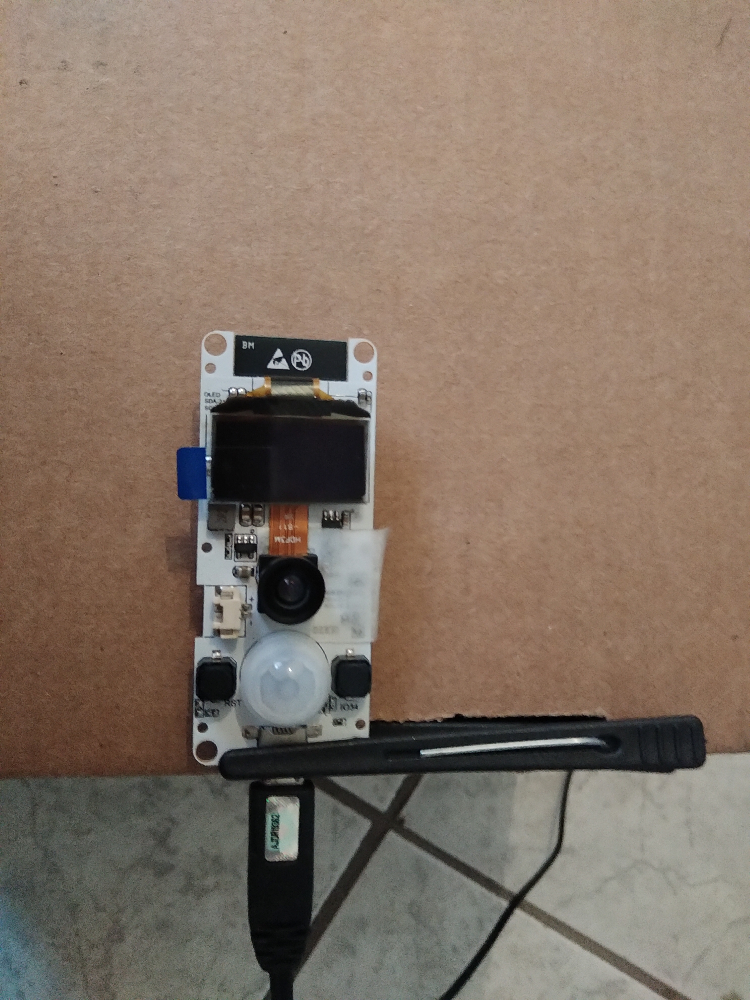
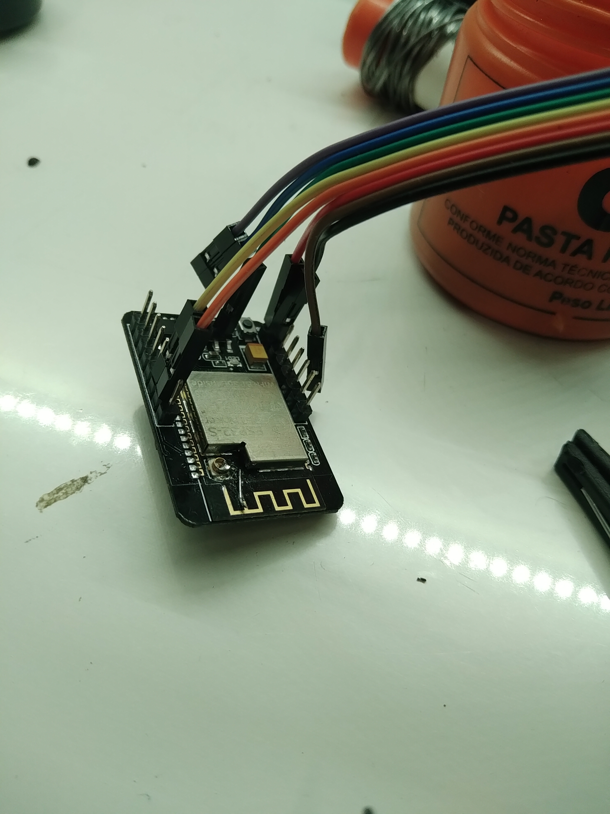

# Título

**nota**: em 2021-09-11 usei este projeto como referência. Senti falta de alguma informação (que está no diário, felizmente). Aproveitei e fiz a revisão deste documento.

## Introdução (parte já foi feita na proposta)

[Proposta](proposta.md)

### Contextualização (o que se sabe) e Motivação (por que se quer)  (desnecessário, se for o mesmo da proposta)

[Proposta](proposta.md)

### Revisão Bibliográfica (informação que foi encontrada durante a execução)

- [Comparativo entre modelos de ESP32 com câmera](https://makeradvisor.com/esp32-camera-cam-boards-review-comparison/)
- [Outro comparativo - este com exemplos de programas](https://github.com/lewisxhe/esp32-camera-series)
- [Revisão do ESP32-CAM](https://makeradvisor.com/esp32-cam-ov2640-camera/)
- [Tutorial em Português para ESP32-CAM (Fernando K.)](https://www.fernandok.com/2019/04/esp32-com-camera-e-reconhecimento-facial.html)
- [Tutorial em Portuguès para TTGO-Camera](https://www.dobitaobyte.com.br/ttgo-t-camera-com-esp32-wrover/)
- [Repositório com exemplo para TTGO-Camera](https://github.com/lewisxhe/esp32-camera-series.git)

#### Conceitos e Terminologia (glossário)
### Organização do relatório (links, please)
## Objetivos (os gerais foram escritos na proposta, os específicos podem ser acrescentados)

Colocar o ESP32-CAM e o TTGO-Camera para funcionar.

## Materiais e Métodos ( quais são os ingredientes e o que fazer com eles para chegar nos resultados)

ESP-CAM



TTGO-Camera



## Resultados e indicadores de avaliação (resultados dos testes dos entregáveis - cada resultado como uma subseção, para facilitar links para o resultado específico)
### Entregáveis previstos (há informação adicional, dependendo do tipo de entregável)

Código-fonte do exemplo que funcionou para ESP-CAM - usei o exemplo que vem com a biblioteca da placa ESP32. A placa que selecionei é ESP-CAM. Para programar, conectar GPIO0 a GND, clicar no upload do programa e resetar o ESP-CAM (apertar o botão de reset), [conforme a referência](https://randomnerdtutorials.com/esp32-cam-ai-thinker-pinout/).

[Código-fonte do programa que usei para ESP-CAM](CameraWebServer-FN)

Para o TTGO-CAM usei [este código](https://github.com/lewisxhe/esp32-camera-series/tree/master/sketch), [desta referência](https://github.com/lewisxhe/esp32-camera-series).

###### <a id="2021-12-03-153820" href="#2021-12-03-153820">2021-12-03-153820</a> 

Com ajuda de JgSeike: para o programa TTGO-CAM compilar, precisa das bibliotecas [OneButton](https://github.com/mathertel/OneButton)
 e [ESP8266 and ESP32 OLED driver for SSD1306 displays](https://github.com/ThingPulse/esp8266-oled-ssd1306)
. Uma busca no gerenciador de bibliotecas deve permitir que sejam identificadas univocamente e instaladas. Os links são os mesmos apresentados no gerenciador de bibliotecas (em *more info*) e são fornecidos aqui para maior detalhamento.


[Código-fonte do exemplo que funcionou para TTGO-CAMERA](TTGO-Camera-FN)

No código do exemplo, ajustar nome da rede e senha.

```c
/***************************************
 *  WiFi
 **************************************/
#define WIFI_SSID   "NOME DA SUA REDE WIFI"
#define WIFI_PASSWD "SENHA DA SUA REDE WIFI"
```

### Entregáveis não previstos (soluções para problemas colaterais)

#### Programação do ESP-CAM

Para enviar programa, conectar GPIO0 a GND, clicar no upload do programa e resetar o ESP-CAM (apertar o botão de reset).

#### Conexão do ESP-CAM à porta USB

O ESP-CAM não tem porta USB (não tem a interface USB-Serial, feita através do chip CH340, CP2102 ou FTDI232). A solução mais frequente é conectar através do FTDI232, que é um módulo separado.

É possível usar a placa de comunicação do WittyBoard (placa de baixo), ou um Arduino UNO, removendo o chip ATMEGA328P e conectando o ESP-CAM - TX com TX e RX com RX, 5V e GND.

#### Intensidade do sinal Wi-Fi

O ESP-CAM que tenho, a cerca de três metros do Access Point, indica intensidade de sinal (RSSI) de -80dBm. Pesquisei e segundo <https://randomnerdtutorials.com/esp32-cam-connect-external-antenna/>, está configurado para usar a antena externa, que não vem no pacote - acredito que a maioria dos ESP-CAM seja configurada desta forma. 

Isto faz o framerate em resolução VGA ser aprox. 1fps.

Foi isto que me fez passar para o TTGO-Camera.

**novidade**: Mudei a conexão da antena. Foi escolha melhor que comprar antena (prazo,tempo), encostar o componente (desperdício), ou jogá-lo no lixo - tive vontade pois nessa mudança de conexão sofri para desconectar o 'jumper' e sofri mais ainda para colocar o fio que serve como jumper para a antena F invertida. Arranquei um pod da PCI. Só valeu a pena porque deu certo. A intensidade do sinal foi de -80 para -60. Agora consegui -50dBm, framerate em VGA de 12fps.




#### mDNS

Em redes com suporte a [mDNS](/componentes/protocolos/Ethernet/README.md#mdns), é possível associar um nome ao IP. No caso deste código, o nome é `esp32-cam.local`. Digitando esse nome na barra de endereços do navegador, se a rede tiver suporte, a página da câmera será mostrada.

[Código-fonte](/projetos/ESP32-CAM/CameraWebServerMDNS-FN)

Dispositivos Android não oferecem suporte para mDNS. Neste caso é necessário acessar por IP. Para saber o IP, fazer ping para a câmera a partir de um computador que tenha acessado a câmera através do nome mDNS.

## Discussão e Conclusão

Na minha opinião, dificultam o uso do ESP-CAM.

- a falta da conexão USB
- a falta de pino de RESET no header
- o posicionamento do botão de reset no lado do header ('costas') da placa.

### Consequências lógicas dos resultados (resultados deduzidos);
### Dificuldades que levaram às soluções colaterais
### Especulações/questionamentos a partir dos resultados (resultados induzidos);
### Desdobramentos possíveis (próximos passos, possibilidades, *spin-offs*);

Fazer vídeos de teste e demonstração como [este](https://youtu.be/AKbXOdZNY_E) do projeto de [tomada conectada](/projetos/ControlarTomadaPelaInternet/README.md). O vídeo no *picture-in-picture* foi feito com TTGO-Camera.

## Referências

[Proposta](proposta.md)

[Diário](diario.md)


