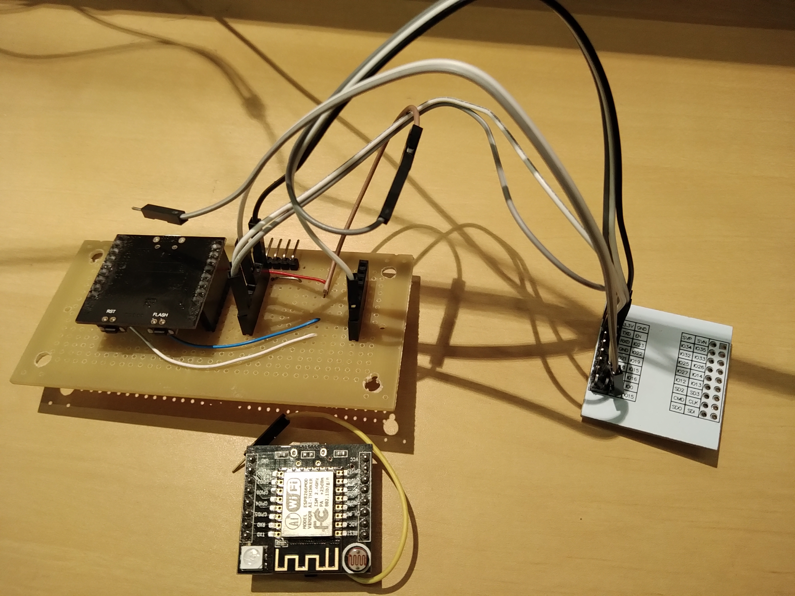

# ESP32 Crossover: Relatório

## Objetivo

Usar a placa de comunicação do Wittyboard com a placa adaptadora para ESP32

## Justificativa, Motivação, Contextualização

Esta é a continuação do trabalho, concluído, documentado em <sobreESP32Crossover.md>. Também está relacionada ao [projeto de confecção de PCB](../PCB/diario.md) - no momento, em andamento.

## Materiais, Despesas e Métodos

### Wittyboard

[Sobre wittyboard neste repositório](../../componentes/controladores/ESP/ESP8266/README.md)

### Placa adaptadora para ESP32

É uma placa de circuito impresso que permite conectar o ESP32 a headers de 100mils (1/10 de polegada).

Lado do ESP32

Lado dos rótulos dos pinos

### ESP32

### Ferramentas

- Garra/Grampo de marceneiro/Prendedor de papel | https://www.kalunga.com.br/prod/prendedor-de-papel-19mm-300219-colorido-easy-office-pt-12-un/374762
- Ferro de solda 30W
- Lima fina para metal ou palha de aço grossa para limpar a ponteira do ferro.
- Solda tipo fio, a mais fina possível, 60% ou mais de estanho, com fluxo 
- Pasta para solda
- Palito de dente, chave de fenda de relojoeiro, para aplicar pequena quantidade de pasta para solda.
- Alicate pequeno de corte 5pol.
- Lupa de aumento 3 vezes ou mais
- Placa adaptadora para Wittyboard (desenvolvimento interno)
- Multímetro
- IDE do Arduino com programador para placa ESP32

## Atividades Realizadas (Método)

### Limpar a ponteira do ferro de solda

Com o ferro de solda desligado e frio, remover resíduos como fluxo queimado (crostas pretas) passando a lima fina suavemente, ou esfregando, sem muito vigor, a palha de aço. O objetivo é remover resíduos sem gastar nem remover o tratamento superficial da ponteira.

Quando for soldar os terminais, ao esquentar o ferro, remova qualquer solda em excesso. Para isso, pode usar malha dessoldadora, ou fio trançado, passar na pasta de solda e passar a ponteira, como se fosse soldar a malha ou o fio. A solda escorre da ponteira e adere à malha/fio. O excesso de solda pode conectar vários terminais do ESP32 juntos, o que não é desejado.

### Posicionar o ESP32 na placa adaptadora

Usar o prendedor de papel, ou o grampo de marceneiro, ou até pregador de roupa para segurar o ESP32 sobre a placa adaptadora.

Olhar o alinhamento dos terminais do ESP32 com os pads da placa adaptadora usando uma lupa. A lupa é altamente recomendada pois a distância entre os terminais é apenas 0.4mm. Tenha cuidado para não ser enganado pelo ângulo de visão - olhe por vários ângulos, dê mais importância à visão perpendicular. Um pouco de paciência e persistência podem ser necessários pois as laterais do ESP32 têm 14 terminais. Aplicar esse tempo num bom alinhamento, na minha opinião, é vantajoso em relação à alternativa: deixar mal alinhado e soldar dois terminais no mesmo pad, por exemplo, com pontes de solda. 

### Passar pasta de solda

A pasta de solda facilita que a solda escorra da ponteira do ferro de solda para o pad e o terminal, unindo-os.

Usando algo com ponta fina e chata (por isso a sugestão da chave de fenda de relojoeiro), pegar um pouco de pasta de solda do pote e passar na parte do pad que não foi coberta pelo terminal do ESP32, e na lateral do terminal do ESP32. 

### Cortar solda

Com o alicate de corte, cortar o fio de solda no menor tamanho possível (isso é da ordem de 0.1mm). É uma lasquinha de solda. Encostando a ponteira nessa lasquinha, esta derrete e forma uma esfera na ponteira. Esta quantidade é suficiente para soldar o terminal.

A quantidade de solda necessária para soldar os terminais aos pads é pequena. Por outro lado, se houver muita solda na ponteira do ferro, mesmo sem pasta de solda, ela escorre e frequentemente conecta vários terminais juntos. Remover uma quantidade de solda tão pequena é possível, com malha para dessoldar (nesse caso o sugador de solda não é muito útil pois a quantidade de solda é muito pequena) MAS, aquecer os terminais e os pads várias vezes acaba arrancando o metal do terminal ou da placa, o que pode inutilizar o terminal.

A afinidade da solda, derretida, pela ponteira é baixa, por isso a solda forma uma esfera na ponta do fio de solda. A quantidade de solda nessa esfera é suficiente para dois ou três terminais. Para controlar melhor a quantidade, com o alicate de corte, cortar o fio de solda no menor tamanho possível (isso é da ordem de 0.1mm). É uma lasquinha de solda. Encostando a ponteira nessa lasquinha, a solda derrete e forma uma esfera na ponteira. Esta quantidade é suficiente para soldar o terminal.

### Soldar

O ideal é que a esfera de solda derretida esteja bem na ponta da ponteira. Isto diminui a chance de encostar em mais de um terminal ou em mais de um pad.

Usando uma lupa para enxergar bem o terminal e o pad, encostar a esfera de solda derretida entre o terminal e o pad, para a solda escorrer e unir os dois.

Depois de soldar todos os terminais do ESP32, soldar os headers.

### Testar por curtos, testar continuidade

Com o multímetro no teste de continuidade (o que faz bip quando as pontas de prova estão encostadas), ligar uma ponta de prova sobre o terminal do ESP32 e ligar a outra ponta

1. no terminal do header em que deve haver conexão (para checar se a solda fez a conexão desejada);
2. no terminal do header ou do ESP32 vizinho ao que se está testando (para checar se não está em curto com os vizinhos);

Em caso de não conexão ou de curto, reaquecer o terminal para tentar eliminar o problema.

Isto pode ser feito 1)a cada terminal soldado ou 2)depois de soldar todos os terminais. 1) é melhor para evitar conexões indesejadas ou conexões desejadas que não foram fechadas, mas demora mais. 2) é mais rápido, mas corrigir problemas pode ser mais trabalhoso.

### Conectar a placa adaptadora montada à placa de comunicação do Wittyboard com AMS1117

| CH340* | ESP32** |
| --- | --- |
| TxD | TxD |
| RxD | RxD |
| REST | EN |
| GPIO0 | IO0 |
| --- | 3,3V |
| GND | GND |

* rótulos dos pinos na placa do ESP8266-12 do wittyboard.
** rótulos dos pinos na placa adaptadora.

Na placa de comunicação faltou o regulador de tensão, conectei um AMS1117.

| CH340* | ESP32** | AMS1117***
| --- | --- | --- |
| TxD | TxD | --- |
| RxD | RxD | --- |
| REST | EN | --- |
| GPIO0 | IO0 | --- |
| --- | 3,3V | 2-Vout ou dissipador |
| GND | GND | 1-Ground |
| VCC | --- | 3-Vin |

* rótulos dos pinos na placa do ESP8266-12 do wittyboard.
*** rótulos segundo [o datasheet](ds1117.pdf).

### Configurações da IDE do Arduino específicas para este trabalho

Conforme documentado na tentativa anterior, usar 115200 como velocidade para upload de programas, ao invés de 921600. Por distração, tentei gravar em 921600 e recebi um erro.

## Resultados e avaliação

Antes de carregar algum programa, apenas conectei o cabo USB e abri o monitor serial, com velocidade de 115200.

Estranhei que ele indicava erro de memória flash e ficasse reiniciando constantemente, mas segui: Tentei transferir o programa 2. [Relógio V1](../RelogioV1/README.md). O resultado foi um erro de gravação, por distração - esqueci de ajustar a velocidade para 115200, estava em 921600:

Arrumei a velocidade de gravação para 115200, o erro mudou:

Busquei pelo erro na internet, [achei um post](https://github.com/espressif/esptool/issues/394) indicando que era um erro de comunicação com a memória flash e que isto pode ser hardware defeituoso. No meu caso, descofiei que tinha alguma solda errada. Testei continuidade com multímetro e achei um curto entre GPIO7 e GPIO6, que são usados para comunicação via SPI com a memória flash. Derretendo a solda de GPIO7 o curto foi eliminado e o ESP32 entrou em funcionamento normal, como pode ser visto no monitor serial.

Então tentei gravar o programa, o que funcionou.

## Discussão e Conclusão

Excesso de solda na ponteira do ferro de solda;
Não cortar a solda
solda em pasta
Remover excesso de solda nos pads
Falta de diagrama ou lista de ligação

Diário comparado a relatório.

Atualização sobre placa de prototipagem para wittyboard

Comparado com ESP8266-12, ESP32 tem sinais de entrada (para modos de programação) mais simples, o que é uma vantagem.
 
## Referências

https://www.14core.com/wiring-and-flashing-programming-esp-32-esp32s-with-usb-ttl-uart/
https://github.com/espressif/esptool/issues/394

# Diário

## 2020-12-22-174944

### Minha cola para relatório sem plano

1. Título
5. Objetivo (O que fazer - pode ser vago, desde que o detalhamento das atividades seja bem feito, pode ser diferente do plano - explicar nos métodos e na discussão | S)
3. Justificativa/Motivação/Contextualização (Por que fazer: Relevância, experiência, conhecimento acumulado, motivação pessoal,... | R)
6. Materiais, Despesas e Métodos (realizados efetivamente)
7. Atividades realizadas (se em equipe, preferencialmente segmentado por membro da equipe | S, M)
    - insumos ( | M)
    - produtos (todos os produtos são resultados mas, talvez, nem todo resultado seja um produto | M)
    - método de transformação de insumo em produto (| S, M)
    - duração ( | T)
    - PROCESSO MÍNIMO PARA CHEGAR AO OBJETIVO.
4. Resultados e avaliação (resultados dos testes dos entregáveis)
    1. Entregáveis previstos
    2. Entregáveis não previstos (soluções para problemas colaterais)
5. Discussão e Conclusão
    1. Houve mudança de objetivo? Explicar
    3. Dificuldades que levaram às soluções colaterais
    1. Consequências lógicas dos resultados (resultados deduzidos);
    2. Especulações/questionamentos a partir dos resultados (resultados induzidos);
    2. Desdobramentos possíveis (próximos passos, possibilidades, *spin-offs*);
6. Referências

