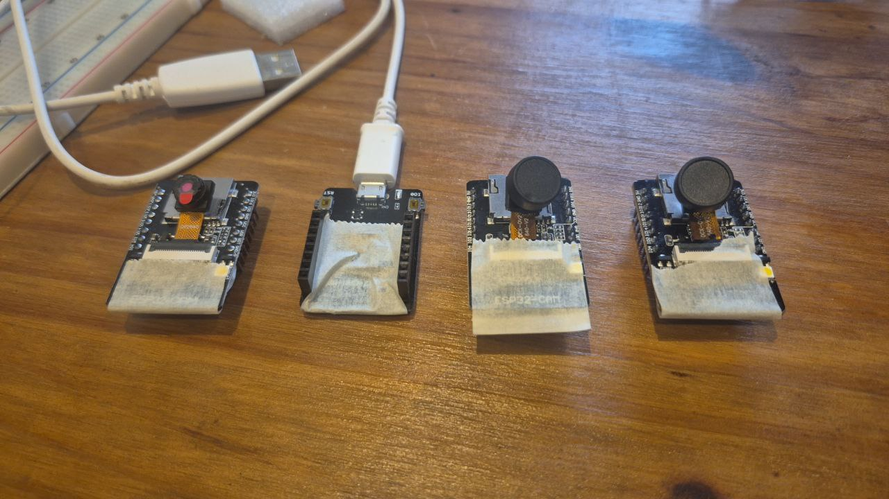
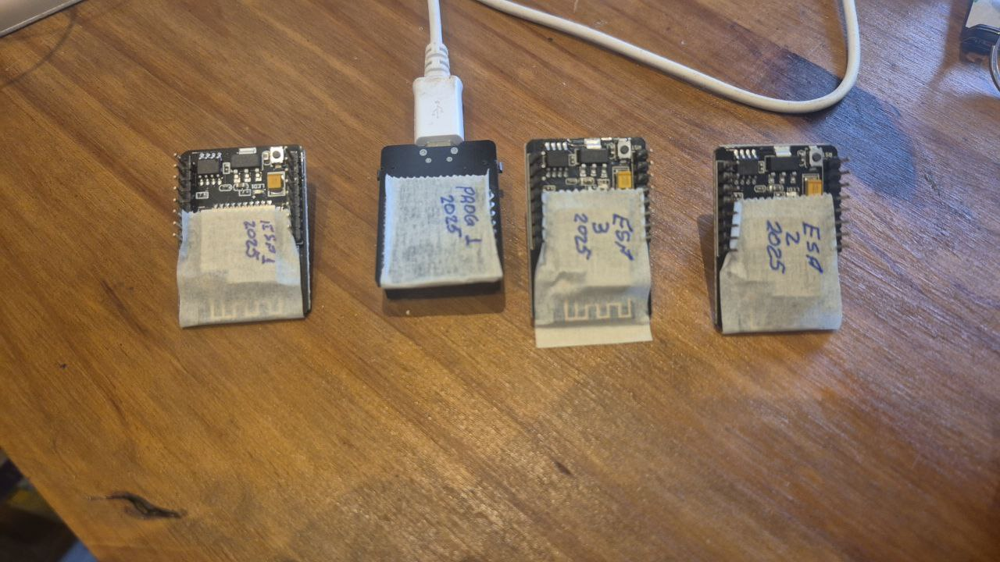
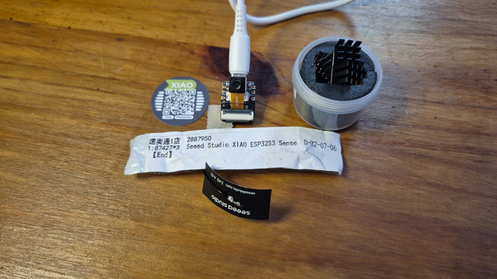

# Inventário de ESP-CAM e modelo novo XIAO ESP32S3 CAM

## ESP-CAM

ESP-CAM é um componente que me toma tempo...

Acho que é pela quantidade de variáveis que precisam ser controladas:

1. *Conexão com FTDI*: Os primeiros que testei usavam FTDI para comunicação. A conexão com FTDI sempre me foi confusa porque as conexões de TX e de RX são cruzadas e, ao que me parece, nem todos os dispositivos e documentações usam essa convenção (ou me falta alguma informação que está na convenção). Por exemplo: numa placa de desenvolvimento com ESP32, no ESP32 há um pino chamado TX e outro chamado RX, no conversor USB há um pino chamado TX e outro chamado RX. Se os dois chips estão soldados na mesma placa conecta-se TX com RX entre eles e está ok. MAS, tome uma placa como Witty Board, em que o ESP está em uma placa e o FTDI em outra placa. Na placa em que o ESP está soldado os pinos estão rotulados TXD e RXD. Na placa em que o FTDI está soldado não tem nenhuma marcação. Neste contexto a pergunta: TX e RX do ESP ou do FTDI? Torna-se relevante.
2. *Energia suficiente*: Há algumas postagens em foruns de pessoas que tentaram usar ESP-CAM e a fonte (uma porta USB de um computador) não era capaz de fornecer energia suficiente. Quando isso acontece o ESP simplesmente desliga, podendo religar *quando der*. O funcionamento fica errático (às vezes faz o que se espera, às vezes não).
3. *Erros na conexão de energia*: A energia, quando fornecida por uma outra fonte (que não um computador), geralmente tem 5V e vem de um carregador USB ou de um powerbank. Se, em alguma ocasião, conectou-se 5V da fonte ao 3.3V do ESP-CAM, algo na placa vai queimar, mas esse erro na conexão passa sem ser percebido. A impressão que se tem é que a placa *simplesmente* pifou.
4. *Sensor de imagem mal conectado*: O conector da fita do sensor tem contatos muito estreitos e inserir a fita no conector requer alguma destreza.
5. *Sensor de imagem queimado*: Sim, isso acontece pois o sensor esquenta muito, mesmo em operação normal. Acontece que ele queima mas só se diagnostica isso depois de eliminar as outras variáveis.
6. *Mau contato no IO0*: O pino IO0 seleciona o modo de boot do ESP. Se estiver HIGH é modo de operação, se estiver LOW é modo de programação. Acontece que se o jumper ficar frouxo no pino o contato fica intermitente o que pode causar falha na programação.
7. *Alguns modelos/firmwares que não precisam da conexão do IO0*: Já passei por isto umas vezes: o ESP entra em modo de programação mesmo sem o jumper em IO0, MAS no upload seguinte precisa tanto do jumper quanto de apertar o botão de reset que tem na placa ESP-CAM (do lado avesso do alojamento microSD, na borda da placa, tem um botão...)

Vou marcar qual ESP-CAM veio com qual placa FTDI e vou identificar cada placa ESC-CAM.

Pelo lado das câmeras :

Pelo lado oposto:

Da esquerda para a direita os rótulos são `ESP 1 2025`, `PROG 1 2025`, `ESP 2 2025`, `ESP 3 2025`. Todos foram programados com o sketch `CameraWebServer-2025-09-10` para conectar ao wifi lab8. O `ESP 1 2025` não precisou ter o botão de reset pressionado para iniciar a carga do programa. Os outros precisaram.

Configurações na IDE (Arduino 1.8.19 com Arduino ESP boards v. 2.0.18-arduino.5:
  
  - Placa: AI Thinker ESP32-CAM
  - PSRAM: None (não testei as alternativas mas esta foi suficiente para testar o Camera Webserver)

O programa está em Arquivo->Exemplos->ESP32->Camera->CameraWebServer

Em `Camerawebserver.ino` ajustar `ssid` e `password`

Em `board_config.h` selecionar o modelo :comentar outros modelos e descomentar `#define CAMERA_MODEL_XIAO_ESP32S3`.

Existem alguns foruns que indicam que é possível usar ESP-CAM com Micropython mas a resolução máxima é cif (400x296) por falta de memória RAM (https://esp32.com/viewtopic.php?t=28293 , https://github.com/lemariva/micropython-camera-driver , https://www.instructables.com/How-to-Use-ESP32-CAM-With-MicroPython/).

Parece que vendedores entregam ESP-CAM com câmeras diferentes de OV2640 e OV5640 e tem que mudar alguma constante no programa para que as imagens sejam transmitidas (https://probots.co.in/technical_data/ESP32-CAM%20Error%20Troubleshooting%20Guide.pdf , https://forum.arduino.cc/t/esp32-cam-without-ov5640/1291227)

Havia uma biblioteca de reconhecimento facial mas ela foi removida (por isso que o sketch que eu usei ano passado, agora, dá erro de compilação) (https://github.com/espressif/arduino-esp32/issues/10881 , https://forum.arduino.cc/t/human-face-detect-mnp01-hpp-no-such-file-or-directory/1334499/2). A solução foi pegar o exemplo novo, configurar o wifi e o tipo de câmera, compilar e upar no ESP...

Existem modelos de ESP que têm mais RAM (é PSRAM) mas não são os modelos mais comuns no Brasil. Esta postagem: https://www.reddit.com/r/esp32/comments/10ikyoq/determining_amount_of_psram_using_esptoolpython/ mostra como saber se o ESP tem ou não PSRAM.

Parece que conseguiram criar um classificador que distingue frutas de outros vegetais (https://mjrobot.org/2022/02/10/esp32-cam-tinyml-image-classification-fruits-vs-veggies/ , https://www.ijeas.org/download_data/IJEAS1111004.pdf)

## XIAO ESP32S3

O QR-Code redirecionou para este site: https://www.seeedstudio.com/xiao-series-page?utm_source=seeed&utm_medium=packaging&utm_campaign=XIAOBox
Nesse site, a página sobre o componente é uma página de venda da loja do fabricante(?): https://www.seeedstudio.com/XIAO-ESP32S3-Sense-p-5639.html
Na página há fotos com as dimensões do componente e abas para detalhes de especificação e para wikis. Nos wikis tem documentação e tutoriais. Segui este: https://dronebotworkshop.com/xiao-esp32s3-sense/ para programar a placa e conseguir o camera webserver funcionando. As configurações na IDE e nos arquivos `Camerawebserver.ino`, `board_config.h` ajudou. Faltou informar que a antena precisa ser conectada, caso contrário o wifi não conecta (o AP fica a 1m da mesa em que montei e mesmo assim, sem antena, não conectou)

*importante*: ficar tentando conectar no wifi (sem conseguir) faz o controlador esquentar bastante - convém evitar essa situação para não exceder a temperatura de operação e queimar o controlador.
 
Configurações na IDE (Arduino 1.8.19 com Arduino ESP boards v. 2.0.18-arduino.5:
  
  - Placa: XIAO_ESP32S3
  - PSRAM: OPI PSRAM

O programa está em Arquivo->Exemplos->ESP32->Camera->CameraWebServer

Em `Camerawebserver.ino` ajustar `ssid` e `password`

Em `board_config.h` selecionar o modelo :comentar outros modelos e descomentar `#define CAMERA_MODEL_XIAO_ESP32S3`.

Tem algo sobre usar este dispositivo em machine learning: https://github.com/Mjrovai/XIAO-ESP32S3-Sense

## Comentários e conclusões

### Na ESP-CAM

 
Acho que estou traumatizado... ESP-CAM é um componente que me toma tempo... precisei me esforçar bastante para começar esta exploração...

- Facilita (bastante) se usar uma placa para comunicação USB ao invés de uma placa FTDI.
- No meu caso, as placas (que comprei há mais tempo) são compatíveis com a placa de comunicação. Só não digo que são iguais porque precisei apertar o botão de reset na placa ESP-CAM para enviar o programa. Na ESP-CAM que veio com o gravador isso não é necessário, o programa é enviado sem precisar apertar o botão físico.
  - Acho que inutilizei uma placa antiga quando interrompi um envio de programa apertando o botão de reset na placa ESP-CAM. Depois que fiz isso novas tentativas de envio falhavam com a mensagem que a memória FLASH não estava sendo gravada. Na hora de enviar o programa pode demorar um pouco do apertar do botão até começar o envio. Então, se apertou uma vez, mesmo que não tenha certeza, espere até o programa dar timeout. Se não enviou, então repita o envio.

### Em  XIAO ESP32S3

- Enquanto não conecta no AP wifi o processador esquenta bastante
- A câmera pode ser desconectada, seja pelo conector entre placas, seja pelo conector da fita da câmera

### Em ambas (ESP-CAM e XIAO ESP32S3)

- Câmera mal conectada geralmente resulta na mensagem `Camera init failed with error 0x106` no monitor serial durante a execução do programa `Camera Web Server`.
