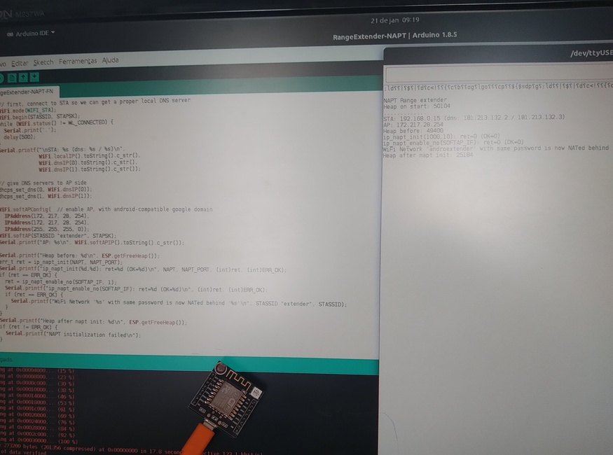
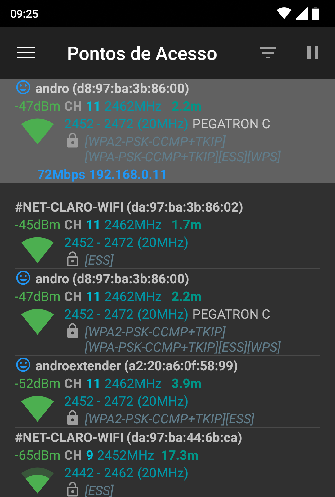

# Extensor Wi-Fi usando Node-8266.

## Introdução

Ultimamente a TV aberta tem mostrado anúncios de operadoras de telefonia e dados mostrando que é possível levar o sinal Wi-Fi até cantos da casa onde o sinal fica muito ruim, mas não mostram o "truque".

É um aparelho, há vários nomes para ele: Extensor, *Wi-Fi range Extender*, Repetidor Wi-Fi. 

Há algumas utilidades, e algumas malandragens (graves), que podem ser feitas quando se sabe fazer um desses. Desta forma, já vou declarando que não me responsabilizo pelo uso que outros possam fazer deste projeto.

A idéia, e o projeto, não são novidades. Seguem outras referências de quem já fez:

- [Instructables - em Inglês](https://www.instructables.com/POWERFUL-Wi-Fi-REPEATER-NODE-MCU/)
- [Do bit ao byte - em Português](https://www.dobitaobyte.com.br/esp8266-wifi-repeater-modo-de-operacao/)
- [Martin Ger, Projeto 1, no github](https://github.com/martin-ger/esp_wifi_repeater)
- [Martin Ger, projeto 2, no github](https://github.com/martin-ger/lwip_nat_arduino)

A anotação do Martin Ger no projeto 2, transcrita abaixo, indica que, em versões recentes do suporte a ESP8266 na IDE do Arduino, há um exemplo de repetidor wifi.

> *** This lib is somewhat obsolete because of the recent update of ESP8266 Arduino https://github.com/esp8266/Arduino. Since release 2.6.0 NAPT/NAT is part of the standard distribution. See also this example: https://github.com/esp8266/Arduino/blob/master/libraries/ESP8266WiFi/examples/RangeExtender-NAPT/RangeExtender-NAPT.ino ***

## Objetivo

Localizar, configurar, compilar, executar, documentar o exemplo de repetidor wifi no exemplo da IDE do Arduino.

## Materiais

- Placa baseada em ESP8266 - usei [Witty board](/componentes/controladores/ESP/ESP8266/README.md#wittyboard). Outras, como Node8266, TTGO8266 devem servir;
- [Arduino IDE](/componentes/controladores/ESP#configurar-arduinoide-para-programar-o-esp8266-ou-o-esp32) - interface de programação.
- Cabo USB para energia e dados, compatível com a placa - usado para conectar a placa ao computador;

## Resultados

### Localizar

Está onde a referência indicou: Na IDE, selecionar a placa `Generic ESP8266` no menu `Ferramentas -> Placas`. Isto apresenta os exemplos para a placa no menu `Arquivo -> Exemplos`. Nesse menu selecionar ` -> ESP8266WiFi -> RangeExtender-NAPT`.

### Configurar

Colocar nome e senha para o ponto de acesso que terá o sinal repetido, substituindo mynetwork pelo nome da rede e mynetworkpassword pela senha da rede. Importante: a rede que estou usando é domiciliar, com autenticação WPA2. 

``` c

// NAPT example released to public domain

#if LWIP_FEATURES && !LWIP_IPV6

#define HAVE_NETDUMP 0

#ifndef STASSID
#define STASSID "mynetwork"
#define STAPSK  "mynetworkpassword"
#endif

```

### Compilar

... na IDE, o botão com figura de *check* compila e envia para o ESP, que deve estar conectado pela USB. Lembre-se de selecionar a porta USB em `Ferramentas -> Porta`.

### Executar

Assim que terminar de transmitir o programa começa a ser executado. No exemplo padrão que usei, ele envia (poucas) mensagens através do monitor serial. A velocidade é 115200 e o tipo é `Nenhum final de linha`. Depois de ajustar velocidade e tipo, aperte o botão de reset do ESP. Ele escreve as mensagens quando reinicia.

IDE, monitor serial


IDE, monitor serial e hardware (wittyboard).



extendedandro é o nome da rede do extensor.




