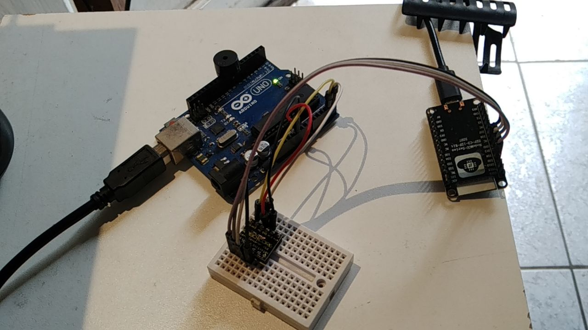

# Comunicação bidirecional entre ESP32 e Arduino através de I2C.
**em construção**

## Motivação

Há projetos em que é conveniente dividir a equipe de desenvolvimento de maneira que cada uma se concentre em objetivos mais simples e, em uma etapa seguinte, com pouco esforço, as partes possam ser *juntadas*.

Essa estratégia de divisão pode ser usada de maneira criativa para, por exemplo, possibilitar o uso de ferramentas (ambientes de desenvolvimento), dispositivos e objetivos *muito* diferentes, permitir uma melhor organização administrativa do grupo, aumentar a produtividade do grupo, ...

É incontestável o sucesso da plataforma Arduino, em especial o UNO e o MEGA, em robótica educacional, ensino de linguagens de programação, programação *low/no-code* (Ardublock, Scratch for Arduino) e sua popularidade na *comunidade maker* (Lab de Garagem, Garoa Hacker Club, Instructables, Sparkfun, Adafruit).

Por outro lado, os Arduino mais populares, em termos de difusão e preço, não contemplam funcionalidades como Wi-Fi, Bluetooth e têm pouca memória e capacidade de processamento.

Outro microcontrolador, popular por seu baixo custo e funcionalidade, mas que apresenta dificuldades de uso, é o ESP32. Este tem Wi-Fi, Bluetooth, capacidade de processamento e memória suficientes para lidar com *Transport Layer Security (TLS)*, que estão nos fundamentos de HTTPS e de SSH. Entre as dificuldades: *crashes* inesperados, enorme quantidade de variações, dificuldade em encontrar a documentação mais adequada para a versão que se tem, *bugs* em bibliotecas, ...

Aproveitar as qualidades e minimizar o impacto dos defeitos de cada plataforma pode ser obtido através do uso combinado. Para isso, é necessária comunicação entre Arduino (AtMega328) e ESP32. Este é o objetivo deste projeto.

## Fundamentos

Arduino (AtMega328) é um microcontrolador que opera a 5V, ESP32 é um microcontrolador que opera a 3,3V. Em primeira abordagem, esta diferença implica que a tensão que representa o bit UM é diferente entre os microcontroladores. Segundo https://ww1.microchip.com/downloads/en/DeviceDoc/Atmel-7810-Automotive-Microcontrollers-ATmega328P_Datasheet.pdf, o AtMega aceita em um pino de entrada, como nível UM, tensões entre 0.6Vcc e Vcc+0.5V (há detalhes omitidos). Uma saída do ESP32 fornece 3,3V, o que estaria OK. Desta forma, está dentro da especificação se a comunicação for unilateral, com o ESP32 enviando dados para o Arduino. No caso em que o Arduino envia dados para o ESP32, o ESP32 aceita em uma entrada Vcc+0,3V (https://www.espressif.com/sites/default/files/documentation/esp32_datasheet_en.pdf). Este valor é bem abaixo dos 5V do Arduino. A consequência é a injeção (excessiva) de corrente na entrada do ESP32, o que será, momentaneamente, desviado para a linha de alimentação do chip (o chip tem proteção para sobretensão), mas, causará aquecimento do componente. Submeter o componente a essa condição continuamente, acabará danificando (queimando) o componente. A solução para essa situação é a colocação de um componente que converte os níveis lógicos, componente conhecido como *level converter* ou *level shifter* (https://learn.sparkfun.com/tutorials/bi-directional-logic-level-converter-hookup-guide/all). **nota**: este componente não permite ligar um LED pois este necessita de muita corrente (miliampéres). O *level shifter* é capaz de fornecer da ordem de centena de microampére. Isto resolve o acoplamento elétrico (ISO/OSI camada 1).

O *level shifter* tem um lado para "alta tensão" (HV) e um lado para "baixa tensão" (LV). No caso, HV= 5V e LV= 3,3V. O modelo citado converte até 4 sinais, enumerados de 1 a 4.

A fim de resolver o enlace (troca) de dados (ISO/OSI camada 2), pela especificação dos componentes, ATMega328 tem hardware especializado para Serial (UART), I2C e SPI, sendo que tem apenas uma serial e esta é usada para programação através do IDE, logo, usar serial parece não ser boa alternativa. I2C é um protocolo a dois fios, SPI é um protocolo a três+ fios. Nenhum dos dois é usado destarte pelo Arduino. Pelo atributo da quantidade de fios, I2C parece ser mais conveniente. O ESP32 tem, grosso modo, as mesmas características (as minúcias dependem do modelo).

I2C é um protocolo a dois fios, denominados SCL e SDA (será importante para montagem do circuito), projetado para uso em barramento (neste ponto, similar ao Ethernet). Cada dispositivo no barramento precisa ter um endereço de 7 bits (logo, um barramento pode ter até 127 dispositivos). A comuniçação é feita por troca de mensagens, as mensagens têm 8 bits. Isto contempla a camada de rede (ISO/OSI camada 3).

I2C *puro* não implementa conceitos como conexão, requisição/resposta, retransmissão, que são implementados na camada de transporte e acima (ISO/OSI camada 4 e acima).

Referência para I2C: https://www.circuitbasics.com/basics-of-the-i2c-communication-protocol/

Referência para modelo OSI: https://en.wikipedia.org/wiki/OSI_model

No Arduino UNO, o pino A4 é SDA e o pino A5 é SCL (https://www.arduino.cc/reference/en/language/functions/communication/wire/).

No ESP32 (especificamente usei um ESP32-C3 com Micropython), em tese, qualquer pino pode ser SDA ou SCL, mas o mais comum (e que funcionou neste caso) é GPIO 8 é SDA, GPIO 9 é SCL (https://esp32.com/viewtopic.php?t=22655).
  
## Implementação

### Circuito

| Arduino | Level Shifter HV |
| --- | --- |
| A4(SDA) | HV1 |
| A5(SCL) | HV2 |
| VCC(5V) | HV |
| GND | GND |

| Level Shifter LV | ESP32 |
| --- | --- |
| LV1 | GPIO8(SDA) |
| LV2 | GPIO9(SCL) |
| LV | 3.3V |
| GND | GND |

### Programas

#### Arduino

adaptado de: https://docs.arduino.cc/tutorials/nano-33-ble-sense/i2c

```c
#include <Wire.h>

// https://docs.arduino.cc/tutorials/nano-33-ble-sense/i2c
// caso não encontre Wire.h, baixar IDE de arduino.cc e (re)instalar (o pacote que vem com Ubuntu22.04 não detecta bibliotecas pré-instaladas, como Wire.)

void receiveEvent(int howMany) {
   char c = Wire.read(); // receive a character
   if(c == '0'){
     digitalWrite(LED_BUILTIN, LOW);   // turn the LED off by making the voltage LOW
   }
   if(c == '1'){
     digitalWrite(LED_BUILTIN, HIGH);  // turn the LED on (HIGH is the voltage level)
   }
}
void setup() {
  Wire.begin(8);                // join i2c bus with address #8
  Wire.onReceive(receiveEvent); // function that executes whenever data is received from writer
}

void loop () {
}

```

#### ESP32

adaptado de: https://docs.micropython.org/en/latest/library/machine.I2C.html

```python
# Exemplo de https://docs.micropython.org/en/latest/library/machine.I2C.html
# adaptado para comunicar com arduino UNO

from machine import I2C

i2c = I2C(scl=Pin(8), sda=Pin(9), freq=100000)          # create I2C peripheral at frequency of 100kHz (https://www.arduino.cc/reference/en/language/functions/communication/wire/)
                                # depending on the port, extra parameters may be required
                                # to select the peripheral and/or pins to use

i2c.scan()                      # scan for peripherals, returning a list of 7-bit addresses
i2c.writeto(8,'1')
i2c.writeto(8,'0')
```

#### Explicação

A comunicação é bidirecional porque `i2c.scan` faz o ESP32 enviar um comando que é respondido pelo Arduino.

Request-response está além do escopo do protocolo I2C, mas é implementado no Arduino. A API do Arduino (https://www.arduino.cc/reference/en/language/functions/communication/wire/, https://www.arduino.cc/reference/en/language/functions/communication/wire/requestfrom/, https://www.arduino.cc/reference/en/language/functions/communication/wire/onrequest/) implementa as funções `requestFrom()` e `onRequest()`, mas a API do ESP32 não implementa (https://docs.micropython.org/en/latest/library/machine.I2C.html). 

#### Resultado




#### Próximos passos

Estudar o código-fonte de `requestFrom()` e de `onRequest()` para implementar funcionamento equivalente no ESP32 (https://forum.arduino.cc/t/understanding-wire-requestfrom-timing/152773, https://forum.arduino.cc/t/avoid-wire-requestfrom-in-program/872436).


