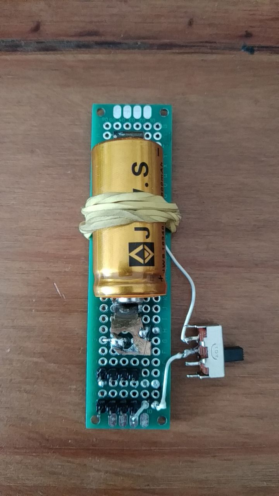

# Plataforma de teste

veja também: https://github.com/FNakano/CFA/tree/master/projetos/Teste3V6

Após alguns anos acompanhando o desenvolvimento do ESP32, de ferramentas para ele e usando-o em projetos, uma plataforma de hardware baseada em ESP32 para a construção de dispositivos para aplicações que julgo interessantes tornou-se suficientemente clara.

É desejável que a plataforma:
- seja **programável sem o uso de fios**; 
- possa **funcionar sem conexão com um computador** (por exemplo conexão USB para energia e dados);
- seja toda montada em uma única placa/caixa;

A construção mínima convém ter pilha ou bateria recarregável e um display (tela) para mostrar mensagens.

## Construção física

## Unidade de suprimento de energia

### Protótipo 

Para desenvolver protótipos da unidade de suprimento de energia, convém que o protótipo possa ser usado com diferentes controladores, permitir a recarga da bateria e a conexão do cabo de dados. No protótipo da foto a bateria pode ser removida para recarga e a chave desconecta a bateria do restante do circuito o que permite a conexão do cabo de dados. Os modelos de placas com ESP32 testados são MH-ET Live ESP32 Minikit (https://github.com/FNakano/CFA/tree/master/projetos/Teste3V6) e ESP32-C3 super mini (https://github.com/FNakano/CFA/tree/master/componentes/controladores/ESP/ESP32#esp32-c3-super-mini)

A escolha dessas placas se deve ao regulador de tensão usado nelas. O ESP32 Dev Kit mais comum não funciona, por falta de energia, se ligado da forma como fiz. Mais informação em https://github.com/FNakano/CFA/tree/master/projetos/Teste3V6#justificativa

#### Lista de materiais

- Uma tomada velha (para desmontar);
- Uma chave (foi usado o modelo deslizante de um polo);
- Uma placa padrão 2x7
- Fios, ferro de solda, headers.

#### Montagem

- Retirar as molas (contatos) da tomada (no caso, desrosquear os parafusos). Elas serão usadas para conectar a bateria;
- Usar uma mola para o polo positivo da bateria, outra mola para o polo negativo da bateria [Foto](./4974620333172698295.jpg).
  - No modelo de tomada usado há duas molas por parafuso, separá-las cortando a chapa com um alicate de corte [Foto](./4974620333172698296.jpg);
  - Soldar uma mola perto da extremidade da placa, definir a posição da outra mola usando a pilha como base - procurar uma posição em que a força seja suficiente para manter o contado das molas com a bateria mas não grande demais a ponto de arquear a placa ou forçar as soldas;
  - Soldar um fio em uma das molas (digamos, a que se conecta ao positivo da bateria), soldar a outra ponta do fio a um dos contatos do interruptor, soldar outro fio ao outro contato do interruptor, soldar a outra ponta do fio ao header;
    - no caso, foram usados quatro pinos para essa conexão. Isto permite ligar a placa microcontroladora, o display e mais dois dispositivos;
  - Soldar outro fio na outra mola (digamos, a que se conecta ao negativo da bateria), soldar a outra ponta do fio ao outro header;
    - no caso, também foram usados quatro pinos para essa conexão. Isto permite ligar a placa microcontroladora, o display e mais dois dispositivos;

### Programas

- Micropython
- driver para display SSD1306
- `main.py`
