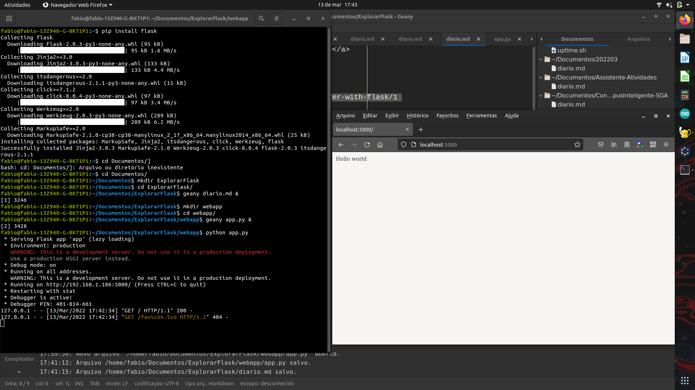

# Programando ESP32 em Python.

## Motivação

- Explorar outras formas de programar o ESP.
- Python costuma ser mais fácil de aprender que C
   - diminui o esforço para aprender. Meu interesse é que pessoas com outras formações possam programar
- Dispensa IDE do Arduino
   - requer algum programa de comunicação como `PuTTy`, `minicom` ou `picocom`

## Objetivo

Criar cliente e servidor web usando variações de Python.

O ESP32 executa um cliente web escrito em (Micro)Python, que se comunica com 

## Procedimento

Começaremos instalando e testando o servidor em um Desktop, depois instalando o cliente no ESP32 e, por fim, testando juntos cliente e servidor.


### Instalar Flask no Desktop

Referência: https://projects.raspberrypi.org/en/projects/python-web-server-with-flask/1

A referência serviu-me muito bem.

No meu Desktop uso Ubuntu 20.04LTS. Nesta distribuição, Python já vem instalado e tanto `python` quanto `python3` são a mesma coisa (em distribuições mais antigas, o primeiro referia-se a Python 2.X e o segundo a Python 3.X). Desta forma instalar Flask é feito com:

```
pip install flask
```

### *Levantar* um servidor web *muito* simples

Captura de tela:



Ainda segundo a referência, criar um diretório para armazenar os arquivos do site e, dentro do diretório, criar um subdiretório `webapp` onde o código-fonte do servidor será armazenado.

No diretório `webapp`, criar o arquivo `app.py` contendo o código listado abaixo (copiar, colar, salvar):

```python
from flask import Flask

app = Flask(__name__)

@app.route('/')
def index():
    return 'Hello world'

if __name__ == '__main__':
    app.run(debug=True, host='0.0.0.0')
```

Este código cria um servidor web que, quando tiver acessada a página inicial `\`, retorna `Hello world`.

Executar `app.py` com a linha de comando:

```
python app.py
```

O programa inicia e ocupa o terminal, como mostrado na captura de tela no terminal da esquerda.

### Testar o servidor no próprio PC

O teste pode ser feito com o navegador. Abra o navegador e navegue para (digite o endereço na barra de endereço): `http://localhost:5000`. O navegador deve mostrar `Hello world`, como mostrado na captura de tela.


### Instalar MicroPython no ESP32

### Programar o ESP32

#### Teste simples: Controlar o LED embutido

#### Conectar com (Ponto de Acesso) Wi-Fi


#### Testar como cliente Web

##### HTTP GET

##### HTTP POST


## Discussão

Não existe Flask para MicroPython

`urequests` e `requests` têm incompatibilidades.
