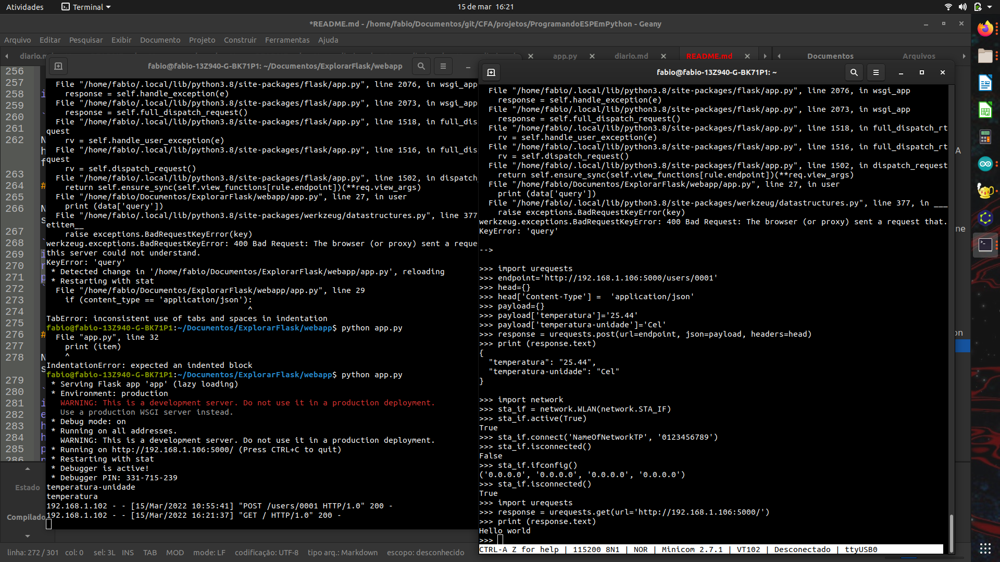
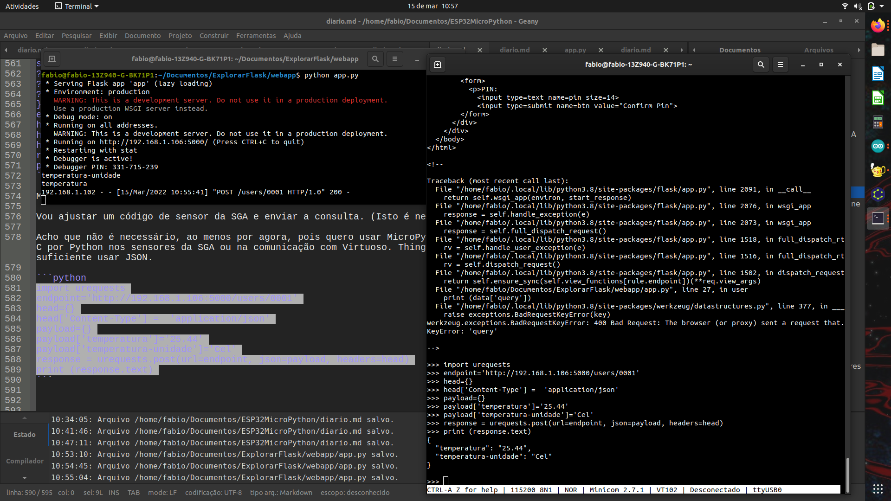

# Programando ESP32 em Python.

## Motivação

- Explorar outras formas de programar o ESP.
- Python costuma ser mais fácil de aprender que C
   - diminui o esforço para aprender. Meu interesse é que pessoas com outras formações possam programar
- Dispensa IDE do Arduino
   - requer algum programa de comunicação como `PuTTy`, `minicom` ou `picocom`

## Objetivo

Criar cliente e servidor web usando variações de Python.

O ESP32 executa um cliente web escrito em (Micro)Python, que se comunica com 

## Procedimento

Começaremos instalando e testando o servidor em um Desktop, depois instalando o cliente no ESP32 e, por fim, testando juntos cliente e servidor.


### Instalar Flask no Desktop

Referência: https://projects.raspberrypi.org/en/projects/python-web-server-with-flask/1

A referência serviu-me muito bem.

No meu Desktop uso Ubuntu 20.04LTS. Nesta distribuição, Python já vem instalado e tanto `python` quanto `python3` são a mesma coisa (em distribuições mais antigas, o primeiro referia-se a Python 2.X e o segundo a Python 3.X). Desta forma instalar Flask é feito com:

```
pip install flask
```

### *Levantar* um servidor web *muito* simples

Captura de tela:


Ainda segundo a referência, criar um diretório para armazenar os arquivos do site e, dentro do diretório, criar um subdiretório `webapp` onde o código-fonte do servidor será armazenado.

No diretório `webapp`, criar o arquivo `app.py` contendo o código listado abaixo (copiar, colar, salvar):

```python
from flask import Flask

app = Flask(__name__)

@app.route('/')
def index():
    return 'Hello world'

if __name__ == '__main__':
    app.run(debug=True, host='0.0.0.0')
```

Este código cria um servidor web que, quando tiver acessada a página inicial `\`, retorna `Hello world`.

Executar `app.py` com a linha de comando:

```
python app.py
```

O programa inicia e ocupa o terminal, como mostrado na captura de tela no terminal da esquerda.

### Testar o servidor no próprio PC

O teste pode ser feito com o navegador. Abra o navegador e navegue para (digite o endereço na barra de endereço): `http://localhost:5000`. O navegador deve mostrar `Hello world`, como mostrado na captura de tela, lado direito da metade para baixo.


### Instalar MicroPython no ESP32

Segui as instruções de: https://docs.micropython.org/en/latest/esp32/tutorial/intro.html

Python é uma linguagem em que é possível digitar os comandos em uma janela e tê-los executados (tecnicamente, é uma linguagem intepretada). Isto significa, entre outras coisas, que a janela que aceita comandos em Python está executando um programa que interpreta e executa esses comandos (chamaremos *interpretador*). O ESP32 deve receber e executar este *interpretador*.

O envio do interpretador (ou, se preferir, a gravação do interpretador na memória (FLASH) do ESP32) é feito através do programa `esptool.py`, executado no Desktop. Para instalá-lo no Desktop use, na linha de comando:

```
pip install esptool
```

O interpretador (tecnicamente, a imagem do programa em disco), o que, na referência é chamado *firmware*, pode ser baixado de https://micropython.org/download/esp32/. Geralmente é suficiente baixar o arquivo (imagem) mais recente.

Com o ESP32 conectado à porta USB do Desktop, verifique como acessar a porta. Dependendo do SO do Desktop ela é acessada com um nome diferente. No Ubuntu costuma ser `/dev/ttyUSB0`

Use o comando:

```
esptool.py --port /dev/ttyUSB0 erase_flash
```

para apagar o conteúdo da memória FLASH do ESP32 e

```
esptool.py --chip esp32 --port /dev/ttyUSB0 write_flash -z 0x1000 esp32-20220117-v1.18.bin
```

para enviar o interpretador para o ESP32. **nota**: trocando `esp32-20220117-v1.18.bin` pelo nome do arquivo que baixou de https://micropython.org/download/esp32/

Resultado da instalação do interpretador no ESP32:

<pre><font color="#859900"><b>fabio@fabio-13Z940-G-BK71P1</b></font>:<font color="#268BD2"><b>~/Documentos/ESP32MicroPython</b></font>$ ls /dev/tty
tty        tty18      tty28      tty38      tty48      tty58      ttyS0      ttyS19     ttyS29
tty0       tty19      tty29      tty39      tty49      tty59      ttyS1      ttyS2      ttyS3
tty1       tty2       tty3       tty4       tty5       tty6       ttyS10     ttyS20     ttyS30
tty10      tty20      tty30      tty40      tty50      tty60      ttyS11     ttyS21     ttyS31
tty11      tty21      tty31      tty41      tty51      tty61      ttyS12     ttyS22     ttyS4
tty12      tty22      tty32      tty42      tty52      tty62      ttyS13     ttyS23     ttyS5
tty13      tty23      tty33      tty43      tty53      tty63      ttyS14     ttyS24     ttyS6
tty14      tty24      tty34      tty44      tty54      tty7       ttyS15     ttyS25     ttyS7
tty15      tty25      tty35      tty45      tty55      tty8       ttyS16     ttyS26     ttyS8
tty16      tty26      tty36      tty46      tty56      tty9       ttyS17     ttyS27     ttyS9
tty17      tty27      tty37      tty47      tty57      ttyprintk  ttyS18     ttyS28     ttyUSB0
<font color="#859900"><b>fabio@fabio-13Z940-G-BK71P1</b></font>:<font color="#268BD2"><b>~/Documentos/ESP32MicroPython</b></font>$ esptool.py --chip esp32 --port /dev/ttyUSB0 erase_flash
esptool.py v3.2
Serial port /dev/ttyUSB0
Connecting....
Chip is ESP32-D0WDQ6-V3 (revision 3)
Features: WiFi, BT, Dual Core, 240MHz, VRef calibration in efuse, Coding Scheme None
Crystal is 40MHz
MAC: 08:3a:f2:43:ec:b8
Uploading stub...
Running stub...
Stub running...
Erasing flash (this may take a while)...
Chip erase completed successfully in 3.8s
Hard resetting via RTS pin...
<font color="#859900"><b>fabio@fabio-13Z940-G-BK71P1</b></font>:<font color="#268BD2"><b>~/Documentos/ESP32MicroPython</b></font>$ esptool.py --chip esp32 --port /dev/ttyUSB0 --baud 460800 write_flash -z 0x1000 esp32-20220117-v1.18.bin 
esptool.py v3.2
Serial port /dev/ttyUSB0
Connecting......
Chip is ESP32-D0WDQ6-V3 (revision 3)
Features: WiFi, BT, Dual Core, 240MHz, VRef calibration in efuse, Coding Scheme None
Crystal is 40MHz
MAC: 08:3a:f2:43:ec:b8
Uploading stub...
Running stub...
Stub running...
Changing baud rate to 460800
Changed.
Configuring flash size...
Flash will be erased from 0x00001000 to 0x0017cfff...
Compressed 1555136 bytes to 1022998...
Wrote 1555136 bytes (1022998 compressed) at 0x00001000 in 23.5 seconds (effective 530.4 kbit/s)...
Hash of data verified.

Leaving...
Hard resetting via RTS pin...
<font color="#859900"><b>fabio@fabio-13Z940-G-BK71P1</b></font>:<font color="#268BD2"><b>~/Documentos/ESP32MicroPython</b></font>$ 

</pre>

### Programar o ESP32

Para comunicar-se com o interpretador (enviar comandos, ver respostas), instalar um emulador de terminal, como `minicom`.

Instalação com `sudo apt install minicom`.

Executar o minicom e conectar com a placa com `minicom -D /dev/ttyUSB0 -b 115200`

No meu caso, dei vários `ENTER`, como sugerido em https://docs.micropython.org/en/latest/esp8266/tutorial/repl.html#repl-over-the-serial-port e o prompt do REPL não apareceu. Quando apertei o reset na placa do ESP32 a mensagem de boot apareceu. Então a velocidade de comunicação deve estar certa, mas não há comunicação quando aperto as teclas. Isto indica que é algo na configuração de controle de fluxo (de dados).

Tive que mudar as configurações de comunicação para tirar o controle de fuxo por hardware. No minicom, teclar `CTRL-A o` selecionar `Configuração da porta serial` desabilitar controle de fluxo. Sair do menu apertando `ENTER`, selecionar `salvar com dfl` (ref: https://forums.raspberrypi.com/viewtopic.php?t=310339#p1856626). Depois disso com um `ENTER` já aparece o prompt `>>>`.

#### Teste simples: Controlar o LED embutido

Depois disso, fui acender e apagar um LED enviando comandos pelo REPL (https://docs.micropython.org/en/latest/esp8266/quickref.html#pins-and-gpio)

**nota**: REPL é o nome dado à interface interativa de Python.

Na janela do `minicom`, conectado ao ESP32, digitar as linhas abaixo, ou copiar e colar:

```
from machine import Pin
p2 = Pin(2, Pin.OUT)     
print(p2.value())       # get value, 0 or 1
p2.on()
p2.off()

```

`p2.on()` deve acender o LED azul do ESP32. `p2.off()` deve apagá-lo.

Isto mostra que o interpretador foi instalado e funciona dentro do esperado.

#### Conectar o ESP32 com (Ponto de Acesso) Wi-Fi

A próxima etapa é conectar como cliente wifi (https://docs.micropython.org/en/latest/esp8266/tutorial/network_tcp.html).

Na janela do `minicom`, conectado ao ESP32, digitar as linhas abaixo, ou copiar e colar:

```python
# Ref.: https://docs.micropython.org/en/latest/esp8266/tutorial/network_basics.html
# Ref.:https://techtutorialsx.com/2017/06/01/esp32-micropython-connecting-to-a-wifi-network/
import network
sta_if = network.WLAN(network.STA_IF)
sta_if.active(True)
sta_if.connect('<your ESSID>', '<your password>')
sta_if.isconnected()
sta_if.ifconfig()
```

Substituir `<your ESSID>` pelo nome da sua rede e `<your password>` pela senha da sua rede.

A conexão leva um tempo para estabelecer-se. Se copiar e colar o código, o teste `sta_if.isconnected()` pode retornar `False` e `sta_if.ifconfig()` pode retornar uma configuração vazia. Espere alguns segundos e teste novamente. Caso o nome e senha estejam corretos, o retorno deve ser `True`.

#### Testar ESP32 como cliente Web e Desktop como servidor Web

Trocar o `app.py` do servidor web pelo abaixo (que é capaz de responder a requisições GET e POST) e executar usando `python app.py`

```python
# Referência: https://projects.raspberrypi.org/en/projects/python-web-server-with-flask/1

from flask import Flask
from flask import request

app = Flask(__name__)

@app.route('/')
def index():
    return 'Hello world'

# https://stackoverflow.com/questions/22947905/flask-example-with-post

@app.route('/users/<user_id>', methods = ['GET', 'POST', 'DELETE'])
def user(user_id):
    if request.method == 'GET':
        """return the information for <user_id>"""
        print (user_id)
        return user_id
    if request.method == 'POST':
        """modify/update the information for <user_id>"""
        # you can use <user_id>, which is a str but could
        # changed to be int or whatever you want, along
        # with your lxml knowledge to make the required
        # changes
        data = request.form # a multidict containing POST data
        # print (data['query']) isto funciona com curl mas não funciona com urequests. 2021-03-15
        content_type = request.headers.get('Content-Type')
        if (content_type == 'application/json'):
            json = request.json
            for item in json:
                print (item)
            return json
        else:
            return 'Content-Type not supported!'
        return user_id
    if request.method == 'DELETE':
        """delete user with ID <user_id>"""
        return user_id
    else:
        # POST Error 405 Method Not Allowed
        print ('deveria ser erro')

if __name__ == '__main__':
    app.run(debug=True, host='0.0.0.0')
```

No ESP32 a biblioteca urequest ( https://makeblock-micropython-api.readthedocs.io/en/latest/public_library/Third-party-libraries/urequests.html) facilita enviar e receber requisições.

##### HTTP GET

No ESP32, após conectar ao Wi-Fi, na mesma rede (roteador, ponto de acesso) em que está o Desktop executando o servidor, executar os seguintes comandos:

```python
import urequests
response = urequests.get(url='http://192.168.1.106:5000/')
print (response.text)
```




##### HTTP POST

No ESP32, após conectar ao Wi-Fi, na mesma rede (roteador, ponto de acesso) em que está o Desktop executando o servidor, executar os seguintes comandos:

```python
import urequests
endpoint='http://192.168.1.106:5000/users/0001'
head={}
head['Content-Type'] =  'application/json'
payload={}
payload['temperatura']='25.44'
payload['temperatura-unidade']='Cel'
response = urequests.post(url=endpoint, json=payload, headers=head)
print (response.text)
```




## Discussão

Não existe Flask para MicroPython

`urequests` e `requests` têm incompatibilidades no que se refere a envio de arquivos e `Content-Type:mixed/multipart`. Parecem ser compatíveis para GET e POST com JSON.
