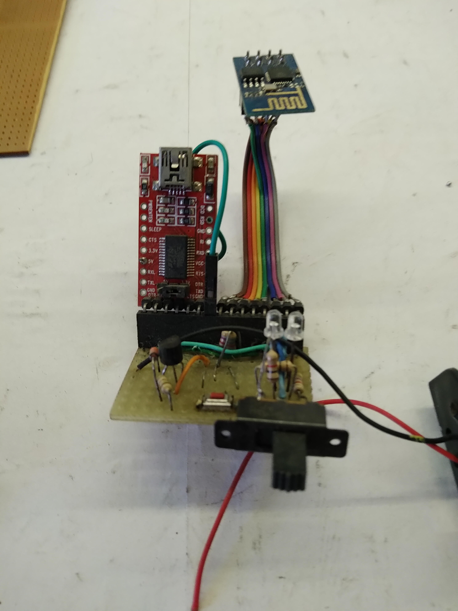
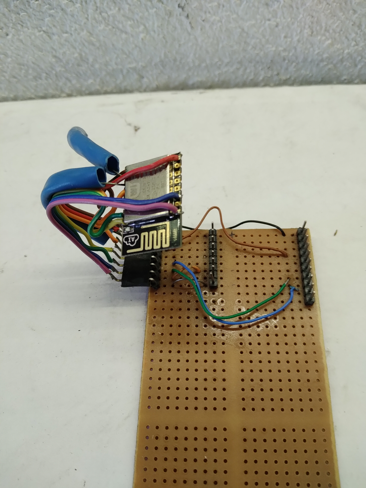
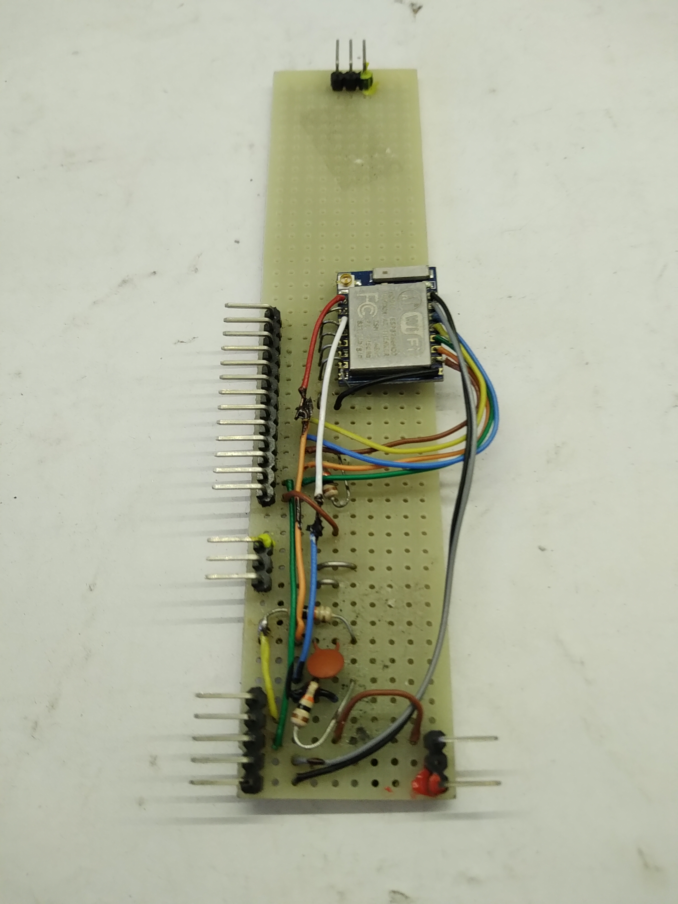
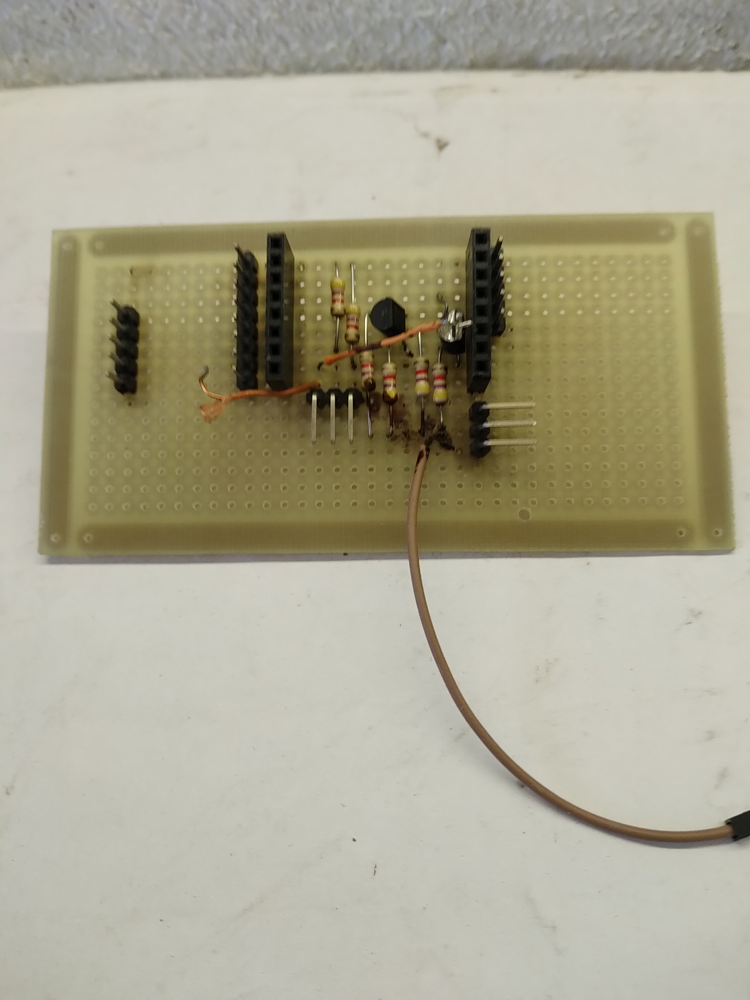
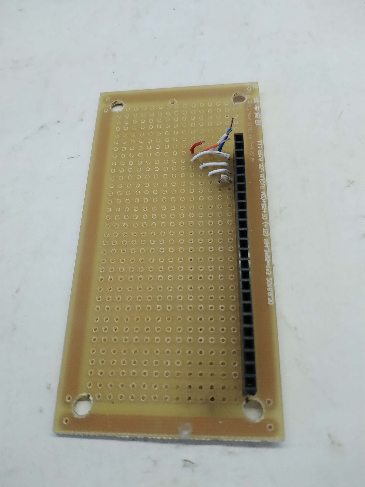
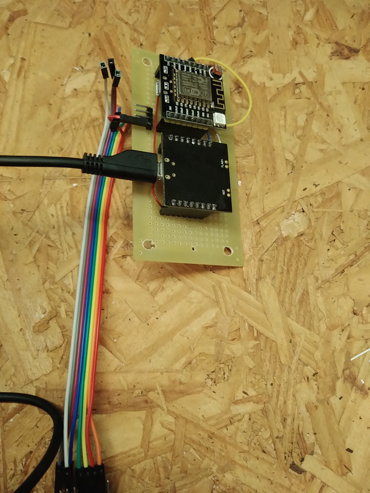
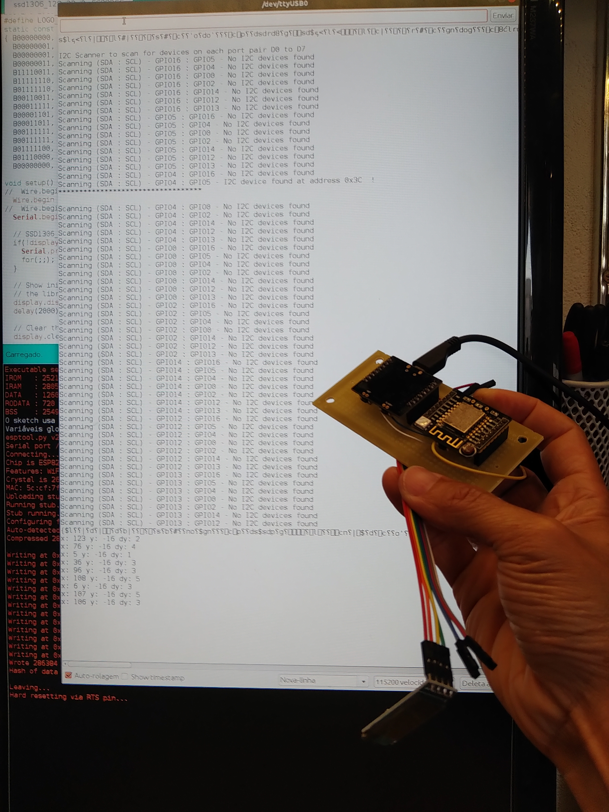

# Wittyboard 2020

## Objetivo

Construir uma placa de circuito impresso para acessar os pinos do ESP8266-12. 

## Contexto

Já tentei isso em 2014 e em 2017. Agora em 2020, começando em 31 de agosto, terminando em 23 de dezembro. Os arquivos estão guardados em backups.
Desde a primeira vez que vi, interessei-me pela construção: duas placas sobrepostas. Uma com CH340 e circuitos de reset, outra com o ESP8266. Esta separação  tem o potencial de:

- ~~programar o ESP8266-12 para operação sem componentes adicionais~~ frustrado pois precisa de alguns resistores pull-up ou pull-down.
- programar o ESP32 para operação sem componentes adicionais (ver [ESP32 Crossover](../ESP32Crossover/README.md).

... mas tem a desvantagem de não permitir usar os pinos do ESP8266-12 quando este está conectado à placa com CH340.

A construção facilita entender a comunicação via Serial/USB e o reset.

Com o estudo, fui entendendo como os componentes adicionais presentes na placa são usados: LED RGB, LDR, regulador de tensão, transistores, resistores.

## Tentativas anteriores

Conexão do ESP-01 com FTDI232. Consegui trocar comandos AT com o ESP01.

Conexão do ESP-12 com a placa com CH340 (presumo que não funcionou porque não tem os pull-up/pull-down)

Conexão do ESP-07 através de jumpers com a placa com CH340 (através dos headers a 90 graus). A placa contém os pull-ups e os pull-down. Esta tanto foi programada quanto conectou-se como servidor e access-point na primeira versão do projeto do vestido.

Conexão do Witty board, tentando implementar o circuito de reset e substituir a placa com CH340 por um FTDI232. Não funcionou.

Conexão do TTGO ESP8266-12 usado no projeto da estação meteorológica. A intenção era usar esta placa para expandir a quantidade de dispositivos que poderia ser conectada ao barramento I2C, mas o comprimento das conexões era muito longo, interferindo no funcionamento do circuito e na conexão wifi.

## Referências

Pinos que precisam ser conectados:

| esp8266-12 | Resistor adicional| FTDI232 |
| --- | --- | --- |
| PIN           |  Resistor | Serial Adapter |
| VCC           |           |  VCC (3.3V) |
| GND           |           |  GND |
| TX or GPIO2*  |           |  RX |
| RX            |           |  TX |
| GPIO0         | pull up   |  DTR  |
| Reset*        | pull up   |  RTS |
| GPIO15*       | pull down | |
| CH_PD         | pull up   | |

Fonte: Ivan Grokhotkov ESP8266 Arduino Core Documentation, Release 2.4.0

[Informação adicional neste repositório](../../componentes/controladores/ESP/ESP8266/README.md)

## Metodologia

1. Intercalar jumpers em todos os pinos que conectam as placas do wittyboard.
2. Testar com envio de programa (WittyLED)
3. Deixar conectados apenas os pinos listados na referência
4. Testar com envio do mesmo programa.

[Imagem wittyboard, conexão, jumpers intercalados](IMG_20200531_203410339.jpg)

## Resultados

Placa adaptadora vista por cima

Placa adaptadora vista por baixo

Placa adaptadora conectada e funcionando

**nota**: acrescentar vídeos e código fonte

| CH340* | ESP-12* |
| --- | --- |
| TxD | TxD |
| RxD | RxD |
| GPIO0 | GPIO0 |
| GPIO2 | GPIO2 |
| GPIO15 | GPIO15 |
| GND | GND |
| REST | REST |
| CH_PD | CH_PD |
| VCC | VCC |

* nomes dos pinos na placa do ESP8266-12 do wittyboard.

As conexões da referência estão corretas.

## Anotações

As três placas de prototipação que construí:
1. Tentando substituir o circuito de reset - Não funcionou;
2. Tentando intercalar uma pci - Não funcionou - não consegui descobrir o motivo;
3. Tentando intercalar uma pci - Não funcionou - a conexão ficou instável - mau contato nos pinos longos do conector porque os pinos são mais finos que os de headers padrão;
4. Tentando aumentar o comprimento da conexão I2C do TTGO - não funcionou - desconfio que o comprimento de aprox. 15cm, nas condições que usei, era muito. Quando cortei os fios para 5cm e conectei com protoboard o i2c_pin_scanner encontrou os dispositivos 0x3C - SSD1306 e 0x76 - BME280.

