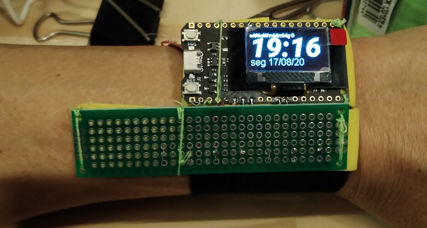
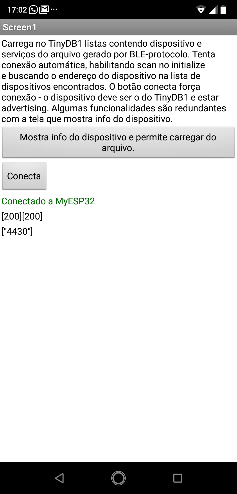
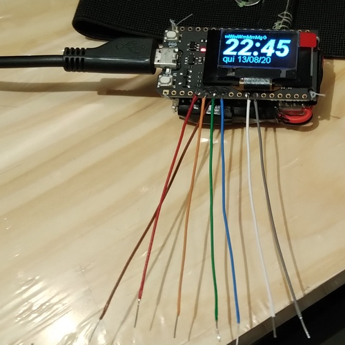
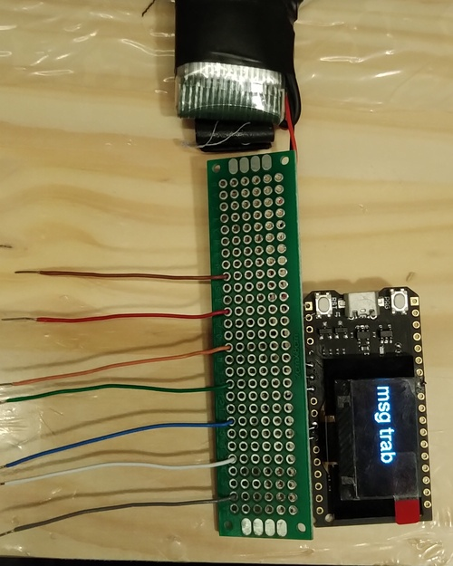
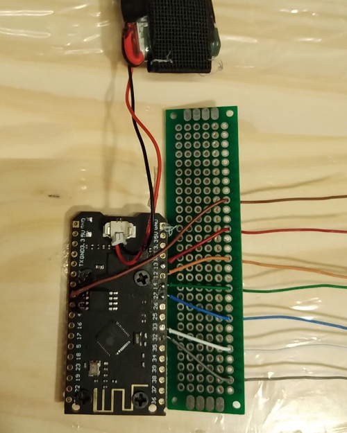
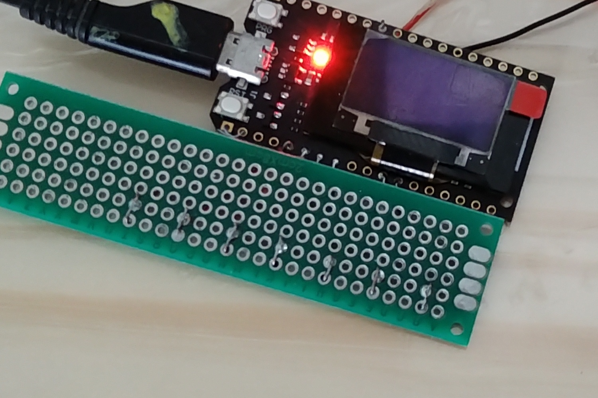
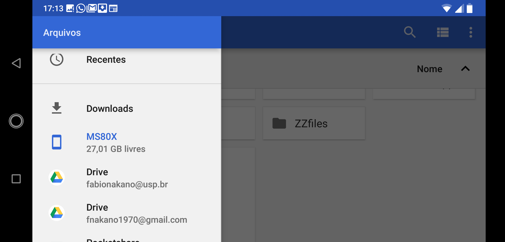

# Relógio conectado

## Introdução

### O resumo de uma história longa

Em 2012 comecei a preocupar-me com as atividades do dia e a forma como as organizava, quando possível, ou como elas mudavam meu dia.

A falta de anotações induziu-me a especulações como *hoje o dia passou e não fiz nada*, *o dia não rende*, *o tempo passa rápido demais*. Uma mistura de desejo de fazer mais com o desejo de ter feito outra coisa que, no meu caso, leva à frustração.

Um motivo mais prático: Sem anotações, atividades, a que dediquei tempo e trabalho, são esquecidas. Dentre elas, etapas de projetos profissionais, trechos de livros que seriam úteis em aulas, idéias, soluções de problemas e frases bem construídas. Nestes casos, esquecer resulta em um relatório mal detalhado, em retrabalho para preparar aulas e citar referências, em dedicar mais tempo e trabalho para escrever um novo projeto ou resolver o tal problema.

A conjunção de curiosidade e sofrimento motivou-me a prospectar ferramentas e formatos já existentes. São elas: 

- editores de texto simples como notepad, gedit,...; 
- editores formatadores de texto como Libre Office Write,...; 
- agendas como Evernote, Google calendar,...; 
- smartwatch com TimeSheet;
- editores HTML como Amaya, Bluefish, ou até composto com editor de texto simples,...;
- listas e quadros, como Trello, Google Keep, ...;
- apps desenvolvidos internamente usando app Inventor;
- Bancos de dados e planilhas;
- JSON e ANTLR;
- editores *Mardown*

Cada uma delas tem sua própria história, que será escrita em algum momento. Cada uma trouxe informação que contribuiu para a construção das novas versões.

Agora, em 2020, são oito anos testando ferramentas. Em uma época em que mudanças são frequentes e rápidas, oito anos é tempo suficiente para existirem vários desdobramentos: idéias novas para usar as ferramentas desenvolvidas para torná-la mais útil, por exemplo gerando esboços de relatórios automaticamente, elucidando atividades para sistematizar processos,....

Este tutorial/documento/site é o registro do estado da experimentação. Também é um exemplo de projeto e documentação para a disciplina CFA. Trata-se de um relógio conecatado. Mostra o que é, um caso de uso e como reproduzir, sem ocupar-se com justificativas para escolhas de materiais, técnicas e ferramentas nem variações e usos alternativos.

## Resultados

As duas fotos seguintes mostram o dispositivo. O display é usado para mostrar hora, nomes das atividades e mensagens de estado do dispositivo. Na segunda foto, os sete 'botões touch' são indicados pelas setas.

<!--- convert -crop 3368x1800+300+800 IMG_20200817_191645877.jpg relogioNoPulso.jpg --->

<!--- convert -crop 3368x1800+300+800 IMG_20200817_191704988.jpg relogioACK.jpg --->

O dispositivo conecta-se ao aplicativo de celular cuja tela é mostrada abaixo. O aplicativo, além de estabelecer a conexão, armazena em um arquivo texto os dados coletados pelo dispositivo na memória (cartão SD, não volátil) do celular.

### Amostra dos dados

O arquivo texto, anotacaoRelogio.txt, contém informação em uma tabela *comma separated values* (CSV). A primeira coluna corresponde ao instante em milissegundos, a segunda à data e a terceira ao texto da anotação, se houver.

| instante (ms)   | data                      | texto da anotação |
| --------------- | ------------------------- | ------ |
| "1597617666911" | "2020/08/16 19:41:06 BRT" | "[200]" |
| "1597617939762" | "2020/08/16 19:45:39 BRT" | "atendimento/reunião/aula" |
| "1597617952294" | "2020/08/16 19:45:52 BRT" | "pausa: relaxamento/refeição" |
| "1597617952780" | "2020/08/16 19:45:52 BRT" | "pausa: relaxamento/refeição" |
| "1597617962336" | "2020/08/16 19:46:02 BRT" | "transpo: ônibus/metrô/carro" |

O usuário pode escolher se faz a anotação no início ou no término da atividade, ou se a atividade é instantânea. Desta forma, o intervalo entre eventos, ou a duração da atividade, dependendo do contexto, pode ser calculada como a diferença entre instantes. Por exemplo, caso se convencione que a anotação seja feita no início da atividade, o intervalo entre consultar o horário (texto = "[200]") até o atendimento/reunião/aula foi "1597617939762-1597617666911" milissegundos e a duração do atendimento/reunião/aula foi "1597617952294-1597617962336" milissegundos. Por questões de implementação, o dispositivo envia várias mensagens para o mesmo evento e duas são de fato recebidas pelo celular.

[Amostra de dados](arquivos/anotacaoRelogio.txt)

## Construção

Este é composto por:

- Um dispositivo que mostra dados em um display, recebe dados por um teclado touch de 7 teclas e transmite/recebe dados por Bluetooth Low Energy (BLE);
- Um app para celular Android que recebe/transmite dados por BLE e escreve/lê arquivos texto;

### Dispositivo

#### Lista de partes

- TTGO T-Display com display OLED e ESP32;
- Placa de circuito impresso tipo ilha 18mmx80mm que servirá como 'botoeira';
- Fio rígido 26 AWG (de par trançado e tronco telefônico);
- Bateria 3,7V, 720mAh;
- Conector JST 1.25mm;
- Ferro de solda, solda, alicates e outras ferramentas acessórias;
- Fita isolante, verniz isolante (serve esmalte para unhas);

- [Faixa de pulso](../../componentes/vestiveis/faixaDePulso/README.md)

#### Lista de programas

- Arduino IDE com biblioteca ESP32;

https://mit-cml.github.io/extensions/

#### Montagem

Os pinos touch 2, 4, 5, 6, 7, 8 e 9 são usados para interface com usuário. Em cada um deles soldar fios rígidos que conectarão os pinos à botoeira. Convém medir o comprimento necessário (cerca de 5 a 8 cm em cada pino).

Inserir as extremidades dos fios nos respectivos furos na botoeira, medir alinhamento das placas, distâncias, margens para costura, cortar, dobrar as pontas para não formar saliências e ganchos que podem prejudicar a parte vestível e o usuário e soldar.

<!--- convert -crop 2000x2500+300+800 IMG_20200816_203421359.jpg botoeira.jpg --->

<!--- convert -crop 2000x2500+700+1200 IMG_20200816_203450772.jpg botoeira-verso.jpg --->

<!--- convert -crop 1500x1000+800+1200 IMG_20200817_103059046.jpg botoeira-soldada.jpg --->

Costurar o TTGO em um passador e a botoeira em outro passador. Importante alinhar a passagem da faixa pelos dois passadores. Caso o passador seja de EVA, fazer o ponto também de um furo da placa para o outro. O ponto largo diminui a chance da linha cortar o passador.

#### Carga do programa no dispositivo

[programa](arquivos/Relogio-protocolo-v5.ino)

[fontes tipográficas padrão](arquivos/images.h)

[fonte tipográfica grande](arquivos/roboto3.h)

### App companheiro

Caso precise começar com o app inventor, recomendamos o tutorial <https://github.com/camilabezerril/ImageCV/blob/master/Documentos/primeiroApp/primeiroApp.md>

[Anotador de atividades](arquivos/Relogio_BLE_V3.aia)

[Configurador de dispositivos](arquivos/BLE_Protocolo.aia)

Celular utilizado

Downloads

Upload no app inventor

Geração do app

Arquivo de configuração de endereço e serviço do dispositivo no app

## Operação

### Sincronização e anotação

/Zfiles/BLE.txt

## Histórico e método de desenvolvimento

O que eu precisava no dispositivo:

- autonomia da bateria;
- mostrar informação no display;
- manter hora;
- comunicação com celular;
- botões;

O que eu não queria usar

- armazenamento no dispositivo: [sistema de arquivos](../../componentes/controladores/ESP/sistemasDeArquivos/README.md)

O que eu já tinha como experiência:

- [RelogioV1](../RelogioV1)

