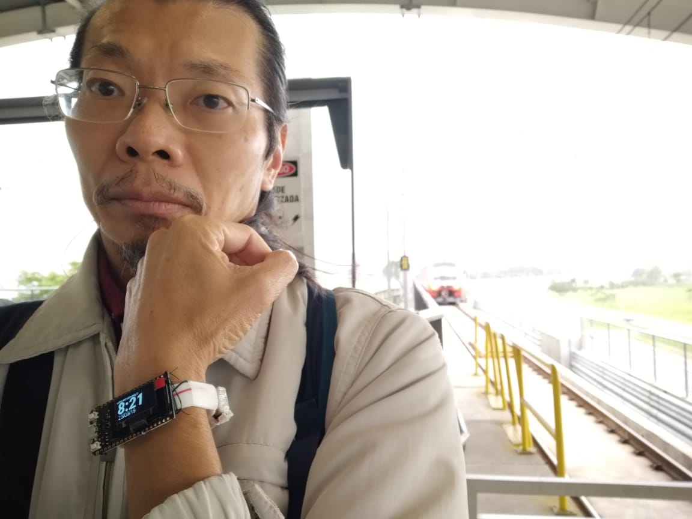

# Relógio V1 - Relatório

**nota**: Este é um teste/exemplo de uso do modelo de relatório. O relatório foi escrito mais de um ano após a execução.

## Introdução

### Contextualização (o que se sabe) e Motivação (por que se quer)

Em 2019 ocorreu o segundo oferecimento concomitante de CFA e e-Textiles. Logo nas primeiras aulas percebeu-se o potencial benefício no ensino e na aprendizagem que traria a construção e apresentação de um dispositivo.

Com a disciplina já em andamento, havia pouco tempo para aproveitar a oportunidade. 

O dispositivo de realização mais oportuna na época era um relógio. Aproveitava a recém adquirida placa controladora com display (ESP32 TTGO-Display) com baterias de [drone H36](https://www.jjrc.com/goodshow/h36-plam-sized-mini-drone.html) que estava sendo usado em uma Iniciação Científica. Não havia teste que mostrasse que a combinação de componentes funcionaria conforme o que se desejava, 

### Revisão Bibliográfica

O display do TTGO é um SSD1306, OLED. A biblioteca escolhida foi a thingpulse.
É possível, em determinadas condições, usar as macros `__DATE__` e `__TIME__` para obter uma data de referência <https://forum.arduino.cc/index.php?topic=335765.0>.

#### ~~Conceitos e Terminologia~~
### Organização do relatório

Após a introdução, acima, seguem objetivos, materiais e métodos utilizados, resultados, discussão e conclusão

## Objetivos ~~(questão de pesquisa colocada formal e explicitamente)~~ (o que quer fazer)

Construir e apresentar um relógio.

## Materiais e métodos
- Instalar Arduino IDE
- [Instalar placa ESP32](../../componentes/controladores/ESP/README.md/#Configurar-ArduinoIDE-para-programar-o-ESP8266-ou-o-ESP32)
- Instalar biblioteca SSD1306 da thingpulse
- Gerar fonte Roboto 48
- Laçar a placa TTGO no organizador de cabos <https://netcomputadores.com.br/p/20002-organizador-de-cabos-clone/4671>
- soldar conector JST 1.25 <https://github.com/Heltec-Aaron-Lee/WiFi_Kit_series/issues/5> na bateria.

## Resultados e indicadores de avaliação

### Entregáveis previstos

[Código-fonte](arquivos/RelogioV1.ino)

O circuito realizado foi a solda do conector JST 1.25.

As macros `__DATE__` e `__TIME__` armazenam data e hora de compilação em formato de String. Como o dispositivo pode ser conectado simultaneamente ao programador, através da porta USB, e à bateria, através do conector, e a desconexão da porta USB não desliga o dispositivo pois a bateria 'entra em funcionamento automaticamente', no instante da programação, o relógio apresenta a hora certa.

Uma parte dos métodos faz *parsing* das strings de data e hora em números, que podem ser incrementados de acordo com o horário interno.

O horário interno é acessado pelo método `millis()` que acessa o registrador interno que mantém o tempo transcorrido a partir do início da execução do programa. A precisão desta forma de medir o tempo é alta, mas o controlador precisa estar ativo o tempo todo. Neste modo o consumo é de XXmA.

Usou-se como faixa de pulso um organizador de cabos de 20cm de comprimento e 1cm de largura feito de velcro. A placa controladora foi fixada com linha de costura através dos furos de fixação e de duas ilhas (contatos) não utilizados no circuito. A bateria foi fixada com fita adesiva.

O maior tamanho de letra da biblioteca thingpulse tem 24 pontos, o que ocupa cerca de metade da altura do display. Para melhorar a visualização da hora, foi gerada uma letra a 48 pontos, usando um site indicado no exemplo de uso da bibliotece thingpulse.

### Entregáveis não previstos (soluções para problemas colaterais)

O conector da bateria na placa tem duas vias com pitch de 1.25mm e ou é um JST-GH ou é um molex PicoBlade <https://en.wikipedia.org/wiki/JST_connector>.

O display OLED se comunica com protocolo I2C. SDA está conectado no pino 3, SCL no pino 15. Adicionalmente, o pino 16 funciona como enable e deve ficar HIGH para o display acender e receber dados (link perdido).

Com a bateria de 150mAh o relógio fica ligado por aproximadamente 3 horas.
    
## Discussão e Conclusão

A maior limitação deste projeto foi o tempo disponível. 

A fita de velcro foi a mais adequada das encontradas nas lojas visitadas. O comprimento de 20cm é quase insuficiente para dar a volta no pulso. A largura, 1cm, é muito estreita, o que dificulta a fixação e deixa os componentes balançando. A fixação foi feita com linha de costura através dos furos de fixação dos componentes. Para fixar a bateria usou-se fita adesiva.

O ajuste da hora requer que o programa seja recompilado, o que precisaria ser feito sempre que a carga da bateria terminasse. Outras formas de ajustar o horário, menos particulares e trabalhosas, poderiam atender melhor aos usos possíveis.

A apresentação do dispositivo foi recebida muito positivamente tanto pelos colegas quanto pelos alunos da disciplina. Ela motivou elaborações sobre materiais e usos potenciais.
 
### ~~Consequências lógicas dos resultados~~

### Dificuldades que levaram às soluções colaterais

- dificuldade em obter informações sobre a placa
    - qual o tipo de conector da bateria;
    - se há restrições conhecidas para as baterias;
    - quais os pinos e protocolo de comunicação com o display.

### ~~Especulações/questionamentos a partir dos resultados~~

### Próximos passos

- reduzir consumo de energia
- usar conectividade wifi, bluetooth
    
## Referências

JJRC drone <https://www.jjrc.com/goodshow/h36-plam-sized-mini-drone.html>

## ~~Lista de divulgação dos resultados, quando for o caso~~

Primeira versão do [Relógio Conectado](../relogioConectado/README.md).

