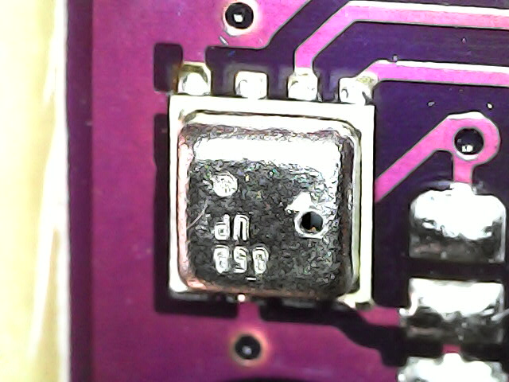
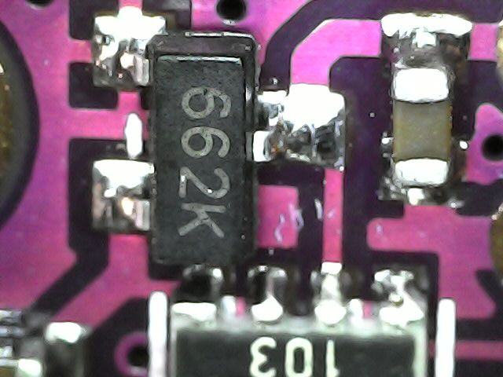
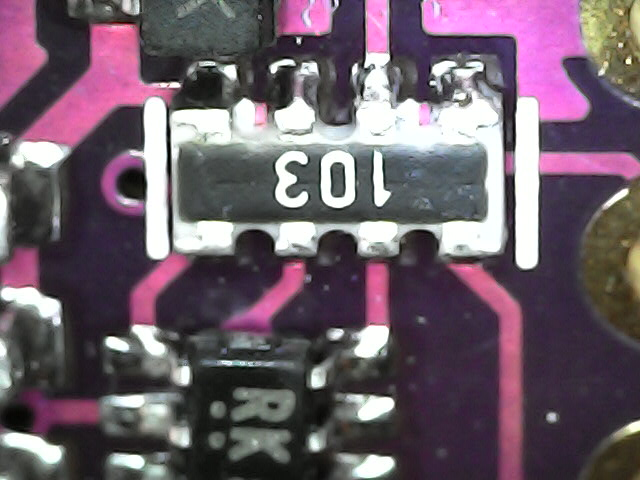
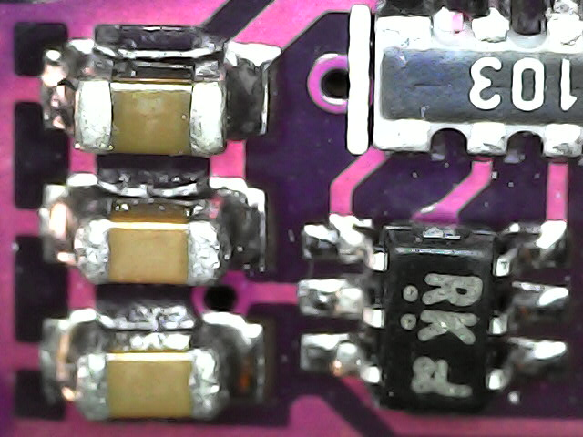
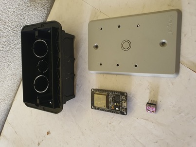

# Sensor meteorológico com ESP32 DevKit

## Novidades

- montagem sob espelho em caixa de luz;
- placa com BME280 de modelo diferente;
- programa para ESP32 DevKit.

Referência (essencial): [Sensor Meteorológico com ESP8266](../SensorMeteorologico/README.md). Explica com detalhes que biblioteca baixar, como baixar, como usar o serviço de armazenamento de dados (ThingSpeak),...

## Placa com BME280

Este modelo é novo para mim. Neste projeto esta placa opera alimentada por 3.3V.

## BME280

Rigorosamente, este é o código do sensor, que é um dos componentes da placa. Frequentemente, por "abuso de notação", uso esse código para referir-me à placa que contém o sensor. Veja o sensor na foto abaixo.

Aproveitando a oportunidade, os outros componentes da placa:

Provavelmente um regulador de tensão (ele converte a tensão de entrada, seja 3,3V, seja 5V para uma tensão em que o BME280 funcione (o componente queima se for ligado direto em 5V):

Rede de resistores (em conjunto com o *level shifter*, compatibiliza a tensão da sinalização (SCL, SDA) entre o BME e o controlador):

À esquerda capacitores, acima a rede de resistores, à direita, *level shifter* como o deste [link da Pololu](https://www.pololu.com/product/2595)

Os capacitores são usados para filtrar ruído elétrico, que pode interferir no funcionamento do sensor e na comunicação entre o sensor e o controlador.

## Lista de peças

- uma caixa de luz 4x2, 
- um espelho-cego, ou de antena, ou de conector de rede, 4x2, furado para atar as placas (furos feitos com furadeira e broca 2.5mm), 
- um ESP32 DevKit, 
- um BME280,
- quatro jumpers fêmea fêmea e
- um carrregador de celular.

(Ver peças nas fotos da montagem abaixo)

## Lista de conexões

| BME280 | ESP32 |
| ------ | ----- |
| Vin    |  3,3  |
| GND    |  GND  |
| SCL    |  D22  |
| SDA    |  D23  |

## Programa

[Código-fonte para IDE do Arduino](thingspeak-bme-fn-SGA-25-02/thingspeak-bme-fn-SGA-25-02.ino). Copiar e ajustar as senhas e chaves em [`secrets.h`](thingspeak-bme-fn-SGA-25-02/secrets.h).

## Vistas do protótipo.

Caixa de luz, espelho furado (furos feitos com furadeira), ESP32 DevKit, BME280. Os 4 jumpers fêmea fêmea e o carrregador de celular, não mostrados, completam a lista de componentes.

Vou amarrar as placas com linha pois não encontrei parafusos de tamanho certo (M2.5) aqui no lab.

Placas montadas e atadas ao espelho, jumpers conectando 3.3V, GND, SDA e SCL.

Da forma como foi feito, ainda é possível levantar as placas e ver o lado dos componentes.

## Resultados

Captura de tela da compilação

Captura de tela da exibição dos dados.

## Observações

Mudar a orientação do ESP32 DevKit para caber o conector USB.

