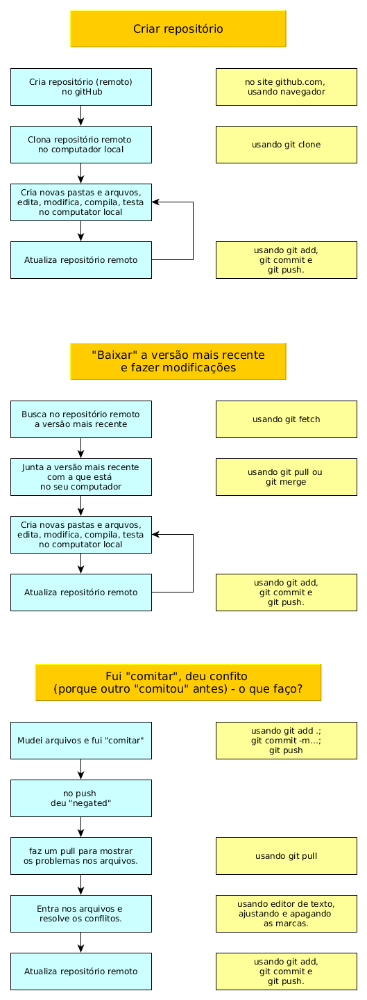

# Como Git e GitHub são usados neste projeto

## Motivação

Estou começando a trabalhar mais seriamente com git e github.

Se você for o único desenvolvedor do projeto, quer acessar o fonte de qualquer lugar e quando edita o fonte em computadores diferentes tem dificuldade ou aborrecimentos em unificar as versões dos computadores, git, github e esta página podem ajudar.

A dinâmica baseia-se em manter o fonte atualizado num repositório. Claro que uma pessoa disciplinada consegue fazer isso com um *pendrive* MAS mesmo os mais disciplinados às vezes esquecem ou não conseguem atualizar. Ferramentas de controle de versão, como git, ajudam a diminuir o trabalho caso isso aconteça. Com esta ferramenta, é possível trabalhar em outra funcionalidade do código, ou em outra seção do capítulo que está escrevendo e depois fundir (*merge*) todas as versões, na maioria dos casos, automaticamente.

Vou chamar *"na maioria dos casos, automaticamente"* de *quase automaticamente*.

Grandes vantagens tornam-se evidentes quando há várias pessoas trabalhando no mesmo arquivo. Neste caso cada uma pode ter sua cópia, dar sua contribuição e depois as contribuições podem ser fundidas *quase automaticamente*.

Se você está num projeto com uma equipe usando git para sincronizar os arquivos do projeto e precisou ficar fora por um mês, com três comandos você atualiza a sua versão e está pronto para voltar, pelo menos no que concerne aos arquivos.

Se você está trabalhando na próxima versão do seu projeto e surge um erro que precisa ser corrigido na versão de produção, com uns poucos comandos você entra na versão de produção, leva seu tempo para fazer a correção e com outros poucos comandos, atualiza a versão de produção e volta para os arquivos e o trabalho na próxima versão.

Se há diferentes versões, por exemplo para Android e para iOS, com alguns arquivos em comum e outros diferentes, com vários colaboradores em cada versão, manter os arquivos coerentes pode ser facilitado através do uso de controladores de versão, como git.

Em vista das vantagens, aprender a usar git pode ser um investimento que compensa: gasta-se esforço aprendendo, ganha-se capacidade de acrescentar colaboradores (escalabilidade) e agilidade em gerenciar o projeto.

## Etapas iniciais

Comecei este repositório criando primeiro o repositório no github (repositório remoto) e depois clonando no computador local (repositório local). Fiz isso porque não achei no github como criar subdiretórios e quero isso para organizar os arquivos que pretendo criar e manter aqui.

Criar o repositório no github foram alguns apertar de botões. Preferi criar com o *README.md* para criar o repositório com algo dentro - recomendo fazer isso. Chamarei o repositório de *RepoTeste*. Já criar no computador local deu mais trabalho pois fiz umas besteiras no caminho.

Antes de começar a história, instale o [git](https://git-scm.com/). :)

Ok, antes de antes de começar: 

- git é uma ferramenta de versionamento e desenvolvimento paralelo (colaborativo) em que cada colaborador pode ter um ou mais ramos de trabalho (*branch*) e pode mantê-los todos em paralelo. Quando um ramo de trabalho estiver concluido, ele pode fundir (*merge*) com o ramo de trabalho que quiser, por exemplo o ramo mestre, ou o ramo de produção. Existe para Linux, Mac e Windows.

- github é um site de desenvolvimento colaborativo e compartilhamento de repositórios. Ele é baseado em um servidor de arquivos executando git e permitindo que desenvolvedores editem, armazenem, compartilhem, comuniquem, divulguem repositórios e socializem em torno deles. No github um repositório é uma área de armazenamento de arquivos e um projeto permite usar, além do repositório, ferramentas de gerenciamento, como quadros e mensagens - semelhante ao Trello. 

Entendida a diferença, *instale o git* passa a ser uma frase que faz sentido... :)

Depois de instalar o git:

- crie uma pasta no computador local para clonar o *RepoTeste*. (Sugestão para este momento:criar a pasta com o mesmo nome);
- copie o <nome do repositório> (algo como https://github.com/.../...) no botão *clone ou download* que aparece na janela do github do lado direito do nome do seu repositório.
- com o terminal (sim, uso linux), entre na pasta;
- execute **git clone <nome do repositório>  .   ** (o ponto no final é importante!)

**nota**: neste exemplo, os comandos git são sempre usados na pasta em que *git clone* foi executado - é nela que a sub-pasta oculta *.git*, que contém os arquivos de controle relacionados à sua cópia local, é criada. 

**nota**: criando deste jeito, a associação entre a pasta local e o repositório remoto fica armazenada (em algum lugar na sub-pasta oculta *.git*). Assim, os comandos *git* usarão o repositório remoto associado e você não precisa informar a cada comando. 


Deve ter aparecido algumas mensagens e se tudo deu certo, o *README.md* deve estar lá também.

Talvez explicar a mesma coisa por outra fonte ajude a entender melhor. Pode tentar [a documentação do github sobre clonar repositórios](https://help.github.com/pt/github/creating-cloning-and-archiving-repositories/cloning-a-repository)

Depois de clonar o repositório, coloquei as instruções no *README.md* usando o editor online. Isto deixou o meu arquivo local atrasado em relação à versão no servidor. Para re-sincronizar:

- git fetch
- git merge (acabei de ver que git checkout dá um aviso que o ramo local está atrasado e recomenda usar git pull. Usei git pull e re-sincronizou)

Talvez explicar a mesma coisa por outra fonte ajude a entender melhor. Pode tentar [a documentação do github sobre sincronizar arquivos locais](https://help.github.com/pt/github/using-git/getting-changes-from-a-remote-repository)

Editor online pode gerar perda de dados (trabalho). Comecei a editar o arquivo local e sincronizar o repositório remoto.

- git add <arquivo(s) que mudou>   (se vários arquivos mudaram, usar . em <arquivos(s) que mudou> pode ser prático)
- git commit -m "mensagem"
- git push


**nota** *git add .* é recursivo. Isto quer dizer que as sub-pastas e arquivos que elas contém são incluidos nos arquivos que serão sincronizados. Ele vai incluir todos os arquivos - inclusive os de recuperação dos editores, por exemplo README.md~. Isto pode ser evitado usando .gitignore [referência do git](https://git-scm.com/docs/gitignore) [referência do github](https://help.github.com/pt/github/using-git/ignoring-files).

Talvez explicar a mesma coisa por outra fonte ajude a entender melhor. Pode tentar [a documentação do github sobre sincronizar arquivos remotos](https://help.github.com/pt/github/using-git/pushing-commits-to-a-remote-repository)

Existe uma espécie de inconsistência lógica em torndo dos usos de *push*, *pull* e *merge*. Talvez fique mais claro para mim quando colocar em prática a possibilidade de usar vários repositórios remotos, várias versões e vários ambientes (o computador em que estou digitando os comandos é um servidor git ou é um cliente git), ... Por enquanto parece tudo mais ou menos igual, embora eu saiba que quando estou dando os comandos no cliente, *push* significa enviar do cliente para o servidor e que o servidor é o repositório remoto e *pull* significa trazer do servidor para o cliente.  

Simulei um cenário **simulação 1** que achei que daria um problema:

Enquanto editava este arquivo, entrei pelo navegador, editei, modifiquei e "comitei" este mesmo arquivo, simulando um outro colaborador que terminou de modificar o mesmo arquivo. Agi como padrão: *git add .*, *git commit -m...*, *git push*. 

O *push* foi negado:

```
fabio@fabio-13Z940-G-BK71P1:~/Documentos/Camila/CV$ git add .
fabio@fabio-13Z940-G-BK71P1:~/Documentos/Camila/CV$ git commit -m "teste push em cima de outro commit"
[master 124b3d9] teste push em cima de outro commit
 3 files changed, 1676 insertions(+), 3 deletions(-)
 create mode 100644 Documentos/sobreGit/README.md~
 create mode 100644 Documentos/sobreGit/git1.graphml
fabio@fabio-13Z940-G-BK71P1:~/Documentos/Camila/CV$ git push
Username for 'https://github.com': fnakano
Password for 'https://fnakano@github.com': 
To https://github.com/camilabezerril/ImageCV.git
 ! [rejected]        master -> master (fetch first)
error: failed to push some refs to 'https://github.com/camilabezerril/ImageCV.git'
dica: Updates were rejected because the remote contains work that you do
dica: not have locally. This is usually caused by another repository pushing
dica: to the same ref. You may want to first integrate the remote changes
dica: (e.g., 'git pull ...') before pushing again.
dica: See the 'Note about fast-forwards' in 'git push --help' for details.
```
Segui a recomendação: fiz um *pull*:

```
fabio@fabio-13Z940-G-BK71P1:~/Documentos/Camila/CV$ git pull
Username for 'https://github.com': fnakano
Password for 'https://fnakano@github.com': 
remote: Enumerating objects: 9, done.
remote: Counting objects: 100% (9/9), done.
remote: Compressing objects: 100% (4/4), done.
remote: Total 5 (delta 2), reused 0 (delta 0), pack-reused 0
Unpacking objects: 100% (5/5), done.
From https://github.com/camilabezerril/ImageCV
   22c78eb..313eea8  master     -> origin/master
Mesclagem automática de Documentos/sobreGit/README.md
CONFLITO (conteúdo): conflito de mesclagem em Documentos/sobreGit/README.md
Automatic merge failed; fix conflicts and then commit the result.
```

Fiz um novo *pull* (*à posteriori* acho que era desnecessário, mas a mensagem foi esclarecedora):

```
fabio@fabio-13Z940-G-BK71P1:~/Documentos/Camila/CV$ git pull
error: Pulling is not possible because you have unmerged files.
dica: Fix them up in the work tree, and then use 'git add/rm <file>'
dica: as appropriate to mark resolution and make a commit.
fatal: Exiting because of an unresolved conflict.
```
Aí que fui ver que o arquivo tinha sido modificado e que o conflito estava marcado:


Resolvi o conflito (coloquei as frases - uma vinda de um commit, outra da minha versão local - na ordem, removi as marcas)


Então fui pelo caminho do *pull*:

```
fabio@fabio-13Z940-G-BK71P1:~/Documentos/Camila/CV$ git add .
fabio@fabio-13Z940-G-BK71P1:~/Documentos/Camila/CV$ git commit -m "conflito entre outro commit e push sendo resolvido"
[master db7714a] conflito entre outro commit e push sendo resolvido
fabio@fabio-13Z940-G-BK71P1:~/Documentos/Camila/CV$ git pull
fatal: unable to access 'https://github.com/camilabezerril/ImageCV.git/': Failed to connect to github.com port 443: Tempo esgotado para conexão
fabio@fabio-13Z940-G-BK71P1:~/Documentos/Camila/CV$ git pull
Username for 'https://github.com': fnakano
Password for 'https://fnakano@github.com': 
remote: Invalid username or password.
fatal: Authentication failed for 'https://github.com/camilabezerril/ImageCV.git/'
fabio@fabio-13Z940-G-BK71P1:~/Documentos/Camila/CV$ git pull
Username for 'https://github.com': fnakano
Password for 'https://fnakano@github.com': 
Already up to date.
```

Achei estranho pois embora atualizado, o conteúdo do servidor não tinha atualizado. Tentei *add* e *commit* novamente e recebi a mensagem elucidativa:

```
fabio@fabio-13Z940-G-BK71P1:~/Documentos/Camila/CV$ git add .
fabio@fabio-13Z940-G-BK71P1:~/Documentos/Camila/CV$ git commit -m "parece não ter resolvido..."
No ramo master
Seu ramo está à frente de 'origin/master' por 2 submissões.
  (use "git push" to publish your local commits)

nothing to commit, working tree clean
```

Agora o *push* resolveu:

```
fabio@fabio-13Z940-G-BK71P1:~/Documentos/Camila/CV$ git push
Username for 'https://github.com': fnakano
Password for 'https://fnakano@github.com': 
Counting objects: 12, done.
Delta compression using up to 4 threads.
Compressing objects: 100% (12/12), done.
Writing objects: 100% (12/12), 43.26 KiB | 2.40 MiB/s, done.
Total 12 (delta 4), reused 0 (delta 0)
remote: Resolving deltas: 100% (4/4), completed with 1 local object.
To https://github.com/camilabezerril/ImageCV.git
   313eea8..db7714a  master -> master
```

### outros screenshots relacionados ao teste:

(screenshots/Captura%20de%20tela%20de%202020-05-28%2020-29-03.png)
(screenshots/Captura%20de%20tela%20de%202020-05-28%2020-30-08.png)
(screenshots/Captura%20de%20tela%20de%202020-05-28%2020-36-30.png)
(screenshots/Captura%20de%20tela%20de%202020-05-28%2020-43-24.png)
(screenshots/Captura%20de%20tela%20de%202020-05-28%2020-44-10.png)
(screenshots/Captura%20de%20tela%20de%202020-05-28%2020-44-33.png)

## Referências sobre markdown

[básico](https://www.markdownguide.org/basic-syntax/)

[estendido](https://www.markdownguide.org/extended-syntax/)

## Fluxogramas



## Comentários

(comentário: este editor de markdown é bem legal - pelo menos o bold e o itálico ele formata WYSIWYG).

(comentário 2: a palavra *é* pode ser usada para dar a definição de dicionário de algo ou para dar a percepção de quem escreve sobre aquilo que ele está descrevendo, além de outros usos. Fique atento!)

(comentário 3: minha internet passou o dia instável. Usar o editor online do github nessa condição pode levar a perda de dados pois se não houver conexão, o botão *commit changes* falha e o que foi digitado no editor é perdido.)

(comentário 4: quando tentei clonar da primeira vez, criei o diretório e dei um **git init**. Se ficar só por isso, cria-se um novo repositório. Vendo [esta postagem](https://stackoverflow.com/questions/651038/how-do-you-clone-a-git-repository-into-a-specific-folder) entendi que eu poderia "corrigir" fazendo: 
git remote add origin PATH/TO/REPO; git fetch; git checkout -t origin/master. Não tentei, mas fica a dica - uma hora eu tento).

(comentário 5: apagando o .git e seu conteúdo, removo o diretório do git. [link](https://stackoverflow.com/questions/1514054/how-do-i-delete-a-local-repository-in-git))

(comentário 6: hiperlinks não podem ter espaços [referência](https://stackoverflow.com/questions/13051428/how-to-display-images-in-markdown-files-on-github). Não adianta colocar dentro de doublequotes. Substituir por %20)
## registro da simulação 1

Modifico aqui para simular o commit de um outro colaborador.

Fazendo de conta que não sei que outro colaborador fez um commit durante a minha edição, vou tentar um push...
