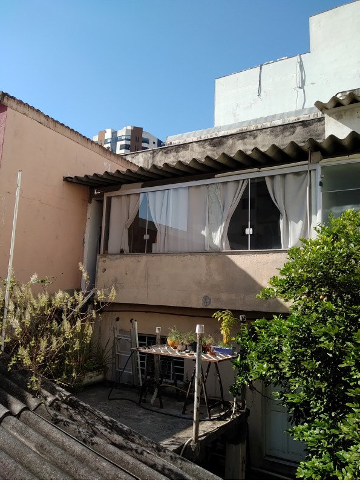

# Sensor Meteorológico

**nota**: não está no formato de projeto da disciplina CFA. Será convertido quando possível.

## Motivação


Estou muito curioso sobre temperatura e umidade do ar dentro e fora de casa. Por isso escolhi medir e registrar essa informação.




## Estrutura deste documento

Divido a explicação em partes:

1. [Enviar dados para a "nuvem"](#enviar-dados-para-a-nuvem): Usando o ESP8266, sem sensores conectados, enviar números para o repositório [ThingSpeak](thingspeak.com) . Neste exemplo é um TTGO com display OLED, mas acredito que NodeMCU, WEMOS D1, Wittyboard e outros também funcionem;
    1. [Configurar ArduinoIDE para programar o ESP8266](#configurar-arduinoide-para-programar-o-esp8266);
    2. [Testar a programação do ESP8266](#testar-a-programação-do-esp8266);
    2. [Criar uma conta gratuita no ThingSpeak](#criar-uma-conta-gratuita-no-thingspeak);
    3. [Criar um canal privado no ThingSpeak](#criar-um-canal-privado-no-thingspeak);
    4. [Programar o ESP8266 para enviar números para o canal](#programar-o-esp8266-para-enviar-números-para-o-canal);
2. Coletar dados;
    1. [Conectar o sensor BME280 ao ESP8266](conectar-o-sensor-bme280-ao-esp8266);
    2. [Programar o ESP8266 para comunicar-se com o sensor e exibir os dados através do monitor serial](conectar-o-sensor-bme280-ao-esp8266);
3. [Juntar os dois](juntar-os-dois);

Se você quer avaliar se segue e para isso é importante conhecer os problemas que estou enfrentando no momento, vá para [Anotações](#anotações)

## Enviar dados para a nuvem

### Configurar ArduinoIDE para programar o ESP8266

Atualmente isto está mais estável e com referências consistentes, assim, quem precisa fazer um tutorial não precisa aplicar muito tempo. Considerando como ponto de partida que ArduinoIDE versão 1.6.5 ou mais recente já esteja instalado:

1. Entre em Arquivo->preferências;
2. na linha **URLs adicionais de gerenciador de placas** acrescente http://arduino.esp8266.com/stable/package_esp8266com_index.json
3. clique ok;
4. Entre em Ferramentas->placa->gerenciador de placas (talvez leve um tempinho até carregar as placas novas);
5. busque por esp8266;
6. instale esp8266;

(isto já foi testado em Windows, Linux e Raspbian Stretch no raspberry pi 4)

Há tutoriais ilustrados em:

- [filipeflop](https://www.filipeflop.com/blog/programar-nodemcu-com-ide-arduino/) 
- [robocore](https://www.robocore.net/tutorials/como-programar-nodemcu-arduino-ide)
- [Arduino](https://www.robocore.net/tutorials/como-programar-nodemcu-arduino-ide)
- [Instructables](https://www.instructables.com/id/Quick-Start-to-Nodemcu-ESP8266-on-Arduino-IDE/)

## Testar a programação do ESP8266

Consiste em conectar um LED à placa do ESP8266 e fazer o LED acender ou piscar. É uma forma simples, rápida e boa de checar que você achou e ajustou adequadamente as configurações do seu ambiente de desenvolvimento e ele está funcionando bem e se todo seu procedimento para programar o ESP8266 (conecta o ESP, seleciona porta, seleciona placa, compila, envia programa, ...) chega ao resultado desejado.

Cada um dos tutoriais ilustrados sugere algo ligeiramente diferente. Se você só tem um LED, siga o do filipeflop. Se você tem LED e resistor, siga o do robocore ou o do Instructables. Se você não tem LED e acredita ou sabe que o LED azul embutido no ESP8266 está funcionando, siga o do Arduino.

## Criar uma conta gratuita no ThingSpeak

ThingSpeak, atualmente, é um serviço da MathWorks. Acredito que o programa mais conhecido da empresa seja o Matlab. Por isso a autenticação é unificada. Ele tem funcionalidades gratuitas, mediante cadastro. A que vou usar é o recebimento, armazenamento e apresentação gráfica de números. Estes podem ser leituras de sensores ou números gerados aleatoriamente no ESP8266.


Clique em sign in (boneco) e depois clique em *create account*. Aparece o cadastro, preencha o cadastro.


Depois entre na sua conta e crie um canal...

## Criar um canal privado no ThingSpeak

Canal é o nome no thingspeak para a conexão para o dispositivo. Um canal é identificado por seu ID (Channel ID) e a leitura/escrita é permitida através de chaves (API keys).

1. clique em Channels -> My Channels;
2. clique no botão new channel;

3. com o canal criado, clique no nome do canal;

4. copie o número do Channel ID;
4. entre na aba API Keys;
5. copie a combinação de letras e números de Write API Key;

(É necessário informar Channel ID e Write API Key no programa do ESP8266 no próximo passo)

## Programar o ESP8266 para enviar números para o canal

Existe exemplo pronto para isto.

Entre no gerenciador de bibliotecas, busque por thingspeak e instale.


Na instalação são instalados exemplos de uso. No ArduinoIDE, entre em Exemplos -> ThingSpeak -> ESP8266 -> Program board directly -> WriteMultipleFields


Selecione a aba (arquivo) secrets.h - Reproduzo o arquivo completo abaixo para referência.

```c
// Use this file to store all of the private credentials 
// and connection details

#define SECRET_SSID "MySSID"		// replace MySSID with your WiFi network name
#define SECRET_PASS "MyPassword"	// replace MyPassword with your WiFi password

#define SECRET_CH_ID 000000		// replace 0000000 with your channel number
#define SECRET_WRITE_APIKEY "XYZ"	// replace XYZ with your channel write API Key

```


Substitua MySSID pelo nome da sua rede doméstica;
Substitua MyPassword pela senha de conexão da sua rede doméstica;
Substitua 000000 pelo Channel ID;
Substitua XYZ pelo Write API Key.

Salve o arquivo, compile o código e envie para o ESP8266.

Abra o monitor serial e veja as mensagens impressas pelo ESP através da porta USB: *Attempting to connect to SSID, connected, Channel update successful, ...*

Abra o navegador, entre no ThingSpeak, entre no seu canal, selecione Private View e veja os gráficos sendo atualizados a cada 20 segundos com os números enviados pelo ESP8266 através da Internet.

## Conectar o sensor BME280 ao ESP8266

Dois avisos antes de começar:

1. O BM**E**280 é um sensor de **umidade do ar**, temperatura e pressão atmosférica. Diferente do BM**P**280 que mede temperatura e pressão, **mas não umidade**. Fisicamente os componentes são iguais, inclusive as placas de circuito impresso para um servem para o outro. Durante uma época (lá pelo ano 2017), lojistas de e-commerce chineses não faziam distinção entre os componentes. Isso gerava incerteza e confusão. O BMP180 também não mede umidade.
2. Outro detalhe importante: o fabricante dos BME280 e dos BMP280 (Bosch Sensortec) parece ter mudado a especificação e o funcionamento dos componentes (inferi isso de referências que achei na web). Isto "quebrou" bibliotecas de sites famosos.

Estes dois eventos podem dificultar a depuração do sistema (dispositivo + rede + servidor de dados + todos os programas) pois não saberemos se o problema que se está depurando origina-se no sensor, no controlador, no código que escrevemos,... (e raramente verifica-se a biblioteca).


A biblioteca que usei é a mostrada [neste repositório github](https://github.com/finitespace/BME280)

Instalei usando o gerenciador de bibliotecas da IDE do Arduino:


O tipo (ou protocolo) de comunicação que usei é I2C. Na placa ESP8266 TTGO que usei os pinos 3V3, GND, SDA e SCL estão fáceis de identificar. Veja na imagem abaixo e faça as mesmas ligações.


 
Caso esteja usando outra placa ESP8266, você precisará saber quais são os pinos SDA e SCL. Ainda não consegui escrever a parte da documentação sobre isso, mas quando eu o fizer, será baseado nestes dois links. Logo, você já pode usá-los.

https://www.instructables.com/id/ESP8266-I2C-PORT-and-Address-Scanner/
http://www.gammon.com.au/forum/?id=10896

No exemplo da biblioteca BME280 que se chama BME_280_I2C_TEST, na função *setup()* há o comando ```Wire.begin()```. Eu o substituí por ```Wire.begin(2,14)``` pois nesta placa o SDA está no pino 2 e o SCL no pino 14. [*download*](BME_280_I2C_Test-esp8266-26-05.ino)

Feito o ajuste, salve, compile, envie para a placa e veja os dados no monitor serial. 

**nota**: cheque se a taxa de transmissão do programa é a mesma do monitor serial (o número no Serial.begin(número) e a velocidade no monitor serial )

## Juntar os dois

Medir umidade, temperatura e pressão atmosférica e enviar para o ThingSpeak.
O código é uma junção dos exemplos de comunicação com ThingSpeak e de leitura do BME280. Em algum momento explicá-lo-ei. No momento, ofereço o [*download*](thingspeak-bme-fn-26-05.ino)

Caso 'falte' o arquivo `secrets.h`, é o mesmo arquivo do código exemplo do ThingSpeak, ajustado segundo [instruções acima, nesta mesma página](#programar-o-esp8266-para-enviar-n%C3%BAmeros-para-o-canal). O arquivo deve estar na mesma pasta do seu *sketch* (arquivo `.ino`).

## Anotações

### atemporais

- a conexão do dispositivo é instável além do que considero aceitável. *backup* ou *reenvio* ou *armazenamento de dados em computador próximo* poderia resolver isso.
- o envio do tempo em milissegundos é útil pois, caso faltem dados, é possível identificar se é questão de falta de energia (o tempo reinicia quando o dispositivo recupera da falha) ou é questão de falta de conexão (o tempo não reinicia). Só não é tão bom porque é *à posteriori*. Talvez possa ser preditivo.
- mensagens no display do dispositivo - informando que a conexão foi feita, que o envio foi bem sucedido,... podem facilitar a instalação e verificação de funcionamento... e evitar retrabalho. 

### Na noite de 06.06 para a manhã e 07.06 houve uma tempestade com raios.

Na tempestade, não sei se por causa da chuva ou por causa dos raios, mas o sensor de temperatura parece ter pifado - apresenta uma temperatura aprox. 10 graus mais alta. Em consequência a umidade também sai errada. Hoje, 08, está bastante nublado, temperatura em torno de 25 graus, acredito que a umidade esteja acima de 60%. Vou fazer uma leitura com a coisaNaEscrivaninha no beiral da janela.


### 31 de maio de 2020

Os pontos obtidos nesse dia são todos *indoor*

### Até 30 de maio de 2020

Fiz dois testes de autonomia de bateria. Os dois apontam para autonomia de 27h.

Observei algo curioso durante esses testes da autonomia:

A internet "fica ruim": Lenta, conexão caindo frequentemente. Vi nos dados que a queda da conexão é determinística: transmite uns 60 pontos (ou talvez 20 minutos), deixa de transmitir por 8 minutos e repete o ciclo.

Acredito que a quantidade de requisições geradas (uma a cada 20 segundos), *atrapalha* o funcionamento do roteador wifi/adsl, que fica num modo "estranho" por 8 minutos, quando consegue recuperar o erro e funcionar por mais um período. MAS é uma conjectura - sem mais informação.

### 29 de maio de 2020

Aprendi de uma colega que *quando uma frente fria deixa o local, geralmente a pressão atmosférica sobe*. Foi o que vi pela manhã. No noticiário informavam que a frente fria estava deixando a região e as 9h observei um pico na pressão atmosférica.


[Sobre referências dentro do documento](https://stackoverflow.com/questions/2822089/how-to-link-to-part-of-the-same-document-in-markdown)
