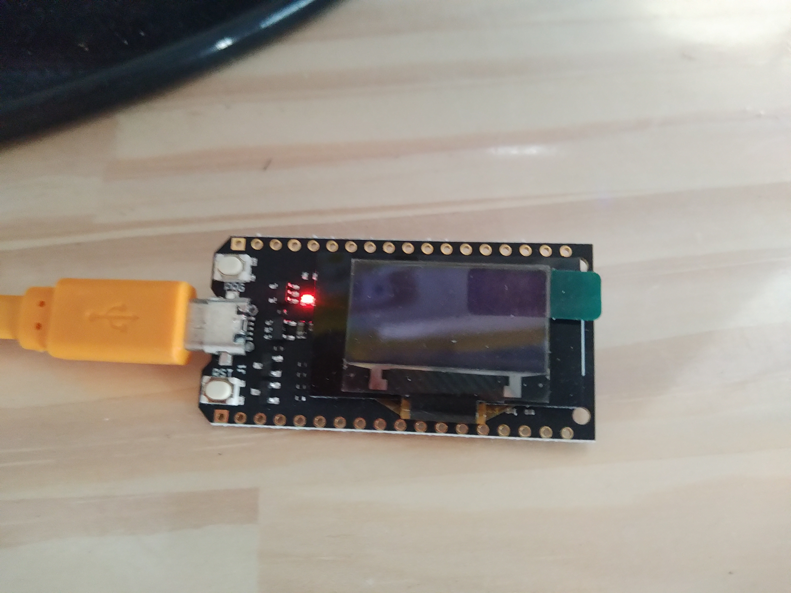

# Servidor de arquivos

## Introdução (parte já foi feita no plano de atividades ou na proposta)

### ~~Contextualização (o que se sabe) e Motivação (por que se quer)~~ feito na proposta

Faz parte do projeto [FuncionalidadesRecorrentes](../FuncionalidadesRecorrentes/README.md)

### Revisão Bibliográfica (informação que foi encontrada durante a execução do plano)

As operações básicas em armazenadores de dados, como gerenciadores de bancos de dados e sistemas de arquivos, são [CREATE, READ, UPDATE e DELETE](https://pt.wikipedia.org/wiki/CRUD)

No pacote para programação de ESP32 para IDE do Arduino há uma coleção de exemplos.

O exemplo [SPIFFS](https://github.com/espressif/arduino-esp32/tree/master/libraries/SPIFFS) apresenta uma maneira de armazenar arquivos no ESP32. Este [link](https://docs.espressif.com/projects/esp-idf/en/latest/esp32/api-reference/storage/spiffs.html) aponta para a documentação oficial. Pode-se usar como analogia que este exemplo ajusta uma parte da memória do ESP32 para funcionar como um cartão SD, ou um pendrive. Há tutoriais em Português: <https://www.fernandok.com/2018/12/otima-noticia-agora-voce-pode-salvar.html>. Para envio de arquivos para o ESP32 existe a ferramenta da IDE do [Arduino SPIFFS file uploader](https://github.com/me-no-dev/arduino-esp32fs-plugin), com [tutorial para instalação](https://randomnerdtutorials.com/install-esp32-filesystem-uploader-arduino-ide/)

SPIFFS, no momento da escrita deste relatório, é um sistema de arquivos sem diretórios e que permite o caracter barra no nome do arquivo, o que emula a estrutura de diretórios.

O exemplo [FSBrowser](https://github.com/espressif/arduino-esp32/blob/master/libraries/WebServer/examples/FSBrowser/FSBrowser.ino) apresenta um servidor HTTP executado em um dispositivo que se conecta como cliente a algum ponto de acesso wifi. Na oração anterior, há duas relações. Na primeira há um cliente, um servidor e é usado o protocolo HTTP. No caso o cliente HTTP é o navagador, executado no seu computador ou celular, e o servidor HTTP é um programa sendo executado no ESP32. Na segunda relação, o ESP32 (cliente nesta relação) se conecta ao roteador wifi (servidor nesta relação).

#### Conceitos e Terminologia (glossário)

CRUD: Abreviação de CREATE, READ, UPDATE, DELETE. São as operações básicas em armazenadores de dados.

Cliente-Servidor: modelo de interação entre agentes onde o cliente solicita algo (geralmente informação) e o servidor responde à solicitação, servindo a informação.

emular: imitar

~~ Questão de pesquisa~~

### Organização do relatório

Este relatório contém introdução, objetivo, materiais e métodos, resultados e comentários e conclusões.

## ~~Objetivos~~ (feito no plano de atividades ou na proposta)

Especificar e prototipar um servidor de arquivos que recebe dados de sensores conectados ao ESP32, armazena em um arquivo local e permite fazer operações sobre os arquivos.

## Materiais e Métodos ( quais são os ingredientes e o que fazer com eles para chegar nos resultados)

Foi usado o TTGO-Display das fotos abaixo. Nenhum circuito foi construído.




Usou-se um computador com sistema operacional Ubuntu-20.04LTS, RAM 8GB e as ferramentas:

- [IDE do Arduino](https://www.arduino.cc/en/Guide#install-the-arduino-desktop-ide)
- [pacote para programação de ESP32](https://github.com/FNakano/CFA/tree/master/componentes/controladores/ESP#configurar-arduinoide-para-programar-o-esp8266-ou-o-esp32)

## Resultados e indicadores de avaliação (resultados dos testes dos entregáveis)

### Especificação das funcionalidades do servidor de arquivos.

O servidor de arquivos recebe dados dos sensores e permite que quem for analisar os dados copie os arquivos <./diario.md#2020-10-04-194400>. A API então é CRUD para os sensores e CRUD para o analista de dados. O FSBrowser apresenta CRUD para o analista de dados, que pode usar um navegador, ou, a linha de comando em seu computador <./diario.md#2020-10-02-213534>:

#### C - Para enviar um arquivo do diretório corrente para o ESP32:

```
curl -v -F 'data=@retamgulo-se.svg' http://esp32fs.local/edit
```

onde `retamgulo-se.svg` é o nome do arquivo no diretório corrente que deseja-se enviar e `http://esp32fs.local/edit` é o endereço do serviço de recepção de arquivos. A cópia do arquivo no ESP32 tem o mesmo nome e é criado na raiz do SPIFFS.

#### R - para baixar um arquivo do ESP32 e mostrar o conteúdo no terminal:

```
curl -v http://esp32fs.local/README.md
```

Para listar os arquivos (baixar o arquivo de índice do sistema de arquivos):

`curl -v   http://esp32fs.local/list?dir=/`

**nota importantíssima**: O nome do argumento deve ser `dir` pois o handlaFileList usa o argumento com esse nome.

Caso deseje-se criar um arquivo, propõe-se usar os operadores `>, >>` para redirecionar a saída da terminal para um arquivo.

#### U - para atualizar um arquivo:

A atualização é feita por leitura, modificação e criação de arquivo com nome igual.

#### D - deletar arquivo

`curl -v -X "DELETE" http://esp32fs.local/edit?file=/README.md`
[referência](https://stackoverflow.com/questions/2539394/rest-http-delete-and-parameters)

**nota importantíssima**: O nome do argumento pode ser qualquer pois o handleFileDelete usa o argumento de índice zero e usa como nome do arquivo.

O SPIFFS-Test apresenta CRUD para o sensor:

#### C - Para criar ou abrir um arquivo no ESP32 para escrita

```
void writeFile(fs::FS &fs, const char * path, const char * message);
```

#### R - para ler uma cadeia de caracteres do arquivo e mostrar no monitor serial:

```
void readFile(fs::FS &fs, const char * path);
```

#### U - para armazenar uma cadeia de caracteres no arquivo:

```
void appendFile(fs::FS &fs, const char * path, const char * message);
```

#### D - deletar arquivo

```
void deleteFile(fs::FS &fs, const char * path)
```

### Entregáveis previstos

#### Código-fonte

O código usado para testar as funcionalidades está contido em <src/FSBeLOG>. Para executá-lo, copiar a pasta e seu conteúdo para seu computador, na pasta Arduino (onde os projetos são armazenados), transferir os dados usando SPIFFS data uploader, compilar o programa, transferir para o ESP32 e executar. 

Os fragmentos de código criados no escopo deste projeto são:

```c
// FSBeLOG.ino
long t;
char nomeDoArquivo[256];
char nomeDoIndice[] = "/indice.txt";

void setup(){
    setupFSB();
    char linha[256];
    Serial.begin(115200);
    if(!SPIFFS.begin(FORMAT_SPIFFS_IF_FAILED)){
        Serial.println("SPIFFS Mount Failed");
        return;
    }
    listDir(SPIFFS, "/", 0);
    
    sprintf (nomeDoArquivo, "/%ld.txt", millis());
    sprintf (linha, "%s\n", nomeDoArquivo);
    appendFile(SPIFFS, nomeDoIndice, linha);

    Serial.println( "Setup complete" );
}

void loop(){
  loopFSB();
  char linha[256];
  if ((millis()-t)>1000) {
    t=millis();
    if (nomeDoArquivo) {
        sprintf (linha, "%ld\n", random(10000));
        appendFile(SPIFFS, nomeDoArquivo, linha);
    }
  }
}
```

Neste fragmento, os métodos `setup()` e `loop()` invocam os métodos `setupFSB()` e `loopFSB()`. Os primeiros originam-se de SPIFFS_Test e os outros de FSBrowser. Desta forma os métodos relativos a cada interface ficam em arquivos separados, o que facilita leitura e modificação do código.

Quando o método `setup()` é executado, ele cria o arquivo com nome igual ao tempo de execução em milissegundos e armazena esse nome no arquivo `indice.txt`.

```c
// FSBrowser-FN
void setupFSB(void) {
  DBG_OUTPUT_PORT.begin(115200);
  DBG_OUTPUT_PORT.print("\n");
...
  server.begin();
  DBG_OUTPUT_PORT.println("HTTP server started");

}

void loopFSB(void) {
  server.handleClient();
}
```

No fragmento acima, apenas os nomes dos métodos foram modificados para acomodar a combinação dos dois arquivos de exemplo.

#### Teste

A seguir, guia com imagens da execução:

O código anterior é o do FSBrowser. O navegador apresenta a visão do analista de dados, com o conteúdo abaixo:


Código FSBeLOG aberto, pronto para compilar e enviar. Com o monitor serial aberto, é possível acompanhar as mensagens de diagnóstico desde o começo da execução.


Começo da execução do FSBeLOG. No monitor serial vê-se que o arquivo `5704.txt` foi criado e as mensagens de atualização do arquivo, como se um sensor fosse sendo lido, são escritas.


Tela do navegador, a visão do analista de dados, o arquivo `indice.txt` informa que o arquivo criado tem o nome `5704.txt`. 


Clicando no nome `5704.txt`, o conteúdo é apresentado no editor de texto.


Para interromper a geração de dados, o sketch FSBrowser foi carregado.


O terminal é aberto e o comando para baixar o arquivo `5704.txt` é dado: `curl -v 'http://esp32fs.local/5074.txt'`. O conteúdo é direcionado para o terminal.


### Entregáveis não previstos (soluções para problemas colaterais)

#### Solução para arquivos de código muito longos

Ter todo o código-fonte em um arquivo só, quando há muito código, deixa-o difícil de ler, de encontrar os trechos para ajustar. Uma solução simples foi adotada <./diario.md#2020-10-04-194400>:

A maioria dos exemplos na IDE do Arduino contém apenas um arquivo de extensão `.ino` dentro de uma pasta de mesmo nome. Testei o que ocorre se houver mais de um arquivo. A resposta é: os dois são compilados juntos.

Caso os dois contenham os métodos `setup()` e `loop()`, ocorre erro de compilação. Isto indica que os métodos de um arquivo são acessáveis no outro.

Resolvi isso renomeando os dois métodos em um dos arquivos. No teste que fiz, `setupFSB()` e `loopFSB()`. O compilador voltou a compilar o código sem erros.

Isto feito, invoquei `setupFSB()` de dentro de `setup()` e `loopFSB()` de dentro de `loop()`, compilei e o programa combinado desta forma funcionou como eu esperava: Cria um arquivo e vai armazenando números e, simultaneamente, esse arquivo está na lista de arquivos do sistema e pode ser baixado usando `curl`. O resultado é a pasta Arduino/FSBeLOG.

#### Novo esquema de memória

Durante os testes de SPIFFS_Test-FN, vi que o ESP32 que uso tem 16MB (128Mb) de memória FLASH, mas os esquemas de memória usando SPIFFS aproveitavam apenas 4MB. <./diario.md#2020-10-05-094248>. Para usar toda a memória disponível, criou-se um novo esquema de memória:

A solução consiste em criar a descrição da partição em um arquivo e referenciar essa descrição na informação da placa. A informação da placa é usada para compor o menu ferramentas. Como o esquema de 2M para APP e 9.5M para arquivos me atendia bem, exceto por ser FAT, criei uma cópia do arquivo na pasta referenciada abaixo:

<pre><font color="#859900"><b>fabio@fabio-13Z940-G-BK71P1</b></font>:<font color="#268BD2"><b>~/.arduino15/packages/esp32/hardware/esp32/1.0.4/tools/partitions</b></font>$ </pre>

Nome do arquivo: spiffs12M-FN.csv

```
# Name,   Type, SubType, Offset,  Size, Flags
nvs,      data, nvs,     0x9000,  0x5000,
otadata,  data, ota,     0xe000,  0x2000,
app0,     app,  ota_0,   0x10000, 0x200000,
app1,     app,  ota_1,   0x210000,0x200000,
spiffs,     data, spiffs,     0x410000,0xBF0000,
```

Depois editei boards.txt para referenciar o arquivo. Foi copiar e colar as três linhas do esquema que usei como base e modificar o nome do esquema e o nome do arquivo:

<pre><font color="#859900"><b>fabio@fabio-13Z940-G-BK71P1</b></font>:<font color="#268BD2"><b>~/.arduino15/packages/esp32/hardware/esp32/1.0.4</b></font>$ gedit boards.txt &amp;
[1] 4986
<font color="#859900"><b>fabio@fabio-13Z940-G-BK71P1</b></font>:<font color="#268BD2"><b>~/.arduino15/packages/esp32/hardware/esp32/1.0.4</b></font>$ 
</pre>

fragmento de boards.txt contendo minha definição de memória

```
...
esp32.menu.PartitionScheme.app3M_fat9M_16MB.upload.maximum_size=3145728
# FN 2020-10-05
esp32.menu.PartitionScheme.fnflash=16M Flash (2MB APP/12.5MB SPIFFS)
esp32.menu.PartitionScheme.fnflash.build.partitions=spiffs12M-FN
esp32.menu.PartitionScheme.fnflash.upload.maximum_size=2097152

...

```

Fechar e abrir a IDE, selecionar o novo esquema de memória e transferir o arquivo e o programa. **nota** a transferência leva mais de 70 segundos e não termina quando mostra 100%. Espere a ferramenta sinalizar o reset do ESP32.


5. Discussão e Conclusão

Baseado no resultado deste projeto, é possível criar dataloggers tanto locais quanto com redundância de armazenamento, em ambos os casos, com a comodidade da transferência de arquivos por wifi.

São resultados adicionais o passo-a-passo para criação de novos esquemas de memória para ESP32 e uma metodologia para combinar código-fonte de forma organizada e com pouco esforço.

Há algumas funcionalidades apresentadas nos exemplos que podem ser exploradas em novos projetos:
O FSBrowser, além de responder requisições HTTP, parece capaz de descompactar e enviar arquivos `.gz`. Estes arquivos, por sua vez, contém código `javascript` que instruem o navegador a baixar bibliotecas de outros sites e executá-las. Com esse apoio, o servidor é capaz de apresentar gráficos e editar textos. A exploração destas funcionalidades e da forma como são implementadas podem originar outros projetos.

Não há (ou não encontrei) bom tutorial para o exemplo FSBrowser. Caso, com mais algumas buscas, continuar desta forma, escrever esse tutorial pode atender muitas pessoas.

O desenvolvimento deste projeto começou no dia 03 de outubro às 16h com a escrita da proposta e terminou no dia 06 de outubro às 20h. Escrever este relatório levou 4 horas.

6. Referências

[diário de projeto](./diario.md)

