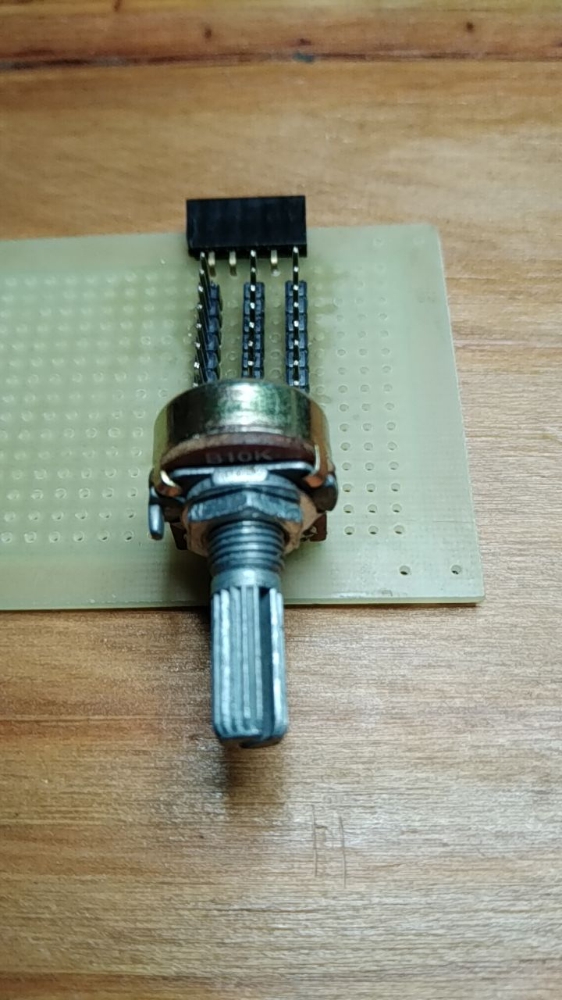
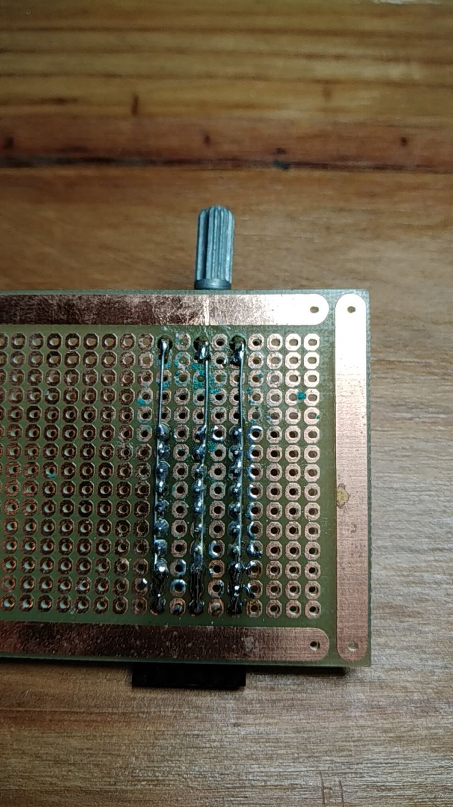

# Test ESP32-C3 ADC

## Motivation

Many sensors output an analogic signal (e.g.: LDR, LM35, Dust Sensors (GP2Y1014AU0F ), ...) 

Microcontrollers can acquire analog signals and convert them to digital signals (numbers and sequence of numbers). The peripheral (microcontroller unit) which does it usually is an Analog to Digital Converter (ADC).

Different microcontrollers have different ADCs, resulting in different ways to use them. It might reach OpCode level (implement a specific machine code to start/stop data acquisition).

Micropython is a firmware that enables (compatible) microcontrollers to interpret Python language and interface them to a programming environment (e.g.: Thonny, rshell, ampy, ...) either wired (USB) or wireless (WiFi + HTTP + Web Sockets + WebREPL).

There are many microcontrollers (e.g.: RP2040, ESP32, ESP8266, STM32, ...) compatible with Micropyhon. Each microcontroller has its ADC hardware (unit).

Microcontrollers have their particularities. For exemple, ESP32 (S, C3) usually have two ADC hardware units on a chip. On ESP32s ADC2 is used when Wi-Fi is active. In this case, ADC2 is not available to the user (https://docs.espressif.com/projects/esp-idf/en/v4.4/esp32/api-reference/peripherals/adc.html#adc-limitations). On ESP32-C3 ADC2 oneshot mode is not usable (https://docs.espressif.com/projects/esp-idf/en/latest/esp32c3/api-reference/peripherals/adc_oneshot.html#hardware-limitations) 

Documentation for ESP32-C3 ADC (and ESP-IDF API) https://docs.espressif.com/projects/esp-idf/en/v4.4.2/esp32c3/api-reference/peripherals/adc.html

Documentation for ESP32S ADC (and ESP-IDF API https://docs.espressif.com/projects/esp-idf/en/v4.4/esp32/api-reference/peripherals/adc.html

Micropython API to ADC is {equal/quite similar} among (compatible) microcontrollers, thus Micropython sets a *compatibility layer*. In other words, a properly written Python program can run on different microcontrollers without modifications.

Micropython documentation for ADC (in any microcontroller?) https://docs.micropython.org/en/latest/library/machine.ADC.html

Micropython documentation for ESP32 ADC https://docs.micropython.org/en/latest/esp32/quickref.html#adc-analog-to-digital-conversion

## Objectives

- Test ADC measurement of various microcontrollers in ESP32 family.
- Build an ADC test circuit and protocol

## Protocol

- Connect some ADC pins to ADC test circuit
- Run test programs through WebREPL (wi-fi active and transceiving)
  - first version of the test program: set an attenuation, make raw reads, make converted reads, check with voltmeter. One read per second during one minute.

## ADC test circuit

It is a voltage divider based on a potentiometer like the one in https://randomnerdtutorials.com/esp32-esp8266-analog-readings-micropython/ on a more permanent build. 

 

Theory on voltage dividers in https://en.wikipedia.org/wiki/Voltage_divider#Resistive_divider . In this particular case, the potentiometer acts as R1 and R2. Vout connection is equivalent to the central pin of the potentiometer. VCC ( 3.3V, Vin) is connected to one of the remaining pins, GND is connected to the other pin. Details on potentiometers: https://en.wikipedia.org/wiki/Potentiometer 

## Program

Micropython constants for ESP32S: https://docs.espressif.com/projects/esp-idf/en/v4.4/esp32/api-reference/peripherals/adc.html#macros

Micropython constants for ESP32-C3: https://docs.espressif.com/projects/esp-idf/en/latest/esp32c3/api-reference/peripherals/adc_oneshot.html#enumerations 

## Test example

## Test example result

## More references

Micropython discussion on ESP32 attenuation: https://forum.micropython.org/viewtopic.php?t=12024
