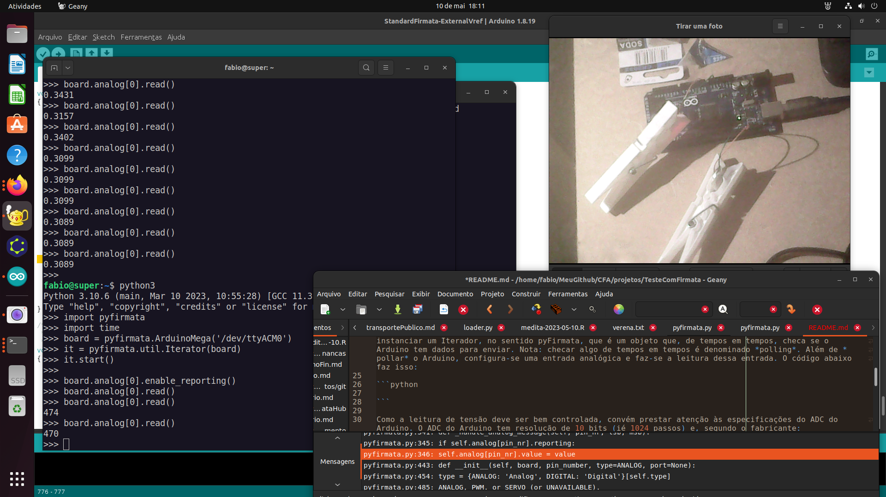

# Teste com Firmata

Firmata é um protocolo para comunicação entre Arduino e Desktop. Sua especificação e o código-fonte do firmware para Arduino está em https://github.com/firmata.

Para usá-lo, instala-se o firmware no Arduino (para isto é necessário Arduino IDE) e instala-se alguma biblioteca de comunicação através de Firmata no Desktop. No caso, uso a biblioteca pyFirmata (https://github.com/tino/pyFirmata) para ler/escrever no Arduino através de um programa em Python.

Ocorreu-me testar Firmata porque tenho uma aplicação em que desejo usar as entradas e saídas do Arduino, conectado a um computador (Desktop) sem que precise programar o Arduino (em C).

Tutoriais sobre como instalar e usar Firmata podem ser encontrados em https://embarcados.com.br/programando-arduino-com-python-primeiros-passos/ , https://roboticsbackend.com/control-arduino-with-python-and-pyfirmata-from-raspberry-pi/ , https://realpython.com/arduino-python/ .

A documentação de Firmata está em https://pyfirmata.readthedocs.io/en/latest/ .

Após instalar o firmware Firmata no Arduino e a biblioteca pyFirmata no Desktop, acender e apagar um LED pode ser feito executando no Desktop os comandos Python abaixo:

```python
import pyfirmata
import time
board = pyfirmata.ArduinoMega('/dev/ttyACM0')
board.digital[13].write(1) # acende LED
board.digital[13].write(0) # apaga LED

```

A aplicação requer ler tensões em circuitos. Para isso uso o Analog to Digital Converter (ADC) do Arduino. Por questões de implementação do pyFirmata (que poderiam ser ocultadas do usuário), é necessário instanciar um Iterador, no sentido pyFirmata, que é um objeto que, de tempos em tempos, checa se o Arduino tem dados para enviar. Nota: checar algo de tempos em tempos é denominado *polling*. Além de *pollar* o Arduino, configura-se uma entrada analógica e faz-se a leitura dessa entrada. O código abaixo faz isso:
 
```python
import pyfirmata
import time
board = pyfirmata.ArduinoMega('/dev/ttyACM0')
it = pyfirmata.util.Iterator(board)
it.start()

board.analog[0].enable_reporting()
board.analog[0].read()

```

Como a leitura de tensão deve ser bem controlada, convém prestar atenção às especificações do ADC do Arduino. O ADC do Arduino tem resolução de 10 bits (ié 1024 passos) e, segundo o fabricante:

23.1 Features
- 10-bit resolution
- 0.5 LSB integral non-linearity
- ±2 LSB absolute accuracy
- 65 to 260μs conversion time
- Up to 15kSPS
- 6 multiplexed single ended input channels
- 2 additional multiplexed single ended input channels
- Temperature sensor input channel
- Optional left adjustment for ADC result readout
- 0 to V CC ADC input voltage range
- Selectable 1.1V ADC reference voltage
- Free running or single conversion mode
- Interrupt on ADC conversion complete
- Sleep mode noise canceler

(Fonte: https://ww1.microchip.com/downloads/en/DeviceDoc/Atmel-7810-Automotive-Microcontrollers-ATmega328P_Datasheet.pdf)

A informação de manual pode não ser confiável. Talvez seja conveniente levantar uma curva de calibração. Outras pessoas já fizeram isso então, por enquanto, vou confiar nesses resultados: https://skillbank.co.uk/arduino/calibrate.htm , https://baltazarstudios.com/accuracy-of-arduinos-adc/

Outro ponto é como configurar o ADC para usar como referência uma referência externa de tensão (ex. uma pilha). Firmata não permite essa escolha (https://github.com/firmata/arduino/issues/39, https://github.com/firmata/arduino/pull/40). Para permitir isso, editei o arquivo `StandardFirmata.ino` e acrescentei na função setup() a linha `  analogReference(EXTERNAL);  // FN 2023-05-10 to use external reference`. O arquivo resultante é `StandardFirmata-ExternalVref.ino`.

Ainda outro ponto é que pyFirmata transforma o inteiro de 10 bits que é lido em um float no intervalo 0,1, arredondado na quarta casa. ié, introduz erro de arredondamento. Para remover a transformação editei a versão local da biblioteca, instalada em `.local/lib/python3.10/site-packages/pyfirmata/pyfirmata.py` - comentei a linha `value=round(...` e inseri a linha que está abaixo dela.

```python
    def _handle_analog_message(self, pin_nr, lsb, msb):
        # value = round(float((msb << 7) + lsb) / 1023, 4)
        value = (msb << 7) + lsb # integer value => no rounding FN 2023-05-10

```

Ajustes feitos, fiz vários testes com duas baterias, uma CR2032 e uma LR41 e as tensões disponíveis na placa (5V e 3V3).



Sobre o ADC do ESP32:
	
- https://docs.espressif.com/projects/esp-idf/en/v4.3/esp32c3/api- reference/peripherals/adc.html
- https://docs.espressif.com/projects/esp-idf/en/v4.4/esp32c3/api-reference/peripherals/adc.html
- https://docs.espressif.com/projects/esp-idf/en/v4.1.1/api-reference/peripherals/adc.html
