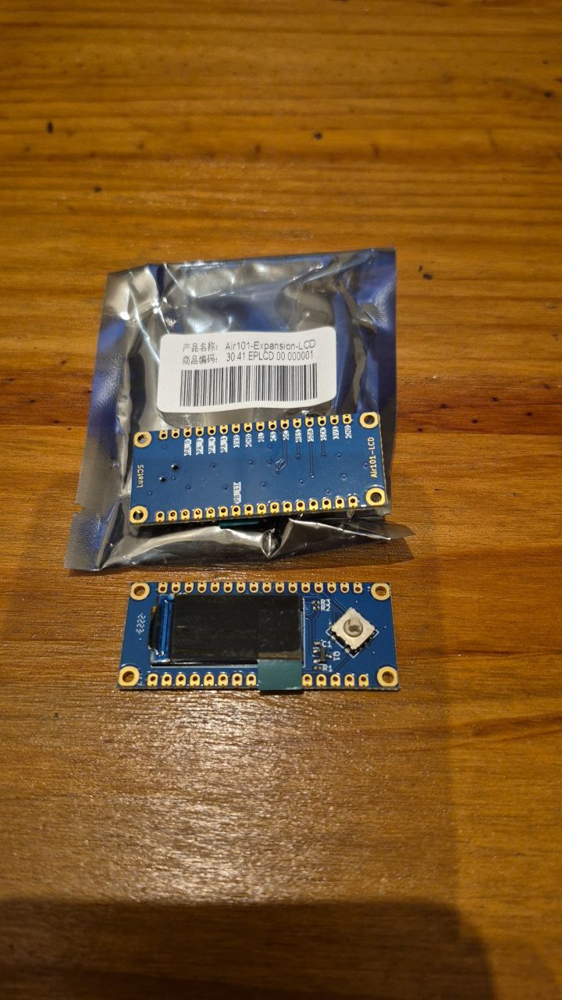

# Trabalho à vista

Tenho algumas placas como esta, foram compradas faz uns anos, estão novas mas parece que não são mais fabricadas.

São placas de expansão de um dispositivo. O dispositivo faz parte de um projeto, assim como o sistema operacional desse dispositivo que, até onde entendi, é baseado na linguagem Lua. Link para o projeto do SO: https://wiki.luatos.org/index.html

O que me atraiu nessa placa de expansão é a presença de um display, aparentemente um OLED, com uma chave do tipo joystick. Essa combinação, na minha opinião, traz bastante usabilidade (no sentido de interface humano-computador) em pequeno tamanho. Comprei sem checar qual era o driver do display e aí é que está a fonte do trabalho.

Se o driver fosse SSD1306 ou SH1106, já tenho experiência em outros projetos, mas o driver parece ser um ST7553S.

Link para documentação da placa: https://wiki.luatos.org/peripherals/lcd_air10x/hardware.html

O que é mau sinal nessa documentação é que a maioria dos links contidos nela está quebrada.

Na documentação informa-se que o driver é para display LCD *colorido* com interface SPI. O datasheet do ST7553S(https://www.waveshare.com/w/upload/e/e2/ST7735S_V1.1_20111121.pdf) também informa isso. 

Em geral a interface SPI usa mais de 4 conexões (fios) mas esta pode usar 4 fios, de acordo com o datasheet.

Só que esse display não parece LCD e nem parece colorido!

Documentação de displays com o mesmo driver, inclusive com driver de software para micropython, mostram um LCD-TFT (https://alastairmontgomery.medium.com/tft-display-st7735-with-micropython-ef48ecbfc278)

Achei exemplos de uso desse display (https://gitee.com/openLuat/luatos-soc-air32f103/tree/master/ModuleDemo/SPI/SPI_Air10x_LCD ), mas entender o suficiente para montar um hardware que consiga executar o exemplo, ou, portar o software para outro hardware parece que vai dar trabalho... ainda mais quando o exemplo só contém protótipos de funções onde deveria ter o corpo delas (https://gitee.com/openLuat/luatos-soc-air32f103/blob/master/ModuleDemo/SPI/SPI_Air10x_LCD/USER/air32f10x_it.c)

Existe referência de 2023 mostrando o display em funcionamento: https://github.com/arendst/Tasmota/discussions/18350

Por enquanto não vejo como colocar esse display para funcionar com a quantidade de esforço que estou disposto a aplicar...

## Outro...

Outro componente que achei interessante é um sensor de distância a laser. Seu código é VL53LOx (https://www.blogdarobotica.com/2025/01/13/como-utilizar-o-modulo-sensor-de-distancia-laser-vl53i0x-com-arduino/ https://github.com/pololu/vl53l0x-arduino). Ele parece mais conveniente que o HC-SR04 porque o sinal não se espalha muito. Ainda não tive tempo para mexer nele...

