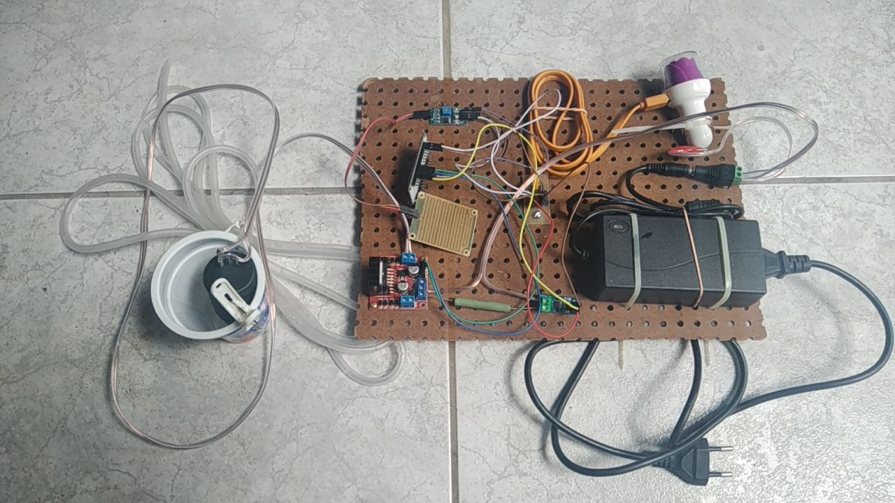

**Atençao**: L298 com motores a 12V e controle a 5V - Aumenta chance de errar conexões e queimar porta USB, ESP32, ... 

link para vídeo do teste armazenado no youtube: https://youtu.be/_JRHtYLH2IU

# Bomba de água, medidor de corrente, sensor de umidade

## Componentes

- Fonte 12V (Conversor 110~240V para 12V 60W) [Foto](./45a59724-433a-4748-ae8e-56996cb202f3.jpeg)
- Fonte 5V (Conversor 12V para 5V 2A): [Foto](./cf908436-0ec3-49ed-9e8d-926aa2564280.jpeg)
- Adaptador de fonte para fio: [Foto](/2023-11-29-161945.jpg)
- Placa de expansão VCC,GND: [Foto](./5bce53eb-ee5d-4659-9164-7bf15ba11e90.jpeg)
- ESP32 Devkit: [Foto](./0f72e6f1-9581-445d-8bbc-886e8d1b1ba6.jpeg)
- Bomba para esguicho de parabrisa: [Foto](./9675b38e-2f70-43a1-ab80-163946a6ff07.jpeg)
- L298: [Foto por cima](./2023-11-29-165023.jpg) , [Foto por baixo](./2023-11-29-165151.jpg)
- ADS712: [Foto](./2023-11-29-165106.jpg)
- Sensor de chuva: [Foto](./2023-11-29-165431.jpg)

**nota**: Os nomes dos pinos podem ser vistos nas fotos e são usados na lista de conexões.

Reguladores lineares (LM78?05, AMS1117) comparados a reguladores chaveados (LM2596, MP1584, XL6009 (Placa), NH-KC24, 134N3P (placa?) ...) comparados a transformadores

[Anotações feitas durante a construção](notas.md).

