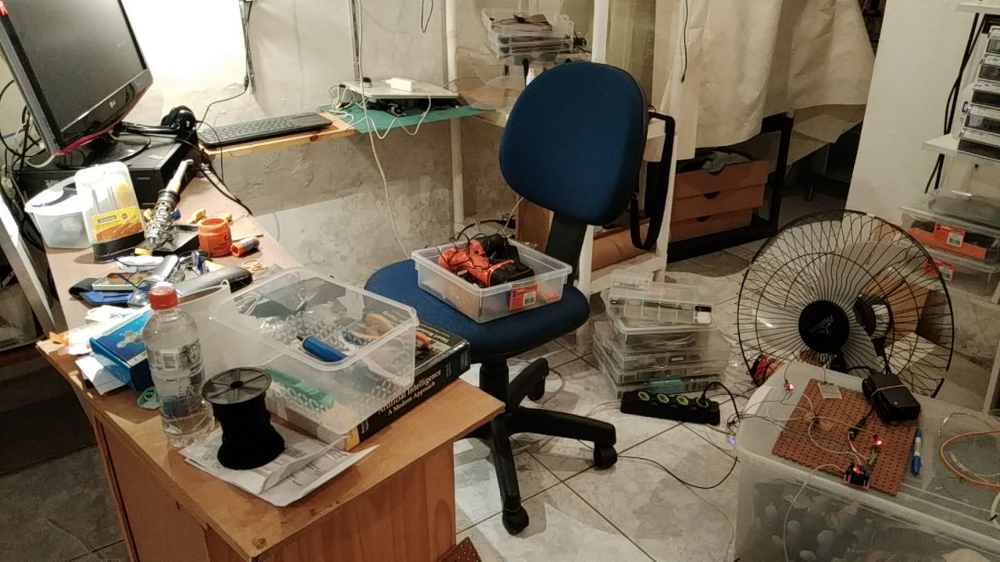

# Bomba de água, medidor de corrente, sensor de umidade

**Atençao**: L298 com motores a 12V e controle a 5V - Aumenta chance de errar conexões e queimar porta USB, ESP32, ... 

Reguladores lineares (LM78?05, AMS1117) comparados a reguladores chaveados (LM2596, MP1584, XL6009 (Placa), NH-KC24, 134N3P (placa?) ...) comparados a transformadores

[Anotações feitas durante a construção](notas.md).

