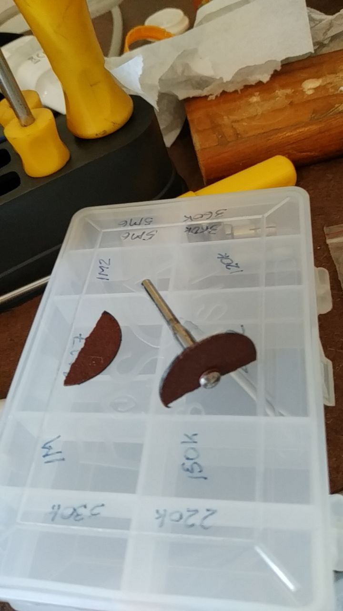

Há momentos em que por mais que se pense e se aja para evitar acidentes, algo passa despercebido e, consequentemente, quebra-se algo...



# Anotações feitas durante a construção

1. Muitas funcionalidades juntas, difícil pensar de maneira organizada, a idéia mais fácil é a que domina, pensamentos circulares, saltando de problema em problema, sem resolver nada.
	- Sugestão: faça um [esquema](./Irriga.jpg), escreva os detalhes.
	No caso, sei que componentes usar então o esquema com nomes de componentes é o caminho. Quando não se sabe que componente usar, pode compensar fazer um esquema com funcionalidades (análise de requisitos);
2. Nesses projetos um problema comum é a falta de pinos 5V e GND para fornecer energia a todos os componentes, então fiz uma [placa auxiliar](./c289f522-1022-4ce8-b70a-801b4493aef2.jpeg) [frente](./5bce53eb-ee5d-4659-9164-7bf15ba11e90.jpeg)
3. Inclui um resistor de 2,2\(\Omega\) para impedir que a corrente suba muito (com este resistor o limite é de cerca de 6A)
4. Tenho os componentes, então [os disponho sobre o que escolhi como base para montagem nas posições que acho melhor](./43340fa7-92b3-49b4-8f2d-a6a808e76eb1.jpeg)
	- Podem ser critérios: distâncias mais curtas, ligações mais curtas, minimizar cruzamento de fios, facilitar o acesso aos terminais, ...
5. Tenho dúvidas sobre como usar alguns componentes. Fui atrás da especificação deles;
	- https://os.mbed.com/users/mikeb/notebook/acs712-hall-effect-current-sensor/
	- file:///home/fabio/Downloads/ACS712_AllegroMicroSystems.pdf
	- O código do componente, impresso sobre ele, permite acessar mais detalhes (ACS712ELCTR-05B-T) é o componente que tenho e que mede corrente elétrica até 5A
	- https://os.mbed.com/teams/TVZ-Mechatronics-Team/code/L298N-Breakout-Test/
	- O L298 tem um regulador de tensão de 5V (LM78M05) então posso usá-lo no lugar da fonte de 5V, desde que forneça corrente suficiente;
	- https://www.alldatasheet.com/view.jsp?Searchword=78m05
	- LM78M05 fornece até 0.5A. O ESP com wifi ligado consome cerca de 0,2A. Até onde sei, é seguro confiar que o restante não passa de 0,3A.
	- para usar o regulador o jumper J5 deve estar colocado e deve se fornecer 12V no pino apropriado (se olhar a especificação com cuidado, algo entre 6V e 12V deve ser ok. Mais de 12V, embora o LM78M05 suporte tensões de até 35V, considerando a corrente consumida, fará ele esquente demais e queimar.
	- **Atençao**: L298 com motores a 12V e controle a 5V - Aumenta chance de errar conexões e queimar porta USB, ESP32, ... 
	- Reguladores lineares (LM78?05, AMS1117) comparados a reguladores chaveados (LM2596, MP1584, XL6009 (Placa), NH-KC24, 134N3P (placa?) ...) comparados a transformadores
6. [Novo esquema](./Irriga-2.jpg)
6. [Nova disposição dos componentes](./529f38c9-492b-47de-b30e-7c4bd8c231f5.jpeg)
7. Gravar micropython no ESP32
	- fiquei irritado porque senti que gastei muito tempo procurando os arquivos e o comando para transferir; 
8. Configurar ESP32 com WebREPL e como Access Point
	- fiquei irritado porque senti que gastei muito tempo procurando os arquivos e o comando para transferir; 
	- Não funcionou de primeira;
	- O monte de fios espalhados me dá nos nervos;
	- Com o Thonny conectado o WebREPL não envia os caracteres que digito na página web;
	- O access point (AP) não inicia e o ESP não dá sinal;
		- Incluí no programa um comando para acender o LED se, ao iniciar o ESP, a interface AP é ativada;
		- parece que precisa esperar um pouco (sleep) para o AP entrar no ar;
9. Montar o circuito e testar o funcionamento ANTES DE FIXAR OS COMPONENTES;
	- Refatorei o código de configAsAP.py para definir funções (estas podem ser chamadas mais de uma vez);
	- `configAsAP.pot.read()` lê do ADS712;
	- `configAsAP.moist.read()` lê do sensor de umidade;
	- `configAsAP.pump.on()` liga a bomba;
	- `configAsAP.pump.off()` desliga a bomba;
10. O ESP32 tem dois ADCs. O ADC2 é usado pelo wifi e não pode ser usado junto com o wifi ligado (https://docs.espressif.com/projects/esp-idf/en/latest/esp32/api-reference/peripherals/adc_oneshot.html#hardware-limitations).
11. Há [relatos de ruído no ADC1](https://esp32.com/viewtopic.php?t=27599 , https://arduino.stackexchange.com/questions/89091/esp32-adc-wifi-issue)
12. Para saber se o pino é um canal do ADC1 ou do ADC2, recorra à [pinagem do ESP32](https://lobodarobotica.com/blog/wp-content/uploads/2020/09/ESP32-Pinout.jpg)


```
Hardware Limitations
Random Number Generator (RNG) uses ADC as an input source. When ADC adc_oneshot_read() works, the random number generated from RNG will be less random.

A specific ADC unit can only work under one operating mode at any one time, either continuous mode or oneshot mode. adc_oneshot_read() has provided the protection.

ADC2 is also used by Wi-Fi. adc_oneshot_read() has provided protection between the Wi-Fi driver and ADC oneshot mode driver.

ESP32-DevKitC: GPIO0 cannot be used in oneshot mode, because the DevKit has used it for auto-flash.

ESP-WROVER-KIT: GPIO 0, 2, 4, and 15 cannot be used due to external connections for different purposes.
```

1. Quando a realidade mostra quem manda: ESP não inicia quando alimentado pelo LM78M05
	- O brilho do LED de energia do ESP varia periodicamente. Isto indica que em alguma fase do boot ou da execução de programas a tensão da fonte cai (geralmente porque o ESP puxa muita corrente). Isto pode indicar algo mais. Se a tensão da fonte cai demais o ESP reinicia, logo, nunca sai da inicialização. 
	- Da forma como escrevi o código do `configAsAP.setup()`, se o AP iniciar o LED ligado ao pino 2 acende. Isto não acontece quando o ESP é alimentado pelo 78M05;
	- Medi a tensão com o multimetro. Aprox. 4,8V quando o LED está com brilho máximo, aprox. 4,6V quando o LED está com brilho mínimo;
	- A solução que me ocorre é voltar ao projeto inicial, com fonte de 5V.
	- Toda aquela conversa do LM78M05 e o tempo gasto para implementar jogado fora.

No sensor ADS712-5B o valor de 185mV/A indica que a cada ampére adicionado/subtraído na carga o valor na saída aumenta/diminui em 185mV. 

A resolução do ADC1 do ESP32 é 12-bits, ou seja, 4096 passos. Com a constante `ADC.ATTN_11DB` que uso na configuração do ADC, o valor 4095 corresponde a 3,3V. Consequentemente cada passo corresponde a aproximadamente 0,8mV. 

Juntando a variação da tensão de saída do ADS712-5B com o ADC1 do ESP32, a variação de 1 ampére resulta em variação de 231 passos. 

A tensão da saída do ADS712 com corrente de carga zero é de 2,5V o que corresponde, em tese, a uma leitura de aproximadamente 3100 no ESP32. Se o motor consumir 1A então a leitura irá para 3331, se o motor consumir 2A então a leitura irá para 3562 e assim por diante. 

Na prática pode haver variações. Por exemplo, no protótipo que montei, medindo a corrente do circuito todo, a leitura base é da ordem de 2900 e ligando o motor é da ordem de 3100.

O sensor de umidade do solo, para a entrada analógica, é ligado diretamente à entrada ESP32 (https://components101.com/modules/soil-moisture-sensor-module).

Uma fonte diferente ensinando formas de fornecer energia ao esp: https://techexplorations.com/guides/esp32/begin/power/

Modelos de fontes:
	
https://www.google.com/search?q=esp32+devkit+vin&sca_esv=586327572&ei=qmhnZfzNO7_K1sQPoMSFsAU&ved=0ahUKEwj8yuum0umCAxU_pZUCHSBiAVYQ4dUDCBA&uact=5&oq=esp32+devkit+vin&gs_lp=Egxnd3Mtd2l6LXNlcnAiEGVzcDMyIGRldmtpdCB2aW4yBxAAGIAEGBMyBxAAGIAEGBMyCBAAGBYYHhgTMggQABgWGB4YEzIIEAAYFhgeGBMyCBAAGBYYHhgTMggQABgWGB4YEzIIEAAYFhgeGBMyCBAAGBYYHhgTMggQABgWGB4YE0igKVCbDljKIXABeAGQAQCYAY4BoAHKCaoBBDAuMTC4AQPIAQD4AQHCAgoQABhHGNYEGLADwgIFEAAYgATCAgYQABgWGB7CAggQABgWGB4YCsICCxAAGIAEGLEDGIMB4gMEGAAgQYgGAZAGCA&sclient=gws-wiz-serp
https://techfun.sk/en/product/boost-charging-discharge-circuit-134n3p-for-lithium-batteries-1a/
https://techfun.sk/wp-content/uploads/2021/09/ce8301-datasheet.pdf
https://pt.aliexpress.com/item/33061491952.html?src=google&src=google&albch=shopping&acnt=768-202-3196&slnk=&plac=&mtctp=&albbt=Google_7_shopping&isSmbAutoCall=false&needSmbHouyi=false&albcp=18265477163&albag=&trgt=&crea=pt33061491952&netw=x&device=c&albpg=&albpd=pt33061491952&gad_source=1&gclid=Cj0KCQiA35urBhDCARIsAOU7QwmMmn4mhAID6ypPGeTgw3F7wNxhdRtWg4qbWvtldgs-EeaBRFvWqLEaAgHqEALw_wcB&gclsrc=aw.ds&aff_fcid=2e6eba8973aa4aa781ff4d7bb29d2619-1701264141063-06824-UneMJZVf&aff_fsk=UneMJZVf&aff_platform=aaf&sk=UneMJZVf&aff_trace_key=2e6eba8973aa4aa781ff4d7bb29d2619-1701264141063-06824-UneMJZVf&terminal_id=40c46bd3639748708a05cfd36b6cac59&afSmartRedirect=y
https://www.wjcomponentes.com.br/fontes/regulador-de-tensao-step-up-xl6009?parceiro=6298&gad_source=1&gclid=Cj0KCQiA35urBhDCARIsAOU7Qwn6KP2rjBX36EJRUGKrfmdB1vIDD_xjX02dZO67x3ZzOY2_gMqLkeoaAryOEALw_wcB
https://produto.mercadolivre.com.br/MLB-1682480893-kit-3-pecas-regulador-de-tenso-step-down-powerbank-5v-usb-_JM?matt_tool=56291529&matt_word=&matt_source=google&matt_campaign_id=14303413604&matt_ad_group_id=133074303519&matt_match_type=&matt_network=g&matt_device=c&matt_creative=584156655498&matt_keyword=&matt_ad_position=&matt_ad_type=pla&matt_merchant_id=109757862&matt_product_id=MLB1682480893&matt_product_partition_id=1799378579933&matt_target_id=pla-1799378579933&gad_source=1&gclid=Cj0KCQiA35urBhDCARIsAOU7QwkVp5UF5E33nw7G0EwlpoS3mgWPURP_UXr-Sp7srNwNZzuJ_U79bLEaAi6aEALw_wcB
https://www.baudaeletronica.com.br/produto/mini-regulador-conversor-de-tensao-dc-ajustavel.html?utm_source=Site&utm_medium=GoogleMerchant&utm_campaign=GoogleMerchant&gad_source=1&gclid=Cj0KCQiA35urBhDCARIsAOU7QwkXijLE-NO37QwxbzxspXyYBTx9hcHnyuRM8bb1doU3nl1Q_uiab7AaAjN6EALw_wcB
https://www.baudaeletronica.com.br/produto/modulo-regulador-de-tensao-lm2596-com-ajuste-de-tensao-e-corrente.html?utm_source=Site&utm_medium=GoogleMerchant&utm_campaign=GoogleMerchant&gad_source=1&gclid=Cj0KCQiA35urBhDCARIsAOU7QwkPutfHaklDlhdWQqsEviIsJpayJjVcUtVGsAwTi3NtiNmDxsoS_toaAkNsEALw_wcB
https://www.baudaeletronica.com.br/produto/mini-regulador-conversor-de-tensao-dc-dc-step-down.html
https://www.autocorerobotica.com.br/modulo-regulador-de-tensao-step-up-e-carregador-para-bateria-de-litio-134n3p

