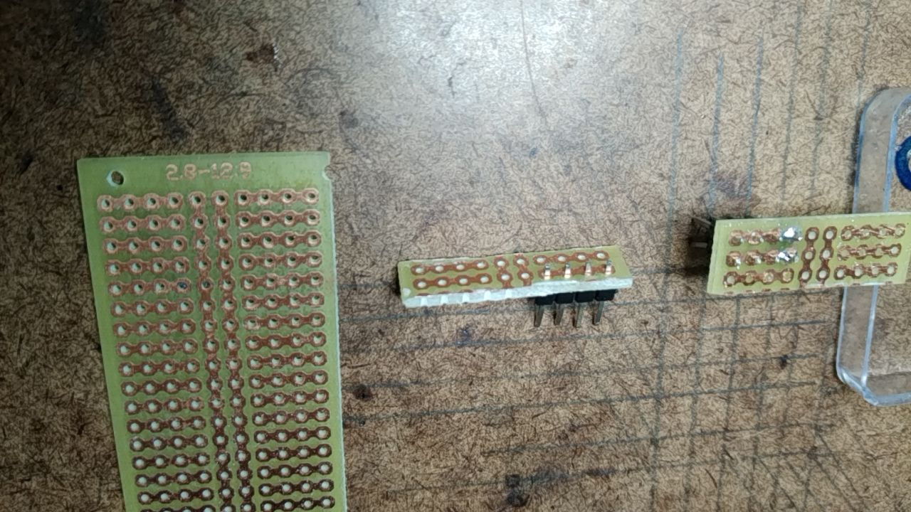
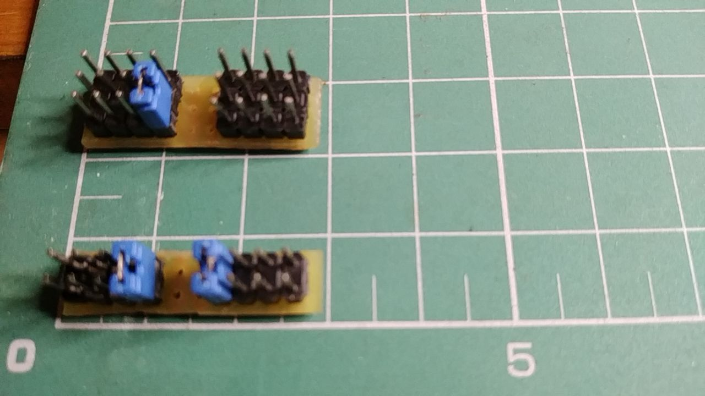

# Power and signal distribution

## Motivation

In some projects there is not enough pins to connect components. For example, connect ESP32 3V3 pin to three other components, say, a SSD1306 OLED Display, a MPU-6050 accelerometer and a BMP280 atmospheric pressure and temperature sensor.

On early stages of development, protoboard and jumpers are used to connect these pins. On a little later stages, when prototypes should be embedded on clothes, protoboards can be bulky and uncomfortable. It this project we proppose an alternative to protoboards.

## Vocabulary

- Printed Circuit Board (PCB) - an insulator plate with copper tracks on, at least, one side. Component terminals can be passed through holes (eyelets) and soldered to the tracks. (See https://en.wikipedia.org/wiki/Printed_circuit_board)
- Eyelet - A pass-through hole on a PCB.
- Track - A continuous copper path on a PCB.
- Standard Designed PCB (stdPCB) - a PCB with a standard pattern of eyelets and tracks. This kind of board is employed to prototype electronic circuits. (See https://curtocircuito.com.br/placa-de-circuito-impresso-ilhada-2-8x12-9-cm.html , https://curtocircuito.com.br/placa-de-circuito-impresso-ilhada-5x10-cm.html and figure 1 left)
- PCB row - a row of eyelets (holes) on an stdPCB. Most stdPCBs are matrices of holes so row or column is a convention stated in the documentation. **note** the holes in a PCB row may not be electrically connected.
- distribution row - a row of *electrically connected* eyelets on a stdPCB
- pin header - an electrical component: a number of metal pins on a plastic support. (See https://en.wikipedia.org/wiki/Pin_header)
- strap - a short jumper that may connect two neighboring pins in a pin header. See https://en.wikipedia.org/wiki/Jumper_(computing)  
- jumper - a jump wire. See https://en.wikipedia.org/wiki/Jump_wire
 
## Context

There are some standard designed Printed Circuit Boards (stdPCB) as in the left side of figure 1. They can be bought in almost any electronic components shop.

Figure 1

In this particular stdPCB a PCB row has 10 holes and a distribution row has 4 holes - notice, in figure 1, a copper track connecting 4 holes, 2 holes connected to vertical tracks and other 4 holes connected by another copper track.

### Method

1. Plan circuit connections
2. Count the number of distribution rows
3. Cut stdPCB as necessary
4. Solder pin headers
5. Add straps when necessary.

#### Mounting

For the two examples, stdPCB (figure 1 left) is cut in two pieces. One piece (figure 1 middle) has four distribution rows the other has six ditribution rows (figure 1 right). One distribution row has four eyelets (holes) connected by a copper track.

All holes in a distribution row are soldered to a pin in a header consequently all pins are electrically connected. One distribution row with header pins inserted (not soldered) can be seen on figure 1 middle.

### Examples

#### 1: ESP32, two accelerometers, two addressable LED strands, one power bank

Connection table - each column except the last one correspond to a component. The first row on the table contains component designation (ESP is the dev kit, ac-1 and ac-2 are accelerometers, fl-1 and fl-2 are addressable LED strands, PB is a power bank).Each (other) table row contain all the pins that are connected together. The pin name (designation in the component of the column) is written in the cell. (*)USB cable **must be disconnected** when Power bank is connected. (**) If only two pins should be connected, the pins can be connected using a jumper - no need to be distributed. 

| ESP | ac-1 | ac-2 | fl-1 | fl-2 | PB | Number of distribution rows |
| --- | --- | --- | --- | --- | --- | --- |
| 5V | --- | --- | 5V | 5V | 5V* | 1 |
| 3V3 | 3V3 | 3V3, AD0 | --- | --- | --- | 1 |
| GND | GND | GND | GND | GND | GND | 2 |
| GPIO (used as SCL) | SCL | SDA | --- | --- | --- | 1 |
| GPIO (used as SDA) | SCL | SDA | --- | --- | --- | 1 |
| GPIO (used to send data to LEDs) | --- | --- | Di | --- | --- | 0** |
| GPIO (used to send data to LEDs) | --- | --- | --- | Di | --- | 0** |

One distribution row has four (4) pins. If more than four connections are necessary, two (or more) rows are tied together with a strap.

From the table above, 6 distribution rows are necessary, two of them are connected with a strap. 

#### 2: ESP32, one vibration motor, one LDR, one UV sensor, one touch sensor, one OLED display

Connection table - each column except the last one correspond to a component. The first row contains component designation (ESP is the dev kit, VIB is a vibration motor). Other rows contain all the pins that are connected together. The pin name (designation in the component of the column) is written in the cell. (**) If only two pins should be connected, the pins can be connected using a jumper - no need to be distributed. 

| ESP | VIB | LDR | UV | Touch | Display | Number of distribution rows |
| --- | --- | --- | --- | --- | --- | --- |
| 3V3 | --- | 3V3 | 3V3 | 3V3 | 3V3 | 2 |
| GND | BLACK | GND | GND | GND | GND | 2 |
| GPIO (used as digital output) | RED | --- | --- | --- | --- | 0** |
| GPIO (used as analog input) | --- | LDR signal output | --- | --- | --- | 0** |
| GPIO (used as analog input) | --- | --- | UV signal output | --- | --- | 0** |
| GPIO (used as digital input) | --- | --- | --- | Touch Signal Output | --- | 0** |
| GPIO (used as SCL) | --- | --- | --- | --- | SCL | 0** |
| GPIO (used as SDA) | --- | --- | --- | --- | SDA | 0** |

From the table above, 4 distribution rows are necessary, two pairs of them are connected with one strap each. 

Figure 2 - Finished distributors. Six row distributor above, with its left-side rows 2 and 3 connected with a strap; four row distributor below, with left side rows connected with a strap and right side rows connected with another strap.

