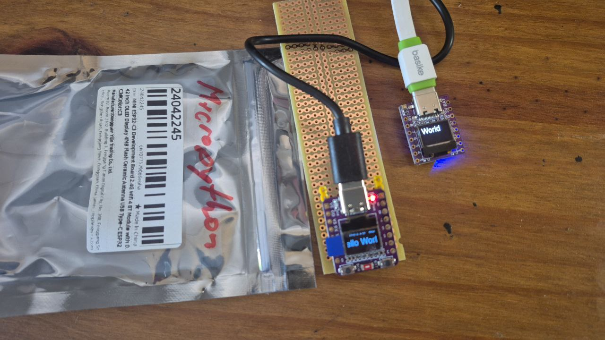

# Display OLED e fontes maiores no ESP32-c3 supermini



Na foto, o da direita é o da 01Space (https://github.com/FNakano/CFA/tree/master/componentes/controladores/ESP/ESP32#esp32-c3-042lcd), o da esquerda é um genérico que encontrei no aliexpress ...

## Conclusão

Sim, é possível usar letras (fontes) maiores no ESP32-C3 supermini e no ESP32-C3 da O1Space.

**nota**: no componente genérico o driver de display pode ser SH1106 ou SSD1306; OU se testar o driver do SSD1306 o driver do SH1106 passa a funcionar (?!) veja o final da seção Comentários.
 
## Objetivo

Verificar se é possível usar fontes maiores sem recompilar Micropython e, se for possível, documentar como fazer. Apresentar todo o código-fonte, referências e comentários (próprios e de terceiros).

## Motivação

Os displays OLED para ESP32 costumam ser menores que 1" diagonal e ter 128x64 pixels. Nos drivers mais comuns a fonte (letra/tipo) disponível tem 8 pixels. A combinação de display e fonte resulta em textos de difícil leitura, por terem letras muito pequenas. 

Usar fontes maiores permite melhorar e expandir a usabilidade do dispositivo. Para isso é desejável usar fontes maiores.

Caso, para usar fontes maiores seja necessário recompilar Micropython, essa solução pode tornar-se pouco prática já que Micropython é um projeto extenso e com muitas variações, logo, recompilá-lo requer um grande conjunto de ferramentas e é um processo trabalhoso. Por isso, deseja-se uma solução que não requeira recompilar Micropython.

O procedimento passa por explorar a Internet à busca de soluções e informação que possam ser combinadas para atingir o objetivo proposto. Caso já exista solução pronta, este trabalho se resume a fazer uma cópia (clonar) e referenciar essa solução.

## Resultado

Foi encontrada a solução https://github.com/peterhinch/micropython-font-to-py/ . *Font to py* contém 

1. um programa que converte fontes no formato `ttf` ou `otf` para mapas de bits em um arquivo-fonte (módulo) Python;
2. esse arquivo é carregado com um `import` e usado em displays que usam a classe `framebuffer` na construção do driver de display. Este é o caso do driver para display OLED SSD1306;
3. para usar o frame buffer dentro do driver de display usa-se a classe Writer (https://github.com/peterhinch/micropython-font-to-py/tree/master/writer) O exemplo simples de uso está em https://github.com/peterhinch/micropython-font-to-py/blob/master/writer/WRITER.md#21-the-writer-class

Esta solução foi testada em um 01Space ESP32-C3 com display OLED de 0.42" e em um ESP32-C3 supermini com display de mesmo tamanho. O código fonte para 01Space está em ./src/pyboard e o código fonte para ESP32-C3 supermini está em ./src-sh1106/pyboard.

Para testar o funcionamento, em um REPL ou em uma IDE como Thonny, depois de conectar a placa, transferir todos os arquivos do /src/pyboard adequado e usar o comando `import largerFontSSD1306` ou o comando `import largerFontSH1106`, conforme a placa e driver de display que estiver usando. Este teste é autocontido no sentido de não necessitar de mais módulos nem mais informação (ex. via web) para ser executado. O resultado é apresentado na foto inicial (acima).

### Outros resultados

- `import scani2c` configura I2C e busca por dispositivos conectados. Tanto SSD1306 quanto SH1106 respondem no endereço 0x3C, em decimal, 60;
- `import dispsh1106` e/ou `import dispssd1306` imprimem uma mensagem com fontes no tamanho padrão, que costuma ser 8pt.

Para informação sobre eventos inesperados, veja a seção Comentários, abaixo. 


## Comentários

Pode ser necessário clonar a solução pois o desenvolvedor original pode modificar seu projeto e fazê-lo incompatível com versões anteriores, isto *quebra* este projeto. A maneira de evitar essa *quebra* é clonar o projeto.

Sobre os componentes, o da 01Space tem a distância entre as fileiras de terminais que não é múltipla de décimo de polegada de maneira que usar esse componente sobre uma placa de circuito impresso padrão é mais difícil. O genérico tem a distância entre as fileiras de terminais múltipla de décimo de polegada.

Tive algum problema com o da 01Space que me impede de atualizar o Micropython - o componenente não aceita ser programado com `esptool` então não tenho como atualizar o Micropython instalado nele. A versão instalada é 1.19.0 . No genérico posso atualizar. A versão instalada é 1.23.0 . Instruções para download e instalação de Micropython em https://micropython.org/download/ESP32_GENERIC_C3/ - para mim esta versão serviu para o ESP32-C3 supermini e para o 01Space.

O da 01Space usa driver de display modelo SSD1306 (https://github.com/micropython/micropython-esp32/blob/esp32/drivers/display/ssd1306.py), o genérico usa driver de display modelo SH1106 (https://github.com/robert-hh/SH1106).

O display do supermini tem intensidade menor que a do display do 01Space.

Não pretendo usar o componente da 01Space novamente. Não consigo atualizar o firmware e tenho crescente dificuldade em fazê-lo conectar com Thonny (https://thonny.org/).

A interface (ou o driver) I2C do ESP32-C3 parece ter algum problema - talvez inicialização de variáveis - pois:

- Num teste ontem `i2c=machine.I2C(0)` foi suficiente para o I2C enviar as mensagens para o display, mas num teste hoje, fazia o 01Space desconectar do Thonny;
- Hoje tive que usar `i2c=machine.I2C(0, sda=machine.Pin(5), scl=machine.Pin(6))`, mas a mensagem quando digito `i2c` é `I2C(0, scl=6, sda=5, freq=851063)`. Essa frequência deve ser entre 100000 e 400000, segundo a especificação do barramento i2c e, quando ajustada no construtor, é de 40000 (um zero a menos): `i2c  = I2C(0, scl=Pin(6), sda=Pin(5), freq=40000)` - talvez isso dê problema em algum momento...

Comentários novos em 2025-08-13 para completar a documentação

Retornei a esse componente, consegui usar do display OLED, documentei (parcialmente) em https://github.com/FNakano/CFA/tree/master/projetos/py-LargerFont no commit anterior ao desta data. Ocorre que, estranhamente, diferentes instâncias do componente parecem ter comportamentos diferentes. Esse que foi documentado até este ponto da documentação foi o primeiro que testei. O segundo que testei, em 2025-08-13, não funcionou com o programa para SH1106 que documentei acima. Testei todos os programas para Micropython para esse componente com SH1106 apresentados em https://electronics.stackexchange.com/questions/725871/how-to-use-onboard-0-42-inch-oled-for-esp32-c3-oled-development-board-with-micro , nenhum funcionou. Como eu havia usado tanto o driver para SH1106 quanto o driver para SSD1306 e desconfiei que isto poderia ter modificado alguma configuração do hardware (embora eu ache que modificar configuração de um display desse jeito seja improvável...), resolvi executar um programa para SSD1306 que copio e referencio abaixo:
  
```python
import machine
import ssd1306

i2c = machine.SoftI2C(scl=machine.Pin(6), sda=machine.Pin(5))

oled = ssd1306.SSD1306_I2C(128, 64, i2c)
oled.fill(0)
oled.text("Micro", 27, 24)
oled.text("   Python", 27, 34)
oled.text("123456789", 27, 44)
oled.text("M_._,_._._", 27, 56)
oled.show()
# https://electronics.stackexchange.com/a/752793
```
  
Surpreendentemente, o display funcionou!! Mais supreendentemente ainda, o programa do projeto (o anterior, que não tinha funcionado) passou a funcionar. Onde funcionar significa mostrar mensagens no display.

**nota**: as referências do forum do micropython foram removidas (visto em 2025-08-13)

MISTÉRIO RESOLVIDO: HÁ FORNECEDORES/FABRICANTES QUE USAM SSD1306 E OUTROS QUE USAM SH1106 . QUANDO GRAVAR MICROPYTHON, TESTAR QUAL DISPLAY É COM O PROJETO https://github.com/FNakano/CFA/tree/master/projetos/py-C3-2025

Consultei algumas páginas de projetos com essa placa que usam linguagem C: https://emalliab.wordpress.com/2025/02/12/esp32-c3-0-42-oled/ , https://www.reddit.com/r/esp32/comments/17jsq2w/esp32_with_oled_not_displaying/ , https://github.com/Pharkie/ESP32-C3-OLED-Demo

## Outras referências acessadas mas não citadas

- https://forum.micropython.org/viewtopic.php?t=11399
- https://www.reddit.com/r/esp32/comments/1jgxpd8/got_a_super_mini_esp32c3_with_042in_oled_finally/
- https://docs.micropython.org/en/latest/library/machine.I2C.html
- https://forum.arduino.cc/t/make-esp32-c3-super-mini-work-with-oled-displays/1248802/12
- https://www.reddit.com/r/esp32/comments/1boaxjn/esp32c3_super_mini_with_i2c_and_spi_connections/
- https://forum.micropython.org/viewtopic.php?t=10330
- https://forum.micropython.org/viewtopic.php?t=2650
- https://github.com/nickpmulder/ssd1306big
- 
