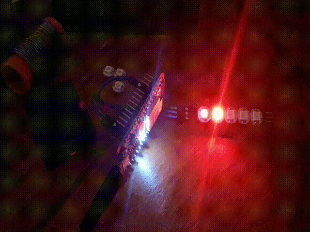

# ESP32-C3 + Micropython + Neopixels

**notice**: this is work in progress



## Objective

Clarify and test Neopixels (addressable RGB LEDs) driven by a program (written in Python) and run on various ESP32 dev kits


-C3 (Ai-Thinker ESP32-C3-12F Kit)

## Motivation

Directly drive devices designed for 5V logic with a 3.3V Microcontroller may be difficult. Logic level thresholds may not be achieved, causing data corruption which compromises overall results. This is the case when driving Neopixel addressable LEDs with ESP32.

### Theory

Voltage ranges expected to encode HIGH(1) and LOW(0) logic levels depend (largely) on physical characteristics of the device construction. A 100% guarantee that a particular device is compliant is (statistically) impossible, but 99.9%+ guarantee is (statistically) achievable.

Device manufacturers usually inform customers about the  ranges in standard conditions. 

### Application of the theory

For example, Neopixel LEDs (component code: WS2812B) *Electrical Characteristics* table in its *datasheet* states: minimum input voltage for HIGH logic level is $V_{IH}=0.7*V_{DD}$  and maximum input voltage for LOW logic level is $V_{IH}=0.7*V_{DD}$ in temperatures in -20~+70C range and VDD=4.5~5.5V (https://cdn-shop.adafruit.com/datasheets/WS2812B.pdf)

According to the datasheet power supply voltage must be in 3.5~5.5V range. Thus it is not guaranteed that it operates properly at 3.3V power supply.

USB port voltage is expected to be 5V. ESP Dev Kit boards contain a voltage regulator to drop it to 3.3V. Supply 5V to Neopixels and 3.3V to ESP32 is fairly expectable. On this condition, Neopixel $V_{IH}=3.5V$ and $V_{IL}=0.9V$. Even if ESP32 signal output is equal to its power supply, ié 3.3V it is still below 3.5V. Theoretically, propper communication between Neopixels and ESP32 is NOT guaranteed.

Subtleity: USB port voltage may be a litte lower than 5V. If USB port voltage drops to 4.5V, Neopixel $V_{IH}=3.15V$ and it should operate correctly.

#### Usefulness

Many wearable devices use Neopixels

A procedure to test Neopixels driven by ESP32 would save time when designing/constructing a wearable device.

A documented list of experiments (tests) would improve designers knowledge.

### Circuit

Find a suitable ESP32 GPIO Pin to send data to Neopixels (on AiThinker ESP32-C3-12F I successfully used GPIO2).

| ESP32-C3 | Neopixel 1 | Neopixel 2 | Neopixel 3 | Neopixel 4 | Neopixel 5 |
| --- | --- | --- | --- | --- | --- |
| 5V | 5V | 5V | 5V | 5V | 5V |
| GND | GND | GND | GND | GND | GND |
| GPIO2 | DIn | --- | --- | --- | --- |
| --- | DOut | DIn | --- | --- | --- |
| --- | --- | DOut | DIn | ---  | --- |
| ---  | --- | --- | DOut | DIn | --- |
| --- | ---  | --- | --- | DOut | DIn |

### Test Program

`knight.py` contains functions to test Neopixel LEDs. It is based on the `neopixel` package which is documented here: https://docs.micropython.org/en/latest/esp8266/tutorial/neopixel.html

It is expected that the tester builds the circuit, opens `knight.py` in Thonny editor, save it into ESP32 and press the Play (green) button to run it. Type `cKnight(np, 10)` in Thonny shell (REPL) and see the same effect of the image above.

<!--- ffmpeg -i ~/Downloads/video4999509225815147373.mp4 -s 640x480 -r 7 -filter:v "setpts=PTS/2" -ss 00:00:01 -to 00:00:02.1 output.gif
 --->

```python
import neopixel
import machine
import time

def fade (np, f):
# reduce brightness of all LEDs (integer division by f)
    aux=[0,0,0]
    for i in range(0,np.n):
        aux[0]=np[i][0]//f
        aux[1]=np[i][1]//f
        aux[2]=np[i][2]//f
        np[i]=tuple(aux)

def knightRider(np, f, color=(200,0,0)):
  # default color is RED, you may try other colors (200, 100, 0) is Zetton :)
    for i in range(0,np.n):
        fade(np, f)  # reduce brightness of all LEDs
        np[i]=color # strong light the (current) first LED
        np.write()
        time.sleep(0.2)
    for i in reversed(range(0, np.n)):
        fade(np, f)
        np[i]=color
        np.write()
        time.sleep(0.2)

def cKnight(np, f, color=(200,0,0)):
    while (True):
        knightRider(np, f, color)

nnp=5 # number of neopixels
npp=2 # neopixels data pin

np=neopixel.NeoPixel(machine.Pin(npp), nnp)

```


### Comments

Using my desktop USB as power supply, I did not notice any communication fail between ESP32-C3 and Neopixels.

I like Knight Rider TV series... and Ultraman TV series...

