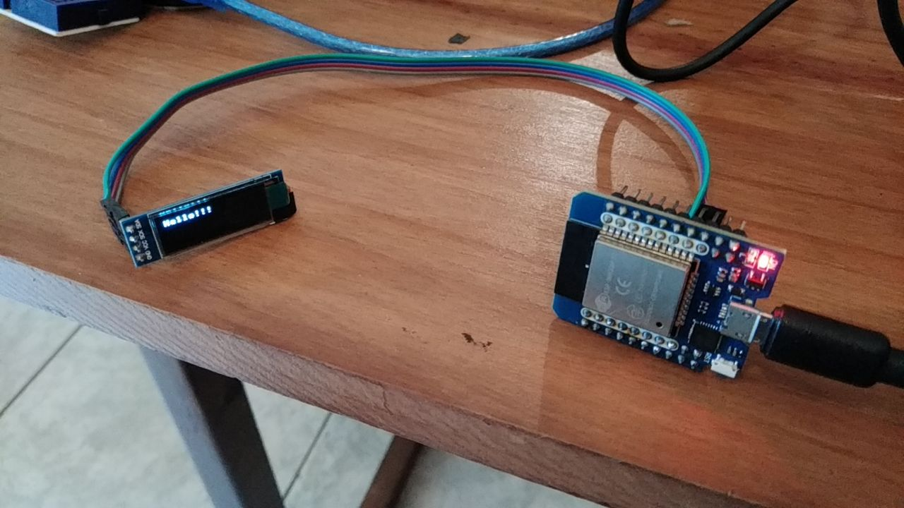

## Objetivo geral

Apresentar informação compilada a respeito do uso do display OLED no ESP32 programado com Micropython.

## Objetivo específico

Montar um circuito que mostra uma mensagem de texto em um display OLED conectado a um ESP32

## Introdução

Displays OLED, no contexto de *Faça você mesmo*, Arduino, ... são pequenas telas monocromáticas, muito úteis para mostrar mensagens no ESP quando este não está conectado no computador ou no WiFi.

Há vários tipos de display OLED, uns com 128x96 pixels, outros com 128x32 pixels, uns com pixels brancos, outros com pixels azuis, ... Todos usam o controlador SSD1306 (sim, o controlador de display comunica-se com o microcontrolador ESP).

Algumas placas suportadas por MicroPython têm o pacote que contém a API do display pré-compilada e empacotada no Micropython, não é o caso de ESP32 (tente `help ('modules')` no ESP para ver uma lista mais ou menos completa de pacotes disponíveis sem necessidade de *download*).

Há várias maneiras de obter o pacote que contém a API do display, lembrando que cada uma pode gravar versões diferentes do pacote em pastas diferentes no ESP, o que pode causar alguma confusão.

É difícil dizer qual fonte é a melhor pois Micropython é um projeto em andamento e ocorrem grandes modificações. No momento (2024-10), o código do driver que tem suporte de micropython.org está em https://github.com/micropython/micropython-lib/tree/master/micropython/drivers/display/ssd1306 . Meu buscador ainda retorna com mais importância o driver no repositório arquivado: https://github.com/micropython/micropython-esp32/blob/esp32/drivers/display/ssd1306.py

A documentação sobre como usar o driver é mais completa para ESP8266 (https://docs.micropython.org/en/latest/esp8266/tutorial/ssd1306.html#using-a-ssd1306-oled-display) que para ESP32 (inexistente). Embora muita informação se aplique pois a API é a mesma, alguma informação, como a atribuição de pinos de comunicação, é diferente, o que pode gerar confusão.

Como Micropython tem gerenciadores de pacote (`upip` - seu uso deve ir diminuindo; e `mip` - este parece o preferido atualmente), era de se esperar que houvesse comandos de gerenciador de pacotes para instalar o driver, MAS não há. (**nota**: como `mip` tem organização decentralizada, fica difícil administrar os pacotes...)

## Circuito e explicações

Tabela de conexões:
| Pino no display | Pino do ESP32 |
| --- | --- |
| SCL ou SCK | 18 |
| SDA | 19 |
| GND | GND |
| VCC | VCC |

**nota**: Tanto o display quanto o ESP operam a 3,3V e têm reguladores de tensão para baixar os 5V da USB para os 3,3V necessários por isso os níveis lógicos dos sinais de controle do display e do ESP são iguais.

Cada linha da tabela acima corresponde a um jumper que conecta o pino do display ao pino do ESP32. O display se comunica com o ESP através do protocolo i2c. Os pinos 18 e 19 do ESP correspondem ao canal 0 do i2c por *hardware* no Micropython. Há muito mais informação sobre esse assunto, aqui limito-me ao (que acho) mínimo necessário. Enquanto eu não escrever sobre i2c, um ponto de partida é https://docs.micropython.org/en/latest/esp32/quickref.html#hardware-i2c-bus .

É possível desenhar um modelo de camadas:
  
<pre>
----------------
| Seu programa |
----------------
| API ssd1306  |
----------------
| API i2c      |
----------------
| Hardware     |
----------------
</pre>

A tabela de conexões faz parte da camada de Hardware. As APIs podem ser consideradas interfaces entre hardware e software. Seu programa pode ser considerado software.

## Pacotes necessários

O pacote (arquivo) `ssd1306.py` é necessário no microcontrolador. Ele pode ficar na raiz (mesma pasta que contém o `boot.py`). Que eu saiba, não há comando `upip` ou `mip` para baixá-lo. A solução é qualquer variação de baixar (inclusive copiar e colar). O arquivo mais recente (em 2024-10) está em https://github.com/micropython/micropython-lib/blob/master/micropython/drivers/display/ssd1306/ssd1306.py .

## Programa e comandos

Seu programa contém chamadas de função tanto para a API do display (ssd1306) quanto para a API do i2c (I2C). O construtor de I2C recebe o número do canal, o construtor de SSD1306_I2C recebe as dimensões do display e a instância de i2c que representa a conexão com o display.

No fragmento de código abaixo instancia-se um objeto i2c que representa o canal 0. O comando `i2c.scan()` verifica quais dos identificadores i2c têm dispositivos conectados. No caso, o display tem identificador 0x3C, em decimal, 60.

```python
import machine
i2c = machine.I2C(0)
i2c.scan()
```

No fragmento de código abaixo instancia-se um objeto SSD1306_I2C que representa o display. O comando `oled.text("Hello!!!", 0, 0, 1)
` preenche o buffer com o padrão de acendimento dos pixels, o comando `oled.show()` envia o conteúdo do buffer para o display.

```python
from ssd1306 import SSD1306_I2C
oled = SSD1306_I2C(128, 32, i2c)
oled.text("Hello!!!", 0, 0, 1)
oled.show()
```

## Execução

Captura de tela mostrando os comandos digitados na janela de *shell* do Thonny


A foto do início mostra o efeito dos comandos no dispositivo.

