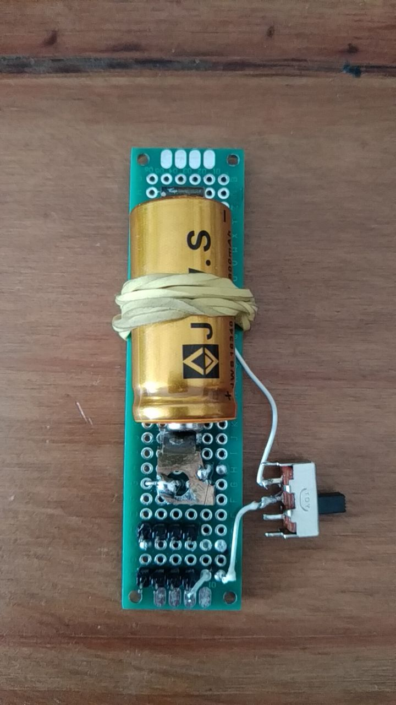
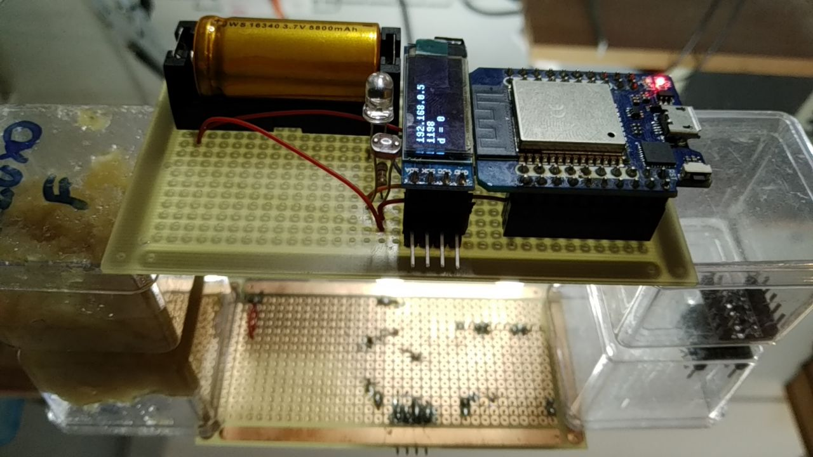

# Plataforma de teste


## Motivação 

Após alguns anos acompanhando o desenvolvimento do ESP32, de ferramentas para ele e usando-o em projetos, uma plataforma de hardware baseada em ESP32 para a construção de dispositivos para aplicações que julgo interessantes tornou-se suficientemente clara.

É desejável que a plataforma:
- seja **programável sem o uso de fios**; 
- possa **funcionar sem conexão com um computador** (por exemplo conexão USB para energia e dados);
- seja toda montada em uma única placa/caixa;

A construção mínima convém ter pilha ou bateria recarregável e um display (tela) para mostrar mensagens.

## Construção física


<!---
## Unidade de suprimento de energia

### Protótipo 

Para desenvolver protótipos da unidade de suprimento de energia, convém que o protótipo possa ser usado com diferentes controladores, permitir a recarga da bateria e a conexão do cabo de dados. No protótipo da foto a bateria pode ser removida para recarga e a chave desconecta a bateria do restante do circuito o que permite a conexão do cabo de dados. Os modelos de placas com ESP32 testados são MH-ET Live ESP32 Minikit (https://github.com/FNakano/CFA/tree/master/projetos/py-Teste3V6) e ESP32-C3 super mini (https://github.com/FNakano/CFA/tree/master/componentes/controladores/ESP/ESP32#esp32-c3-super-mini)

A escolha dessas placas se deve ao regulador de tensão usado nelas. O ESP32 Dev Kit mais comum não funciona, por falta de energia, se ligado da forma como fiz. Mais informação em https://github.com/FNakano/CFA/tree/master/projetos/py-Teste3V6#justificativa



#### Lista de materiais

| Quantidade | identificador | descrição e obervações |
| --- | --- | --- |
| 1 | ESP32 MH-ET | --- |
| 1 | PCI padrão 5X10 | --- |
| --- | --- | --- |
| --- | --- | --- |
| --- | --- | --- |
| --- | --- | --- |
| --- | --- | --- |
| --- | --- | --- |
| --- | --- | --- |
| --- | --- | --- |
| --- | --- | --- |

#### Montagem

- Retirar as molas (contatos) da tomada (no caso, desrosquear os parafusos). Elas serão usadas para conectar a bateria;
- Usar uma mola para o polo positivo da bateria, outra mola para o polo negativo da bateria [Foto](./4974620333172698295.jpg).
  - No modelo de tomada usado há duas molas por parafuso, separá-las cortando a chapa com um alicate de corte [Foto](./4974620333172698296.jpg);
  - Soldar uma mola perto da extremidade da placa, definir a posição da outra mola usando a pilha como base - procurar uma posição em que a força seja suficiente para manter o contado das molas com a bateria mas não grande demais a ponto de arquear a placa ou forçar as soldas;
  - Soldar um fio em uma das molas (digamos, a que se conecta ao positivo da bateria), soldar a outra ponta do fio a um dos contatos do interruptor, soldar outro fio ao outro contato do interruptor, soldar a outra ponta do fio ao header;
    - no caso, foram usados quatro pinos para essa conexão. Isto permite ligar a placa microcontroladora, o display e mais dois dispositivos;
  - Soldar outro fio na outra mola (digamos, a que se conecta ao negativo da bateria), soldar a outra ponta do fio ao outro header;
    - no caso, também foram usados quatro pinos para essa conexão. Isto permite ligar a placa microcontroladora, o display e mais dois dispositivos;
--->

#### Lista de materiais

- Um suporte para bateria 16340 (esse não achei no Brasil, tive que trazer via ali express);
- Uma bateria recarregável de 3,6V: código 16340 (ou CR123) (esse achei no Mercado Livre);
- Uma placa padrão, ilhada, face simples, 10x5 (https://www.rscomponentes.com/placa-5x10-universal-padrao-perfurada-ilhada-fibra-fenolite)
- Um kit de desenvolvimento LIVE D1 mini ESP32 (a minha tem a marcação MH-ET Live) veja https://github.com/FNakano/CFA/tree/master/projetos/Teste3V6 para entender a escolha;
- Um display OLED com driver SSD1306 (https://www.wjcomponentes.com.br/tela-oled-0-91) - este, em 2024-11-19 é razoavelmente mais barato que o modelo mais comum de 0.96"
- Um LED (usei um verde porque a intensidade (lm) é mais alta;
- Um resistor $82\Omega$ (calculado para fornecer os 20mA ao LED);
- Um LDR (há questões de fabricação desses componentes que os tornam pouco padronizados. O que uso tem resistência de $300k\Omega$ no escuro um sensor de luz como o BH1750 pode ser alternativa;
- Um resistor de $1k\Omega$ (forma um *bom conjunto* com o ADC de 12 bits e o LDR de $300k\Omega$) 
- Fios, ferro de solda, headers (conectores Du Pont tanto macho quanto fêmea).

#### Lista de conexões

| ESP | R ($1k\Omega$) | LDR | R ($82\Omega$) | LED | Display | Touch Sensor | Buzzer |
| --- | --- | --- | --- | --- | --- | --- | --- |
| VCC | --- | A | --- | --- | VCC | VCC | --- |
| GND | A | --- | --- | K | GND | GND | - GND |
| GPIO36 aka SVP (used as analog input) | B | B | --- | --- | --- | --- | --- |
| GPIO18 (used as digital output) | --- | --- | A | --- | --- | --- | --- |
| --- | --- | --- | B | A | --- | --- | --- |
| GPIO21 (used as SCL) | --- | --- | --- | --- | SCL | --- | --- |
| GPIO22 (used as SDA) | --- | --- | --- | --- | SDA | --- | --- |
| GPIO39 aka SVN (used as digital input) | --- | --- | --- | --- | --- | IO | --- |
| GPIO33 (used as PWM output) | --- | --- | --- | --- | --- | --- | + |

alguma conexão ou sujeira na placa ou na mesa faz o ESP entrar em modo de programação quando está conectado nessa placa.

```
>>> ets Jul 29 2019 12:21:46

rst:0x1 (POWERON_RESET),boot:0x13 (SPI_FAST_FLASH_BOOT)
configsip: 0, SPIWP:0xee
c��ets Jul 29 2019 12:21:46

rst:0x1 (POWERON_RESET),boot:0x13 (SPI_FAST_FLASH_BOOT)
configsip: 0, SPIWP:0xee
clk_drv:0x00,q_drv:0x00,d_drv:0x00,cs0����vets Jul 29 2019 12:21:46

rst:0x1 (POWERON_RESET),boot:0x13 (SPI_FAST_FLASH_BOOT)
configsip: 0, SPIWP:0xee
clk_drv:0x00,q_drv:0x00,d_drv:0x00,cs0_drv�ets Jul 29 2019 12:21:46

rst:0x1 (POWERON_RESET),boot:0x13 (SPI_FAST_FLASH_BOOT)
configsip: 0, SPIWP:0xee
clk_drv:0x00,q_drv:0x00,d_drv:0x00,cs0_drv:0x00,hd_drv:0x00,wp_drv:0x00
mode:DIO, clock div:2
load:0x3fff0030,len:4728
load:0x40078000,len:14888
load:0x40080400,len:3368
entry 0x400805cc
ets Jul 29 2019 12:21:46

rst:0x1 (POWERON_RESET),boot:0x13 (SPI_FAST_FLASH_BOOT)
configsip: 0, SPIWP:0xee
clk_drv:0x00,q_drv:0x00,d_drv:0x00,cs0_drv:0x00,hd_drv:0x00,wp_dr�ets Jul 29 2019 12:21:46

rst:0x1 (POWERON_RESET),boot:0x13 (SPI_FAST_FLASH_BOOT)
configsip: 0, SPIWP:0xee
clk_drv:0x00,q_drv:0x00,d_drv:0x00,cs0_drv:0x00,hd_drv:0x00,wp_drv:0x00
mode:DIO, clock div:2
load:0x3fff0030,len:4728
load:0x40078000,len:14888
load:0x40080400,len:3368
entry 0x400805cc
ets Jul 29 2019 12:21:46

rst:0x1 (POWERONets Jul 29 2019 12:21:46

rst:0x1 (POWERON_RESET),boot:0x13 (SPI_FAST_FLASH_BOOT)
configsip:
Backend terminated or disconnected. Use 'Stop/Restart' to restart.

```

~~tirei o conector fêmea em que o rst estava ligado.~~ o RST estava ligado no GND, eu removi o conector em que o GND estava conectado e por isso eliminei o problema.


#### Placa montada




### Programas e testes

- Micropython
  - fazer download e instalar conforme https://micropython.org/download/ESP32_GENERIC/
  - com o microcontrolador conectado por USB, ativar webrepl (https://github.com/micropython/webrepl)
- transferir os arquivos da pasta src para a pasta raiz do microcontrolador
- executar no microcontrolador (seja pelo webREPL, seja pelo Thonny) `import test`
  - em operação normal o LED embutido (azul) vai acender (e, talvez apagar); o LED verde deve acender por um segundo; o display deve acender todos os pixels e, após um segundo, apresentar a mensagem contendo IP, leitura analógica e estado do pino em que o LED verde está conectado. 


Se logo que a placa for resetada e o micropython começar a executar (LED verde aceso), o sensor touch for acionado então o programa interrompe a inicialização (do display, do wifi, asyncio e outros componentes) e o LED verde dá duas piscadas. Como um problema na inicialização potencialmente interromperá a execução do script, no final dele dexarei um comando para apagar o LED verde, então, dado tempo suficientemente grande, se o LED verde não apagar então houve erro na inicialização.

``` 
>>> import machine
>>> t=machine.Pin(39, machine.Pin.IN)
>>> t.value()
0
>>> t.value()
1
```

referência que mostra que svn é pino 39: https://forum.micropython.org/viewtopic.php?t=5909

todos os pinos foram testados e funcionam para as funções atribuídas.

soldei o sensor touch e o buzzer.
