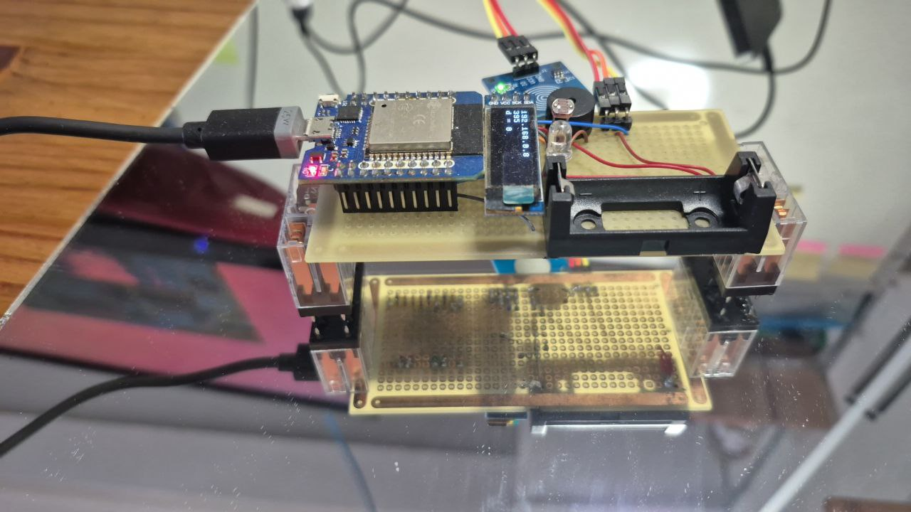

# Plataforma de teste




## Motivação 

Após alguns anos acompanhando o desenvolvimento do ESP32, de ferramentas para ele, usando-o em projetos e acompanhando projetos de estudantes, ficou suficientemente claro o que uma plataforma de hardware baseada em ESP32 para a construção de dispositivos para aplicações que julgo interessantes é.

## Construção física

<!---
## Unidade de suprimento de energia

### Protótipo 

Para desenvolver protótipos da unidade de suprimento de energia, convém que o protótipo possa ser usado com diferentes controladores, permitir a recarga da bateria e a conexão do cabo de dados. No protótipo da foto a bateria pode ser removida para recarga e a chave desconecta a bateria do restante do circuito o que permite a conexão do cabo de dados. Os modelos de placas com ESP32 testados são MH-ET Live ESP32 Minikit (https://github.com/FNakano/CFA/tree/master/projetos/py-Teste3V6) e ESP32-C3 super mini (https://github.com/FNakano/CFA/tree/master/componentes/controladores/ESP/ESP32#esp32-c3-super-mini)

A escolha dessas placas se deve ao regulador de tensão usado nelas. O ESP32 Dev Kit mais comum não funciona, por falta de energia, se ligado da forma como fiz. Mais informação em https://github.com/FNakano/CFA/tree/master/projetos/py-Teste3V6#justificativa


#### Lista de materiais

| Quantidade | identificador | descrição e obervações |
| --- | --- | --- |
| 1 | ESP32 MH-ET | https://github.com/FNakano/CFA/tree/master/projetos/py-Teste3V6 |
| 1 | PCI padrão 5X10 | https://www.rscomponentes.com/placa-5x10-universal-padrao-perfurada-ilhada-fibra-fenolite |
| 1 | display OLED 0.91" 128x32 | https://www.wjcomponentes.com.br/tela-oled-0-91 |
| 1 | sensor touch TTP223B   | --- |
| 1 | LDR | O que uso tem resistência de $300k\Omega$ no escuro |
| 1 | Resistor $1k \Omega$ 1/8W | forma um *bom conjunto* com o ADC de 12 bits e o LDR de $300k\Omega$ |
| 1 | LED | --- |
| 1 | Buzzer Passivo | --- |
| 1 | Resistor $82 \Omega$ 1/8W | calculado para fornecer os 20mA ao LED |
| 1 | Suporte para bateria 16340 | esse não achei no Brasil, tive que trazer via ali express |
| 1 | Bateria recarregável 16340 | ou CR123 |
|  | fio sólido | para fazer jumpers |
|  | headers | tanto retos quanto 90 graus |
|  | conectores MODU | para conectar aos headers |

#### Lista de ferramentas e consumíveis

- ferro de solda
- solda

#### Lista de conexões

| ESP | R ($1k\Omega$) | LDR | R ($82\Omega$) | LED | Display | Touch Sensor | Buzzer |
| --- | --- | --- | --- | --- | --- | --- | --- |
| VCC | --- | A | --- | --- | VCC | VCC | --- |
| GND | A | --- | --- | K | GND | GND | - GND |
| GPIO36 aka SVP (used as analog input) | B | B | --- | --- | --- | --- | --- |
| GPIO18 (used as digital output) | --- | --- | A | --- | --- | --- | --- |
| --- | --- | --- | B | A | --- | --- | --- |
| GPIO21 (used as SCL) | --- | --- | --- | --- | SCL | --- | --- |
| GPIO22 (used as SDA) | --- | --- | --- | --- | SDA | --- | --- |
| GPIO39 aka SVN (used as digital input) | --- | --- | --- | --- | --- | IO | --- |
| GPIO33 (used as PWM output) | --- | --- | --- | --- | --- | --- | + |

alguma conexão ou sujeira na placa ou na mesa faz o ESP entrar em modo de programação quando está conectado nessa placa.

### Montagem

Dispor os componentes na placa e soldar fios quando necessário.

- Conexões retas curtas podem ser feitas com os terminais dos resistores e outros componentes;
- Conexões muito longas (que cruzam outras conexões) podem ser feitas com fio sólido encapado. Este pode ser conseguido em cabos telefônicos e cabos de rede;
- Para soldar um header, solde um pino de uma extremidade, reaqueça para alinhar o header, quando estiver alinhado solde o restante dos pinos;


### Programas

#### teste

- Micropython
  - fazer download e instalar conforme https://micropython.org/download/ESP32_GENERIC/
  - com o microcontrolador conectado por USB, ativar webrepl (https://github.com/micropython/webrepl)
- transferir os arquivos da pasta src para a pasta raiz do microcontrolador
- executar no microcontrolador (seja pelo webREPL, seja pelo Thonny) `import test`
  - em operação normal o LED embutido (azul) vai acender (e, talvez apagar); o LED verde deve acender por um segundo; o display deve acender todos os pixels e, após um segundo, apresentar a mensagem contendo IP, leitura analógica e estado do pino em que o LED verde está conectado. 


Se logo que a placa for resetada e o micropython começar a executar (LED verde aceso), o sensor touch for acionado então o programa interrompe a inicialização (do display, do wifi, asyncio e outros componentes) e o LED verde dá duas piscadas. Como um problema na inicialização potencialmente interromperá a execução do script, no final dele dexarei um comando para apagar o LED verde, então, dado tempo suficientemente grande, se o LED verde não apagar então houve erro na inicialização.

``` 
>>> import machine
>>> t=machine.Pin(39, machine.Pin.IN)
>>> t.value()
0
>>> t.value()
1
```

referência que mostra que svn é pino 39: https://forum.micropython.org/viewtopic.php?t=5909

todos os pinos foram testados e funcionam para as funções atribuídas.

#### cliente WiFi 

Edite `lab8.py`, ajuste o comando `wifi_if.connect(SSID, PWD)` com o nome da rede e a senha. Salve o arquivo (no ESP) e importe o módulo com `import lab8`.

#### Display OLED

Conecte-se ao wifi (siga as intruções e `import lab8`) e importe `teste.py` com o comando `import teste`.

#### Tocar música

Importe o módulo `music.py` com o comando `import music` e execute a função com `music.playAquarela()`.

#### Tocar música (programação assíncrona)

Programação assíncrona é usada quando deseja-se liberar o computador/microcontrolador para executar várias tarefas ao "mesmo tempo". Por exemplo, um dispositivo que atende a requisições HTTP e toca música simultaneamente.

No Micropython a programação assíncrona é feita com o módulo `asyncio` que compartilha o tempo de processamento entre co-rotinas. A sintaxe para definir e usar co-rotinas é um pouco diferente da sintaxe para definir e usar funções.

Importe o módulo `amusic.py` com o comando `import amusic`, importe o módulo `asyncio.py` com o comando `import asyncio` e execute a função com `asyncio.run(amusic.loopAquarela())`.

Como a execução das notas é interrompida pela passagem de controle a qualidade da música cai...

#### Servidor web e música (programação assíncrona)

Conecte-se ao wifi (siga as intruções e `import lab8`), importe o módulo `playandserve.py` com o comando `import playandserve`, importe o módulo `asyncio.py` com o comando `import asyncio` e execute com o comando `asyncio.run(main())`.
