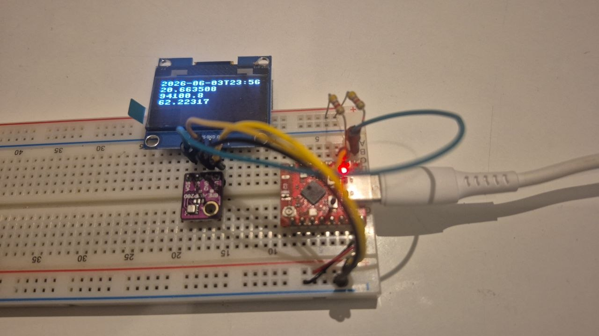

# Sensor atmosférico

Hardware:

ESP32C3 (microcontrolador/placa microcontroladora)
BME280 (sensor de temperatura, pressão atmosférica e umidade do ar)
Display OLED SSH1106 (display de 1.3", resolução de 128x64, chip driver SH1106)
Dois resistores de 4k7 pull-up para os sinais SDA e SCL 
Jumpers
Protoboard

Software e serviços web:

Thing Speak (serviço da mathworks para armazenar e exibir dados IoT)
micropython 1.28, 
scripts python na pasta `pyboard` deste repositório

O que faz:
  
Mede temperatura, pressão atmosférica e umidade do ar locais com o sensor BME280, envia os valores medidos para o serviço Thing Speak e mostra no display a informação armazenada no serviço.

Veja os gráficos em https://thingspeak.mathworks.com/channels/3399532

Imagem:
  

Display OLED mostra na primeira linha a data em que informação foi armazenada no Thing Speak, nas linhas subsequentes temperatura, pressão e umidade. A placa abaixo do display contém o BME280. A placa à direita do BME280 é a placa microcontroladora ESP32C3.

Mapa de ligações:
  
ToDocument

Como replicar:
  
ToDocument

Scripts explicados:

ToDocument

