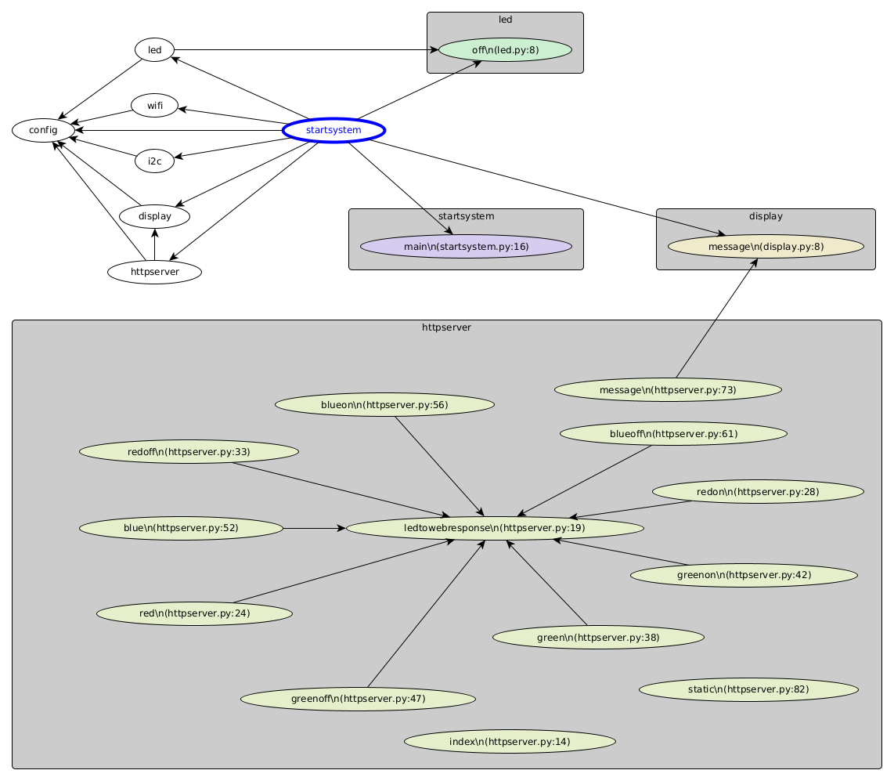

Convergência de https://github.com/FNakano/CFA/blob/master/partirDoZero.md , https://github.com/FNakano/CFA/tree/master/projetos/ControlarTomadaPelaInternet , https://github.com/FNakano/CFA/tree/master/projetos/py-tomadas , https://github.com/FNakano/CFA/tree/master/projetos/py-MicrodotAndWebREPL e https://github.com/FNakano/CFA/tree/master/projetos/py-aiorepl-microdot

**nota do autor**: A partir do momento em que comecei a escrever esta documentação até o dispositivo desenvolvido estar do jeito que eu acredito ser um *pacote pronto*, levou uma semana.

# Dispositivo conectado para controle de tomadas

## Objetivo(s)

Exemplificar um projeto: elaboração da proposta, execução, elaboração do relatório conforme https://github.com/FNakano/CFA/blob/master/partirDoZero.md

Atualizar os projetos https://github.com/FNakano/CFA/tree/master/projetos/ControlarTomadaPelaInternet , https://github.com/FNakano/CFA/tree/master/projetos/py-tomadas 

Implementar funcionalidades que acho interessantes como execução concorrente de servidor web e terminal de programação e serviço para mostrar mensagens no dispositivo. 

**nota do autor**: o produto extrapola bastante o MVP de controle de tomada que é mais próximo do produto obtido nos projetos que antecederam a este.
 
## Introdução

Existe uma variedade de *smart bulbs* e *smart plugs* no mercado. Esses dispositivos são uma espécie de símbolo da *smartificação*. Sua utilidade é bastante clara, quase lúdica, embora o custo/benefício do dispositivo comparado com interruptores de parede gere discussão.

Do ponto de vista construtivo é um sistema de informação composto por circuito físico, servidor web, interfaces de uso e circulação de informação. 

A reprodução do dispositivo até o teste de uso não traz grandes dificuldades. Por outro lado, reproduzir a metodologia de projeto e construir documentação equivalente para outro projeto, resolver as questões de elaboração das etapas, por exemplo, localizar e corrigir erros, seja no circuito, no programa ou na documentação, requer tempo e pode ser desafiador.

## Método (de execução do projeto)

Usou-se o método descrito em https://github.com/FNakano/CFA/blob/master/partirDoZero.md . O tipo de projeto e forma de documentaçao foram escolhidos com base nas diretrizes da disciplina https://github.com/FNakano/CFA/blob/master/diretrizes.md . 

A aplicação executada no dispositivo tem vários arquivos. Estes foram copiados para este repositório github usando o programa `rshell`. Dentro do `rshell` usa-se o comando `cp -r /pyboard/* .` .  Thonny e `rshell` não podem ser usados simultaneamente pois requerem acesso exclusivo à mesma porta USB o que não é permitido pelo sistema operacional (LINUX). Ver figura abaixo.

O Webrepl deve estar configurado. Isto é: no dispositivo, após instalar Micropython e configurar o Wifi , executar `import webrepl_setup`. Mais informação em  https://github.com/micropython/webrepl

## Resultados

Figura 1 - Foto representativa do estado de desenvolvimento em 2025-08-23 - Aplicativo iniciado com comando `import startsystem` no Thonny (direita embaixo na foto). Navegador com webrepl e comandos enviados através dele (direita, centro na foto). Navegador com requisição para acender o LED vermelho (esquerda acima na foto). Navegador com requisição para mostrar mensagem no display (direita acima na foto). Dispositivo com LED vermelho aceso e mensagem no display (esquerda abaixo na foto)

### Resultado do teste de uso (provisório)

Ver Figura 1

### Como reproduzir este dispositivo

#### Lista de Materiais (não é versão final)

| Nome | Quantidade | link para foto do componente, de fato, utilizado|
| --- | --- | --- |
| Placa de desenvolvimento Ai-Thinker ESP32-C3 | 1 | Na figura 1, placa conectada ao protoboard que contém o LED vermelho aceso. Este componente é conveniente pois tem um LED RGB. | 
| Display OLED 128x64 com interface I2C | 1 | Na figura 1, display mostrando letras em azul, conectada ao protoboard | 
| Resistor $4k7\Omega$ | 2 | Resistores de pull-up para SDA e SCL, conectados ao protoboard | 
| Protoboard | 1 | Na figura 1, bloco branco contendo contatos. Serve para conectar os terminais dos componentes e construir o circuito | 
| [Relé Shield](../../componentes/atuadores/rele/README.md) | 3 | [três módulos, esquerda das tomadas, com o relé azul](a acrescentar) |
| Fonte 5V (carregador para celular, battery pack ou equivalente) | 1 | [a acrescentar) |
| tomada | 4 | ver https://github.com/FNakano/CFA/tree/master/projetos/py-tomadas#dispositivo |
| plugue | 1 | ver https://github.com/FNakano/CFA/tree/master/projetos/py-tomadas#dispositivo |
| chapadur para apoiar montagem | 1 | ver https://github.com/FNakano/CFA/tree/master/projetos/ControlarTomadaPelaInternet#materiais-e-m%C3%A9todos--quais-s%C3%A3o-os-ingredientes-e-o-que-fazer-com-eles-para-chegar-nos-resultados |
| cabo de par 1.0mm | 1 | ver https://github.com/FNakano/CFA/tree/master/projetos/ControlarTomadaPelaInternet#materiais-e-m%C3%A9todos--quais-s%C3%A3o-os-ingredientes-e-o-que-fazer-com-eles-para-chegar-nos-resultados |
| segmentos 2.5mm^2 | 1 | ver https://github.com/FNakano/CFA/tree/master/projetos/ControlarTomadaPelaInternet#materiais-e-m%C3%A9todos--quais-s%C3%A3o-os-ingredientes-e-o-que-fazer-com-eles-para-chegar-nos-resultados |
| Conector Sindal | 1 | ver https://github.com/FNakano/CFA/tree/master/projetos/ControlarTomadaPelaInternet#materiais-e-m%C3%A9todos--quais-s%C3%A3o-os-ingredientes-e-o-que-fazer-com-eles-para-chegar-nos-resultados |
| placa de distribuição de energia | 1 | ver https://github.com/FNakano/CFA/tree/master/projetos/ControlarTomadaPelaInternet#materiais-e-m%C3%A9todos--quais-s%C3%A3o-os-ingredientes-e-o-que-fazer-com-eles-para-chegar-nos-resultados | 

#### Montagem

##### Lista de conexões (não é versão final)

Tabela de conexões:
| Pino no display | Pino da placa de desenvolvimento | Resistor 1 | Resistor 2 |
| --- | --- | --- | --- |
| SCL ou SCK | 8 | A | --- |
| SDA | 9 | --- | A |
| GND | GND | --- | --- |
| VCC | VCC | B | B |

**nota**: Tanto o display quanto o ESP operam a 3,3V e têm reguladores de tensão para baixar os 5V da USB para os 3,3V necessários por isso os níveis lógicos dos sinais de controle do display e do ESP são iguais.

Cada linha da tabela acima corresponde a um jumper que conecta o pino do display ao pino do ESP32. O display se comunica com o ESP através do protocolo i2c. Os pinos 8 e 9 da placa de desenvolvimento são configurados para corresponder a SCL e SDA do  canal 0 do i2c por *hardware* - isto é feito no arquivo `i2c.py` no Micropython. Há muito mais informação sobre esse assunto, aqui limito-me ao (que acho) mínimo necessário. Enquanto eu não escrever sobre i2c, um ponto de partida é https://docs.micropython.org/en/latest/esp32/quickref.html#hardware-i2c-bus .

Os terminais dos resistores são iguais (em contraste com o LED). Escolheu-se identificá-los como A e B.

#### Carga do programa em um novo dispositivo

1. Copie somente a pasta `src` e seu conteúdo;
2. Entre na pasta `src`
3. Transfira para o dispositivo usando `rshell` com o comando `cp -r * /pyboard/`;
4. Feche rshell com o comando `exit`
5. Abra o Thonny
6. Na janela de comando do Thonny dê o comando `import startsystem`

##### Resolução de (alguns) problemas

1. Não conecta na rede (Access-Point - AP) do local onde estou.
   - O ESP32 usa wifi a 2.4GHz. O nome e senha da rede devem ser informados em `config.py` nas variáveis `wifi_id` e `wifi_password`. O arquivo pode ser editado usando Thonny.

#### Teste de uso

No teste feito, quando o programa está pronto para receber requisições HTTP, ele mostra no display o nome do domínio e seu IP. No navegador, abra a página ´device001.local:5000´. O dispositivo deve responder com uma página. Note que *abrir uma página* com o navegador, em geral, equivale ao usuário do navegador dar um comando para o navegador fazer uma requisição GET.

Para acessar o REPL através da Web (ié Webrepl), no navegador abra a página `http:device001.local:5000/static/webrepl/webrepl`. Com a página aberta, ajuste a URL na caixa de texto ao lado do botão `Connect`, substituindo a porta 5000 pela porta 8266 e clique no botão `Connect`. No console, abaixo do botão, pede-se a senha que é `star`. Mais informação na seção Método (está em Método pois configurar Webrepl não está no escopo deste projeto).

Para acender o LED vermelho, na barra de endereço do navegador digite `http://device001.local:5000/red/on`

Para mostrar a mensagem "ttt" no display, na barra de endereço do navegador digite: http://device001.local:5000/message?text="ttt"

### Manual de usuário

As rotas que podem ser acessadas no servidor são:

| rota | efeito no navegador | efeito no dispositivo |
| --- | --- | --- |
| / | mostra a página index.html | - |
| /hello | mostra o texto 'hello from device001.local' | - |
| /red | mostra o texto on caso o LED da cor esteja aceso, off caso o LED esteja apagado | - |
| /blue | mostra o texto on caso o LED da cor esteja aceso, off caso o LED esteja apagado | - |
| /green | mostra o texto on caso o LED da cor esteja aceso, off caso o LED esteja apagado | - |
| /red/on | mostra o texto on | acende o led vermelho |
| /blue/on | mostra on | acende o led azul |
| /green/on | mostra on | acende o led verde |
| /red/off | mostra o texto off | apaga o led vermelho |
| /blue/off | mostra off | apaga o led azul |
| /green/off | mostra off | apaga o led verde |
| /message | mostra o texto que está sendo mostrado no display | - |
| /message?text="xxx" | mostra o texto passado como argumento em 'text' | mostra no display o texto passado como argumento em 'text' |
| /static/webrepl/webrepl.html | Mostra a página para acesso a interface de comando (REPL) | - |

O aplicativo é iniciado com o comando `import startsystem` digitado no REPL (Thonny).

### Manual do desenvolvedor

#### Anotações

Algo muito desejável seria um grafo de chamada. Encontrei pyAn (https://github.com/Technologicat/pyan). Parece que a ferramenta já funcionou bem e parece que muitos programadores a usam. Apesar da utilidade o desenvolvedor tem dificuldade em encontrar colaboradores para manter a ferramenta... 

Precisaram recomendar downgrade para poder usar: https://github.com/Technologicat/pyan/issues/72#issuecomment-2021297633

O grafo gerado mostra os `import`.

O comando para instalar pyAn (com o downgrade) é `pip3 install pyan3==1.1.1`

O comando para gerar o grafo de chamada é: `python3 -m pyan *.py --uses --colored --grouped --annotated --yed >../doc/myuses.graphml`

O programa para visualização do arquivo `myuses.graphml` é yEd. Como o grafo não contém informação sobre posicionamento é necessário aplicar um layout, como o circular. Frequentemente vértices do grafo são encobertos por elementos do fundo - usar `lower selection`. O resultado, após ajustes na visualização, está abaixo.

As rotas no servidor web não são mostradas no grafo.

Com esta visualização notei que há arquivos que usei para teste de funcionalidades durante o desenvolvimento mas que não são necessários na aplicação, escolhi remover do grafo mas manter os arquivos.

#### Conteúdo

O módulo `config.py` contém as variáveis globais. Na primeira parte, as variáveis que um usuário/desenvolvedor poderia configurar. Na segunda parte as variáveis inicializadas durante a execução do programa e usadas para acessar algum objeto do sistema.

O aplicativo é iniciado com o comando `import startsystem`. Neste módulo são carregados outros módulos. A ordem de carga é importante pois módulos carregados antes fornecem funções e variáveis para módulos carregados depois. Por exemplo, o módulo `led.py` inicia as variáveis globais que permitem controlar os LEDs. Em seguida, o módulo `wifi.py` usa os LEDs para indicar estados da inicialização do WiFi.

Diagrama de chamadas de funções e módulos. Os vértices sem cor de fundo correspondem a módulos. O módulo `startsystem` importa os outros módulos, inclusive `config.py` que contém variáveis para acessar objetos do sistema. A ordem de carga dos módulos é importante. As caixas que contém sub-grafos são agrupamentos, que também correspondem a módulos. Os sub-grafos são funções definidas dentro desses módulos. Por exemplo, em `httpserver.py` são definidas todas as funções que respondem a rotas do servidor web, como acender/apagar LEDs, navegar para webrepl e enviar mensagens para o display.

#### API

No futuro, usarei algum documentador automático. Estes usam Python docstrings então nos módulos há docstrings (por enquanto explicando o que há nos módulos, sem detalhes das funções).

Ler comentários nas funções no código-fonte (em andamento)

## Conclusão e Comentários

Desenvolver este projeto levou muito mais tempo do que o esperado (eu esperava dois dias, usei uma semana e ainda há o que fazer). Acredito que os motivos sejam:
  
1. Redefinições de objetivo, método, ferramentas durante o projeto;
   - Inclusão de funcionalidades como Webrepl;
   - Inclusão de documentação como o grafo de chamada;
2. O sistema de informação, em especial o programa, poderia ser mais simples. Tornou-se elaborado considerando desenvolvimentos futuros em que podem ser agregadas muito mais funcionalidades em um contexto multiusuário.
