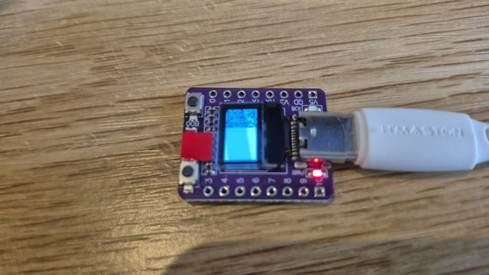
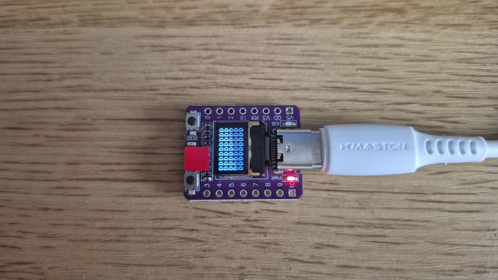
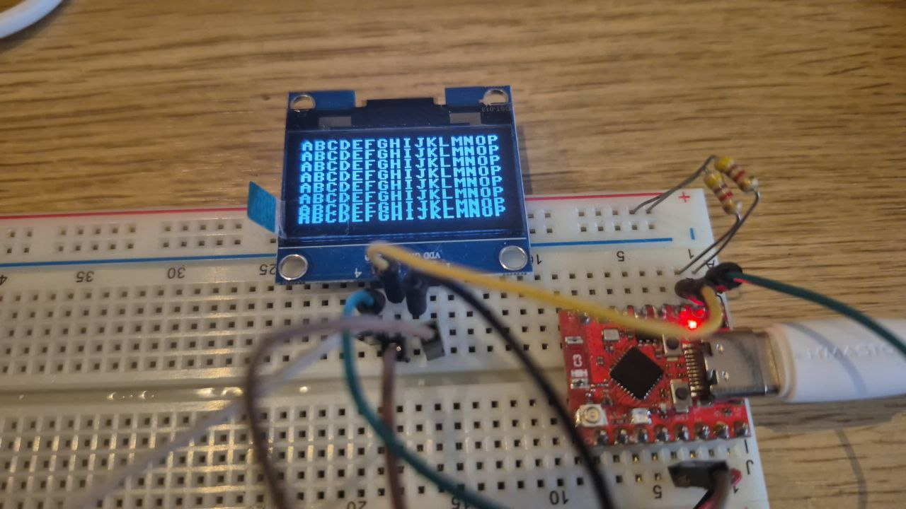
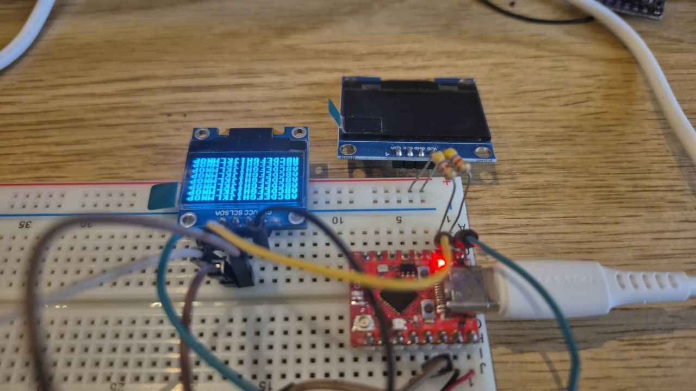
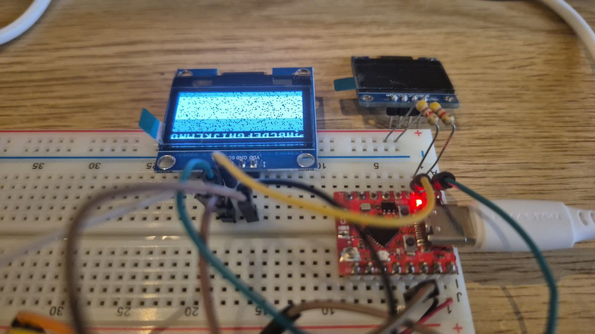
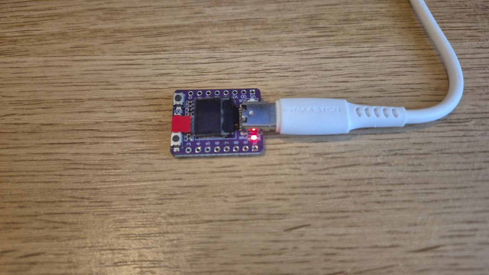
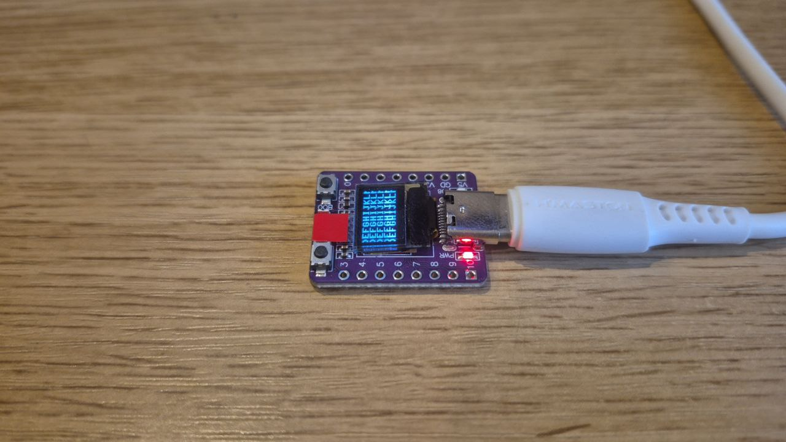
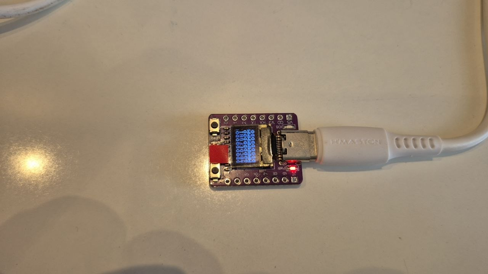
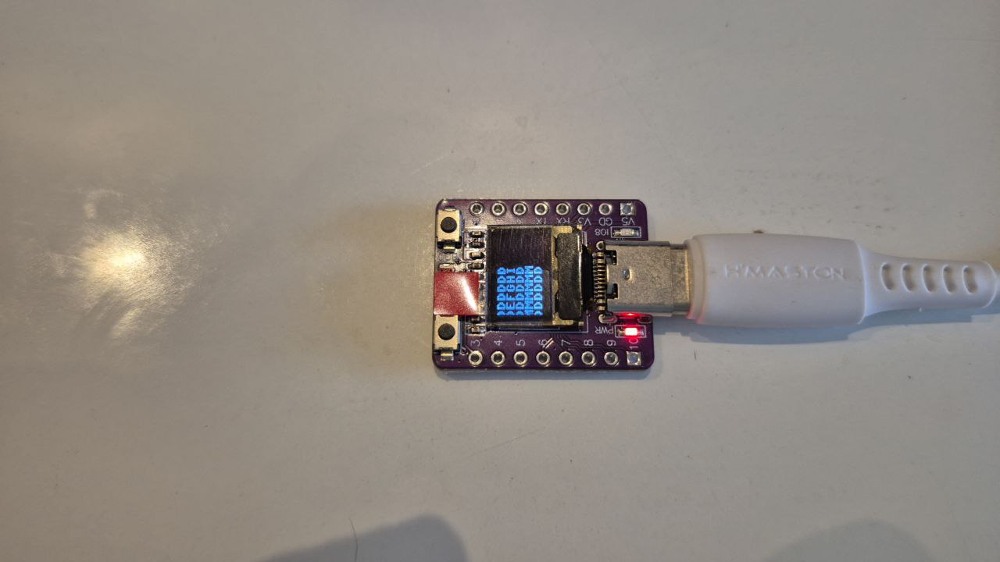

Há algumas questões cujos efeitos se sobrepõe. Isolar e, se possível, eliminar as causas é a tarefa.


Presumo que este seja um ESP32 com display OLED 72x40 com circuito driver SH1106 (a confirmar) e biblioteca (pacote micropython) SSD1306. Pode-se dizer que a biblioteca não é apropriada para o circuito então podem ocorrer eventos inesperados. O código abaixo deveria inicializar o display e acendê-lo todo preenchendo o buffer de memória. Acredito que, por não ser a biblioteca adequada, uma parte do display mostra dados não inicializados e outra parte mostra todos os pixels acesos.

```python
import ssd1306
disp=ssd1306.SSD1306_I2C(72, 40, i2c)
disp.fill(1)
disp.show()
```

**notas**: o circuito driver é um circuito eletrônico que converte sinais de um protocolo (fonte) para outro (alvo). O protocolo fonte geralmente é compatível com os sinais gerados por microcontroladores ou microprocessadores de uso mais geral (como 8085, 6508, STM32, ATMega, ESP32, ...). O protocolo alvo geralmente é compatível com os sinais elétricos necessários ao funcionamento do dispositivo (no caso, o display propriamente dito).

**nota**: o driver de dispositivo, no contexto em que estamos acostumados, é um programa instalado em um sistema operacional e que permite ao SO enviar informação (geralmente interpretáveis como comandos) no protocolo fonte. Esses comandos são convertidos pelo circuito driver nos sinais elétricos necessários ao funcionamento do dispositivo na execução do específico comando.  

**nota**: a combinação das duas notas acima gera confusão quando pessoas se comunicam. Uma pode referir-se ao (programa) driver de dispositivo e outra pode referir-se ao (circuito) driver de dispositivo, ambos usando a palavra driver ou driver de dispositivo.


Segundo a IA da página de busca do Google, a diferença entre os circuitos drivers que tem reflexo no software é o diferente mapeamento dos buffers de memória na matriz da tela:


No ESP32 conectado a um display OLED 128x64 com circuito driver SH1106, o comando `0XA5` funciona para acender o display todo sem necessidade de escrever no buffer do circuito driver. Se funcionar em todos os displays, é útil para testar se o display (propriamente dito) está funcionando e conectado adequadamente.

**nota**: Tanto SSD1306 quanto SH1106 implementam o comando 0xa5 com o mesmo comportamento visível. Então, ser capaz de executar esse comando não permite diferenciar um controlador de outro.
 
```python
import config
import i2c
import display
config.disp.write_cmd(0xA5)
```
inicializar um circuito SH1106 com a biblioteca SSD1306 faz o display mostrar um padrão aparentemente aleatório.

inicializar um circuito SSD1306 com a biblioteca SH1106 faz... ?

inicializar o circuito do ESP com a biblioteca SSD1306 faz o display mostrar um padrão aparentemente aleatório em uma parte e o display apagado na outra.

inicializar o circuito do ESP com a biblioteca SH1106 faz o display (que estava apagado) continuar apagado mas não atender comandos, seja o disp.write, seja o disp.write_cmd.

É mais provável que o circuito do ESP seja um SSD1306 (talvez conectado ao display de uma maneira estranha)



O melhor ajuste que consegui:

```
>>> disp.text("DDDDDDDDDD", 27, 24, 1)
>>> disp.show()
>>> disp.text("DDDDDDDDDD", 27, 32, 1)
>>> disp.show()
>>> disp.text("DDDDDDDDDD", 27, 40, 1)
>>> disp.show()
>>> disp.text("DDDDDDDDDD", 27, 48, 1)
>>> disp.show()
>>> disp.text("DDDDDDDDDD", 27, 56, 1)
>>> disp.show()
```

Comparar sh1106 com ssd1306 usando displays de mesma dimensão em pixels. Os displays que tenho que provavelmente são sh1106 são 128x64 de 1.3 polegadas e os provavelmente ssd1306 são 128x64 de 0.96 polegadas.

Inspecionando a função init_display do sh1106.py com o código de inicialização do ssd1306.py, vejo que no ssd1306 há muito mais inicialização .

Uma constante que está na inicialização de ssd e não na de sh é SETMUXRATIO. O comando 0xa8 existe nos dois controladores https://cdn-shop.adafruit.com/datasheets/SSD1306.pdf, file:///home/fabio/Downloads/sh1106_datasheet.pdf mas esse comando não é usado no sh1106.

As funções `show` são bem diferentes. No sh1106 há umas contas para considerar a localização da tela dentro do buffer. Largura e altura da tela não são usados na configuração do hardware, são usados na alocação do framebuffer.

Os comandos SET_MEM_ADDR = const(0x20)
SET_COL_ADDR = const(0x21)
SET_PAGE_ADDR = const(0x22) do ssd1306 não existem no sh1106. Eles têm a ver com regiões do buffer do componente, coisa que o sh1106 não tem.

sh1106
        if self.rotate90:
            for i in range(self.bufsize):
                db[w * (i % p) + (i // p)] = rb[i]
        if full_update:
            pages_to_update = (1 << self.pages) - 1
        else:
            pages_to_update = self.pages_to_update
        #print("Updating pages: {:08b}".format(pages_to_update))
        for page in range(self.pages):
            if (pages_to_update & (1 << page)):
                self.write_cmd(_SET_PAGE_ADDRESS | page)
                self.write_cmd(_LOW_COLUMN_ADDRESS | 2)
                self.write_cmd(_HIGH_COLUMN_ADDRESS | 0)
                self.write_data(db[(w*page):(w*page+w)])

ssd1306
    def show(self):
        x0 = 0
        x1 = self.width - 1
        if self.width == 64:
            # displays with width of 64 pixels are shifted by 32
            x0 += 32
            x1 += 32
        self.write_cmd(SET_COL_ADDR)
        self.write_cmd(x0)
        self.write_cmd(x1)
        self.write_cmd(SET_PAGE_ADDR)
        self.write_cmd(0)
        self.write_cmd(self.pages - 1)
        self.write_data(self.buffer)

próximo passo é analisar isto...

-------------

Como distinguir entre um display com circuito driver SSD1306 e um display com circuito driver SH1106, ambos conectados ao ESP através de I2C?

A identificação é feita pelo funcionamento e obtenção dos resultados esperados em testes: Se o display apresentar os resultados esperados no teste com a biblioteca para um certo circuito driver então o circuito driver é o circuito para o qual a biblioteca foi construída.

<!---

| display apresenta os resultados esperados (A) | biblioteca para o circuito driver X (B) | o circuito driver é o circuito driver X (C)| A & B | (A & B) => C |
| --- | --- | --- | --- | --- |
| F | F | F | F | T |
| F | F | V | F | T |
| F | V | F | F | T |
| F | V | V | F | T |
| V | F | F | F | T |
| V | F | V | F | T |
| V | V | F | V | F |
| V | V | V | V | T |

(ai... a matemática discreta...)
--->

Pelo argumento acima, se o circuito driver não for o circuito para o qual a biblioteca foi construída então o display não pode funcionar. Acontece que o contexto é complicado pois, enquanto a energia for mantida, os estados anteriores podem influenciar os estados futuros (ié, configurações feitas para um teste podem ainda ser válidas quando o teste seguinte for aplicado. É preciso que os testes sejam independentes entre si, caso contrário os resultados podem não ser repetíveis, o que gera confusão)

<!---
Pelo argumento acima, se o circuito driver for o circuito para o qual a biblioteca foi construída, o display pode ou não funcionar.

Pelo argumento acima, se o circuito driver não for o circuito para o qual a biblioteca foi construída então o display não pode funcionar.
--->

## Teste da biblioteca SH1106 a displays com circuito driver SH1106 e com cicuito driver SSD1306

Seguindo os 5 passos abaixo, se o circuito driver do display OLED for SH1106 as seis linhas de mensagens serão apresentadas no display, mesmo que truncadas.

1. Conectar o display ao ESP (SDA=GPIO5, SCL=GPIO6, VCC=VCC, GND=GND), precisa ser somente um display, conectar também os resistores de pull-up;
2. Desconectar o ESP da porta USB e reconectar;
3. Executar o script abaixo;
4. Se a mensagem aparecer, mesmo cortada, o circuito driver é SH1106.
5. Em um display de 128x64 pixels, a mensagem deve aparecer sem a letra 'Q';

```python
from machine import Pin, I2C

i2c=I2C(0, sda=Pin(5), scl=Pin(6))

import sh1106
disp=sh1106.SH1106_I2C(128,64,i2c)

disp.text('ABCDEFGHIJKLMNOPQ', 0, 0, 1)
disp.text('ABCDEFGHIJKLMNOPQ', 0, 8, 1)
disp.text('ABCDEFGHIJKLMNOPQ', 0, 16, 1)
disp.text('ABCDEFGHIJKLMNOPQ', 0, 24, 1)
disp.text('ABCDEFGHIJKLMNOPQ', 0, 32, 1)
disp.text('ABCDEFGHIJKLMNOPQ', 0, 40, 1)
disp.text('ABCDEFGHIJKLMNOPQ', 0, 48, 1)
disp.text('ABCDEFGHIJKLMNOPQ', 0, 54, 1)
disp.show()
```

## Explicações e comentários adicionais

### Sobre o código

É o programa mais curto e inteligível que consegui escrever.

`from machine import Pin, I2C` importa os pacotes usados no programa.

`i2c=I2C(0, sda=Pin(5), scl=Pin(6))` instancia o objeto `i2c` que permite enviar e receber mensagens pelo barramento i2c. Espera-se que o display esteja conectado ao ESP através desse barramento. SDA e SCL são os nomes convencionados dos sinais no protocolo I2C (veja, por exemplo, https://en.wikipedia.org/wiki/I2C para uma explicação sobre o protocolo). Nesta configuração, o sinal SDA será enviado através do pino 5 do ESP e o sinal SCL será enviado através do pino 6 do ESP. 

`import sh1106` importa o pacote que envia mensagens para o circuito driver SH1106.

`disp=sh1106.SH1106_I2C(128,64,i2c)` instancia o objeto que representa o circuito driver SH1106. A escolha do tamanho 128x64 pixels, mesmo que o display físico não tenha essa quantidade de pixels é proposital. A análise exploratória e de documentação de SH1106 e de SSD1306 mostra que o maior display usado nas implementações comerciais tem esse tamanho, que o SH1106 é capaz de gerir displays de até 132x64, que o SSD1306 é capaz de gerir displays de até 128x64. Análise do código da biblioteca SH1106 mostra que a diferença entre 132 e 128 é compensada na função `show`, no endereçamento de colunas. O programador sabia que na implementação do display de 128x64 com driver SH1106 (132x64) o implementador (fabricante) não conectava os dois primeiros SEG, que correspondem às duas primeiras colunas na RAM interna ao SH1106. Em consequência, os dois últimos SEG também não são conectados e a janela de 128x64 fica "centrada" na janela de 132x64. Com outros tamanhos de display essa conexão e mapeamento podem ser diferentes. Escolher o tamanho 128x64 no programa (e encher o display com mensagens) aumenta a chance de, mesmo em displays pequenos, alguns pixels acendam e outros apaguem formando padrões (sequências de partes de letras) reconhecíveis.

`disp.text('ABCDEFGHIJKLMNOPQ', 0, 0, 1)` escreve, no buffer interno à instância do objeto, o texto na posição assinalada e com a "cor" assinalada.

`disp.show()` envia o conteúdo do buffer interno para o circuito driver SH1106.

### Sobre os passos

#### 1. Conectar o display ao ESP (SDA=GPIO5, SCL=GPIO6, VCC=VCC, GND=GND) ao ESP, precisa ser somente um display, conectar também os resistores de pull-up;

Os resistores de pull-up são necessários. Através deles o pino conectado através dele é colocado em nível lógico 1. Se o pino for uma entrada então a leitura do nível lógico do pino será 1. Se o pino for uma saída então escrever nível lógico 0 não danificará o circuito pois a corrente é limitada pelo resistor.

É preciso conectar apenas um display pois se houver mais de um eles interferirão entre si na comunicação I2C. Eles interferem pois, independente do circuito driver, têm o mesmo endereço no barramento I2C. O endereço é o 60 (em hexadecimal, 0x48).

#### 2. Desconectar o ESP da porta USB e reconectar;

Caso haja alguma configuração prévia, o display pode apresentar os resultados esperados mesmo que a biblioteca não seja a correta.

Para não usar alguma configuração feita anteriormente, o circuito precisa ser resetado. O reset do ESP, seja pelo botão, seja por CTRL-D, seja pelo botão STOP do Thonny, não reseta o circuito controlador. Nesse circuito (controlador + ESP), o reset do controlador só ocorre por interrupção do fornecimento de energia. Desconectar o ESP da porta USB tem esse efeito tanto para o circuito controlador quanto para o ESP.

#### 3. Executar o script abaixo;

Ver explicação sobre o programa, acima no texto.

#### 4. Se a mensagem aparecer, mesmo cortada, o circuito driver é SH1106.

O programa foi feito para preencher um display de 128x64 (com a hipótese que os caracteres ocupam uma (sub-)matriz 8x8)

> The text is displayed with the built-in 8x8 pixel font, which support the ASCII character set values 32..127

(Fonte: https://github.com/robert-hh/SH1106?tab=readme-ov-file#framebuffer-methods no commit fe67423)

Displays com menos pixels, digamos, 128x32, 70x40; com o programa configurado como está, devem mostrar recortes retangulares dessa imagem no display 128x64.

#### 5. Em um display de 128x64 pixels, a mensagem deve aparecer sem a letra 'Q';

'ABCDEFGHIJKLMNOPQ' tem 17 letras. Até a letra P uma linha de pixels tem 128 pixels. É esperado que a mensagem seja truncada e a letra 'Q' não seja apresentada (a biblioteca foi analisada para chegar a essa conclusão).


O teste pode não funcionar, mesmo se o circuito driver for o para o qual a biblioteca foi construído, se as conexões estiverem erradas ou o display tiver um defeito. A informação a seguir pode ajudar a identificar os problemas: O comando `print (i2c.scan())` lista todos os endereços usados por dispositivos conectados ao barramento I2C. O endereço do circuito driver, seja SH1106, seja SSD1306 é 60 (0x48).

### Resultado da aplicação da biblioteca SH1106 em um display SH1106 (ié display X e biblioteca X)



o display apresenta as 6 linhas de mensagens, cortando a letra 'Q'

### Resultado da aplicação da biblioteca SH1106 em um display SSD1306 (ié display Y e biblioteca X)


o display não apresenta nada.

-------------------

## Teste da biblioteca SSD1306 a displays com circuito driver SH1106 e com cicuito driver SSD1306


Seguindo os mesmos 5 passos acima mas substituindo o script pelo abaixo corresponde ao teste para identificação do circuito driver SSD1306.

```python
from machine import Pin, I2C

i2c=I2C(0, sda=Pin(5), scl=Pin(6))

import ssd1306
disp=ssd1306.SSD1306_I2C(128,64,i2c)

disp.text('ABCDEFGHIJKLMNOPQ', 0, 0, 1)
disp.text('ABCDEFGHIJKLMNOPQ', 0, 8, 1)
disp.text('ABCDEFGHIJKLMNOPQ', 0, 16, 1)
disp.text('ABCDEFGHIJKLMNOPQ', 0, 24, 1)
disp.text('ABCDEFGHIJKLMNOPQ', 0, 32, 1)
disp.text('ABCDEFGHIJKLMNOPQ', 0, 40, 1)
disp.text('ABCDEFGHIJKLMNOPQ', 0, 48, 1)
disp.text('ABCDEFGHIJKLMNOPQ', 0, 54, 1)
disp.show()
```

### Resultado da aplicação da biblioteca SSD1306 em um display SSD1306 (ié display Y e biblioteca Y)



o display apresenta as 6 linhas de mensagens, cortando a letra 'Q'

### Resultado da aplicação da biblioteca SSD1306 em um display SH1106 (ié display X e biblioteca Y)



o display apresenta algum padrão de acendimento dos pixels.

---------------------

Testando uma placa ESP32 supermini com display OLED de 0.42". Segundo um vendedor, o display tem 70x40 pixels

 resultado da aplicação do script que usa a biblioteca SH1106 - nenhuma mensagem é mostrada.

 resultado da aplicação da biblioteca SSD1306 - um corte retangular da mensagem é mostrado.

**Uma conclusão**: no ESP32 supermini com display OLED de 0.42" o circuito driver de display é SSD1306.

Algumas pistas: as colunas que ficam fora do mapeamento são as das DUAS pontas pois a mensagem é truncada tanto pela direita quanto pela esquerda. Se o corte nas colunas fosse simétrico, 128-70=58, 58/2=29, 29 colunas ficariam fora em cada ponta, são quase 4 letras. Como a letra 'D' aparece cortada, acho bastante provável que o corte (nas colunas) seja simétrico. Se o corte nas linhas fosse simétrico, 64-40=24, 24/12=12, 12 linhas ficariam fora em cada ponta. 12 linhas (pixels) corresponde a uma letra e meia mas as letras estão inteiras e compõe 5 linhas. Um ajuste no programa ajuda a identificar quais linhas são mostradas.

```python
from machine import Pin, I2C

i2c=I2C(0, sda=Pin(5), scl=Pin(6))

import ssd1306
disp=ssd1306.SSD1306_I2C(128,64,i2c)

disp.text('ABCDEFGHIJKLMNOPQ', 0, 0, 1)
disp.text('ABCDErGHIJKLMNOPQ', 0, 8, 1)
disp.text('ABCDEsGHIJKLMNOPQ', 0, 16, 1)
disp.text('ABCDEtGHIJKLMNOPQ', 0, 24, 1)
disp.text('ABCDEuGHIJKLMNOPQ', 0, 32, 1)
disp.text('ABCDEvGHIJKLMNOPQ', 0, 40, 1)
disp.text('ABCDEwGHIJKLMNOPQ', 0, 48, 1)
disp.text('ABCDExGHIJKLMNOPQ', 0, 54, 1)
disp.show()
```

resultado da aplicação do script acima: 

São mostradas as últimas 5 linhas. Isto indica que os 24 primeiros SEG não são usados. Um tanto inesperado, se dependesse somente de intuição, eu não acertaria...

----
2026-01-30

Após uma loooonga pausa neste assunto, estou de volta.

Decidi usar esse componente nas aulas de 2026 que começarão em menos de um mês.

1. O driver de display é um SSD1306. Esse driver tem um buffer de 128x64.
2. Alocando o tamanho total do buffer é possível saber qual é o recorte do buffer que é mostrado em algum particular display.
3. O display que vem montado do ESP32 tem offset de 27 em X e offset de 24 em Y, por inspeção visual.
4. É mais provável que o display tenha 72x40, por inspeção visual.


```python
# Executei este programa para gerar a imagem no display apresentado na fotografia abaixo.
from machine import Pin, I2C
i2c=I2C(0, scl=Pin(6), sda=Pin(5)) # ok, neste ESP os pinos são 5 e 6

print('Scan i2c bus...')
devices = i2c.scan()  # ok, ele acha o display em 0x3c

if len(devices) == 0:
  print("No i2c device !")
else:
  print('i2c devices found:',len(devices))

  for device in devices:  
    print("Decimal address: ",device," | Hexa address: ",hex(device))

import ssd1306
disp=ssd1306.SSD1306_I2C(128, 64, i2c) # https://goldenmorninglcd.com/pt/exibi%C3%A7%C3%A3o-oled/0.42-polegadas-oled-72x40-ssd1306-branco-gme7240-01/
disp.text("DDDDDDDDDD", 26, 24, 1)
disp.text("ABCDEFGHIJ", 26, 32, 1)
disp.text("DDDDDDDDDD", 27, 40, 1)
disp.text("MMMMMMMMMM", 27, 48, 1)
disp.text("DDDDDDDDDD", 27, 56, 1)
disp.show()
```


Note nas duas primeiras linhas que a primeira coluna de pixels do primeiro caracter da linha está faltando e há pixels acesos (do décimo caracter) na última coluna dessas duas linhas. Isto indica que o offset não deve ser 26 e que a quantidade de pixels na linha deve ser 9x8=72. Nas linhas seguintes o primeiro caracter parece inteiro e não se vê pixels do décimo caracter.

### O que ocorre se pusermos as dimensões certas na instanciação do display??

```python
from machine import Pin, I2C
i2c=I2C(0, scl=Pin(6), sda=Pin(5)) # ok, neste ESP os pinos são 5 e 6

print('Scan i2c bus...')
devices = i2c.scan()  # ok, ele acha o display em 0x3c

if len(devices) == 0:
  print("No i2c device !")
else:
  print('i2c devices found:',len(devices))

  for device in devices:  
    print("Decimal address: ",device," | Hexa address: ",hex(device))

import ssd1306
disp=ssd1306.SSD1306_I2C(72, 40, i2c) # https://goldenmorninglcd.com/pt/exibi%C3%A7%C3%A3o-oled/0.42-polegadas-oled-72x40-ssd1306-branco-gme7240-01/
disp.text("DDDDDDDDDD", 0, 0, 1)
disp.text("ABCDEFGHIJ", 0, 8, 1)
disp.text("DDDDDDDDDD", 0, 16, 1)
disp.text("MMMMMMMMMM", 0, 24, 1)
disp.text("DDDDDDDDDD", 0, 32, 1)
disp.show()
```


Em relação à imagem esperada, a imagem obtida é um recorte que mostra todas as linhas mas trunca as colunas até o pixel 26. Explicação presumida e parcial: a função `SSD1306_I2C.write_data(...)` tem, implícito, o mapeamento da coluna zero do display físico no zero-ésimo bit do zero-ésimo elemento do vetor, mas, no display físico, as primeiras 27 linhas não existem - o chip driver não tem esses pinos conectados ao display.

com a explicação parcial, se o display for criado com 72+27 colunas e o eixo x tiver um offset de 27, as linhas devem ser mostradas até o nono caracter... vamos testar... o resultado obtido não foi o esperado, preciso estudar mais o código do programa driver micropython. Em todo caso, já tenho uma forma de mostrar mensagens no display - alocando o buffer do tamanho total e usando offset de 27 e as 5 últimas linhas. Tem um desperdício mas acho aceitável...

```python
from machine import Pin, I2C
i2c=I2C(0, scl=Pin(6), sda=Pin(5)) # ok, neste ESP os pinos são 5 e 6

print('Scan i2c bus...')
devices = i2c.scan()  # ok, ele acha o display em 0x3c

if len(devices) == 0:
  print("No i2c device !")
else:
  print('i2c devices found:',len(devices))

  for device in devices:  
    print("Decimal address: ",device," | Hexa address: ",hex(device))

import ssd1306
disp=ssd1306.SSD1306_I2C(128, 64, i2c) # https://goldenmorninglcd.com/pt/exibi%C3%A7%C3%A3o-oled/0.42-polegadas-oled-72x40-ssd1306-branco-gme7240-01/
disp.text("DDDDDDDDDD", 27, 24, 1)
disp.text("ABCDEFGHIJ", 27, 32, 1)
disp.text("DDDDDDDDDD", 27, 40, 1)
disp.text("MMMMMMMMMM", 27, 48, 1)
disp.text("DDDDDDDDDD", 27, 56, 1)
disp.show()

```


Achei uma chamada estranha a uma função `i2c.writevto(...)`, que eu não conhecia, está na documentação do micropython. Ela escreve um vetor no barramento i2c (https://docs.micropython.org/en/latest/library/machine.I2C.html#machine.I2C.writevto)


A pasta `src` contém as versões mais recentes dos programas que testei. Vou usar o ESP32 para preparar a aula 1 de CFA-2026.
